# TryHackMe-赏金黑客 CTF 写道(详细)

> 原文：<https://infosecwriteups.com/tryhackme-bounty-hacker-ctf-writeup-detailed-b1afdc0ed20c?source=collection_archive---------1----------------------->

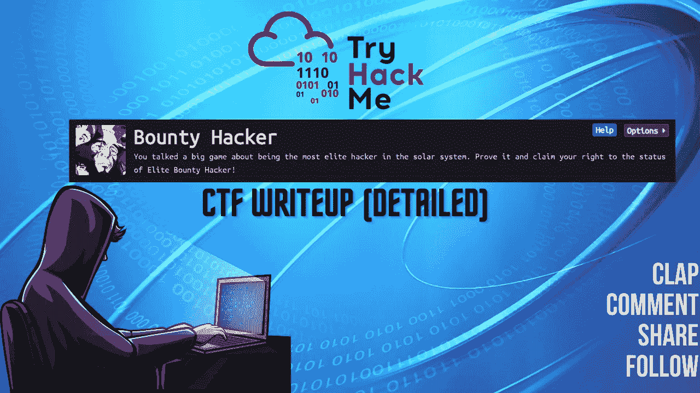

CTF 报道#2

欢迎各位！！我们将在 [TryHackMe](https://medium.com/u/dc49a0a3cb16?source=post_page-----b1afdc0ed20c--------------------------------) 上做赏金黑客 CTF。

 [## 赏金黑客

### 你讲了一个关于成为太阳系最精英黑客的大游戏。证明它，并要求你的权利…

tryhackme.com](https://tryhackme.com/room/cowboyhacker) 

我总是通过在桌面上创建 CTF 目录和在 CTF 目录中创建 Nmap 目录来开始我的 CTF。

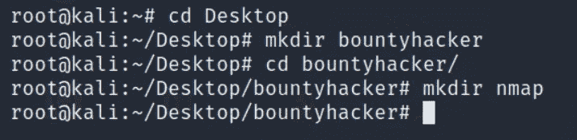

让我们开始吧！！享受流动吧！！

**任务 1。名副其实。**

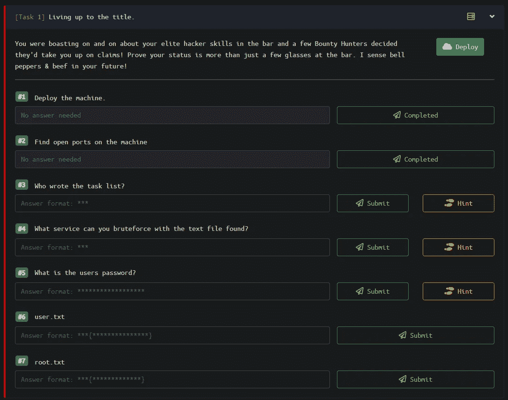

任务列表

> #1.1 部署机器
> 答:无需回答

## Nmap 扫描:

我们将在目标 IP 上执行 nmap 扫描，并枚举目标上运行的服务、版本和端口。

> nmap-sC-sV-oN nmap/bounty hacker<target_ip></target_ip>

*   -sC:默认脚本
*   -sV:版本检测
*   -oN:输出将存储在您之前创建的目录“nmap”中

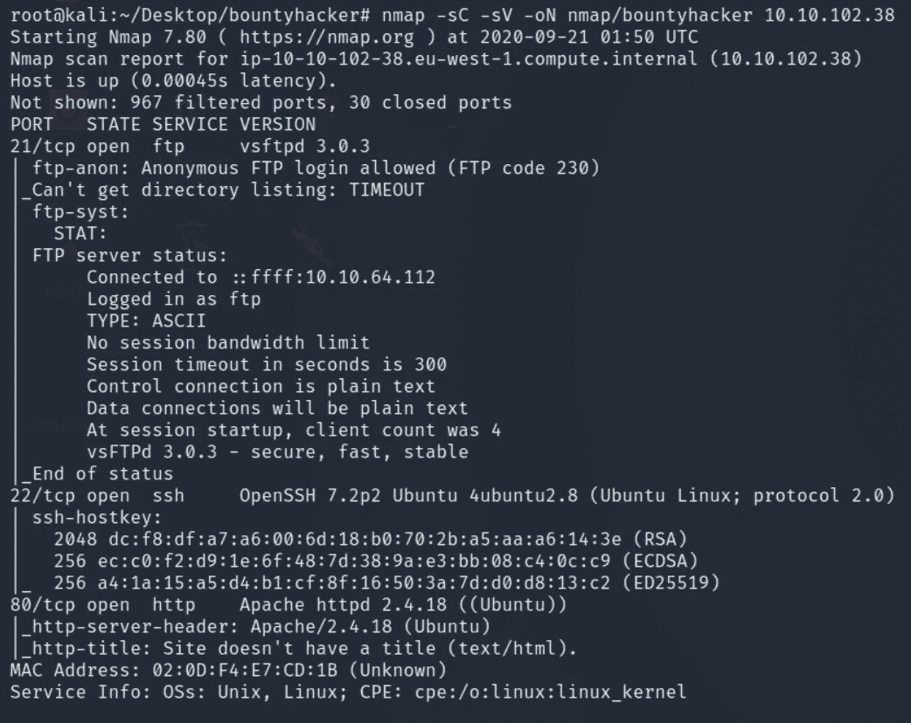

Nmap 扫描输出

机器上打开了 3 个端口:
21/ftp- vsftpd 3.0.3(允许匿名 ftp 登录)
22/ssh-OpenSSH 7.2 p2
80/http-Apache/2 . 4 . 18

> #1.2 找到机器上开放的端口。
> 答:不需要回答

我不会马上冲进 FTP。相反，我更愿意检查端口 80 上的页面来评估攻击面。

导航至网址 http:// <target_ip>并查看页面。</target_ip>

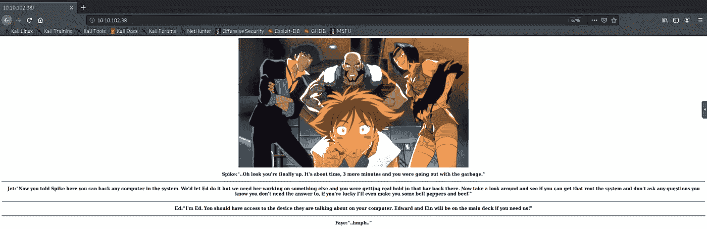

这只是一页。很少有人会想到 Spike，Jet，Ed，Faye 可能是用户名。我也这么想。你知道吗，让我们在 vim 或文本编辑器中写下这些名字，以防我们陷入兔子洞，开始敲门找壳。Lol。我希望它不会发生。

检查页面的源代码，寻找任何对我们的枚举过程有帮助的有趣信息总是好的。
查看 URL 页面的来源。Ctrl+U

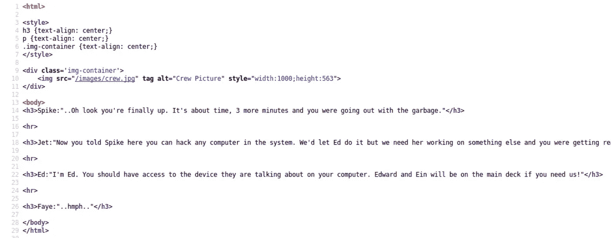

不要。没有什么引起我的注意。看起来很正常。没有白色的隐藏文本。无可奉告。没有哈希。继续前进..

不如我们在目标 IP 上快速启动一个 gobuster 扫描，找到隐藏的目录供我们探索。

## Gobuster:

gobuster dir-u http://<target_ip>-w<path_to_wordlist></path_to_wordlist></target_ip>

*   -u:指定 URL
*   -w:指定单词列表

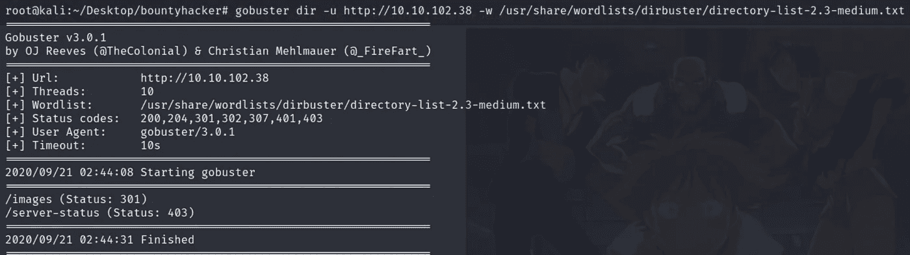

Gobuster 输出

此外，您可以在 gobuster 中使用更多标志:

*   -问:安静，无声扫描。将隐藏横幅。
*   -o:要存储在目录中的输出
*   -x:搜索扩展名，如 html、txt、php、phtml 等。

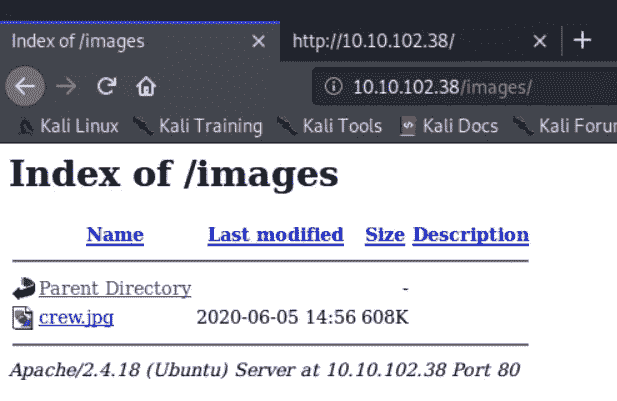

不要。！到目前为止，没有什么对我们有价值的东西。因此，我们将继续进行。保存。jpg 文件。也许这张照片可以隐藏一些信息。也称为“隐写术”。Steg 工具能不能帮到我们。也许我们可能错了。我们将会发现或者没有必要去发现，因为 ftp 的未来可以给我们一个明确的方向。

让我们开始列举 FTP。注意，它允许匿名登录，也许我们可以在那里找到一些有趣的东西。手指交叉。

> ftp <target_ip>匿名登录</target_ip>

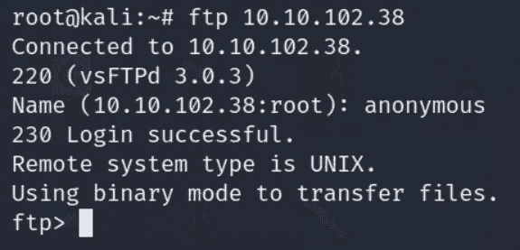

列出文件。验证做 ls -la，看看是否有任何隐藏的文件，让我们抓住之前，我们退出。我们目前没有，但仍然，这是一个好习惯。

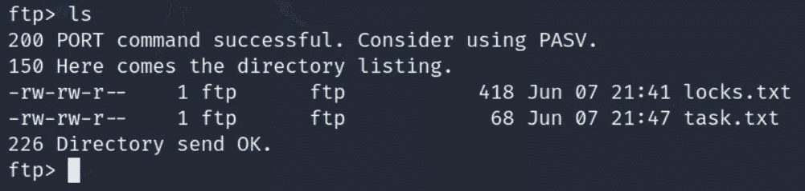

有两个文件。两者都是。txt 和不知何故的 locks.txt 现在对我来说看起来很好吃。我觉得这可能是密码的提示，或者是盒子上的用户。让我们把文件传输/下载到我们的系统中，找出答案。只需使用命令:
>get locks . txt
>get task . txt

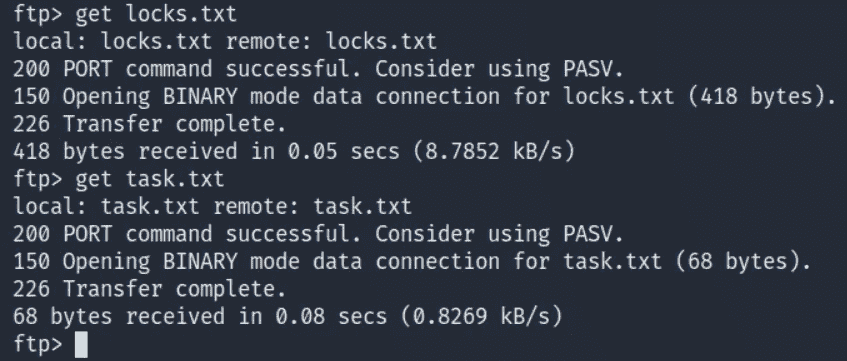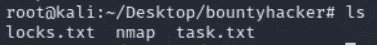

> 猫锁. txt **或**少锁. txt

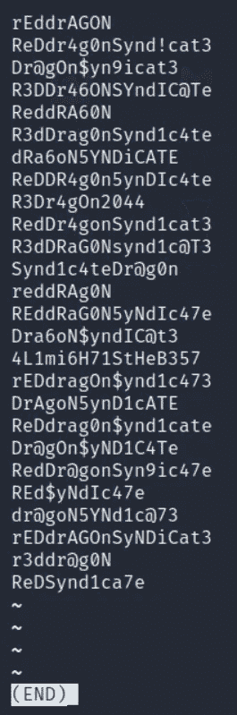

如我所愿。locks.txt 文件是潜在密码的组合列表。这个文件在暴力破解时对我们非常有用，可以作为一个单词表使用。让我们检查另一个文件。

> 猫 task.txt **或**少了 task.txt

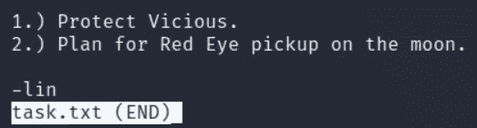

厉害！我们可以看到有一个用户名“林”。
进展顺利！

> #1.3 任务单是谁写的？
> 林

我们有什么？
一个字典
一个用户名‘Lin’+(还有几个来自 URL)
一个端口开 22/ssh

这意味着我们可以尝试用 Hydra 强行使用 SSH。

> #1.4 您可以使用找到的文本文件强制执行什么服务？
> 答:宋承宪

Hydra 是一个破解密码的神奇工具，它支持很多暴力破解服务。让我们启动九头蛇。

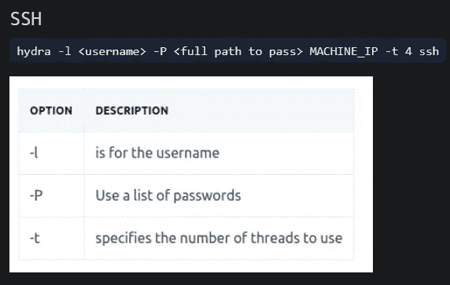

> 九头蛇-l <user>-P <path_to_wordlist><target_ip>-t 4 宋承宪</target_ip></path_to_wordlist></user>

耶！！我们得到了对林的账户进行 ssh 的密码。

> #1.5 用户密码是什么？
> 答:xxxxxxxxxxxxxxxxxxx

现在闭嘴。

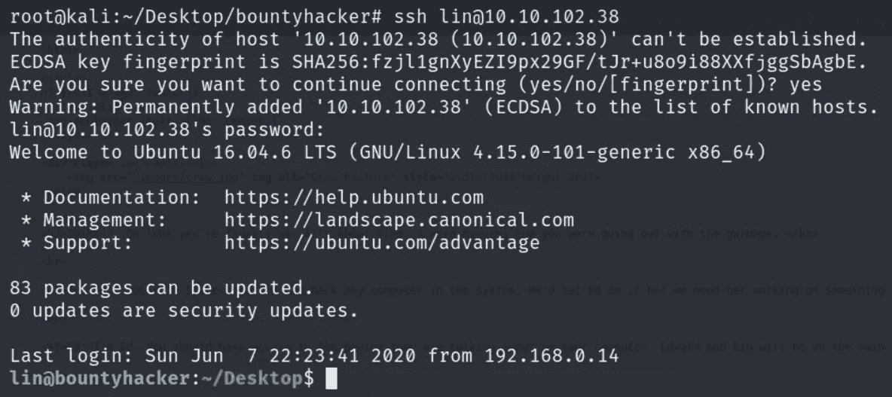

它确实工作得很好。太棒了。！ls 和我们得到我们的用户标志。

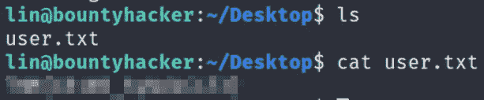

> #1.6 user.txt
> 回复:xxxxxxxxxxxxxxxx

现在剩下的是找到一种方法来提升我们在机器上的特权，以成为根并最终捕获根标志。

> 尝试使用命令:
> sudo -l

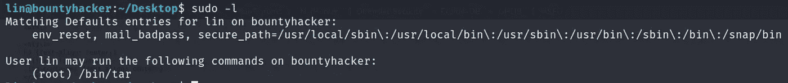

太棒了！现在我们知道用户 lin 拥有以 root 用户身份运行/bin/tar 的权限。这对我们提升权限有很大帮助。

我的第一点是总是去[https://gtfobins.github.io/](https://gtfobins.github.io/)寻找可能的特权提升命令来提升具有特殊权限的特定二进制文件的特权。在搜索栏中搜索焦油，点击焦油向下滚动到 SUDO。

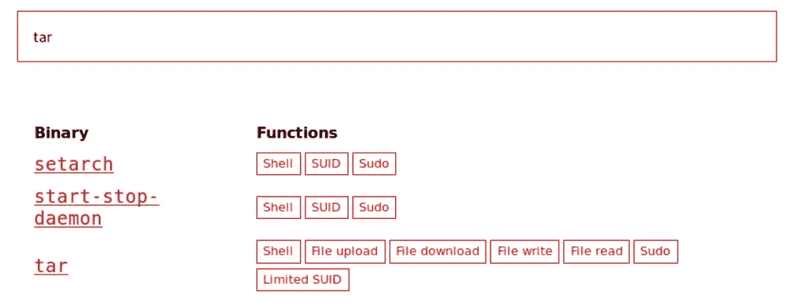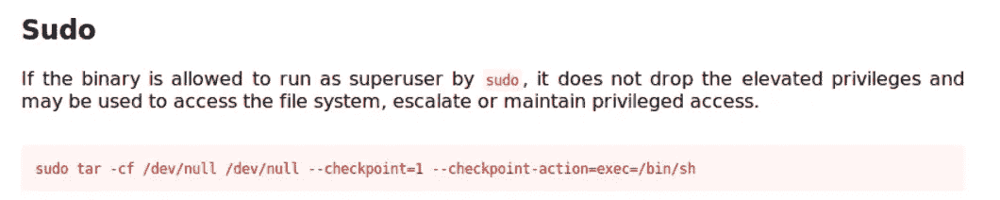

一定要看描述。我觉得挺好的。忍不住跑起来，扎了根。让我们看看。手指交叉。

> sudo tar-cf/dev/null/dev/null—check point = 1—check point-action = exec =/bin/sh

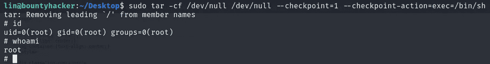

我们已经成功提升了我们的特权。我们现在可以确认我们是 root 了。

还有最后一件事要做，我们结束了。

拿到我们的根旗。我们很容易就能找到自己的根旗。

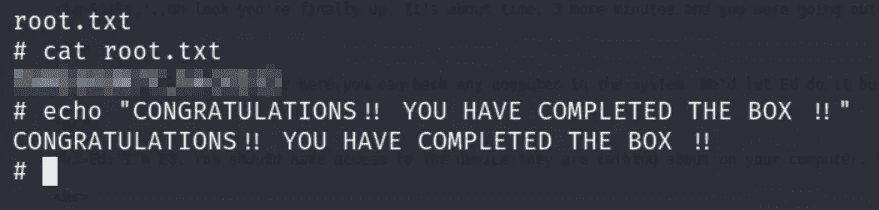

！！太棒了。！干得好！！

> #1.7 root.txt
> 回复:xxxxxxxxxxxxxxxx

现在，我们不需要那些我们保存下来供以后从 URL 中引用的名称。有些信息看起来很重要，但实际上并非如此。把所有事情都记下来是一个好习惯。

这是我一天之内写的第二篇关于 CTF 的文章。促使我写另一篇文章的是我从最近发表的“root me”CTF 文章中得到的惊人回应和反馈。对此的反应如此热烈，以至于我忍不住为你们做了一个更详细的指导，尤其是对初学者。我的文章是专门为初学者设计的，让他们通过实践、经验和时间来学习和发展自己的方法。

这确实很有趣。我希望你喜欢阅读它。

如果你喜欢这篇文章或者这篇文章在任何可能的方面帮助了你，请在评论中告诉我或者用掌声分享你的爱。

> *作为 10 月 PentesterLab 赠品的一部分提交*

跟着我。

谢谢你抽出时间。

保重，注意安全，继续黑！

哈桑·谢赫