# TryHackMe。闯入克诺比机器。

> 原文：<https://infosecwriteups.com/tryhackme-breaking-into-the-kenobi-machine-c569c4e2c625?source=collection_archive---------4----------------------->

## 这不仅仅是一个基本的演练，而是一个可以学习的资源。

1.  ***部署易受攻击机器***

在渗透测试的最开始，我想从两个扫描开始，我通常称之为基本 Nmap 扫描和 vuln 扫描。

基本 Nmap 扫描:

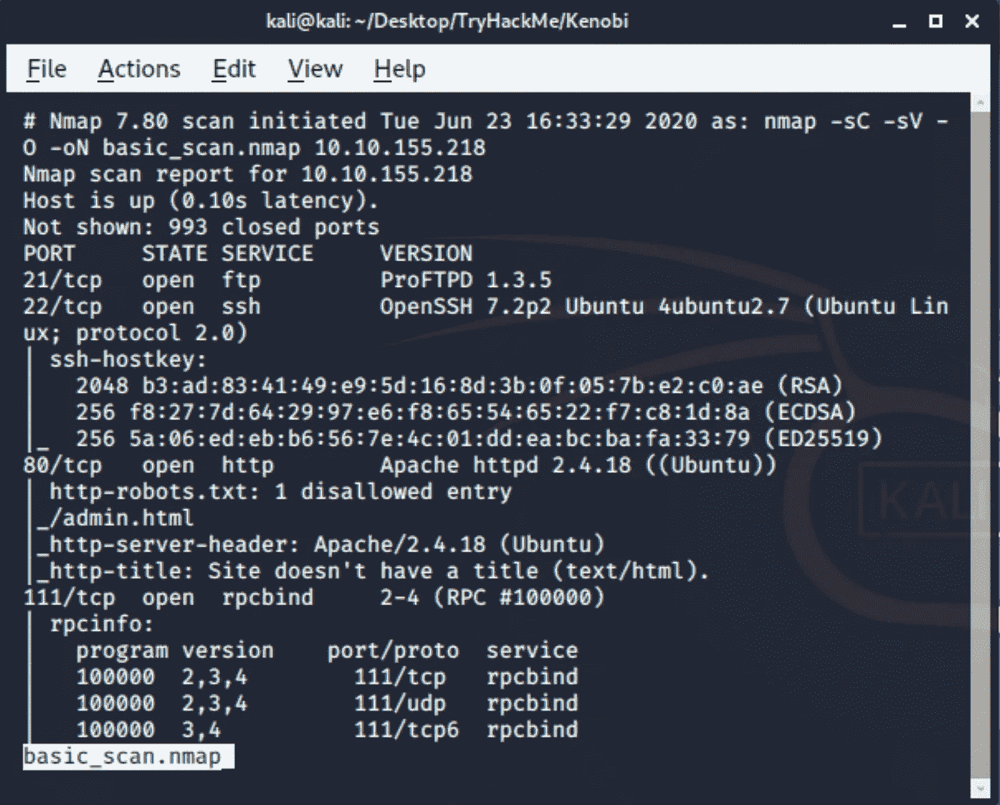

在基本扫描中，我通常使用-sC、-sV 和-O 开关。

外阴扫描:

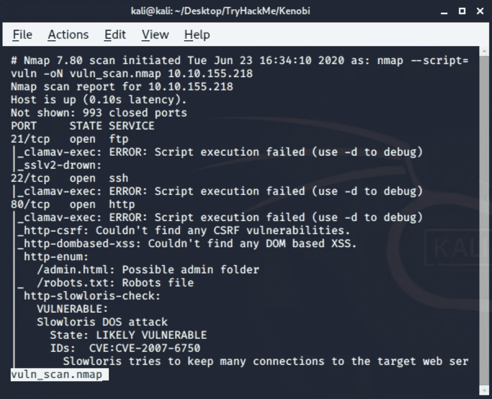

Vuln scan 没有为我们提供太多有价值的信息，所以我们不会详细讨论它的结果，但从一开始就看到潜在的漏洞仍然是一个很好的做法。

对第一次扫描的探索将会给我们第一部分第二个问题的提示。

**2*。*** ***枚举桑巴股份***

因为这不仅仅是一个演练，而是一个学习的机会，我将粘贴对我来说是新的附加信息以及我们可以学习的资源的链接。

下面是来自《桑巴简介》TryHackMe 的截图。

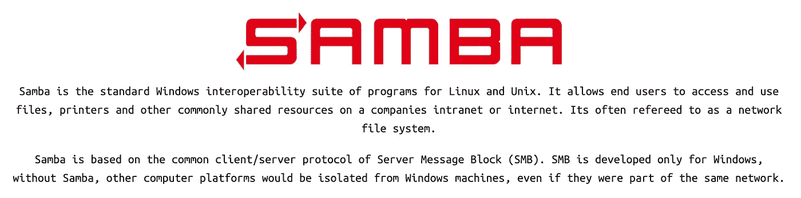

正如我们从 Nmap 扫描中注意到的，端口 139 和 445 是开放的，有机会找到进入系统的潜在入口。那么，让我们运行由我们的老朋友 Nmap 提供的基本 SMB 枚举扫描。

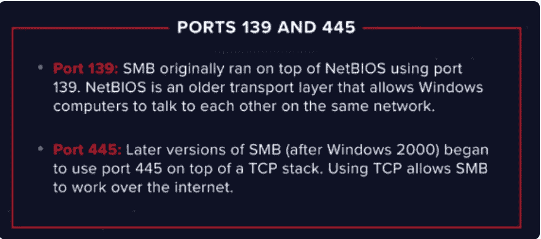

从 tryhackme.com 取回

我们可以通过简单地使用以下命令来检查所有 SMB 枚举扫描:

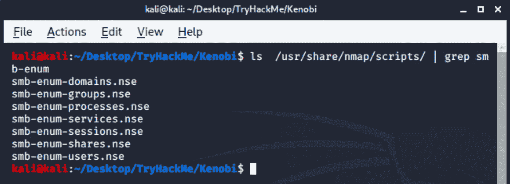

在我们的例子中，让我们按照 TryHackMe 的建议运行:

**nmap-p 445-script = SMB-enum-shares . NSE，SMB-enum-users . NSE<IP-addr>-oN SMB _ enum . nmap**

或者，如果我们需要更多信息，我们可以:**nmap-p 445-script = SMB-enum *<IP-addr>-oN SMB _ enum . nmap**

现在，我们可以浏览输出并找到系统上可用的 SMB 共享。

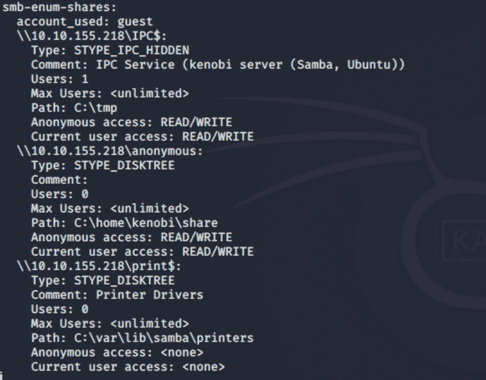

在这里，我想删除一些关于这些共享的截图，这样我们就能对我们实际列举的内容有更多的了解。

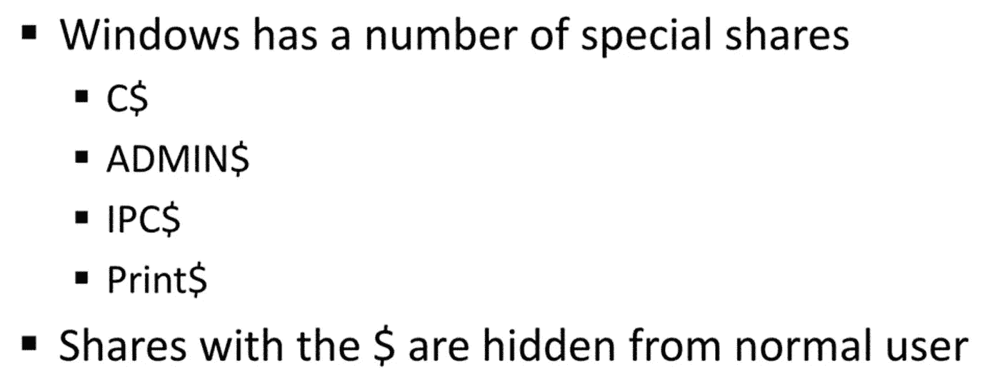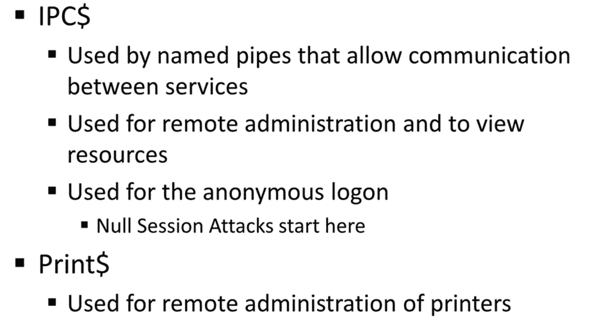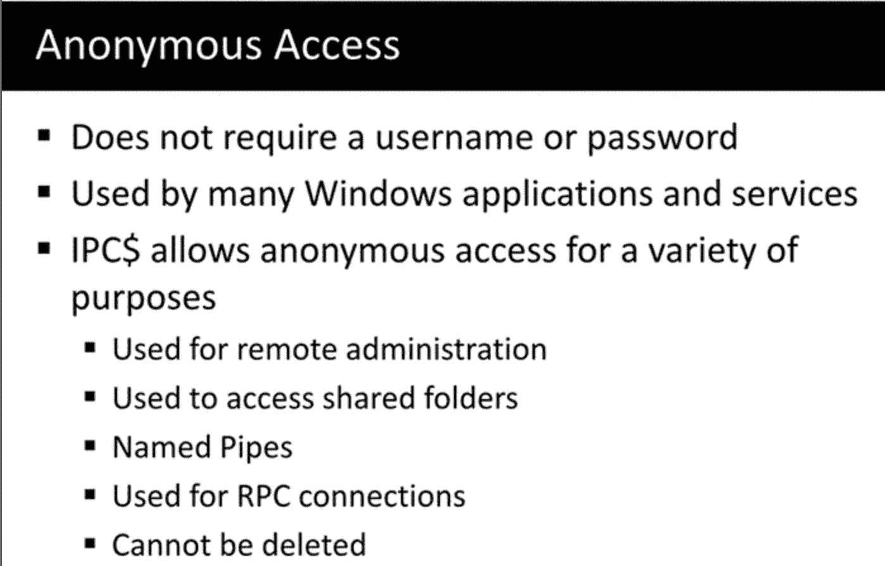

接下来，我们将通过键入以下命令来访问该匿名共享:

**smbclient // < ip 地址>/匿名**

它将让我们访问位于 **C:\home\kenobi\share** 路径中的匿名共享。在那里我们会找到问题 2 的文件。

为了下载该文件，我们可以发出**smbget-R SMB://<IP-add>/anonymous**命令。

浏览该文件，记录一些可能对入侵机器有用的信息。

回到 Nmap 扫描，我们看到了 TCP 端口 111 (rpcbind)。为了更好地理解什么是潜在的弱点，让我们探索一下 RPC 是什么以及它是如何工作的。

基本上，Microsoft 远程过程调用(MSRPC 或 RPC)是本地机器上的程序调用远程主机上的应用程序要执行的过程的过程。该过程的输出返回给请求者。

下面是更深入的解释:[https://docs . Microsoft . com/en-us/windows/win32/RPC/how-RPC-works](https://docs.microsoft.com/en-us/windows/win32/rpc/how-rpc-works)

TryHackMe:

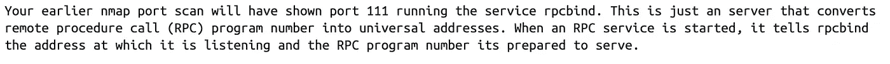

端口映射器似乎是公开的，所以我们可以看到什么程序监听什么端口。

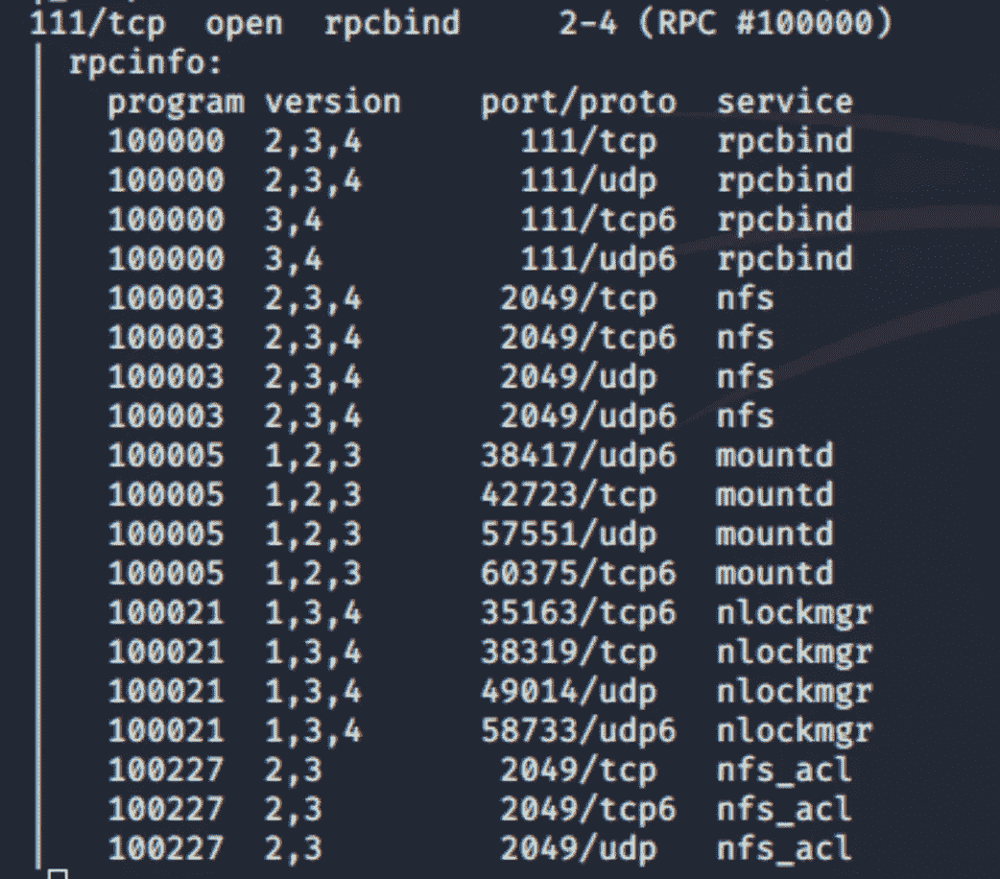

从输出中可以清楚地看到，NFS 服务正在运行。

让我们从 Nmap 脚本引擎运行一些 nfs 脚本，看看我们是否能得到一些有趣的东西。

TryHackMe 建议使用这些脚本: **nmap -p 111 -script=nfs-ls，nfs-statfs，nfs-showmount < ip-addr >，**但是我们可以做更多的扫描以达到教育的目的(……**-script = NFS ***)。

输出显示了我们可以访问哪些装载，我们肯定可以进一步利用这些信息。

***3。使用 ProFtpd*** 获取访问权限

快速浏览 TryHackMe 的 ProFtpd:

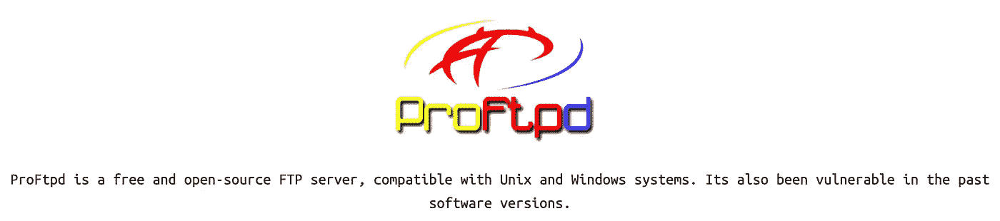

为了检查当前版本的 FTP 服务器是否存在漏洞，我们可以使用 **searchsploit** 命令利用本地 ExploitDB 数据库。

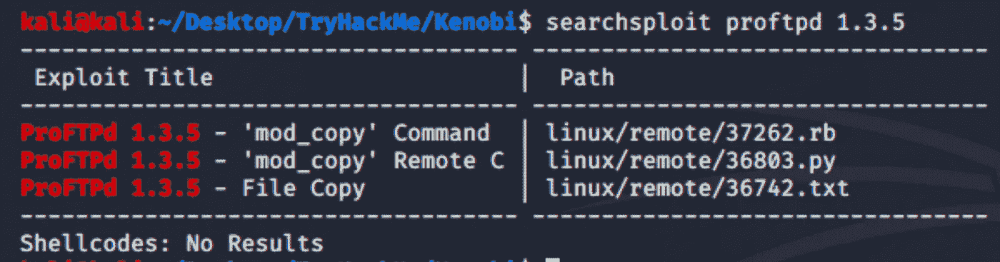

如果您想更详细地探索这些漏洞，请使用带有 **-x** 开关的 **searchsploit** 进行深入研究。

例如:

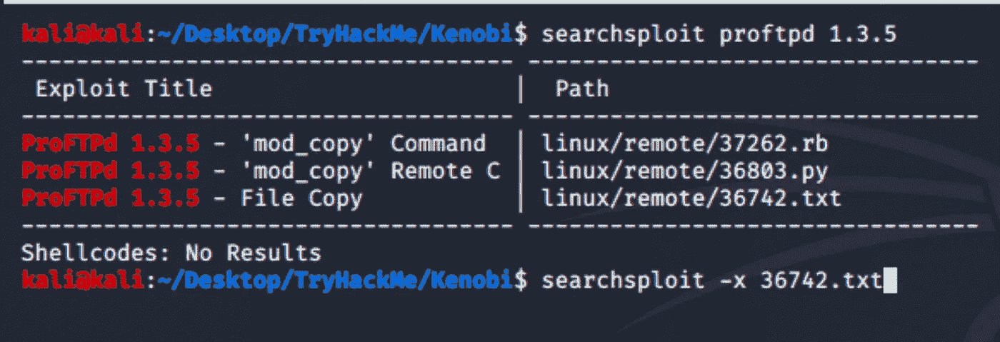

最后一个命令将提供以下输出:

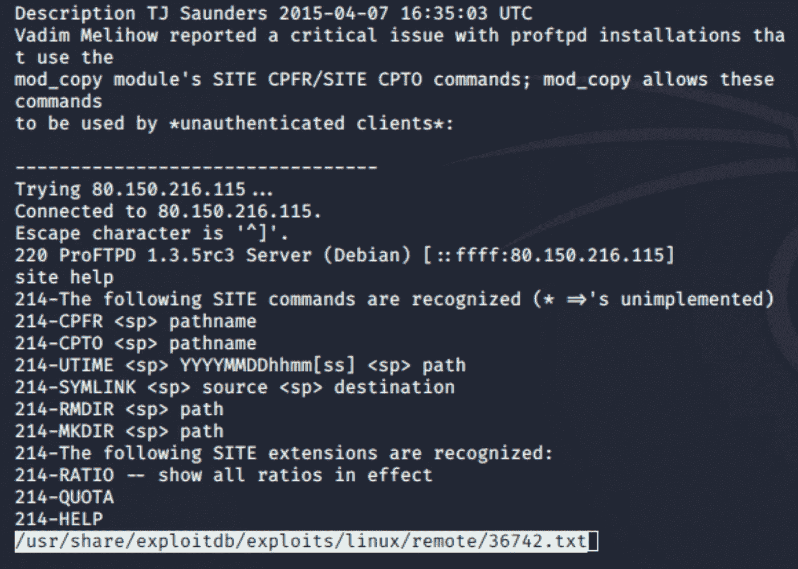

从描述区域，我们可以了解实际的漏洞是什么，以及我们如何利用它。

为了连接到 FTP 服务器，我们将使用 NetCat 实用程序。下面的屏幕截图显示了将 SSH 密钥复制到 NFS 共享(/var*)的过程。

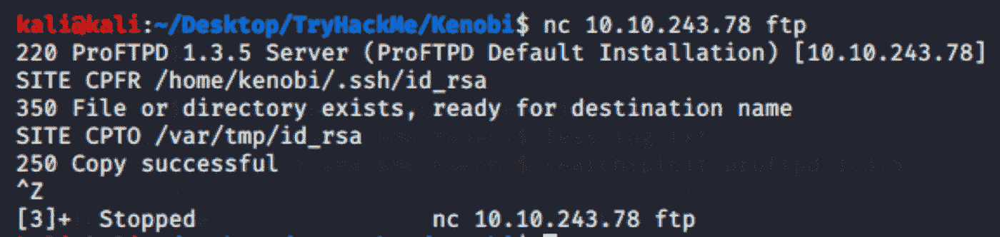

现在，我们可以将/var/tmp 目录挂载到我们的机器上，并检索 SSH 密钥。

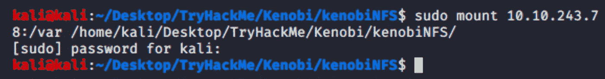

您可以通过进入我们放置 id_rsa 文件的 tmp 目录来检索密钥。

现在，让我们将密匙从挂载复制到我们的系统，并通过 SSH 连接到受害者机器。

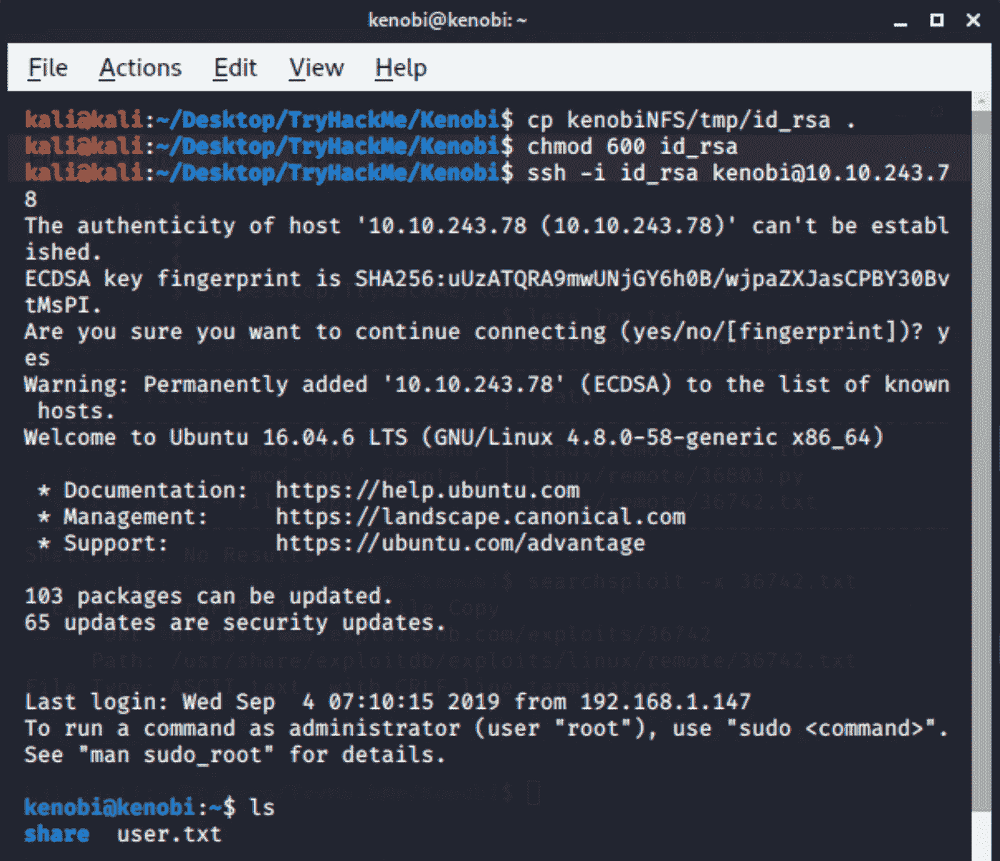

您可以使用 cat user.txt 获取您的标志。

这可能会混淆我们刚刚做的事情，特别是当涉及到不同的共享和 FTP 服务器时。

因此，这里有一点关于目前为止所涉及的股票之间的差异的解释。

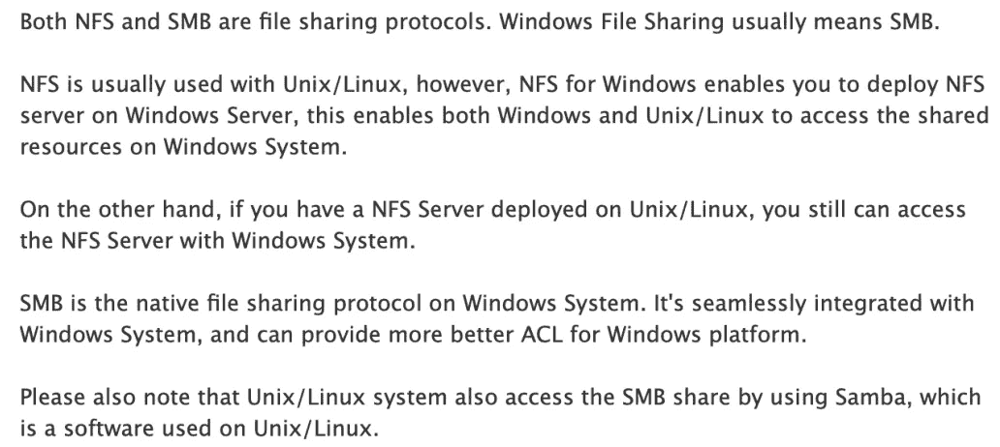

***4。通过路径变量操作提升权限***

为了找到启用了 SUID 位的二进制文件，我们可以使用以下两个命令:

**find/-perm-u = s-type F2>/dev/null**

或者

**find/-perm-4000-type F2>/dev/null**

这两个命令的第二部分将把错误消息(权限被拒绝)发送到任何地方。

为了从前面的命令输出中发现一些奇怪的东西，您可以比较在易受攻击的机器和您自己的系统上执行该命令的结果。它可以作为一个基线。

**/usr/bin/menu** 看起来很奇怪，我们来看看这个。

在探索了该程序的功能之后，我们可以看到它的输出看起来像是众所周知的 Linux 命令的输出。

我们可以使用 **strings** 命令来查看这个应用程序源代码中人类可读的行。

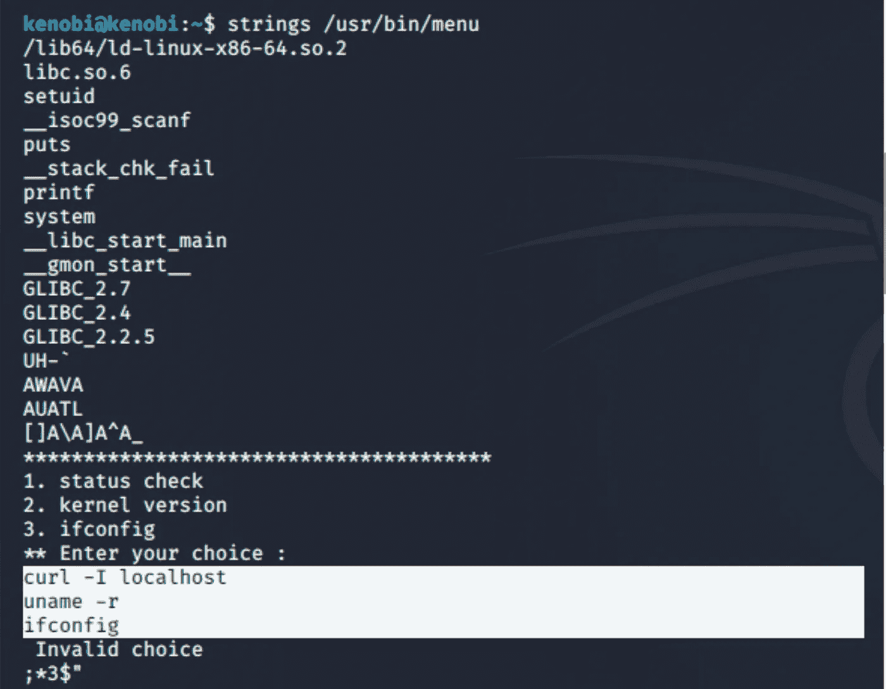

正如我们已经看到的，在这些选项后面有三个 Linux 命令(curl、uname 和 ifconfig)。但是，没有指定这些二进制文件的完整路径。它告诉我们，系统会在克诺比的路径上寻找这些指令。

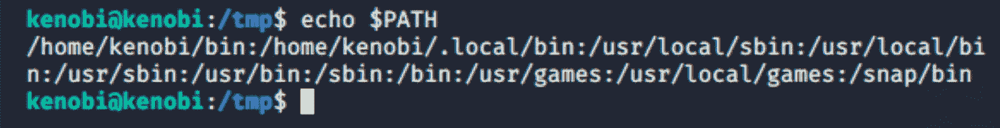

但是，如果我们创建这些命令的版本，并在现有列表的开头添加新的路径，会怎么样呢？

首先，让我们创建自己的 curl 命令，当执行该命令时，它将给出 shell:

**回声'/bin/sh' >卷曲**

**chmod 766 curl**

其次，我们需要向克诺比路径添加另一个条目，指向我们刚刚创建的全新 curl 二进制文件:

**导出路径=/tmp:$PATH**

所有准备工作都已完成，让我们再次运行/usr/bin/menu 二进制文件。

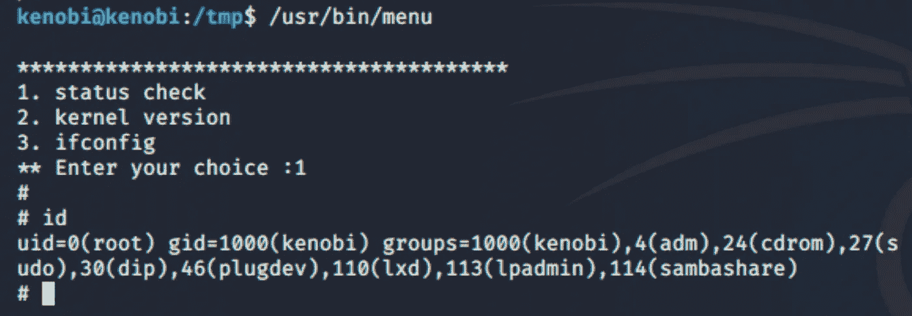

瞧啊。现在，我们是根！

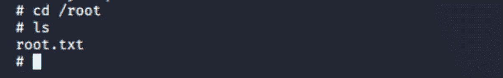

所有剩下的——找回最后一面旗帜！