# TryHackMe- Brute It CTF 报道(详细)

> 原文：<https://infosecwriteups.com/tryhackme-brute-it-ctf-writeup-detailed-af408268855?source=collection_archive---------4----------------------->

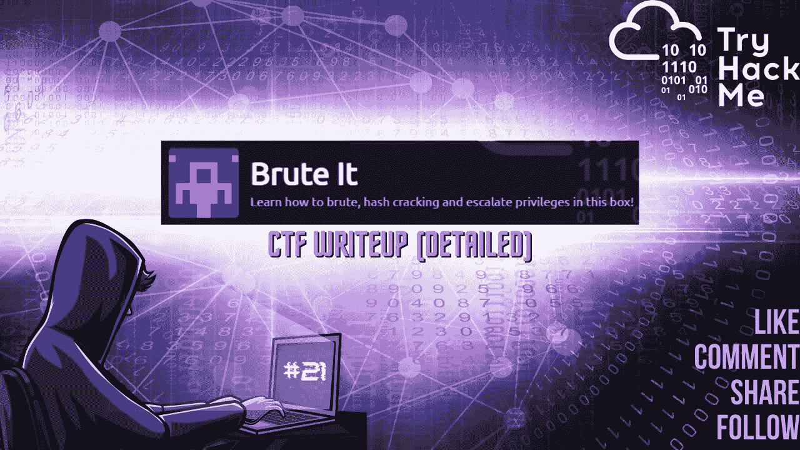

欢迎各位！！我们将在 [TryHackMe](https://medium.com/u/dc49a0a3cb16?source=post_page-----af408268855--------------------------------) 上演蛮力 CTF。

CTF 链接:

 [## 试试看

### TryHackMe 是一个学习和教授网络安全的在线平台，全部通过您的浏览器完成。

tryhackme.com](https://tryhackme.com/room/bruteit) 

CTF 由以下作者创作:

 [## TryHackMe | ReddyyZ

### TryHackMe 是一个学习和教授网络安全的在线平台，全部通过您的浏览器完成。

tryhackme.com](https://tryhackme.com/p/ReddyyZ) 

为您的 CTF 计算机创建一个目录，并为 Nmap 创建一个目录来存储您的 Nmap 扫描输出。

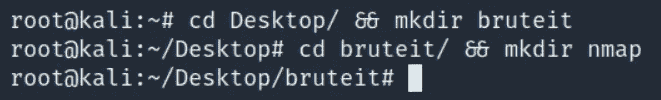

让我们开始吧！！享受流动吧！！

## 任务 1-关于这个盒子:

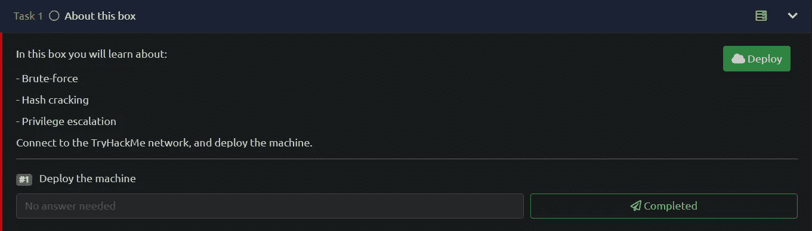

最容易的任务😃

> #1 部署机器
> 答:不需要回答

## 任务 2-侦察:

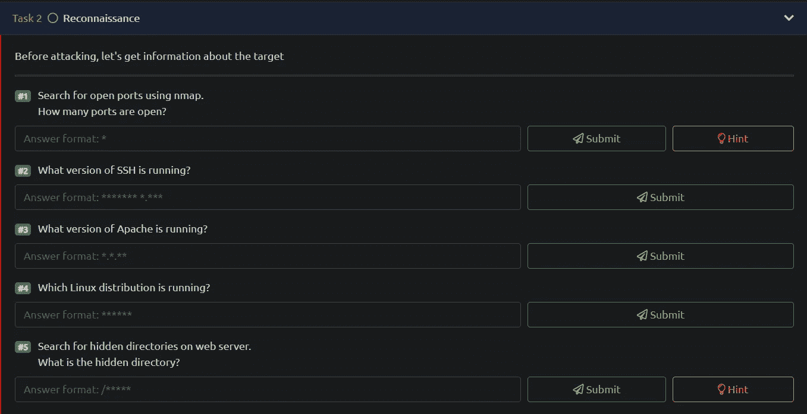

## Nmap 扫描:

> *nmap-sC-sV-p--oN nmap/brute it _ all ports<TARGET _ IP>*
> 
> -sC:默认脚本
> -sV:版本检测
> -oN:输出将存储在您之前创建的“nmap”目录中
> -p-:要扫描的所有端口

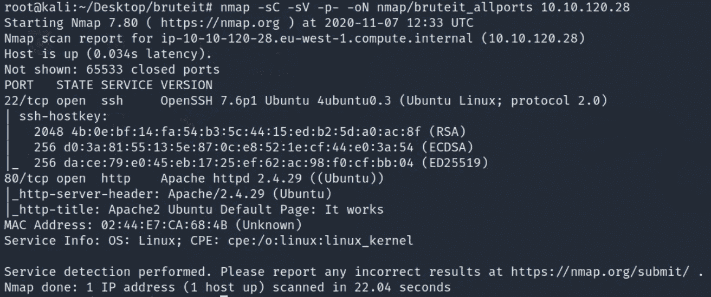

有 2 个端口打开:
22/ssh-OpenSSH 7.6p 1
80/http-Apache httpd 2 . 4 . 29
检测到 OS-Ubuntu Linux

Nmap 扫描输出回答了一些任务。让我们提交它们。

> #1.使用 nmap 搜索开放端口。开放了多少个端口？
> 答:2
> 
> #2.SSH 运行的是什么版本？
> Ans: OpenSSH 7.6p1
> 
> #3.Apache 运行的是什么版本？
> 答复:2.4.29
> 
> #4.运行的是哪个 Linux 发行版？
> 答:Ubuntu

## Gobuster:

> *gobuster dir-u http://<TARGET _ IP>-w<PATH _ TO _ word list>-o<OUTPUT _ FILE _ NAME>-x<扩展名>*
> 
> -u:URL
> -w:word list
> -q:quiet，静默扫描。将隐藏横幅。
> -o:输出将存储在目录
> -x:搜索扩展名，如 html、txt、php、phtml 等。

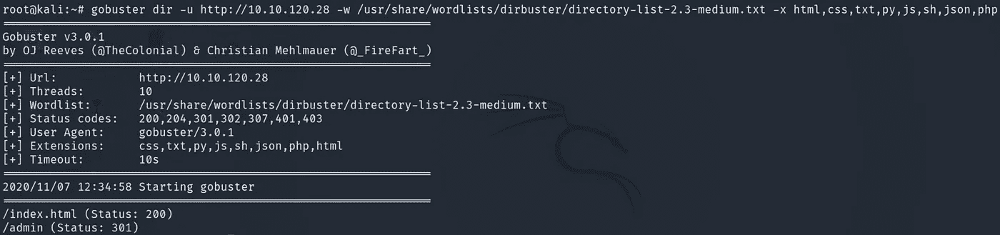

我们发现了一个目录/admin，它回答了这个问题。提交吧。

> #5.搜索 web 服务器上的隐藏目录。什么是隐藏目录？答复:/管理员

太棒了！！让我们进行任务 3。

## 任务 3-获得外壳:

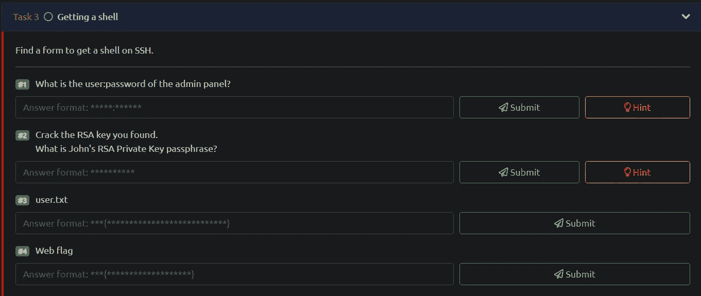

> 导航到 http://<target_ip></target_ip>

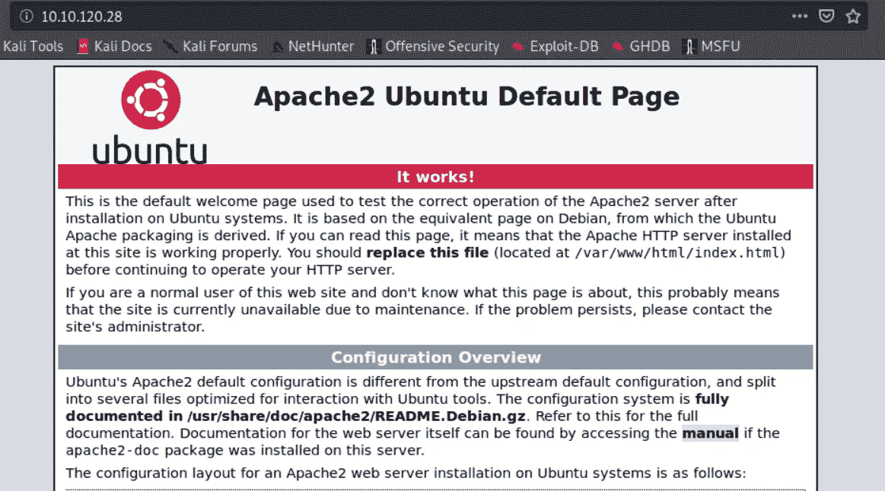

经常检查页面的源代码，寻找隐藏的注释，这是一个很好的习惯，可以在我们的枚举过程中帮助我们。查看 URL 页的源代码。

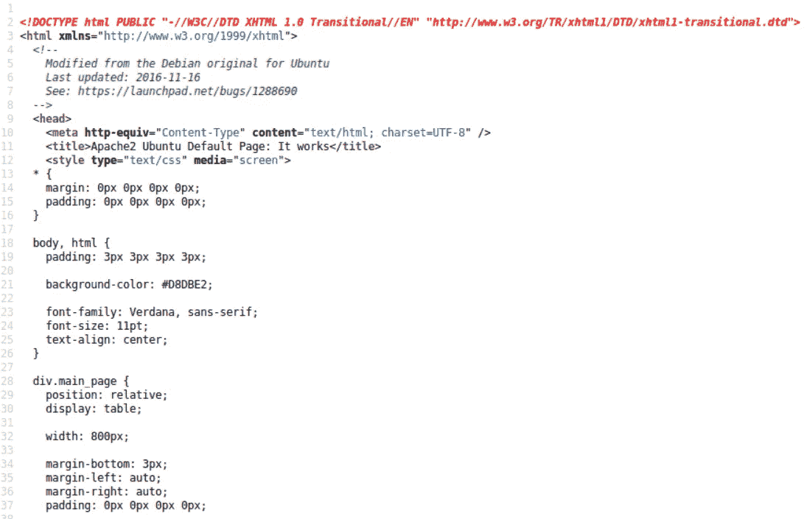

检查过了。看起来很好，不包含隐藏的评论或哈希。我们将检查/admin 目录。

> 导航到 http:// <target_ip>/admin</target_ip>

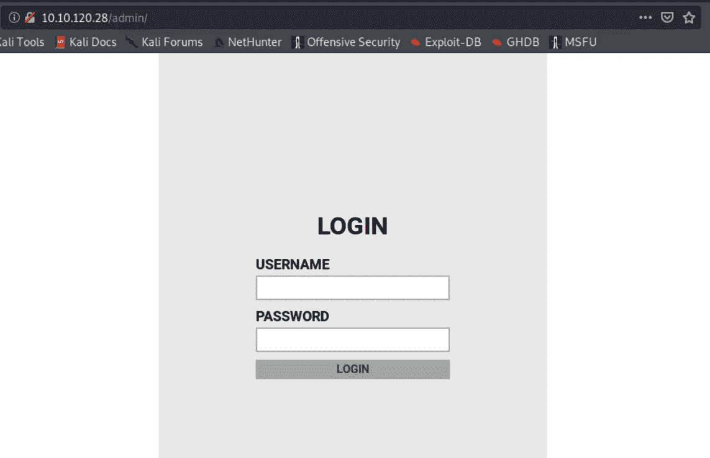

检查源代码。[Ctrl+U]

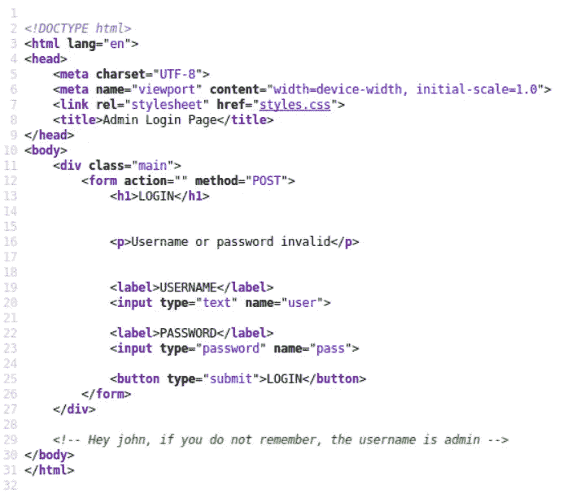

太棒了。！用户名是 admin，但我们也获得了另一个名字'约翰'。出于强行登录提示的目的，我们现在关心的是用户名“admin”。

我们将启动 Hydra 并插入以下命令:

> hydra-l admin-p<path_to_wordlist><machine_ip>http-post-form“/admin/index.php:user=^user^&pass=^pass^:f=username 或密码无效”-V</machine_ip></path_to_wordlist>

让我们分解命令

*   -l 用于指定用户名
*   -P 用于指定单词列表
*   http-post-form 用于指定请求类型
*   /admin/index.php 是我们要暴力破解的页面
*   :用户是用户名的表单字段
*   ^USER^是用来告诉九头蛇插入用户名在这个领域
*   :pass 是密码的表单字段
*   ^PASS^是用来告诉九头蛇插入密码在这个领域
*   :F 用于告诉 hydra，如果登录凭据不正确，可能会出现失败消息
*   错误消息是用户名或密码无效
*   -V 用于详细输出

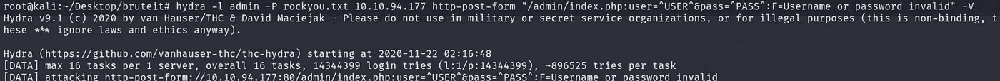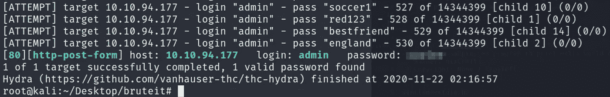

稍后，我们将获得密码以及问题的答案。提交吧。

> 什么是用户:管理面板的密码？答:管理员:XXXXXX

继续前进……

> 再次导航 http:// <target_ip>/admin</target_ip>

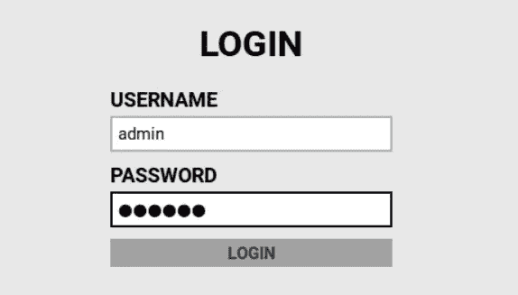

插入凭据，然后单击登录

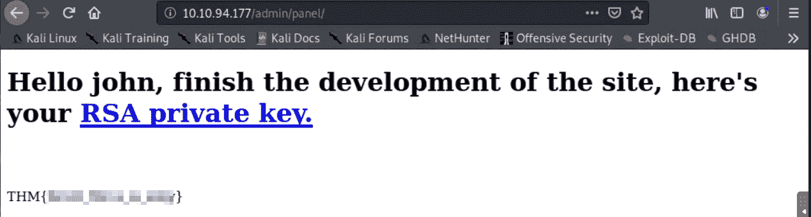

太棒了！！我们已经获得了网络标志，它回答了这个问题。提交吧。

> 网旗
> Ans: THM {XXXXXXXXXXXX}

我们有一个链接到 RSA 私钥，我们一定会检查。

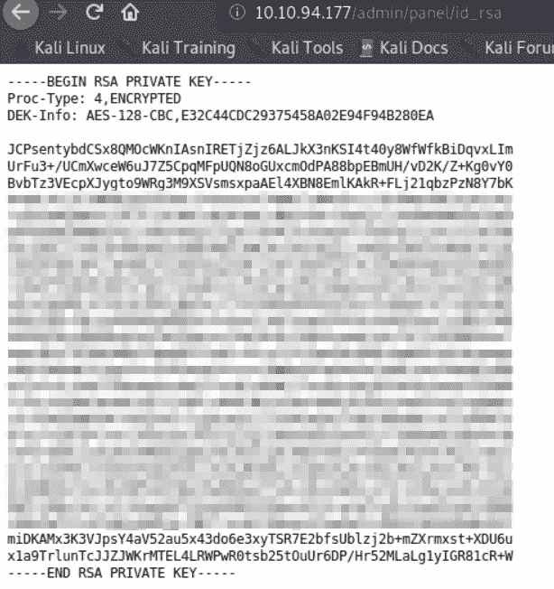

太好了！！所以我们得到了“id_rsa”密钥，但它是加密的。别担心，我们会解密的。

我们可以使用‘纳米’编辑器来保存加密的私钥。复制键[Ctrl+U]保存[Ctrl+O]退出编辑器[Ctrl+X]。

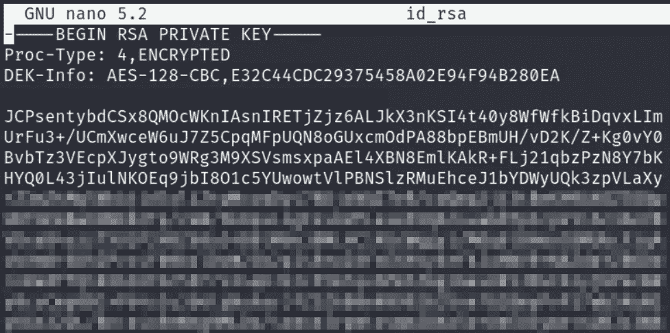

我们必须解密 ssh 密钥，为此，我们可以使用一个非常棒的脚本，将 ssh 密钥转换为开膛手工具 john 可以理解的格式，然后使用单词列表暴力破解该密钥，以找到允许我们登录 SSH 的正确短语或密码。

 [## openwall/约翰

### 此时您不能执行该操作。您已使用另一个标签页或窗口登录。您已在另一个选项卡中注销，或者…

github.com](https://github.com/openwall/john/blob/bleeding-jumbo/run/ssh2john.py) 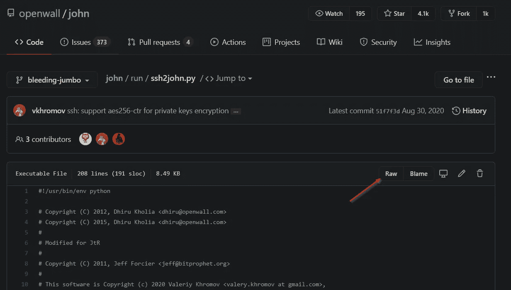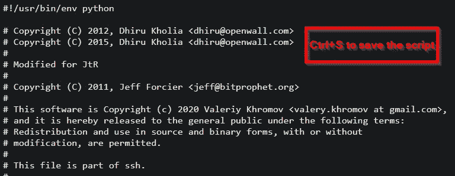

在我们将脚本保存到主机上之后，使用“chmod +x ssh2john.py”命令使其可执行是很重要的。

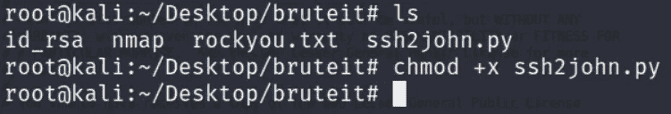

我们可以执行脚本，使用“id_rsa”文件作为输入参数，并将输出保存到“id_rsa_key”文件

> *。/ssh 2 John . py id _ RSA>id _ RSA _ key*

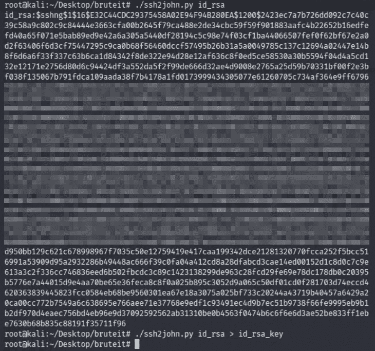

我们将启动开膛手约翰工具，并使用输出文件对 rockyou 单词表进行暴力破解。

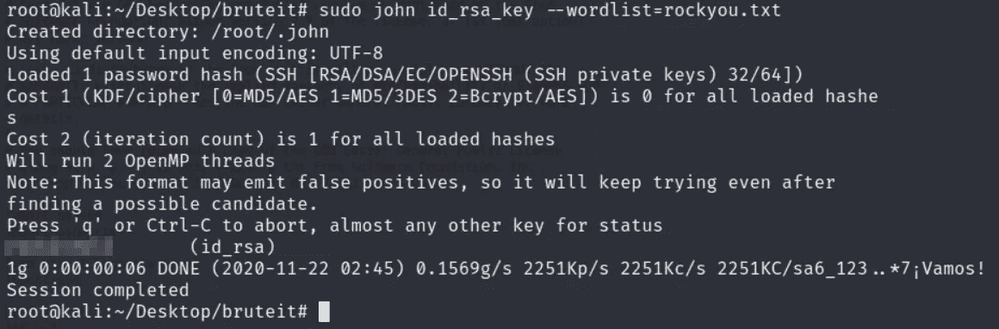

太棒了。！我们已经获得了密码。它也回答了任务中的问题。提交吧。

> 破解你找到的 RSA 密钥。
> John 的 RSA 私钥密码是什么？
> 答:XXXXXXXXX

我们可以使用 id_rsa 文件进入 ssh，以用户“john”的身份登录，当提示输入密码时，我们可以使用通过开膛手 john 破解的密码。

太棒了。！我们进去了。！
让我们捕获用户标志。

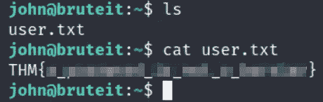

提交吧。

> user . txt
> Ans:THM { xxxxxxxxxxxxxxxxxxxxx }

## 任务 4-权限提升:

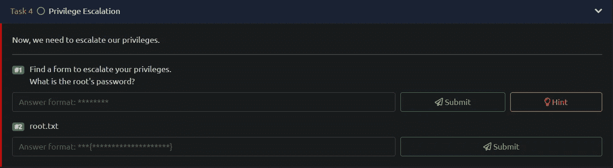

我们需要提升此机器的权限，以成为 root 用户并获取 root 标志。

我们将首先查找用户“john”作为“root”可以执行的任何命令或二进制文件。这可以通过使用命令“sudo -l”来检查

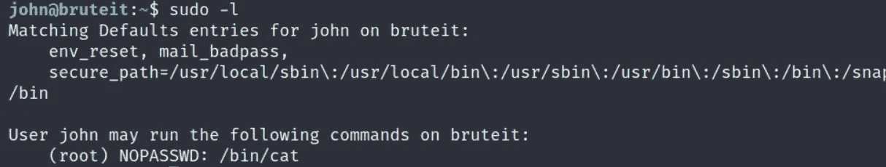

确实有。二进制文件“cat”可以作为根用户执行。我寻找特权提升命令的途径是 gtfobins。

 [## GTFOBins

### GTFOBins 是 Unix 二进制文件的精选列表，攻击者可以利用它来绕过本地安全限制…

gtfobins.github.io](https://gtfobins.github.io/) 

搜索“猫”。

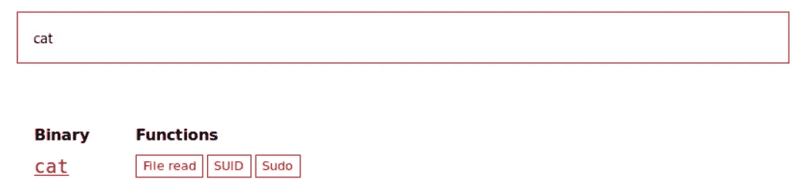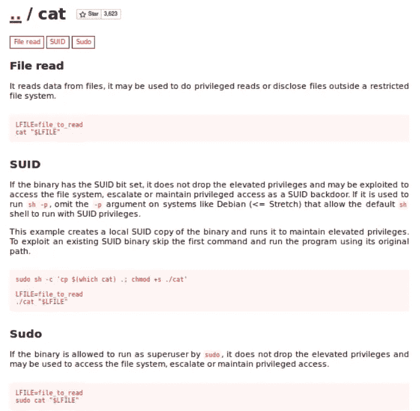

我们将创建 LFILE 变量来访问/root 目录中的“root.txt”标志，然后使用“sudo”来“cat”变量集。它不会让我们根，但让我们根旗相当容易。

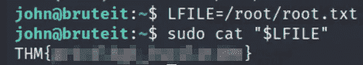

现在我们有了！！太棒了！！
提交吧。

> root . txt
> Ans:THM { xxxxxxxxxxxxxxxxxxxxx }

类似地，我们也可以访问包含根用户密码散列的影子文件。

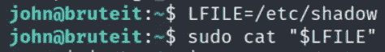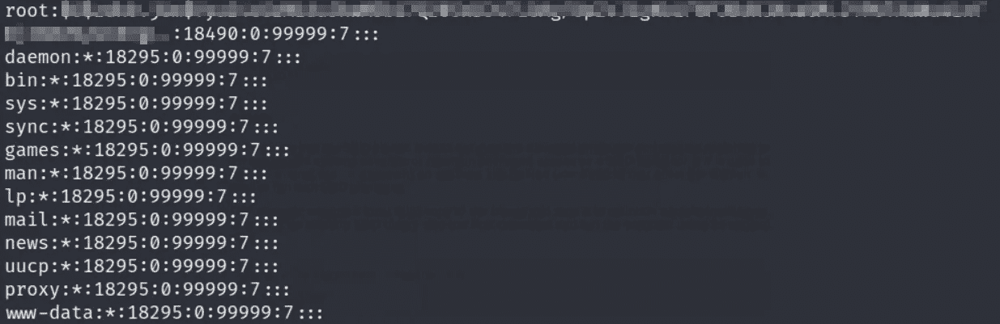

我们已经获得了根的密码散列。现在我们需要解密它。我相信‘hashcat’工具会像魔咒一样工作并成功破解它。

Hashcat 是一个优秀的哈希破解工具，有很多受支持的哈希类型。对于我们来说，确定我们需要破解的哈希类型并搜索要在“hashcat”中设置的正确模式数以破解它是非常重要的。
要找到哈希的模式号，我们可以访问下面的链接:

 [## example_hashes [hashcat wiki]

### 如果您在 hashcat 中得到一个“行长度异常”错误，这通常是因为您所请求的散列模式…

hashcat.net](https://hashcat.net/wiki/doku.php?id=example_hashes) 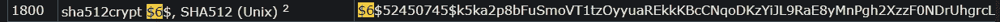

哈希是 SHA512CRYPT，模式号是 1800。
将哈希保存在文件中。只是散列“从$6$到 VgL。”。
我们将旋转哈希卡特。

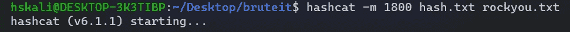

过一会儿…

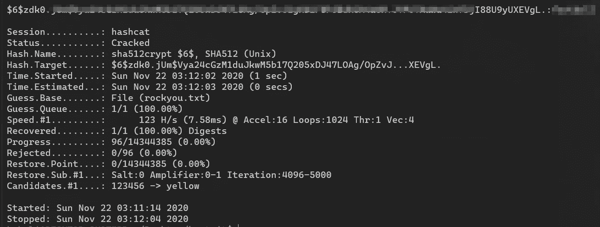

我们已经破解了哈希并获得了 root 的密码。它回答了这个房间的最后一个问题。让我们提交它，给这个 CTF 一个美好的结局。

> 找一个表格来提升你的特权。
> root 的密码是什么？
> 答:XXXXXXXXXX

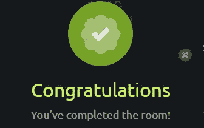

我们已经完成了房间。我真的很喜欢这个房间，并从中获得了很多乐趣。我会建议每个人都尝试一下这个房间，我相信你会学到一些新的东西。

如果你喜欢这篇文章，并且这篇文章对你有所帮助，请在评论中告诉我，或者用掌声分享你的爱。

谢谢你抽出时间。

跟着我。

更多的报道正在进行中。

保重，注意安全，继续黑！

**-哈桑·谢赫**