# TryHackMe- c4ptur3-th3-fl4g CTF 报道(详细)

> 原文：<https://infosecwriteups.com/tryhackme-c4ptur3-th3-fl4g-ctf-writeup-detailed-f196058c26d0?source=collection_archive---------0----------------------->

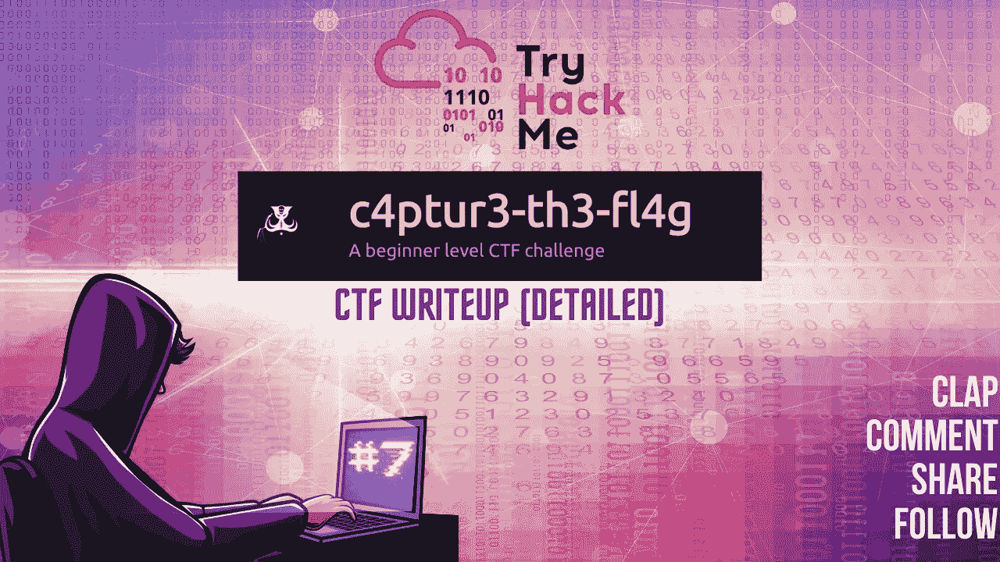

CTF 报道#7

欢迎各位！！我们要在 TryHackMe 上做 **c4ptur3-th3-fl4g** CTF。我相信我们会很高兴完成这个房间。

 [## TryHackMe | c4ptur3-th3-fl4g

### TryHackMe 是一个学习和教授网络安全的在线平台，全部通过您的浏览器完成。

tryhackme.com](https://tryhackme.com/room/c4ptur3th3fl4g) 

让我们开始吧！！享受流动吧！！

## 任务 1-翻译和转移:

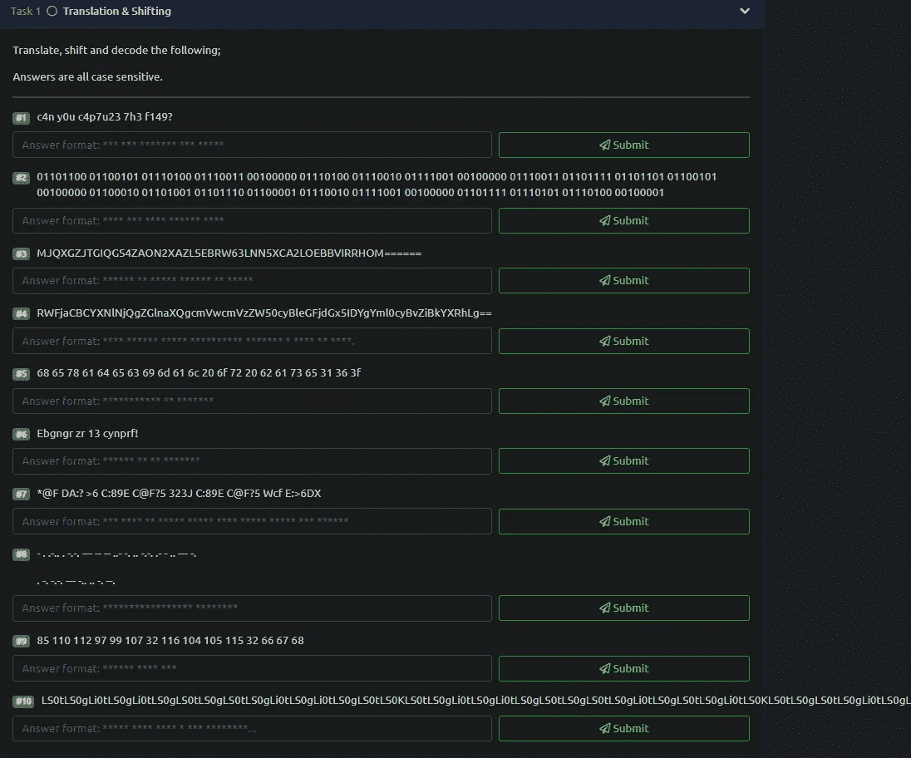

> #1.
> 
> c4n y0u c4p7u23 7h3 f149？

> 你能抓住旗子吗？
> 上面的字符串是“你能抓住旗子吗？”这很容易理解。
> 这不是一个哈希解码，它只是把一些字符转换成数字，意思相同。我的名字是哈桑，但如果我使用别名 H@$$@N，它不会是一个散列，但看起来很酷。😄

为了回答大多数问题，我将在处理哈希时使用我的首选。

 [## 网络咖啡馆

### 网络瑞士军刀-一个用于加密、编码、压缩和数据分析的网络应用程序

gchq.github.io](https://gchq.github.io/CyberChef/) 

Cyberchef 将完美地完成这项工作。在这篇文章中，我们会经常用到它。

> #2.
> 
> 01101100 01100101 01110100 01110011 00100000 01110100 01110010 01111001 00100000 01110011 01101111 01101101 01100101 00100000 01100010 01101001 01101110 01100001 01110010 01111001 00100000 01101111 01110101 01110100 00100001

看到 0 和 1，马上就知道是什么了。是的，你认为是对的。它是二进制的。因此，我们可以去 Cyberchef，选择二进制，将散列粘贴到输入中，神奇的事情马上就发生了。您将在右下角看到输出。这就是这项任务的答案。

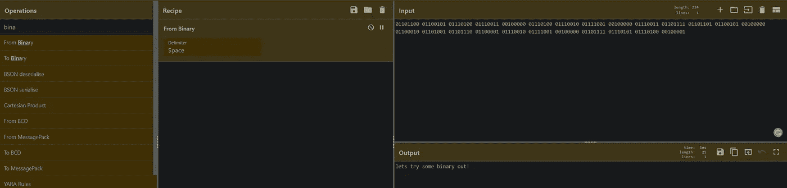

二进制的

> 让我们尝试一些二进制！

> #3.mjqxgzjtgiqgs 4 zaon 2 xazlsebrw 63 lnn 5 xca 2 loebbvirrhom = = = = =

识别散列是否是基本编码的最好方法是查看散列的最后几个字符。如果我们能在最后看到=符号，它确实给我们一个线索，它确实是基本编码的。但是哪个基地？基数太多了比如 32，58，62，64，85 会是哪一个？答案很简单。只要尝试所有的基本格式，你就知道是哪一种了。我拖动所有的基本格式，把它们全部关掉，一个接一个地打开，然后分析输出。

哈希是以 32 为基数的。破解了。太棒了。继续前进…

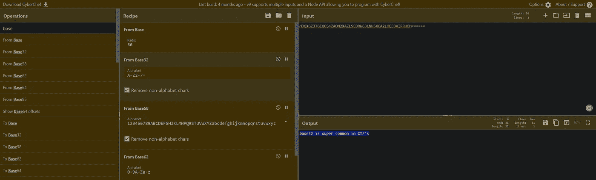

Base32

> 答:base32 在 CTF 非常普遍

> #4.rwfjacbcyxnlnjqgzglnaxqgcmvwcmvzzw 50 cyblegfjdg X5 idygyml 0 cybvzibkyxrhlg = =

如此简单..我知道你猜对了..它是 base64 编码的哈希..让我们破解它。

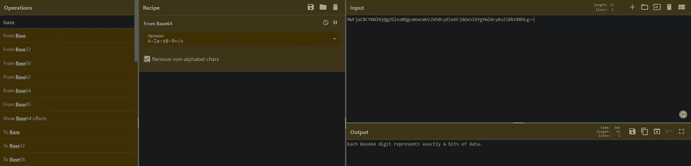

Base64

或者，我们使用终端来解码 base64 哈希。

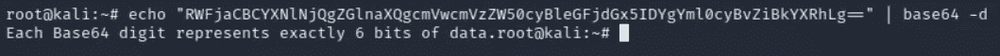

> 答:每个 Base64 数字正好代表 6 位数据。

> #5.
> 
> 68 65 78 61 64 65 63 69 6d 61 6c 20 6f 72 20 62 61 73 65 31 36 3f

哈希是十六进制格式。因此，我们将使用'从十六进制'和破解哈希。

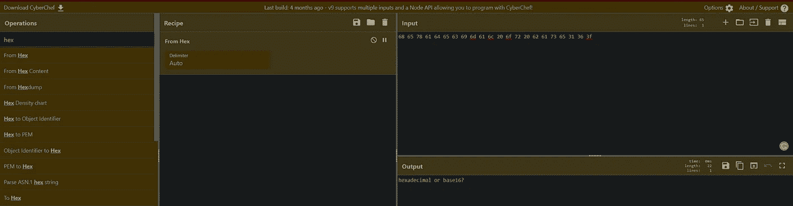

十六进制

> 答:十六进制还是十六进制？

> #6.
> 
> Ebgngr zr 13 cynprf！

散列看起来像旋转了许多位置的字母。这意味着哈希可能是 ROT13。我们可以用‘rot 13’破解它。

太棒了。！这太有趣了！！

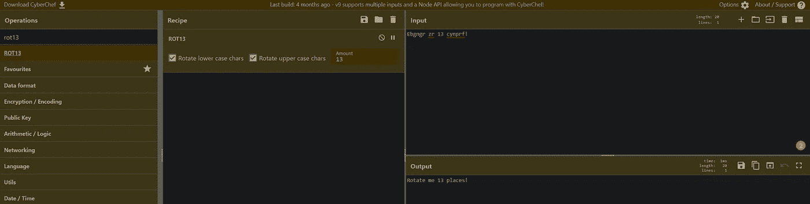

ROT13

> Ans:把我旋转 13 个位置！

> #7.
> 
> *@F DA:？> 6°C:89E°C @ F？5 323J C:89E C@F？5 Wcf E:>6DX

嗯。这是什么？这是一个包含一些旋转字符和一些特殊字符的散列。是 ROT47 哈希。我们知道该怎么做。

太好了。到目前为止一切顺利。

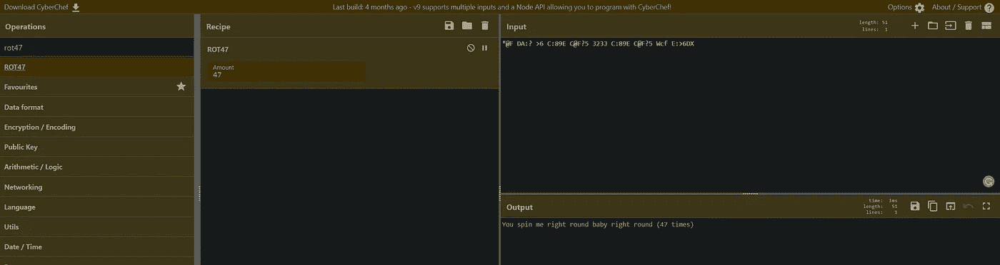

ROT47

> 答:宝贝，你让我向右旋转(47 次)

> #8.
> 
> - . .-.. . -.-. — — — — ..- -. .. -.-. .- — .. — — -.
> 
> . -. -.-. — — -.. .. -. — .

在过去，这种特殊的散列被军事人员用来通过声音传递秘密信息。这种散列被称为“莫尔斯电码”。

莫尔斯电码是电信中使用的一种方法，用于将文本字符编码为两种不同信号持续时间的标准化序列，称为点和破折号或 dits 和 dahs。

我们可以用“摩尔斯电码”来破解密码。

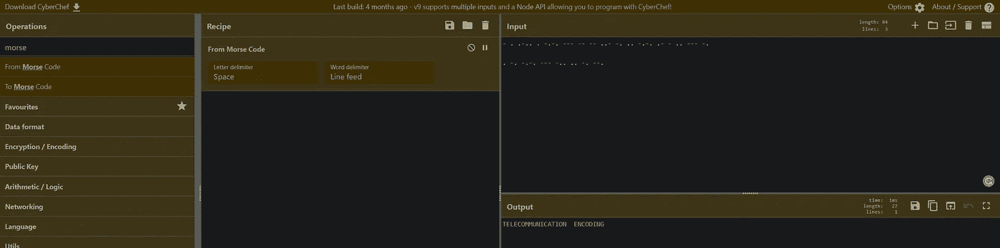

莫尔斯电码

> Ans:电信编码

> #9.
> 
> 85 110 112 97 99 107 32 116 104 105 115 32 66 67 68

你可能会猜测格式是十六进制。但事实并非如此。它是 unicode 代码点。这对数字代表字母。您可以导航到下面的链接来阅读和理解 unicode。

 [## 统一码

### Unicode 是文本字符的一种编码，它能够表示来自许多不同语言的字符…

tutorials.jenkov.com](http://tutorials.jenkov.com/unicode/index.html#:~:text=Each%20character%20is%20represented%20by,as%20one%20or%20more%20bytes) 

我解码 unicode 码位的方法是:

 [## 文本转换为十进制:将文本转换为 Unicode 码位

### 在像 ASCII 和 Unicode 这样的编码标准中，每个字符都可以用一个数字代码点来表示。而 ASCII 是…

cryptii.com](https://cryptii.com/pipes/text-decimal) 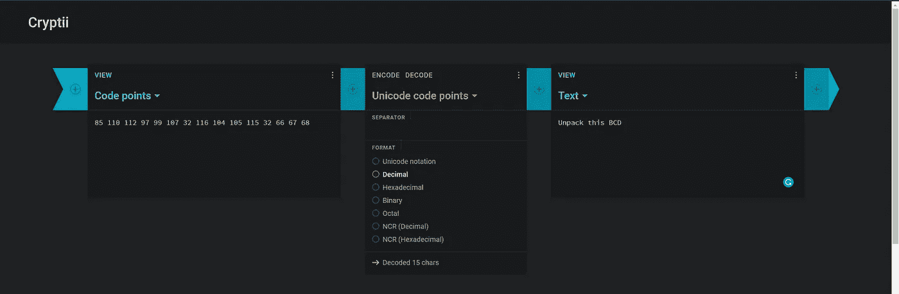

UNICODE 码位

> 回答:打开这个 BCD

> #10.
> 
> ……ls 0 TLS 0 gls 0 TLS 0 gli 0 TLS 0 gli 0 TLS 0 kls 0 gli 0 TLS 0 gli 0 TLS 0 gls 0 TLS 0 gls 0 TLS 0 gli 0 TLS 0 TLS 0 gls 0 TLS 0 GL 0 TLS 0 GL 0 TLS 0 gli 0 TLS 0 =

由于散列的长度，看起来散列被编码了多次。如果是的话，我们就必须多次解码才能得到答案。

注意:我已经缩短了哈希，因为哈希是一个非常长的重复字母的字符串，但请注意在末尾有=符号。

给了我们一个线索。想想吧。的确，它是基本编码的。
我们会用 base64，开始破解。

**Base64**

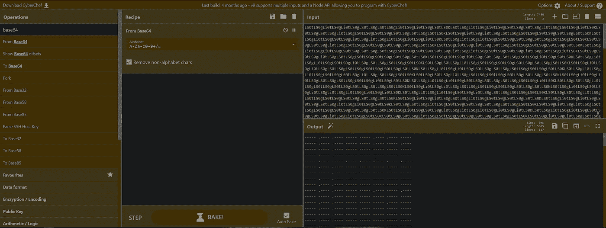

BASE64

**Base64 >莫尔斯电码**

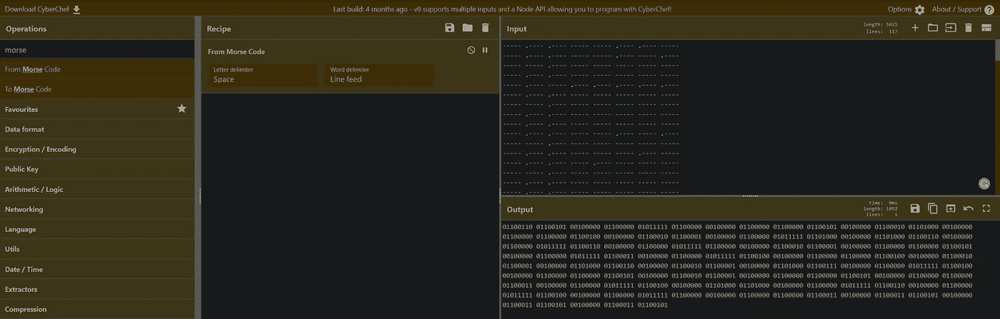

莫尔斯电码

**基数>莫尔斯码>二进制**

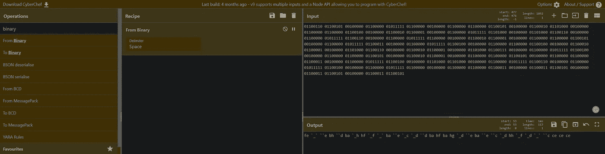

二进制的

**基数>莫尔斯码>二进制码> Unicode 码分**

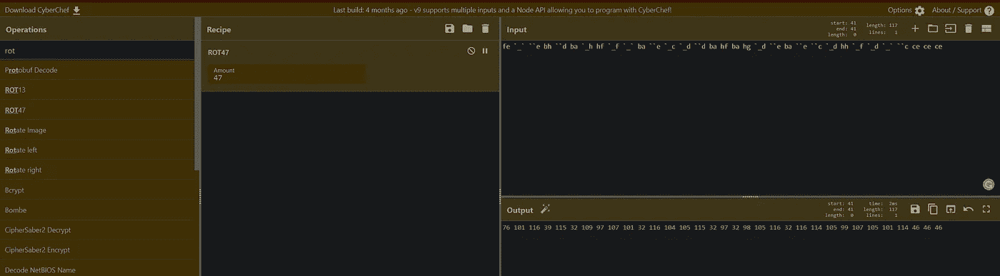

UNICODE 码位

要解密 Unicode 码位，我的方法是:

 [## 文本转换为十进制:将文本转换为 Unicode 码位

### 在像 ASCII 和 Unicode 这样的编码标准中，每个字符都可以用一个数字代码点来表示。而 ASCII 是…

cryptii.com](https://cryptii.com/pipes/text-decimal) 

点击解码并粘贴左边的散列。

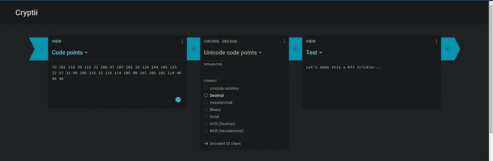

加密解密 UNICODE 码位

> 答:让我们把这个弄得更复杂一点…

太棒了。！我们已经完成了哈希破解挑战，现在我们可以继续进行频谱图挑战。

## 任务 2-频谱图:

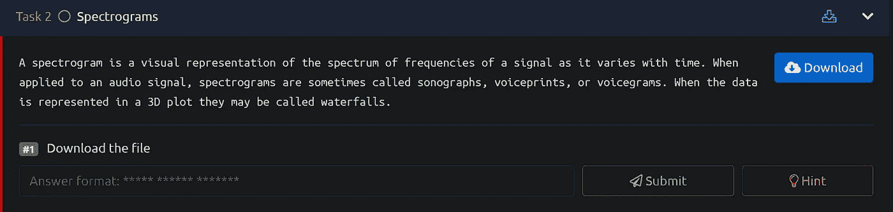

任务 2

下载文件。这是一个. wav 音频文件。

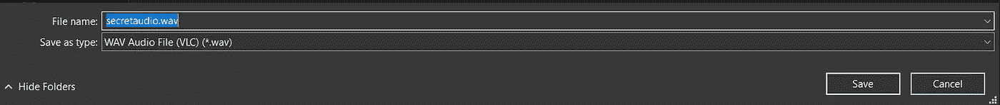

我们可以使用一个很棒的在线工具来分析嵌入在音频文件中的频谱。

 [## 光谱分析仪

### 这个音频频谱分析仪可以让你看到音频记录中出现的频率。

academo.org](https://academo.org/demos/spectrum-analyzer/) 

上传。我们先前下载的 wav 音频文件并播放该文件。

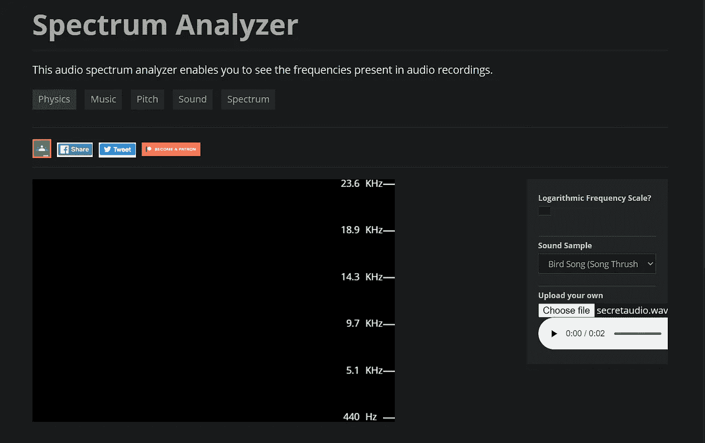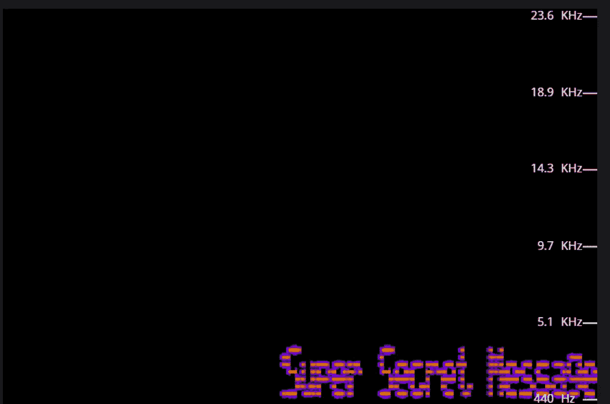

> #1.下载文件
> Ans:超级秘密消息

## 任务 3-隐写术:

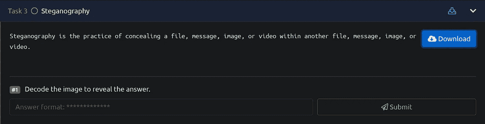

任务 3

下载文件。这是一个. jpg 图像。

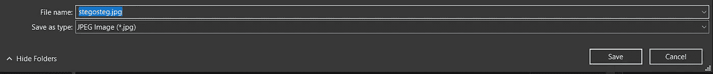

在这里，我们使用另一个伟大的在线工具，解码隐藏在 jpg，jpeg 文件中的数据。

 [## 隐写解码器

### 此表单使用编码器表单对隐藏在 JPEG 图像或 WAV 或 AU 音频文件中的有效负载进行解码。当…

futureboy.us](https://futureboy.us/stegano/decinput.html) 

上传我们之前下载的文件，然后点击提交。

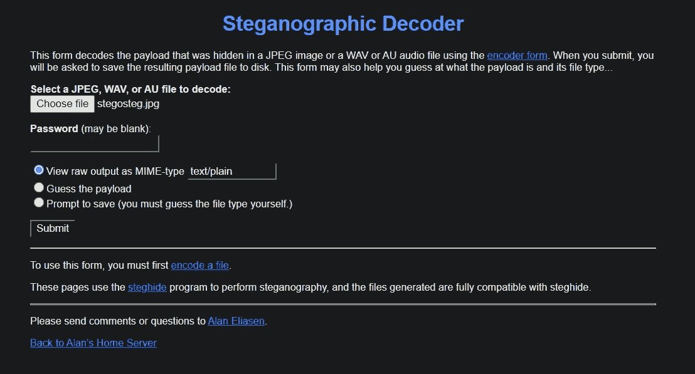

哒哒！！我们有这个任务的答案。

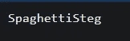

> #1.解码图像以揭示答案

我们正在粉碎它！！

## 任务 4-通过淫秽实现安全性:

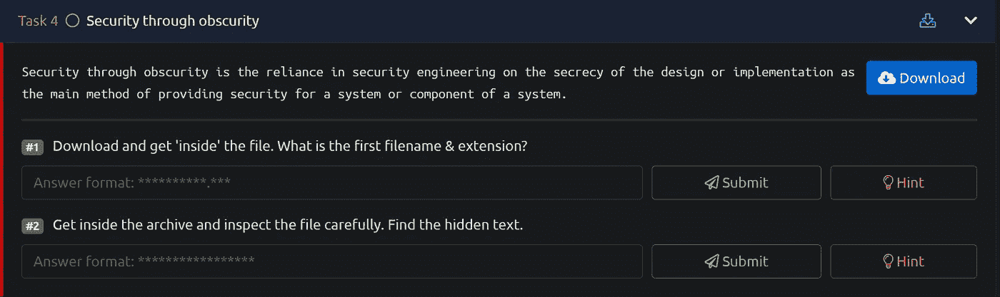

任务 4

下载文件。这又是一个. jpg 文件。

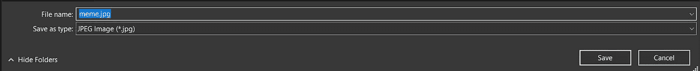

进入终端，把你的文件放在一个目录里。我们将使用 strings 命令查看内容，并以人类可读的格式显示。我们将努力寻找可能是本任务中问题答案的信息。

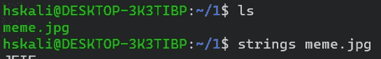

继续向下滚动输出，您会发现输出的最后两行。阅读任务。是的，事实上，这两条线分别是任务的答案。

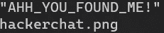

> #1.下载并获取“内部”文件。第一个文件名和扩展名是什么？
> 答:hackerchat.png
> 
> #2.进入档案，仔细检查文件。找到隐藏的文本。
> Ans:“AHH _ 你 _ 发现 _ 我！”

宏伟。！！

这是一个很棒的盒子，可以用来提高您的加密和哈希破解技能。在当今世界，数据必须是安全的，为了保护数据，必须用加密技术对数据进行加密。密码学是一个非常重要的探索和深入研究的话题，因为它对任何从事 pentesting 职业的人都非常有益。

我们已经完成了房间！！下一篇文章再见！！

如果你喜欢这个帖子，并且这个帖子在任何可能的方面帮助了你，请在评论中告诉我，或者用掌声分享你的爱。

谢谢你抽出时间。

跟着我。

更多的报道正在进行中。

保重，注意安全，继续黑！

哈桑·谢赫