# TryHackMe-CTF 巧克力工厂报道(详细)

> 原文：<https://infosecwriteups.com/tryhackme-chocolate-factory-writeup-detailed-906767867be8?source=collection_archive---------0----------------------->

CTF 报道#26

欢迎各位！！
我们将在 [TryHackMe](https://medium.com/u/dc49a0a3cb16?source=post_page-----906767867be8--------------------------------) 做巧克力工厂 CTF 室。这是一个有趣，简单，美妙的盒子。您将学习侦察、枚举、隐写术、哈希破解、获取外壳和权限提升。

CTF 链接:

[https://tryhackme.com/room/chocolatefactory](https://tryhackme.com/room/chocolatefactory)

CTF 由以下作者创作:

[https://twitter.com/andyinfosec_?lang=en](https://twitter.com/andyinfosec_?lang=en)

为您的 CTF 计算机创建一个目录，并为 Nmap 创建一个目录来存储您的 Nmap 扫描输出。

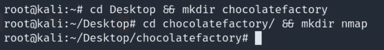

让我们潜入巧克力工厂吧！！享受冒险吧！！

# 任务 1-简介:

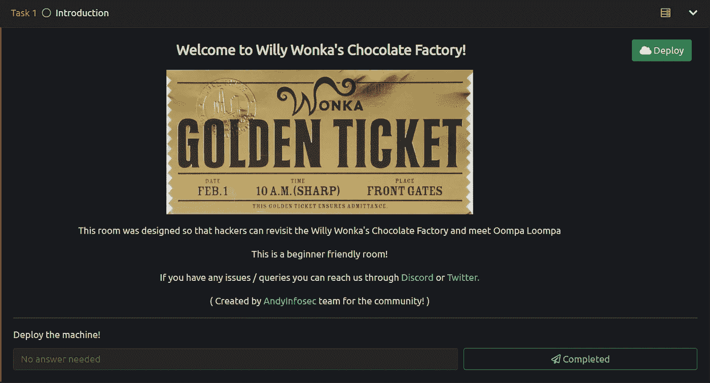

最容易的任务😄。

> 部署机器。答:不需要回答。

威利·旺卡，查理来了！！继续前进…

# 任务 2-挑战:

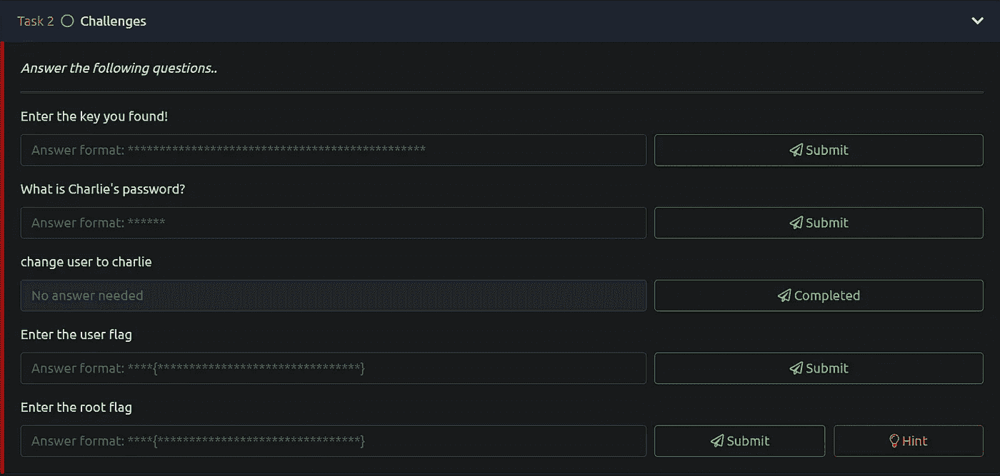

像往常一样，我们将从用我们最喜爱的扫描工具“Nmap”扫描目标开始。

## Nmap 扫描:

对于非常彻底的扫描(需要一点时间):

> *nmap-sC-sV-p--在 nmap/allports 上< TARGET_IP >*
> 
> -sC:默认脚本
> -sV:版本检测
> -oN:输出将存储在您之前创建的“nmap”目录中
> -p-:要扫描的所有端口

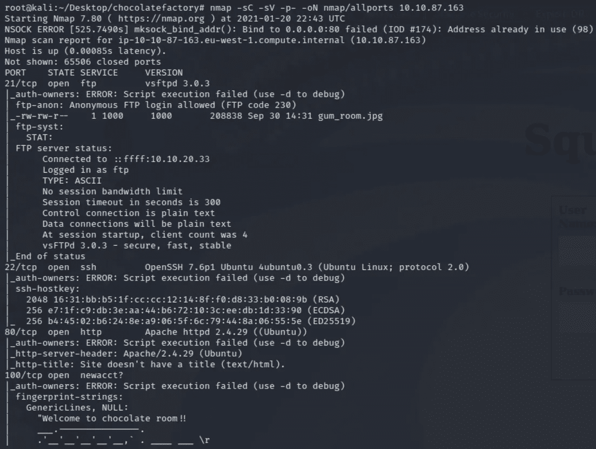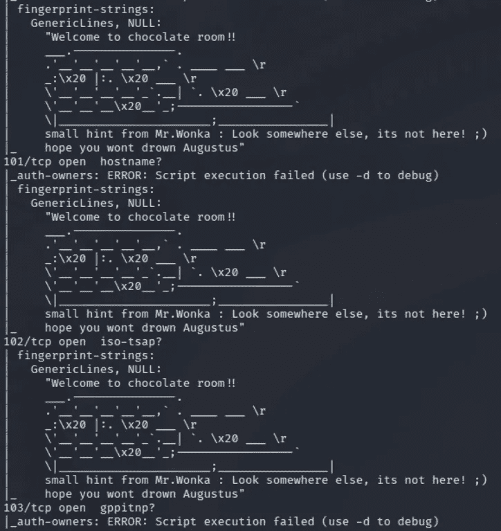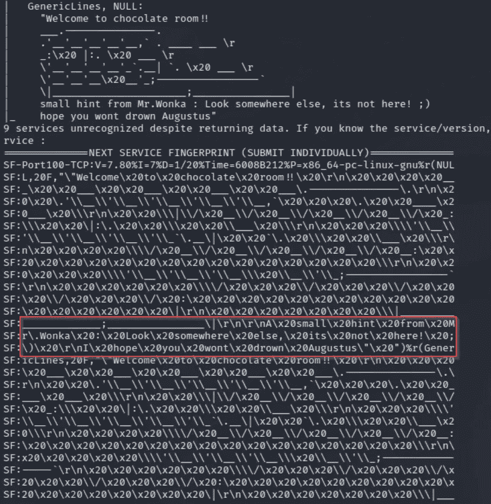

如果您仔细观察扫描输出，虽然它有点混乱，但可读性足够好，可以理解。旺卡先生暗示我们去别处看看，他希望我们不要淹死奥古斯都。虽然☺.的暗示没有用

快速识别开放端口(仅需 2 秒钟):

> *nmap-Pn<TARGET _ IP>*
> 
> -Pn:没有 ping，只有主机发现

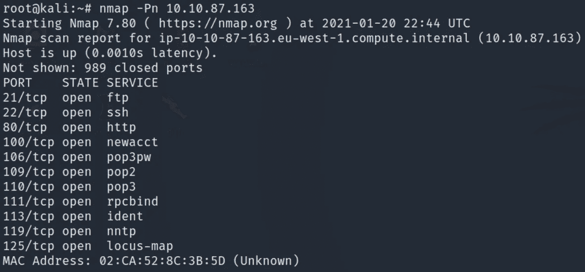

我们将重点关注 3 个开放且最有趣的端口:
21/ftp- vsftpd 3.0.3(允许匿名登录)
22/ssh-OpenSSH 7.6 P1
80/http-Apache httpd 2 . 4 . 19

厉害！！让我们不要急于列举网络服务器。首先，让我们列举 FTP，并找到任何潜在的信息或文件为我们布局。也许不是。我们最终会发现的。

## FTP 枚举:

我们将以“匿名”用户的身份使用“匿名”密码登录 FTP。

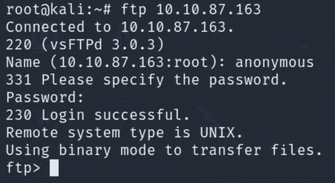

太棒了！！所以我们登录了 FTP。我们可以使用' ls '来列出文件。

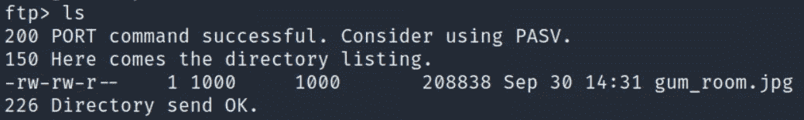

只有一个图像文件。我们可以把它转移到我们的主机上。

> 获取<file_name></file_name>

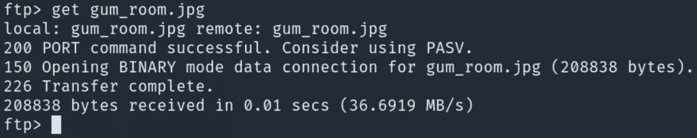

请记住，在我们退出之前，一定要检查 FTP 中隐藏的文件或目录。有时我们可能会错过一些包含重要信息的东西。我们使用' ls -la '列出所有文件，包括隐藏文件。

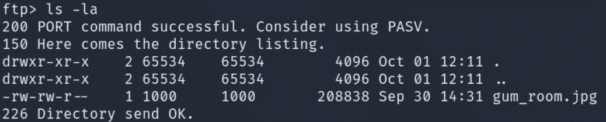

没有隐藏。没关系，我们可以继续了。

让我们分析一下我们得到的文件。

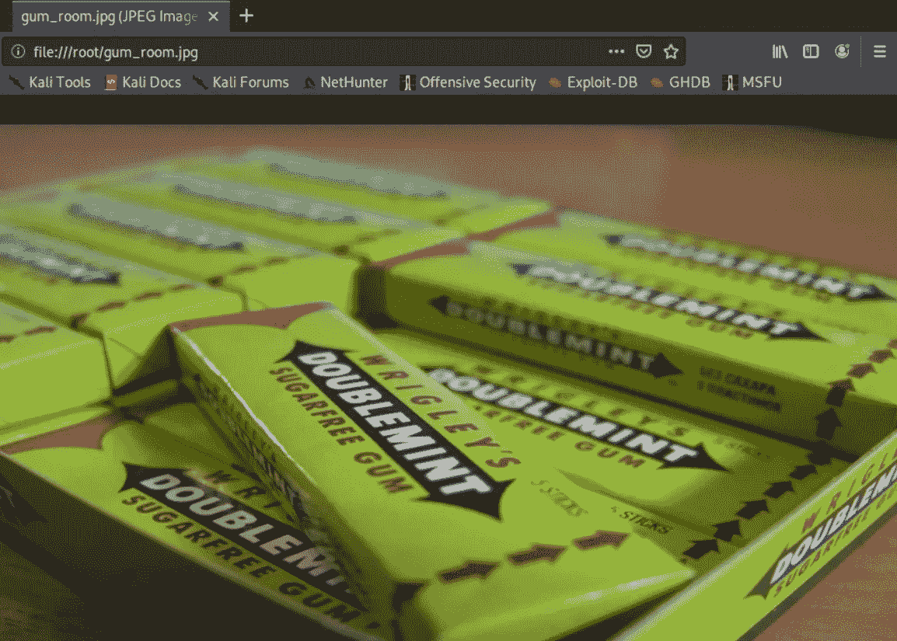

不错！！只是一个众所周知的口香糖的图像，我们可能至少试过一次。不管怎样，我们也许可以在这幅图像中寻找隐藏的东西。我的首选 steg 工具是 steghide 和 exiftool。Steghide 将从图像中提取信息/文件，exiftool 将从图像中提取元数据。

如果您尚未安装这两种软件，您可以通过以下方式进行安装:

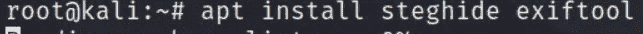

让我们用隐藏来隐藏它。

> 隐写提取物-sf

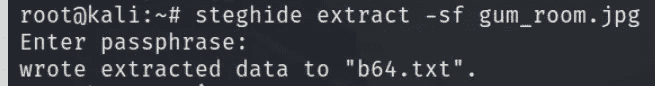

太棒了。！该图像未受密码保护。点击回车键，隐藏的文件被提取出来。我们去看看！看起来像是 base64 编码的哈希。

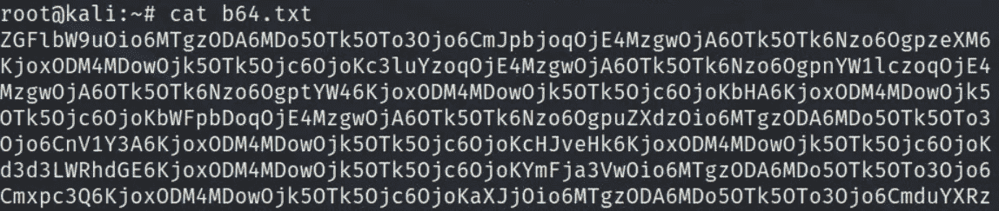

是的，是 base64。我们需要解码。

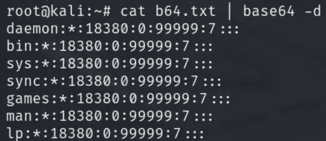

哇！！那是编码成 base64 的/etc/shadow 文件。向下滚动一点，我们将找到用户“charlie”的散列。

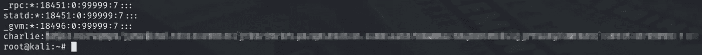

复制它，保存在一个文件中。使用 nano 编辑器。

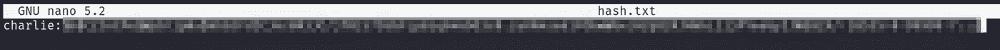

我们可以旋转臭名昭著的“开膛手约翰”工具来解密哈希。以$6$开始的散列是 SHA-512 地穴。我使用“rockyou”单词表进行解密。

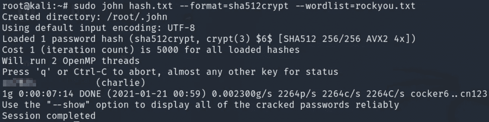

太棒了，我们已经得到了用户“查理”的密码。注意:解密用了 7 分 14 秒。因此我会建议你让它在后台运行。

让我们提交任务的答案。

> 查理的密码是什么？
> 答:XXXXXX

我们可以开始枚举运行在端口 80 上的 web 服务器。😄我们到现在都没有检查过网络服务器。

我们可以在网络服务器上快速启动 gobuster。

## Gobuster:

> *gobuster dir-u http://<TARGET _ IP>-w<PATH _ TO _ word list>-o<OUTPUT _ FILE _ NAME>-x<EXTENSIONS>*
> 
> -u : URL
> -w:单词列表
> -q:安静，无声扫描。将隐藏横幅
> -o:输出将存储在目录
> -x:搜索扩展名，如 html，txt，php，phtml 等

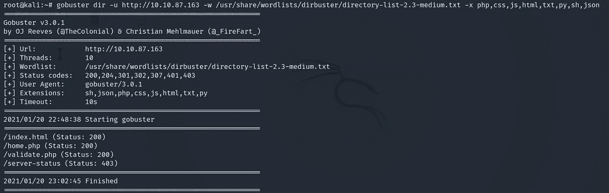

> 导航到 http://<target_ip></target_ip>

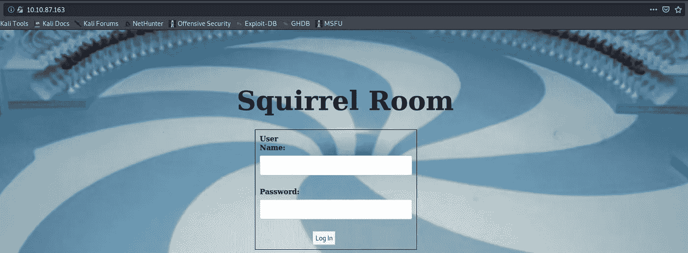

我们有一个登录提示。我们有用户名“查理”和密码是 XXXXX。输入凭据并登录。

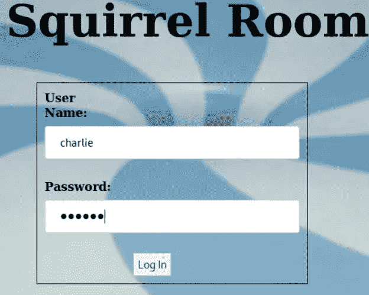

> 重定向至 http:// <target_ip>/home.php</target_ip>

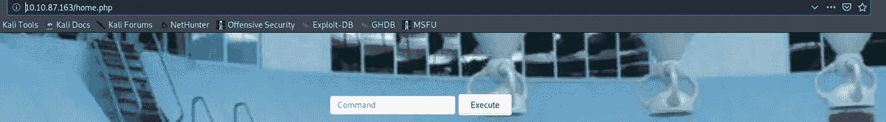

我们重定向到的页面早些时候被 gobuster 发现了。我们可以在机器中发出命令，这些命令将在目标的 web 服务器上执行。厉害！！我们继续吧。始终使用基本命令来查看一些是否被列入黑名单。以“ls”开头。

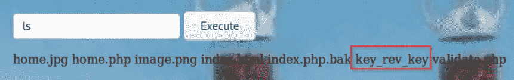

伟大的 so 'ls 作品。嗯。看起来 key_rev_key 文件有我们在任务中需要提交的密钥。我们能“猫”吗？

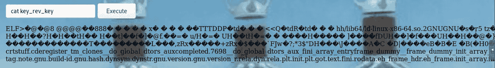

这是一个可执行文件，它是乱码，因此我们将尝试'字符串',所以它可以显示我们人类可读格式的输出。

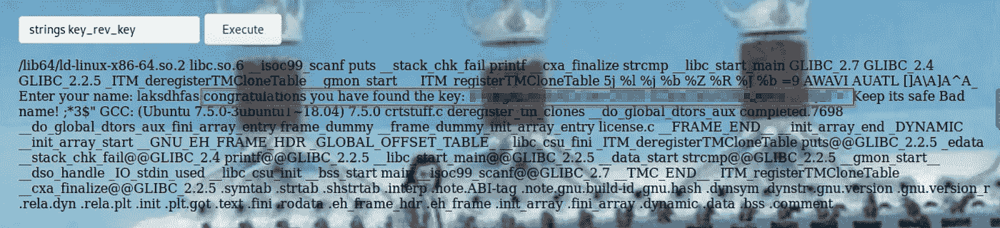

仔细看，你会看到关键。
提交吧。

> 输入您找到的密钥！
> 答:xxxxxxxxxxxxxxxxxxxxxxxxxxxxxxxxxxxxxxxxx

太好玩了！！目标是在目标机器上获得立足点或外壳。我们可以通过注入一个恶意的反向 shell 脚本来实现这一点，该脚本将使用“netcat”监听器执行并获得一个 shell。我找到反向 shell 脚本的途径是 pentestmonkey 网站。

 [## 反向外壳备忘单

### 如果你足够幸运，在渗透测试中发现了一个命令执行漏洞，不久之后…

pentestmonkey.net](http://pentestmonkey.net/cheat-sheet/shells/reverse-shell-cheat-sheet) 

复制 python 反向 shell 脚本并粘贴，修改主机的 IP 和端口值。

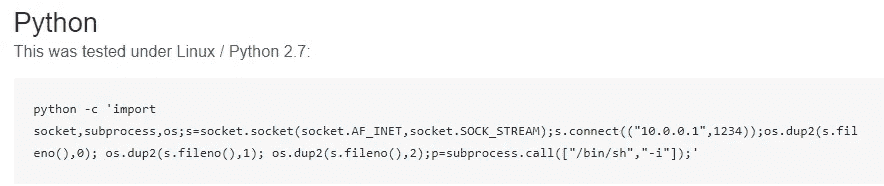

启动 netcat 监听器。

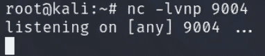

单击执行。

检查回监听器。

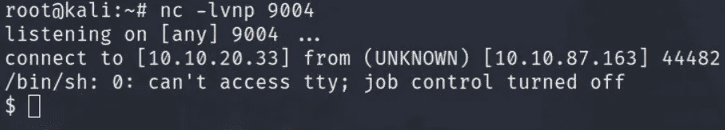

瞧啊。我们成功获得了壳牌。
但是壳不是稳定的壳。
我们如何获得稳定的外壳？让我给你带路。

> $ python-c ' import pty；pty . spawn("/bin/bash ")'
> Ctrl+Z
> stty raw-echo
> fg
> export TERM = xterm

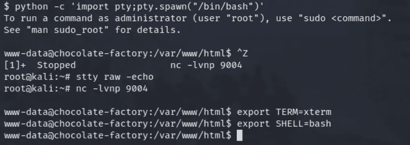

我们现在有一个稳定的外壳。
上面的命令可以让你通过 TAB 键自动完成，清空屏幕，在 shell 中轻松导航。

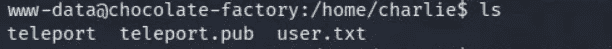

我们在“查理”的主目录中有 3 个文件。我们需要用户标志。我假设它不会让我们执行它，因为我们是用户“查理”。

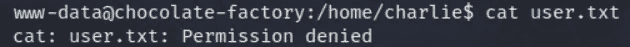

确实不会。让我们检查一下其他文件。

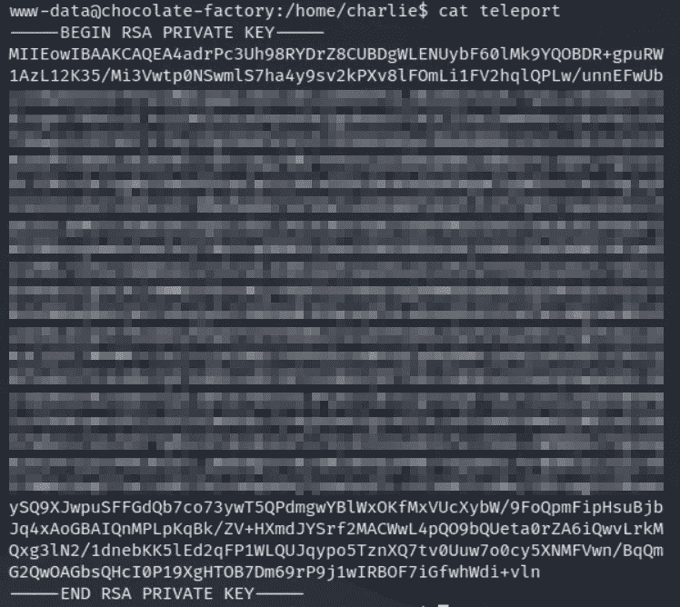

宏伟！！我们已经获得了 SSH 密钥，用于以用户“charlie”的身份登录。

让我们完成它。而且，它回答下一个任务。

复制 SSH 密钥，使用 nano 创建文件，粘贴密钥，保存[Ctrl+O]并退出[Ctrl+X]。

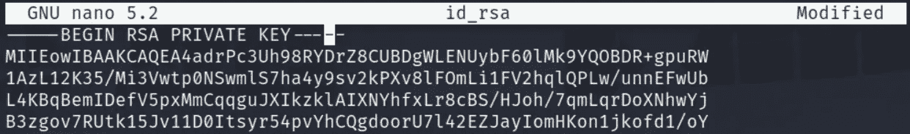

在我们 SSH 之前，我们需要给密钥权限

> chmod 600 id_rsa

然后我们就可以用钥匙登录查理了。

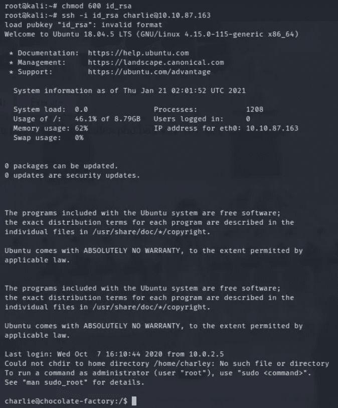

不错！！我们现在是查理了。因此，完成下一个任务，我们走了。

> 将用户改为 charlie
> 答:不需要回答。

让我们捕获用户标志。

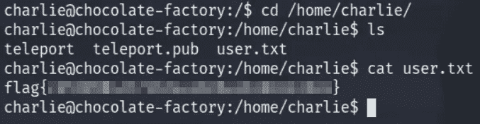

干得好！！我们已经得到了用户标志。在任务中提交。

> 输入用户标志
> Ans:XXXXXXXXXXXXXXXXXXXXXXXXXXXXXXXXXXXXXXXXX

现在怎么办？是的，你认为是对的。像任何其他 CTF 的最终目标是成为根通过升级特权和检索根旗帜。

我们将开始列举任何潜在的攻击媒介。我总是使用“sudo -l”命令来查看是否有用户有权以 root 身份执行的命令或二进制文件。

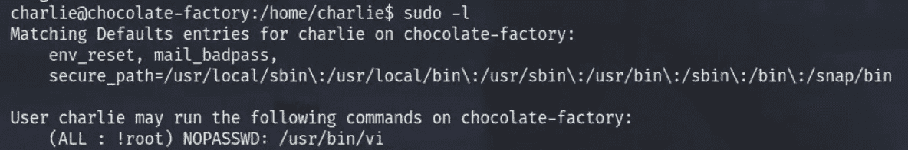

太好了！“vi”二进制文件可以由用户 charlie 以 root 用户身份运行。
GTFObins 是我查找权限提升命令的首选。很多时候，这些命令非常管用，可以帮助我们提升权限。

 [## GTFOBins

### GTFOBins 是 Unix 二进制文件的精选列表，可用于在错误配置的环境中绕过本地安全限制…

gtfobins.github.io](https://gtfobins.github.io/) 

搜索“vi”。

复制命令。

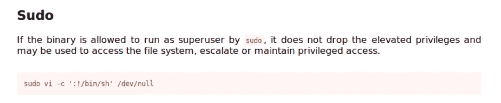

将它粘贴到终端中，然后按回车键。手指交叉！

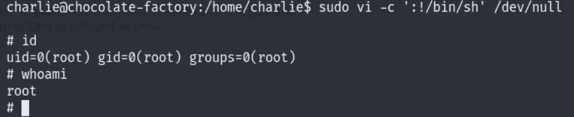

我们已经成功提升了权限。让我们抓住根旗，我们可以给巧克力工厂的冒险一个快乐的结局。

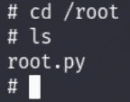

嗯（表示踌躇等）..有一个 python 脚本，而不是带有根标志的文本文件。
我们可以执行脚本并查看它的交互。

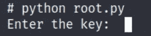

它需要输入一个有效的密钥，以便为我们提供根标志。阿汉！钥匙！也许它需要的密钥就是我们在任务中提交的密钥。让我们从任务列表中复制它，并将其作为一个键粘贴到“root.py”脚本中，看看它是否有效。

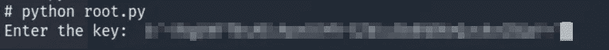

进入！

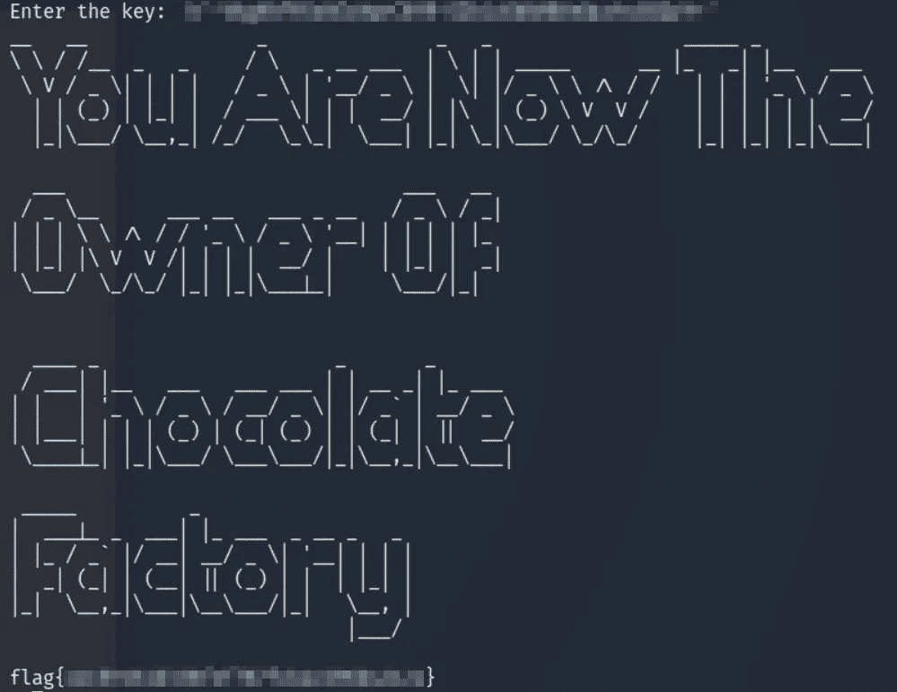

SuP3r-Aw3s0mE！！

我们已经拿到了钥匙。提交吧。

> 输入根标志
> Ans:xxxxxxxxxxxxxxxxxxxxxxxxxxxxxxxxxx

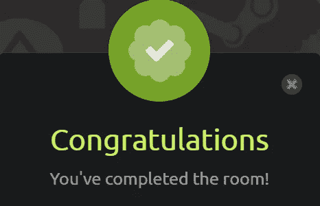

祝贺我们完成了房间。那是史诗般的乐趣。

我相信很多人可以在相当短的时间内完成盒子，但我的方法是列举出一个盒子。然而，我非常喜欢扎根于此，而不是写一篇详细的文章来帮助我的有志黑客同伴学习网络安全。

我会建议每个人都尝试一下这个房间，我相信你会学到一些新的东西。

如果你喜欢这篇文章，并且这篇文章对你有所帮助，请在评论中告诉我，或者用掌声分享你的爱。

谢谢你抽出时间。

跟着我。

在推特上关注我:
[https://twitter.com/hhassansheikhh](https://twitter.com/hhassansheikhh)

给我买杯咖啡:
【https://www.buymeacoffee.com/hshoscp2021 

更多的报道正在进行中。

保重，注意安全，继续黑！

**-哈桑·谢赫**