# CTF 的尝试

> 原文：<https://infosecwriteups.com/tryhackme-cmess-ctf-c1339774550e?source=collection_archive---------1----------------------->

## 你能找到这个 Gila CMS 盒子吗？


来源:tryhackme

**在这里找到的房间**:【https://tryhackme.com/room/cmess 

在这台机器中，我们在 **user.txt** 和 **root.txt** 文件中存储了两个标志。

启动您的机器……


我们将这台机器分成两个任务，即 [**任务 1**](#eedb) & [**任务 2**](#7471)

**#【任务 1** 】:获取 **user.txt** 文件中存储的普通用户标志

***步骤 1-* >** 在 **/etc/hosts** 中添加您的机器 IP 作为 **cmess.thm** 名称

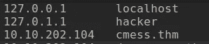

***步骤 2->***ping**cmess . thm**检查机器是否活着

***步骤 3 - >*** 执行端口扫描

[](https://github.com/robertdavidgraham/masscan) [## GitHub-robertdavidgraham/mass can:TCP 端口扫描器，异步抛出 SYN 包，扫描…

### 这是一个互联网规模的端口扫描器。它可以在 5 分钟内扫描整个互联网，传输 1000 万…

github.com](https://github.com/robertdavidgraham/masscan) 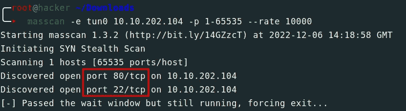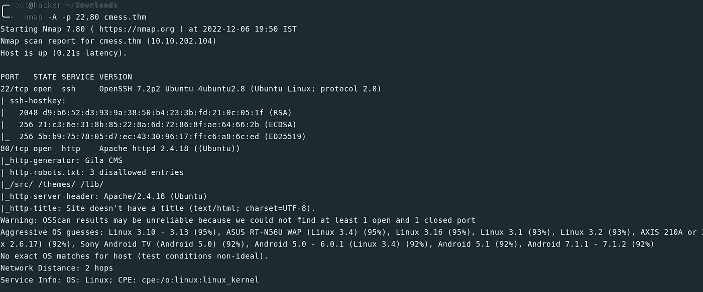

您可以手动运行它或使用我的脚本

```
#!/bin/bash

masscan -e tun0 $1 -p 1-65535 --rate 10000 > $1_masscan
cat $1_masscan | grep "Discovered open port" | awk {'print $4'} | tr -d /tcp >> $1_masscanP
cat $1_masscanP | while read b || [[ -n $b ]] ;do nmap -A -p"${b}" $1 ;done >> $1_nmap

# u also uncommnet below line
# rm $1_masscan
# rm $1_masscanP
# Usage : ./filaname.sh <ip>
```

我们在 **cmess.thm** 上的 **/robots.txt** 目录中发现了 3 个不允许的条目，但是在导航之后，它包含了 403 禁止消息。

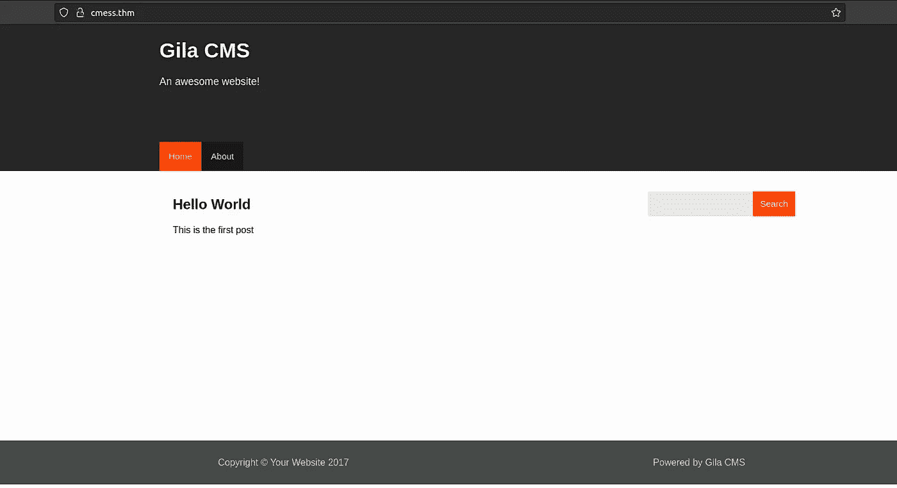

网页

***步骤 4 - >*** 执行目录模糊化

我们使用 **ffuf** 工具进行目录模糊化，这是我最喜欢的模糊化或暴力破解工具。

[](https://github.com/ffuf/ffuf) [## GitHub - ffuf/ffuf:用 Go 编写的快速网页模糊器

### 一个用 Go 编写的快速 web fuzzer。ffuf 在 Porchetta Industries Discord 服务器上有一个频道，此外还有…

github.com](https://github.com/ffuf/ffuf) 

命令:***ffuf-w/root/Desktop/word lists/dir _ big . txt-u***[***http://cmess.thm/FUZZ***](http://cmess.thm/FUZZ)

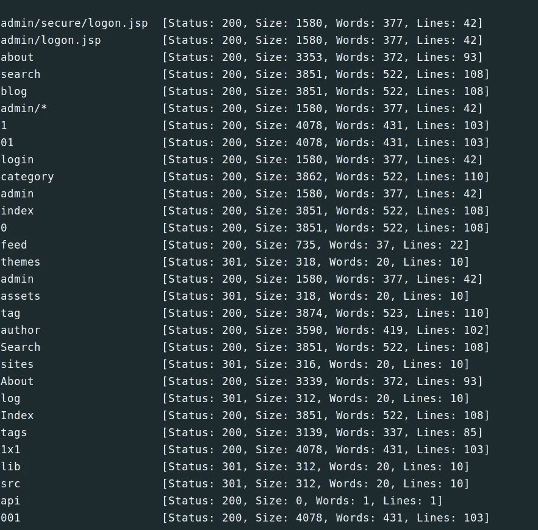

我们得到了一个很长的目录列表，但我们试图在上面导航，他们要求输入电子邮件 id 和密码才能登录。

之后，试图找到一个与 Gila cmess 相关的漏洞，但没有发现任何有趣的东西。在 Hint 的帮助下试图暴力破解子域。

***步骤 5 - >*** 执行子域蛮干

命令:***ffuf-w/root/Desktop/word lists/dir _ big . txt-u***[***http://cmess.thm/***](http://cmess.thm/)***-H " Host:fuzz . cmess . thm "-fw " 522 "***

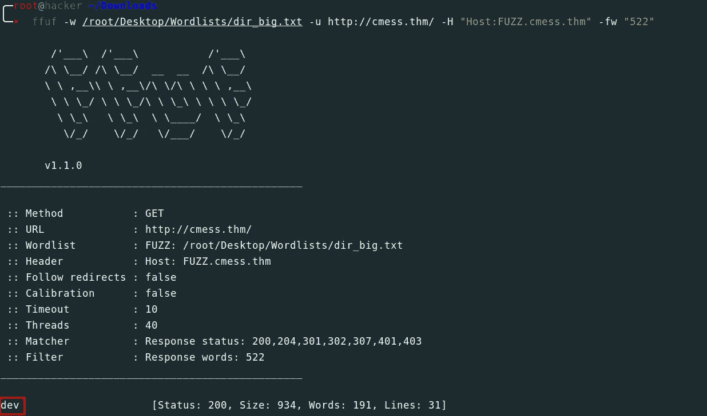

ffuf

我们在 **cmess.thm** 上得到了一个 ***dev*** 子域，试图访问它们，但在此之前，将这个子域添加到我们的 **/etc/hosts** 文件中

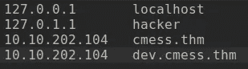

浏览***dev . cmess . thm***找到这样有趣的东西

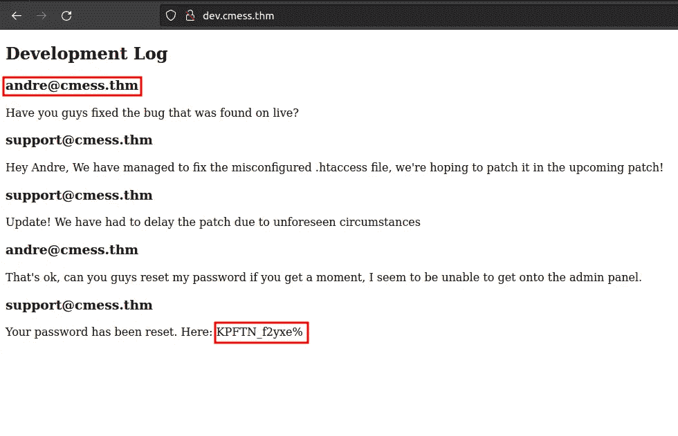

dev.cmess.thm

***步骤 6 - >*** 尝试使用这些凭证登录 cmess.thm/admin

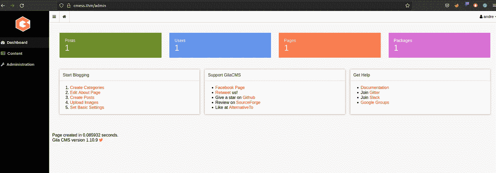

我们成功登录到**和**管理面板

***步骤 7 - >*** 上传 php 反向外壳

尝试探索管理面板中的所有标签，我们得到了一些上传功能。尝试上传反向外壳，因为网站运行在一个 **Apache** 服务器上，那么 **PHP** 对于反向外壳非常方便。

[](https://github.com/pentestmonkey/php-reverse-shell/blob/master/php-reverse-shell.php) [## PHP-reverse-shell/PHP-reverse-shell . PHP at master

### 此时您不能执行该操作。您已使用另一个标签页或窗口登录。您已在另一个选项卡中注销，或者…

github.com](https://github.com/pentestmonkey/php-reverse-shell/blob/master/php-reverse-shell.php) 

用您的 ip 更改 IP 变量值并设置端口号

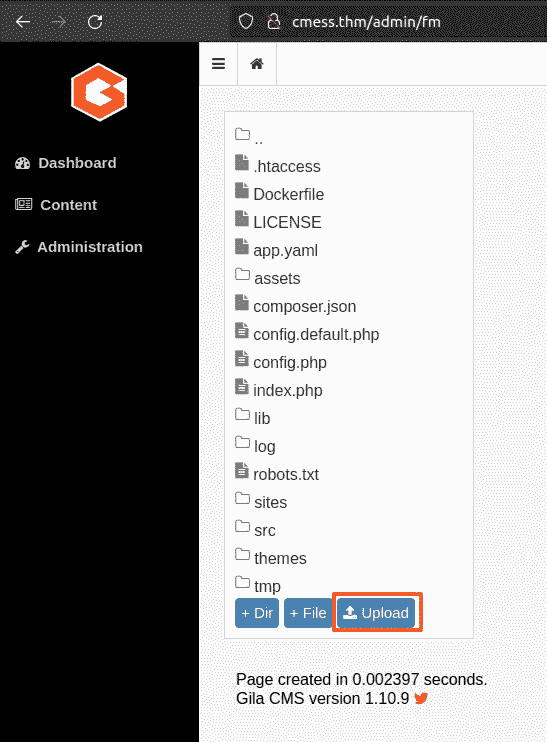

上传文件后被存储在**资产**文件夹中导航到它

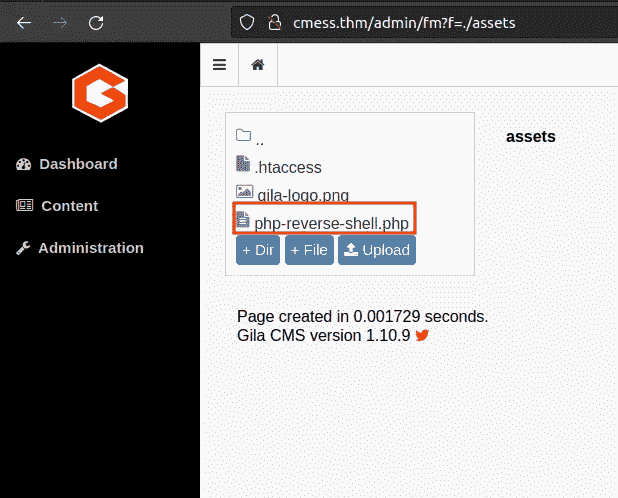

点击我们的文件名，保存这个文件。并在我们的机器上启动 netcat 监听器。但是从我们执行这个文件的地方。

开始思考……

***第 8 步- >*** 在机器上得到第一个反向壳

当我们执行目录模糊化时，我们得到了一个名为/assets 的目录，试着浏览它，但是它们是空的，试着在我们的文件名后面加上这个名字，比如[http://cmess.thm/assets/](http://cmess.thm/assets/)文件名>，然后点击回车

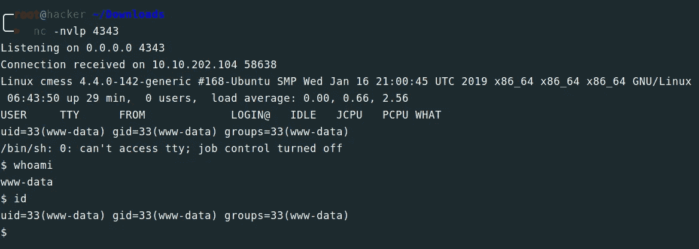

Booommmm …

我们得到了我们的 shell，但是我们无法访问位于 **user.txt** 文件的 **andre** 文件夹，该文件显示权限被拒绝的消息。

***第 9 步- >*** 使用 **linpeas.sh** 查找升级路径

这是一个自动查找 Linux 系统漏洞的工具

[](https://github.com/carlospolop/PEASS-ng/tree/master/linPEAS) [## 在卡洛斯波洛普大师那里

### PEASS -权限提升精彩脚本套件(带颜色)-PEASS-ng/Lin peas at master Carlos polop/PEASS-ng

github.com](https://github.com/carlospolop/PEASS-ng/tree/master/linPEAS) 

在我们的本地机器上启动 python 服务器

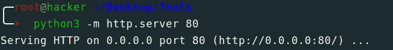

之后在 **wget** 的帮助下在 **/tmp** 文件夹中下载 **linpeas.sh** 。

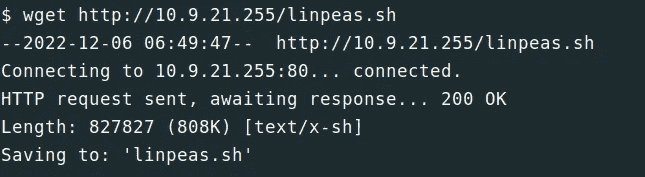

给它执行权限 **chmod +x linpeas.sh** 运行它**。/linpeas.sh**

我们得到了一个隐藏的 **bak** 文件，存储在 **/opt** 文件夹和 **cron job** 中

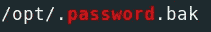

bak 文件


cron 作业

**第 10 步->-**第一个标志

使用 **cat** 查看 **.password.bak** 文件中的信息

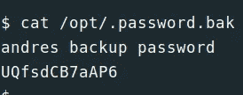

这看起来像安德烈的备份密码，但我们如何使用它？我们知道 ssh 在 22 端口上是开放的，尝试使用这个密码登录。

命令:- ssh andre@cmess.thm

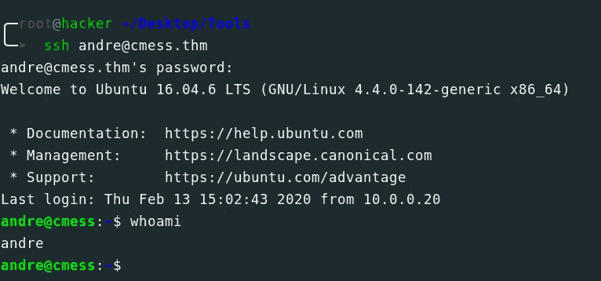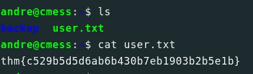

旗

我们得到了第一面国旗。🤩

**#【任务 2】:**获取 **root.txt** 文件中存储的 **root** 用户标志

***步骤 1 - >*** 了解 **cron job**

现在我们可以访问 andre 的文件夹了，让我们看看使用 **linpeas** 找到的 cron 作业做了什么

命令:- **cat /etc/crontab**

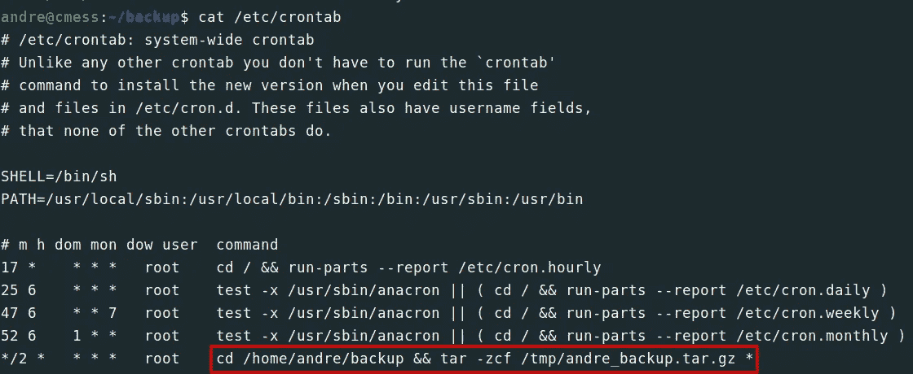

在这个场景中，每 2 分钟使用 **tar** 将 **/home/andre/backup** 文件夹中的所有文件和文件夹备份到 **/tmp** 文件夹中作为 **andre_backup.tar.gz** ，但是有一个问题，即 ***(通配符)**，这意味着 **/home/andre/backup** 文件夹中的任何内容都是备份的，我们可以使用这个功能来滥用这台机器。

***步骤 2 - >*** 创建 bash one liner

我们简单地创建一个 bash one liner 来获取根 shell

```
echo "cp /bin/bash /tmp/bash; chmod +s /tmp/bash" > exploit.sh
```

它可以将 **/bin/bash** 复制到 **/tmp/bash** 中，并赋予其权限为 **setuid** 和 **setgid**

将此文件保存到 **/home/andre/backup** 文件夹中。授予它执行权限。并键入如下两个命令。

**touch/home/Andre/backup/—check point = 1**(**—check point = 1**是 **tar** 用于显示 1 条记录后的进度信息)

**touch/home/Andre/backup/—check point-action = exec = sh \ exploit . sh(**它用于在每个检查点运行指定的操作后，即运行 **exploit.sh)**

等待 2 分钟…..

键入命令: **/tmp/bash -p** (用于执行 **/tmp/bash** 文件夹)

我们得到了我们的根壳…… &旗帜……..

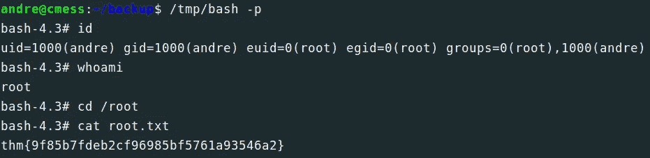

根标志

**:注:**
如果你被困在某个地方，找不到穿透机器的方法，千万不要以为自己会什么都不做，或者开始怀疑自己。看**提示**。这是你学习新东西的方法。但在此之前，尝试你武器库中所有的武器。

不断学习……

感谢阅读💓…………

帮我接通:

[Twitter](https://twitter.com/bhavesharmalkar) ， [Linkedin](https://www.linkedin.com/in/bhaveshharmalkar/) ， [GitHub](https://github.com/bhaveshharmalkar)

## 来自 Infosec 的报道:Infosec 每天都有很多内容，很难跟上。[加入我们的每周简讯](https://weekly.infosecwriteups.com/)以 5 篇文章、4 个线程、3 个视频、2 个 GitHub Repos 和工具以及 1 个工作提醒的形式免费获取所有最新的 Infosec 趋势！