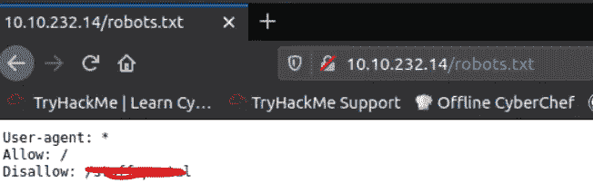
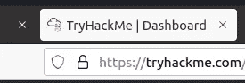
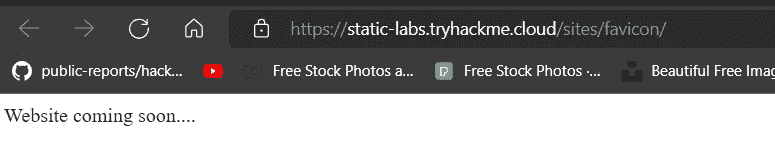
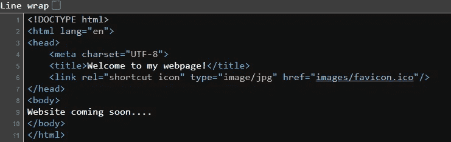
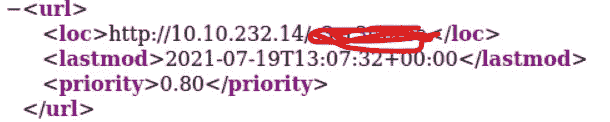
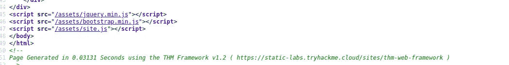
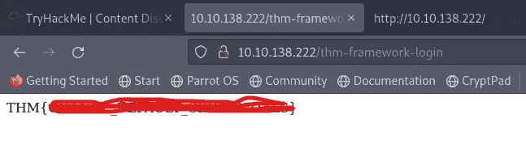
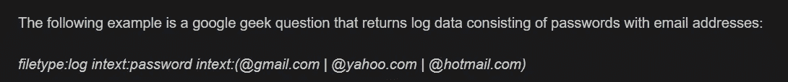
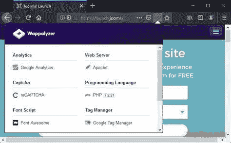
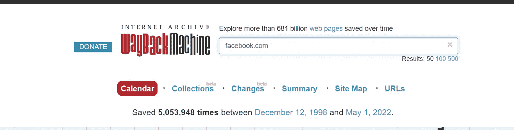

# TryHackMe —内容发现

> 原文：<https://infosecwriteups.com/tryhackme-content-discovery-ade077cf7437?source=collection_archive---------2----------------------->

在本文中，我们将介绍另一个 TryHackMe 挑战“内容发现”。

这个房间告诉我们如何识别 web 服务器中的隐藏内容，并利用它们来探索更多的漏洞。让我们开始吧…

网页上的内容有许多类型，如配置文件、图像、媒体等。有几种方法来探索他们使用自动，手动和其他方式。

## 1.指南

找到隐藏内容的第一个方法是搜索 robots.txt 文件。它是一种索引文件，包含该目录中的所有数据、权限和内容。

在我们的机器中，我们将探索 robots.txt，看看哪些是允许的，哪些是不允许的。

在上图中，我们可以看到有一个我们不允许的目录。

下一个方法是使用 **favicon 数据库**。

favicon 是浏览器地址栏或标签中显示的一个小图标，用于标记网站。

有时当使用不同的框架来构建一个网站时，作为安装一部分的 favicon 将被留下来用自定义框架替换，如果网站开发人员没有用自定义框架替换它，这可以给我们一个使用什么框架的线索。

OWASP 有一个通用框架图标的数据库，我们可以用它来检查目标图标【https://wiki.owasp.org/index.php/OWASP_favicon_database 

在这个挑战中，我们将看到创作者使用哪个 favicon。我们将导航到静态页面的源代码，并将 favicon 的散列与 OWASP 数据库进行比较。

现在我们将使用 Curl 命令来获取这个页面中使用的 favicon 的哈希值。

我们可以使用 Linux 终端或 Powershell 来获取哈希值。

使用**网站地图 XML 文件**

Sitemap 是一个 XML 文件，它包含了所有者希望在搜索引擎上看到的每个文件的详细列表。在网站抓取过程中，网站地图文件对识别内容起着至关重要的作用。

在这个挑战中，我们需要导航到网站地图文件，并确定所有者不希望我们探索的秘密路径。

下一种方法是使用 **Http-Headers**

当我们向服务器发出请求时，它会用不同的头来响应，这些头包含与 web 应用程序相关的非常有用的信息，如服务器版本、框架等。使用 Curl 进行请求也是获取更多内容的一种方式。

使用**框架堆栈**

每个网站都使用某种网站栈来构建自己的网站。在网站上我们可以看到这个框架的源代码。当我们导航到源网站时，根据版本号和其他关键信息，我们可以识别公开的漏洞来利用它们

在本次挑战中，我们将访问网站，然后导航到框架网站以确定一些关键信息。

我们得到了框架源代码页面，让我们导航到网站并获取标志来清除这个挑战。

根据框架页面中给出的说明，我们得到了标志。

使用 **OSINT- Google Dorking**

谷歌呆子们正在以一种更有效的方式使用搜索引擎来缩小搜索结果的范围。我们可以使用一些关键字，以定制的方式得到结果，如文件类型，特定的网站，特定的关键字等。

使用 **OSINT — Wappalyzer**

Wappalyzer 是一个在线工具和浏览器扩展，它可以帮助我们了解某个特定网站使用的所有框架和语言

使用 **OSINT — Wayback 机**

Wayback machine 是 archive.org 的一个特色，这是一个非盈利的社区建设网站，它就像一个在线存储器，存储所有网站的变化，文件等等。这有助于我们了解网站是如何变化的，也有助于我们发现许多漏洞。

使用 **GitHub**

Git 是一个**版本控制系统**，它跟踪项目中文件的变更。在团队中工作更容易，因为您可以看到每个团队成员正在编辑的内容以及他们对文件所做的更改。当用户完成更改后，他们用一条消息提交这些更改，然后将它们推回到一个中心位置(存储库),供其他用户将这些更改拉回到他们的本地机器。

您可以使用 GitHub 的搜索功能来查找公司名称或网站名称，以尝试定位属于您的目标的存储库。一旦被发现，你可能会接触到你还没有发现的源代码、密码或其他内容。

使用 **S3 铲斗**

**S3 水桶**

S3 桶是亚马逊 AWS 提供的一种存储服务，允许人们在云中保存文件甚至静态网站内容，可以通过 HTTP 和 HTTPS 访问。文件的所有者可以设置访问权限，使文件成为公共的、私有的甚至可写的。有时，这些访问权限设置不正确，无意中允许访问不应该对公众开放的文件。

S3 存储桶的格式是 http(s):// **{name}。**[**s3.amazonaws.com**](http://s3.amazonaws.com/)【姓名】由业主决定，如[tryhackme-assets.s3.amazonaws.com](http://tryhackme-assets.s3.amazonaws.com/)。可以通过许多方式发现 S3 桶，例如在网站的页面源、GitHub 存储库中找到 URL，甚至自动化这个过程。

一种常见的自动化方法是使用公司名称，后跟常见术语，如**{ name }**-资产、 **{name}** -www、**{ name }**-公有、**{ name }**-私有等。

使用**自动化发现**

自动发现是使用工具而不是手动发现内容的过程。虽然有许多不同的内容发现工具可用，但都有各自的特点和缺陷，我们将介绍三个预装在我们的攻击箱上的工具，ffuf、dirb 和 gobuster。

感谢您阅读本文:)

我们将在下一篇文章中联系。