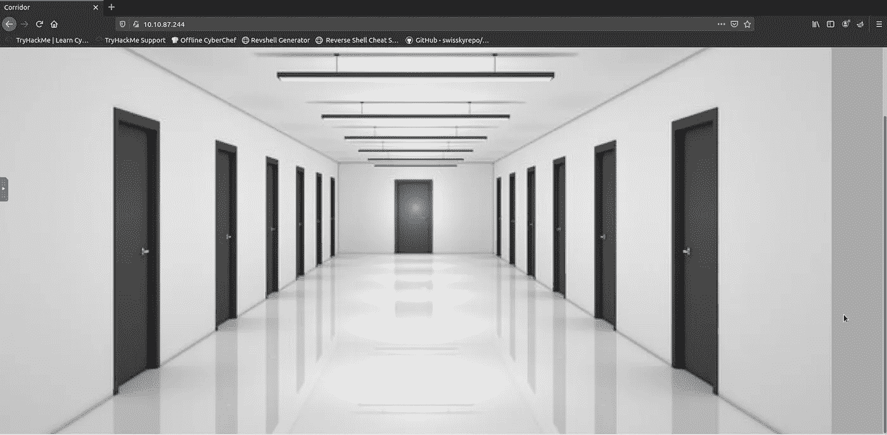
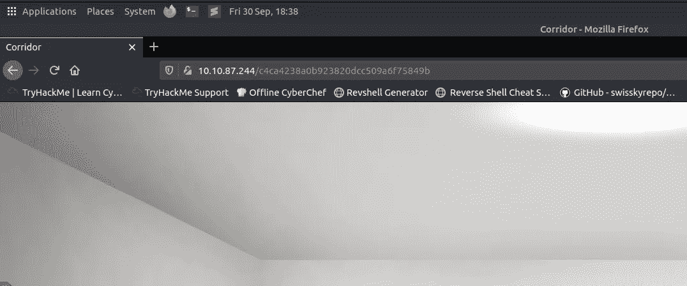
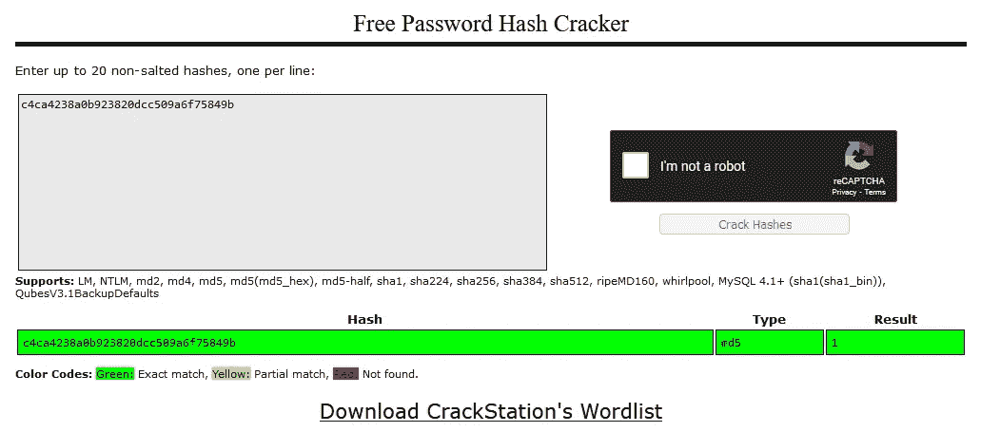
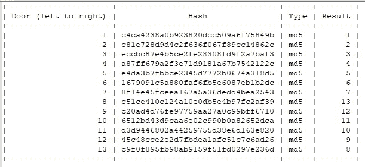
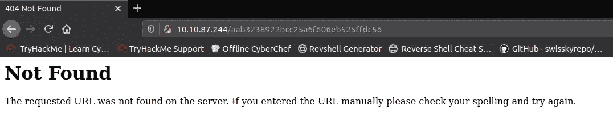
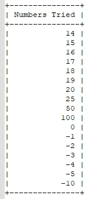
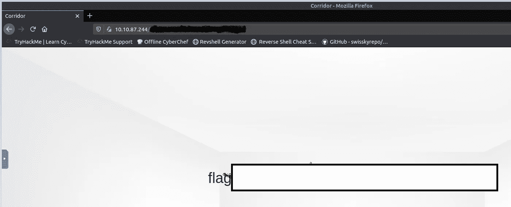
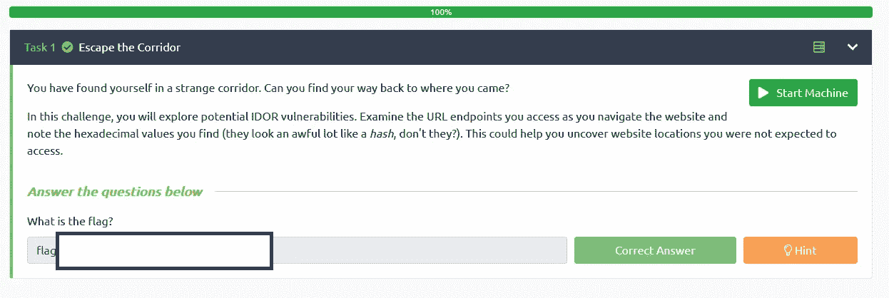

# TryHackMe:走廊房间报道[无回答]

> 原文：<https://infosecwriteups.com/tryhackme-corridor-room-write-up-no-answer-3732354e72ed?source=collection_archive---------0----------------------->

走廊标志

**房间描述:** *“你能逃出走廊吗？”*

**任务 1:** 逃离走廊

**任务描述:**“你发现自己来到了一个陌生的走廊。你能找到回到你来的地方的路吗？

在这个挑战中，您将探索潜在的 IDOR 漏洞。当你浏览网站时，检查你访问的 URL 端点，记下你找到的十六进制值(它们看起来非常像一个*散列*，不是吗？).这可以帮助您发现您不希望访问的网站位置。"

要开始这个房间，我们需要做的第一件事是启动机器&攻击箱(或者在连接到 VPN 时使用个人虚拟机)。

我们获得了机器的以下 IP 地址(10.10.87.244)，您的 IP 地址会有所不同。我将把这个 IP 放到 firefox 中，看看是否有可用的网站。

我们有一个网站(让我想起了 SCP)

左边第一个房间

我点击的第一个房间似乎显示了一个字符串，从房间描述来看，我不得不假设它是一个散列。我将使用 [CrackStation](https://crackstation.net/) 来了解更多信息。

破解站哈希破解

第一个哈希是 md5，结果是 1

现在我在想，所有其他房间都会有哈希，所以我要检查每个哈希，并使用 CrackStation，看看我是否能找到任何线索。

来自门的散列

看着散列和结果，我似乎无法从中获得任何有用的信息(随机数放在一起？)

最高的散列值是 13，现在我想知道如果我得到 14 的散列值并尝试它会发生什么？

404 对 14

现在，因为子域是以散列的形式，我不认为我会有任何运气使用任何工具来找到正确的子域，除非我将散列添加到单词列表中。

正因为如此，我将尝试随机数字和它们的散列，直到我取得一些成功。为此，我将使用来自[miracel salad](https://www.miraclesalad.com/webtools/md5.php)的 md5 散列生成器。

测试的数字(转化为 md5 哈希

幸运的是，我得到了正确的散列来得到旗子。我不确定这是不是正确的方法(试错法),但似乎我能够为这个房间找到正确的标志。

找到了旗帜 xD

任务 1–100%完成

一个奇怪的房间，我无法找到任何复活节彩蛋或任何其他方式来获得旗帜，除了从我的试错法纯粹的运气。正确的数字在表中。将数字转换成散列将导致标记。

感谢你阅读我的走廊房间的文章，如果你想自己试试这个房间，链接在下面。如果你想和我联系，我也附上了我的链接树。感谢 [tryhackme](https://tryhackme.com/p/tryhackme) ， [JohnHammond](https://tryhackme.com/p/JohnHammond) ，[cmnatic](https://tryhackme.com/p/cmnatic)&[Tim Taylor](https://tryhackme.com/p/timtaylor)来到这个房间！

走廊房间链接:[https://tryhackme.com/room/corridor](https://tryhackme.com/room/corridor)

我的链接树—[https://linktr.ee/StefanPBargan](https://linktr.ee/StefanPBargan)

## 来自 Infosec 的报道:Infosec 每天都有很多内容，很难跟上。[加入我们的每周简讯](https://weekly.infosecwriteups.com/)以 5 篇文章、4 个线程、3 个视频、2 个 GitHub Repos 和工具以及 1 个工作提醒的形式免费获取所有最新的 Infosec 趋势！