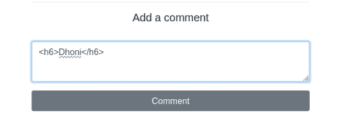
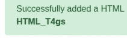
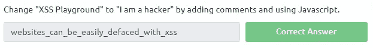
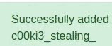

# TryHackme —跨站点脚本

> 原文：<https://infosecwriteups.com/tryhackme-cross-site-scripting-bcb7c876ae6a?source=collection_archive---------0----------------------->

## 恶意脚本注入

2022 年新年，欢迎神奇的黑客们回来。我想出了一个很酷的关于跨站点脚本的有趣话题的博客。

在 web 应用程序上发现的一个安全漏洞。攻击者使用这些恶意脚本，并且必须在受害者机器上执行。

跨站点站点脚本涉及的类型有:

1.  存储的 XSS
2.  反映了 XSS
3.  多姆 XSS

跨站点脚本可以做很多事情，例如:

1.  cookie 窃取—使用跨站点脚本，可以从未经验证的会话中窃取 cookie。
2.  击键记录—使用跨站点方式来捕获击键。
3.  网络摄像头快照—从受损的机器上拍摄快照
4.  网络钓鱼—攻击者在合法网站中插入伪造的登录表单，或者重定向到恶意网站。
5.  端口扫描—用于扫描内部网络并识别网络中的主机列表。
6.  其他浏览器漏洞

**存储的 XSS:**

存储 XSS 是一种危险的跨站点脚本。如果不可信的用户输入没有被净化，那么它将被注入到数据库中。

> 任务 1:添加评论，看看你是否能插入一些你自己的 HTML。

然后你会在网页上看到评论。

> 任务 2:创建一个警告弹出框，出现在带有您的文档 cookies 的页面上。

解决方案: 

> 任务 3:通过添加评论和使用 Javascript 将“XSS 游乐场”改为“我是黑客”。

解决方案:

> 任务 4:通过窃取 Jack 的 cookie 来接管他的帐户，他的 cookie 值是多少？

解决方案:

键入此注释后，移动到 web 应用程序的/log 目录。

s % 3 at 0 yyhmitfnsf0k M5 ne-IR 1 sktx 3 aeu . yj1 % 2 fxoaxe 7 ccjuymfgqpw 3 o5 WP 3 o 8 AE 7 ynhnhpjiase

任务 5:以杰克的身份发表评论。

**映 XSS:**

恶意有效负载用于向用户发送并回复。攻击者通过社会工程点击了精心制作的有效负载。

> 制作一个反射的 XSS 有效载荷，它会弹出一个说“你好”的窗口

ThereIsMoreToXSSThanYouThink

> 创建一个反射的 XSS 有效载荷，它会弹出一个显示你机器 IP 地址的窗口。

ReflectiveXss4TheWin

多姆·XSS

在基于 DOM 的 XSS 攻击中，在执行网站的合法 JavaScript 之前，恶意有效载荷不会被受害者的浏览器实际解释。那么，这到底意味着什么呢？

> 查看已部署的机器上基于 DOM 的 XSS 页面源代码，并找出一种利用 cookies 执行警报的方法。

测试" onmouseover = " alert(document . cookie)"

答:BreakingAnElementsTag

> 在图像标签上创建一个*on over*事件，将网站的背景色改为红色。

解决方案:test " onmouseover = " document . body . style . background color = ' red '；

ans:JavaScript sawesome

**防火墙规避:**

> 绕过删除任何脚本标记的过滤器。

解决方案:

ans:3c cf 8d 90 aaece 81710 ab 9 db 759352 c 0

> 警报这个词被过滤了，绕过它。

解决方案:0\ "自动对焦/onfocus = alert(1)→-确认(3)-"

ans:a2 e 5 ef 66 f 5 ff 584 a 01d 734 ef 5 edaae 91

> 你好这个词被过滤了，绕过它。

解决方案:

答案:decba 45d 0eff 17 c 6 eed 1629393 bee 1d

> 挑战 4 中的筛选如下:
> 
> 单词“你好”
> 
> 脚本
> 
> 错误
> 
> onsubmit
> 
> 装载
> 
> onmouseover
> 
> 专注
> 
> onmouseout
> 
> 在线按键
> 
> onchange

答案:2482 d2e 8939 fc85a 9363617782270555