# TryHackMe- Easy Peasy CTF 写文章(详细)

> 原文：<https://infosecwriteups.com/tryhackme-easy-peasy-ctf-writeup-detailed-4a7406fdf79d?source=collection_archive---------1----------------------->

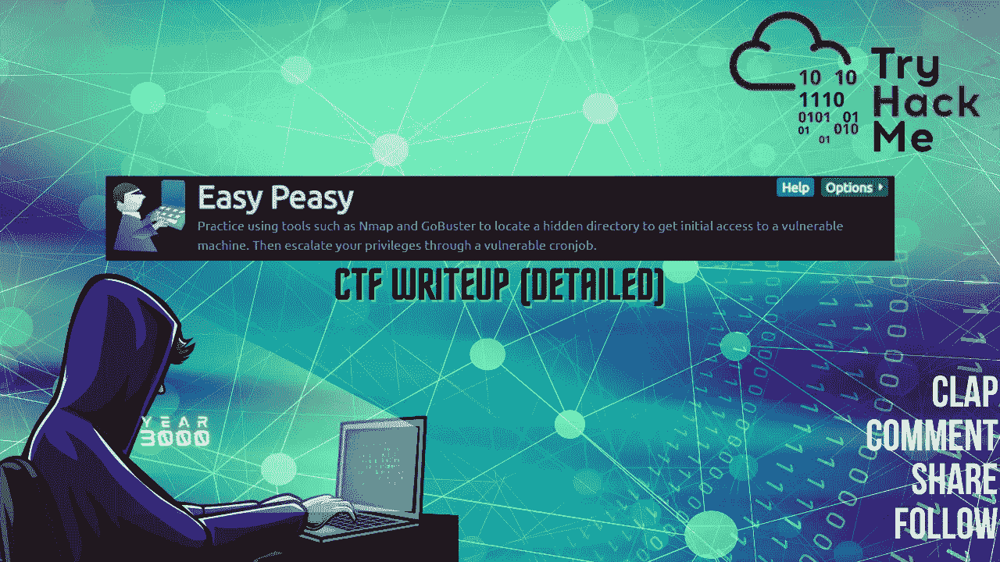

CTF 报道#5

欢迎各位！我们将在 TryHackMe 上做简单的 CTF 题。我希望这个盒子也像它的名字一样，“简单”😃。反正我们会知道的。

让我们开始吧！享受流动吧！

 [## 简单易做

### 练习使用 Nmap 和 GoBuster 等工具来定位隐藏的目录，以获得对易受攻击的…

tryhackme.com](https://tryhackme.com/room/easypeasyctf) 

部署机器。
在桌面上为 ctf 机器创建一个目录，并为 nmap 创建一个目录。

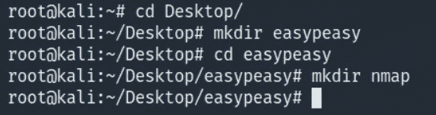

## 任务 1-通过 Nmap 枚举

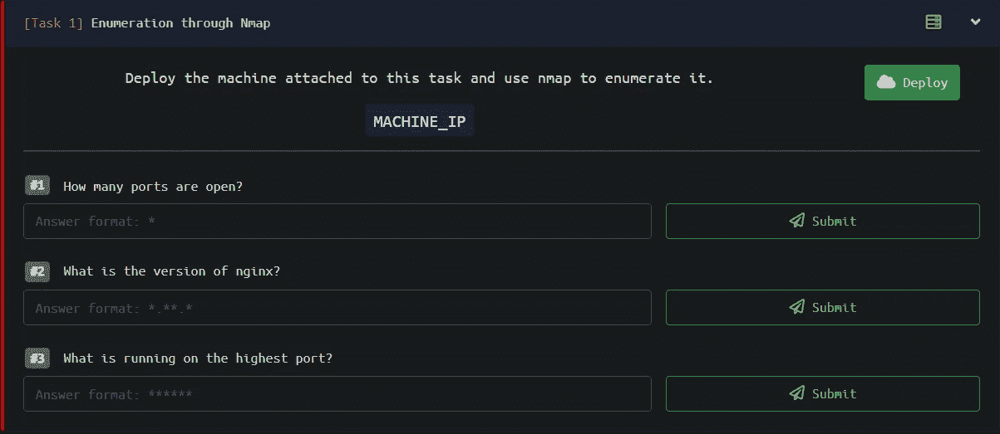

任务列表

**Nmap 扫描:**

> nmap -sC -sV -oN nmap/rootme<target_ip></target_ip>

*   -sC:默认脚本
*   -sV:版本检测
*   -oN:输出将存储在您之前创建的目录“nmap”中
*   -p-:要扫描的所有端口

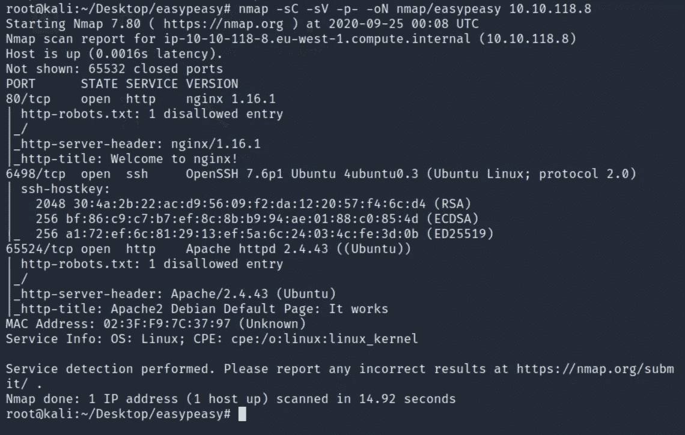

有 3 个端口打开:
80/http-nginx 1 . 16 . 1
6498/ssh-OpenSSH 7.6 P1
65524/http-Apache httpd 2 . 4 . 43
检测到 OS-Linux

> #1.1 打开了多少个端口？
> Ans:3
> # 1.2 nginx 是什么版本？
> Ans: 1.16.1
> #1.3 最高端口运行的是什么？答案:阿帕奇

太棒了。是不是很好玩？我们刚刚回答了任务 1 中的所有三个问题。让我们继续进行任务 2。

## 任务 2-损坏机器

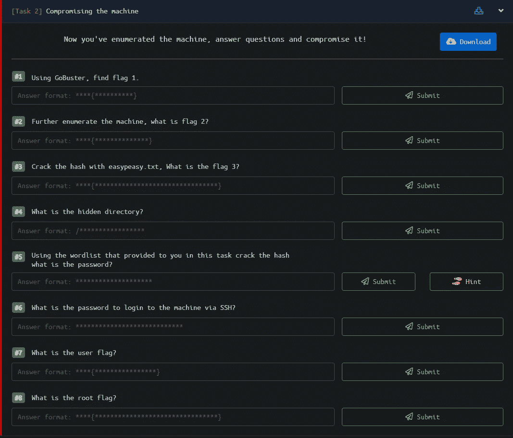

**Gobuster :**

我喜欢这个工具，我经常在 CTF 使用它。这个工具将帮助我们寻找隐藏的目录。

gobuster dir-u http://<target_ip>-w<path_to_wordlist></path_to_wordlist></target_ip>

*   -u : URL
*   -w:单词表

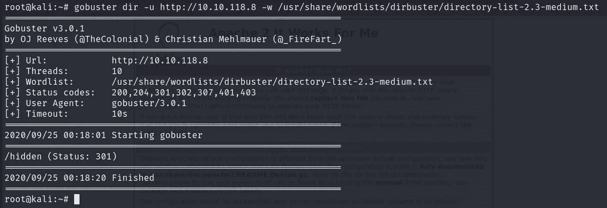

此外，您可以在 gobuster 中使用更多标志:

*   -问:安静，无声扫描。将隐藏横幅。
*   -o:要存储在目录中的输出
*   -x:搜索扩展名，如 html、txt、php、phtml 等。

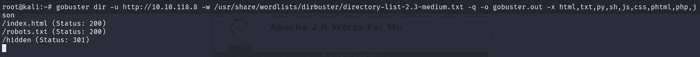

我们有一个目录/hidden 可以查看，也有 robots.txt 文件可以查看。

导航到 http://<target_ip></target_ip>

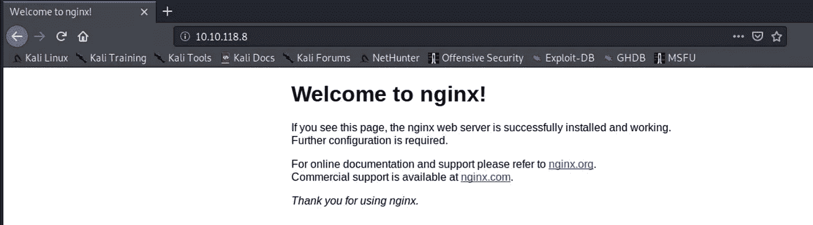

Nginx 默认页面

很好，我们可以看到 nginx 正在工作。

让我们看看在 gobuster 中发现的/hidden 目录。

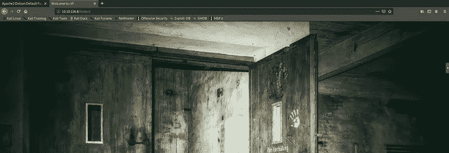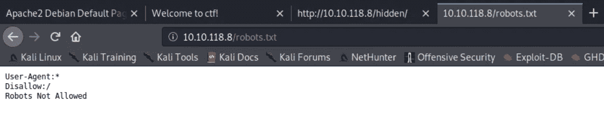

左:/隐藏右:robots.txt

检查页面的源代码，寻找任何对我们的枚举过程有帮助的有趣信息总是好的。
查看 URL 页面的来源。Ctrl+U。

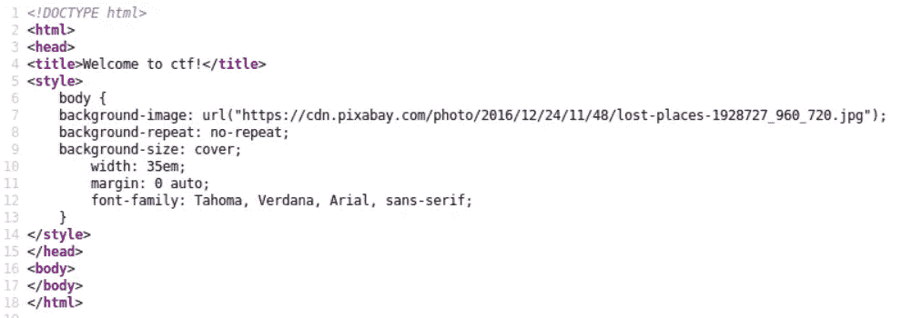

查看位于/hidden 的源代码，我们没有发现任何有趣的内容或任何隐藏的注释。

我们可以尝试使用 gobuster 来查看目录/hidden 中的隐藏目录。也许它能引导我们找到重要的信息。

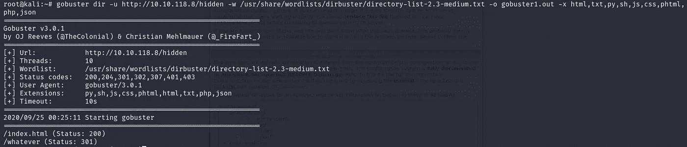

正如我所猜测的，我们已经收到了输出，它显示在/hidden 目录中有子目录/无论什么。

导航到 http:// <target_ip>/hidden/whatever</target_ip>

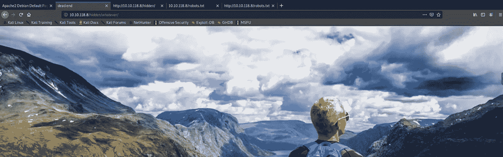

/隐藏/无论什么

又是一个图像。让我们看看源代码。

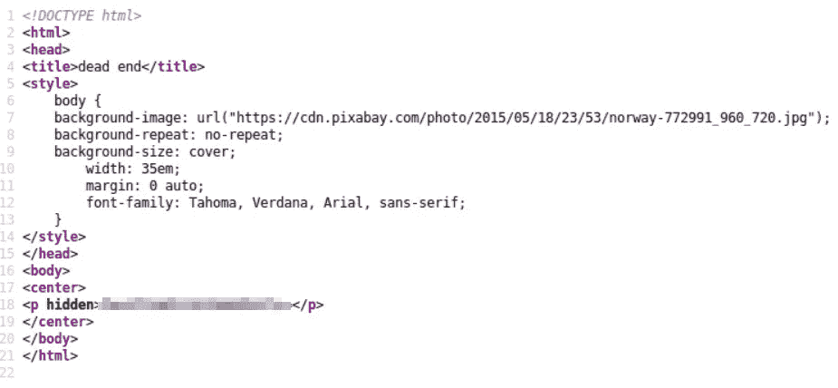

精彩！！所以我们有一个看起来像 base64 的散列。

我们可以复制这个，试着解码这个。我将使用终端方式来完成此操作。

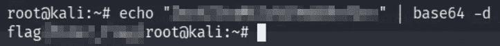

做得好！！这回答了我们在任务 2 中的第一个子任务。

> #2.1 使用 GoBuster，找到标志 1。
> Ans:xxxxxxxxxxxxxxxxxxx

我们现在将检查运行在端口 65524 上的 HTTP 服务器

导航到 http:// <target_ip>:65524</target_ip>

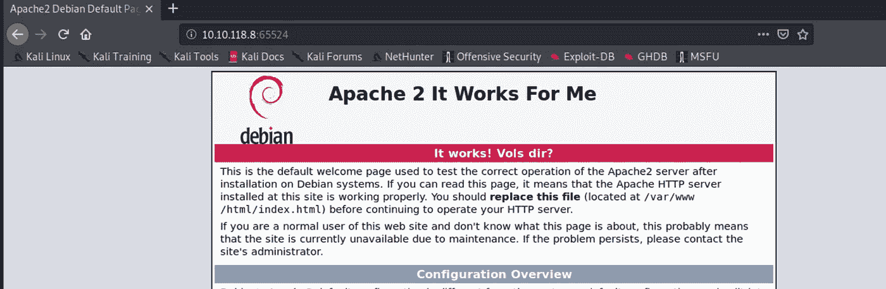

Apache 默认页面

让我们查看源代码，找到任何信息或注释。

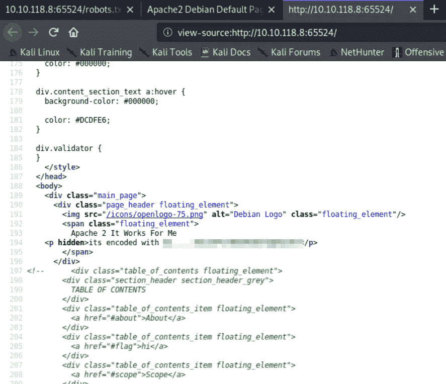

巴。…该提示看起来像是基本编码，例如 64、32、62、58 等。我们会尝试解密它。我用 https://md5hashing.net 解密了这个散列，它完美地破解了它。

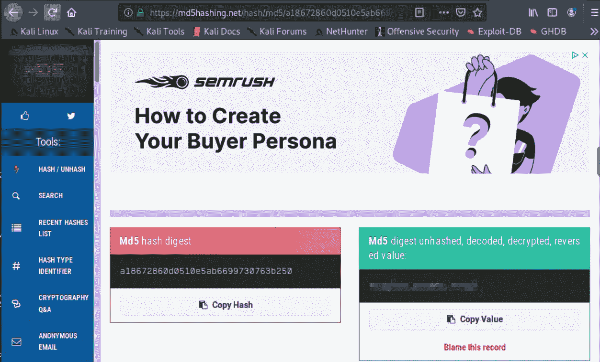

> #2.2 进一步列举机器，flag 2 是什么？
> 答:xxxxxxxxxxxxxxxxxx

对于下一个任务，我在一瞬间找到了旗子。让我告诉你怎么做。我知道我可以使用 easypeasy.txt 字典来强行找到旗帜，但我总是期待任何快速获胜。

提示:在源代码中，如果我们可以在浏览器中使用“查找”Ctrl+F 并搜索关键字“标志”,我们就可以在源代码中找到标志。这么酷？每当源代码很长，需要在相对较短的时间内完成，并且我发现其中有很多重要信息时，我都会尝试这样做。关键是使用可预测的关键字，例如标志、用户、根、基础、隐藏。

或者，我们可以使用终端来搜索我们想要搜索的信息。

> curl -s <target_ip>| grep <keyword>-s:无声</keyword></target_ip>

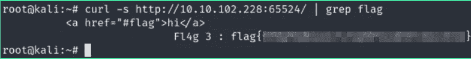

导航到我们通过破解哈希发现的目录。

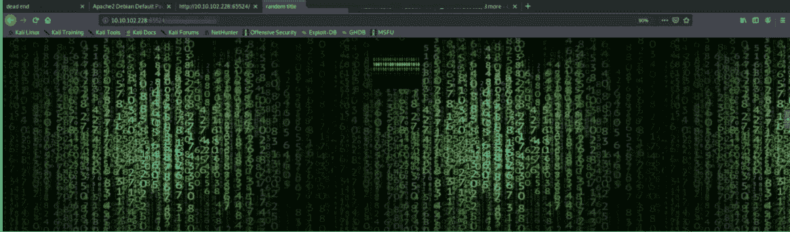

让我们来看看这个页面的源代码。

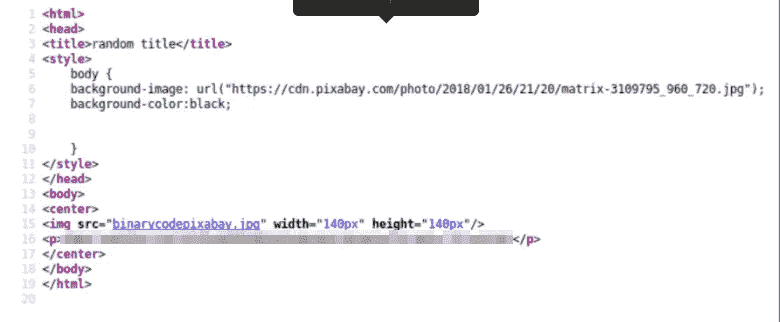

好的。我们有一个哈希，现在我们将复制它，并创建一个包含该哈希的 hash.txt 文件。有几种方法可以做到，vim，nano，echo，touch。我在这个任务中使用了 echo 命令。

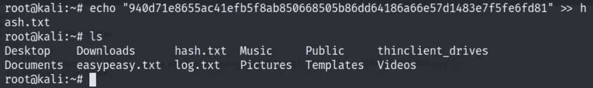

我们已经保存了文件，现在我们将尝试暴力破解，用开膛手约翰破解。我们早些时候得到了“easypeasy.txt”字典用于此目的。
提示:如果您不完全清楚哈希类型，例如是 md5、sha256 还是 base32 等，您可以使用 GOST 格式，john 会将哈希文件或哈希视为 ghost 哈希，并使用您选择的字典继续破解哈希。

我们可以旋转约翰。

> sudo John-word list = easy peasy . txt-format = GOST hash . txt

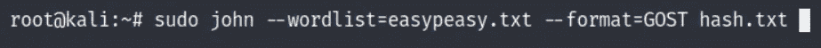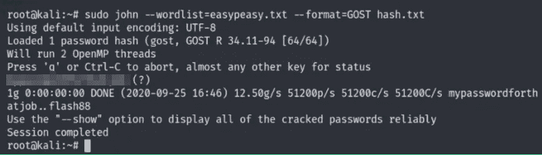

太棒了。！我们得到了我们的密码

目录页面中的图片有隐藏信息。因此我们将使用隐写术从图像中提取信息。

使用命令:

> apt-get 安装隐藏信息
> 隐藏信息提取-SF binarycodepixabay.jpg

*   提取:要使用的选项
*   sf:指定文件

在前面的步骤中解密的散列给了我们一个密码。我们可以使用它，并将其输入“输入密码”字段。输入并按 Enter 键后，您的数据将从图像中提取出来。

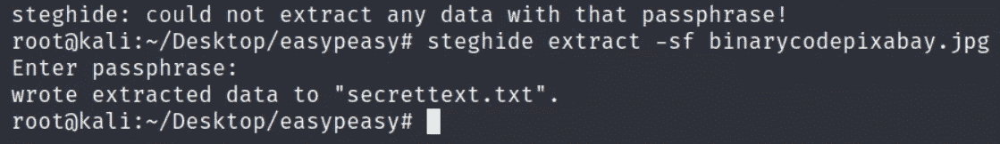

我们找到了一个 secrettext.txt。让我们看看它的内容。

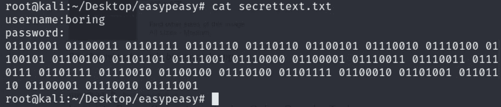

厉害！！我们有用户名和密码。
密码看起来不像密码。你是对的。这是一个二进制。我们需要解码二进制，它会给我们密码。

我的首选是赛博咖啡馆。它非常有效。让我们复制散列并粘贴到输入中。使用“从二进制”作为操作，把它拖到配方中，然后等待魔法。

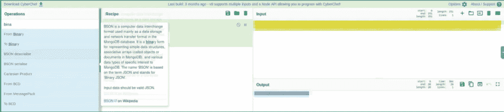

太棒了。我们已经得到了密码。不浪费时间，我们将使用凭证 SSH 并在机器上获得立足点。

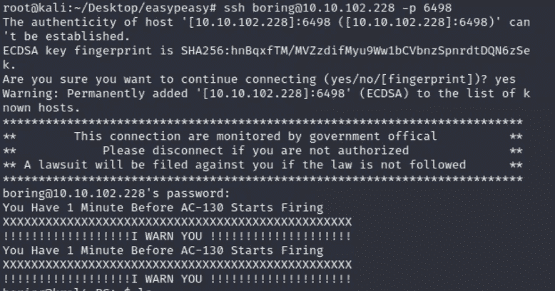

不要担心，我警告你，这只是一个横幅。

我们进去了。我们已经成功进入。我们需要寻找我们的 user.txt 标志。

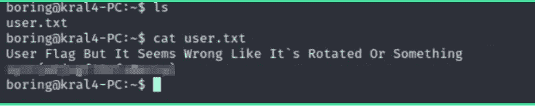

明白了，但看着吧。旗帜是旋转的，每次看到这个关键字“旋转”，我总是假设这将是 rot13。我们可以再次使用赛博咖啡馆进行解码。

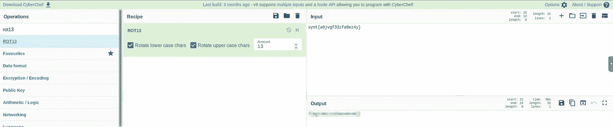

做得好！！我们得到了我们的用户标志。现在，我们需要提升我们在盒子上的特权，这样我们就可以捕获我们的根标志，并给这个盒子一个美好的结局。

Linpeas 是我最喜欢的自动计数工具。输出非常长，但是根据权限提升向量的百分比级别，通过突出显示的颜色很好地组织了输出。这无疑节省了我们大量时间，否则我们必须执行耗时的手动枚举。

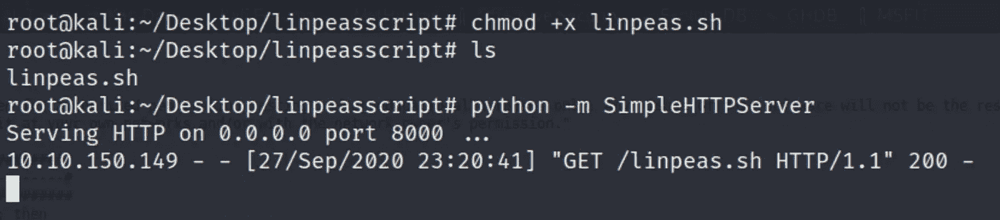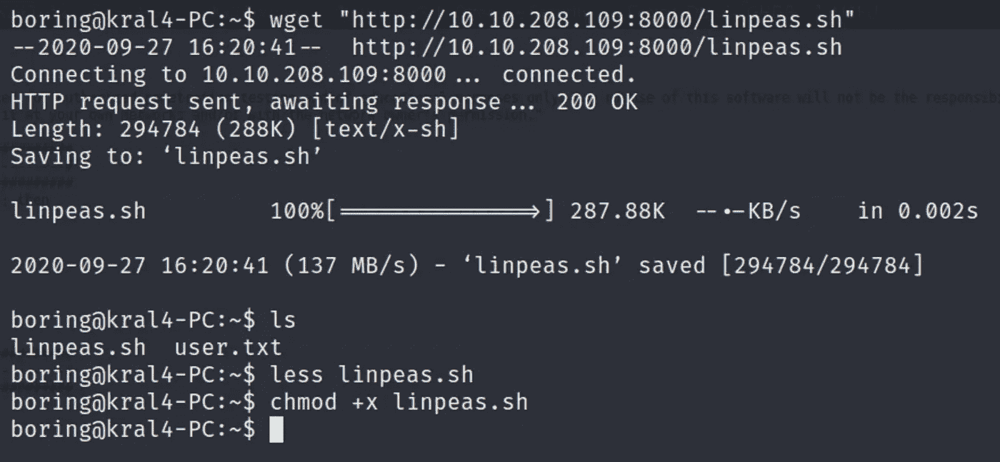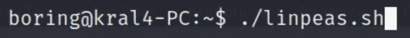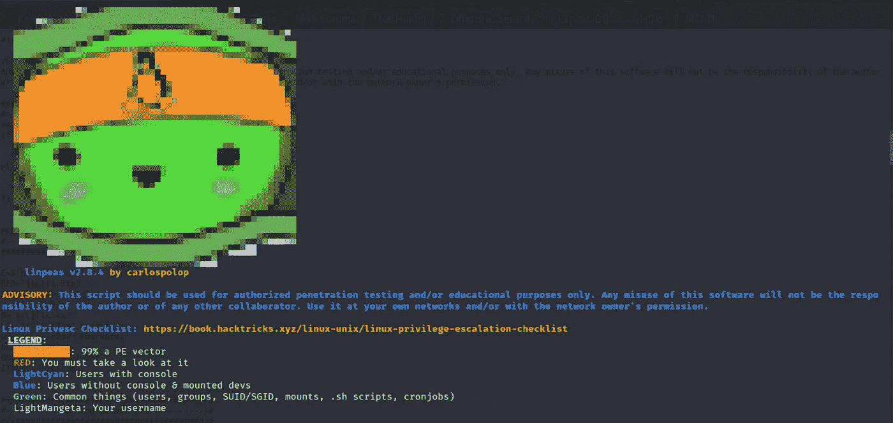

我们有一些计划运行的脚本。可以帮助检查 crontab。

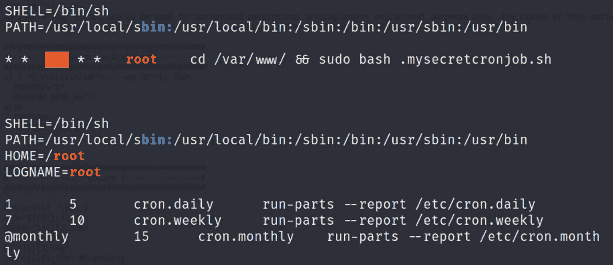

CD/var/www/& & sudo bash . my cretcronjob . sh

导航到目录/var/www，我们将找到. mysecretcronjob.sh 脚本。

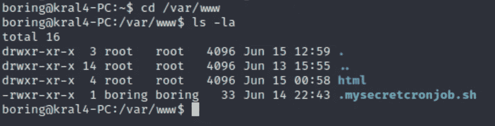

做“少”在看剧本……..

因此，该脚本实际上没有脚本，这对于我们使用有效负载修改脚本非常有用，我们可以设置一个侦听器来获取 shell 和提升权限。

 [## swisskyrepo/payloads all things

### Web 应用程序安全和 Pentest/CTF-swisskyrepo/payloads all things 的有用负载和旁路列表

github.com](https://github.com/swisskyrepo/PayloadsAllTheThings/blob/master/Methodology%20and%20Resources/Reverse%20Shell%20Cheatsheet.md#bash-tcp) 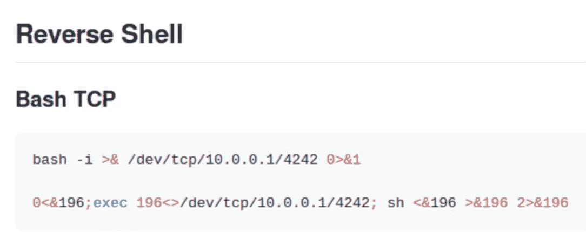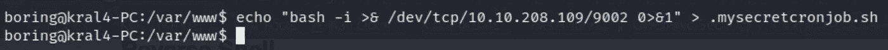

我们将设置监听器。我正在使用端口 9002。并等待脚本自动运行。手指交叉！

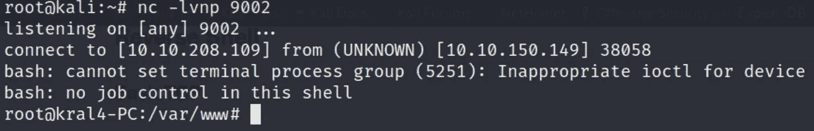

瞧啊。！
我们已经成功提升到 root 权限！！
我们现在可以确认我们是 root 了！！

让我们得到我们的根旗。

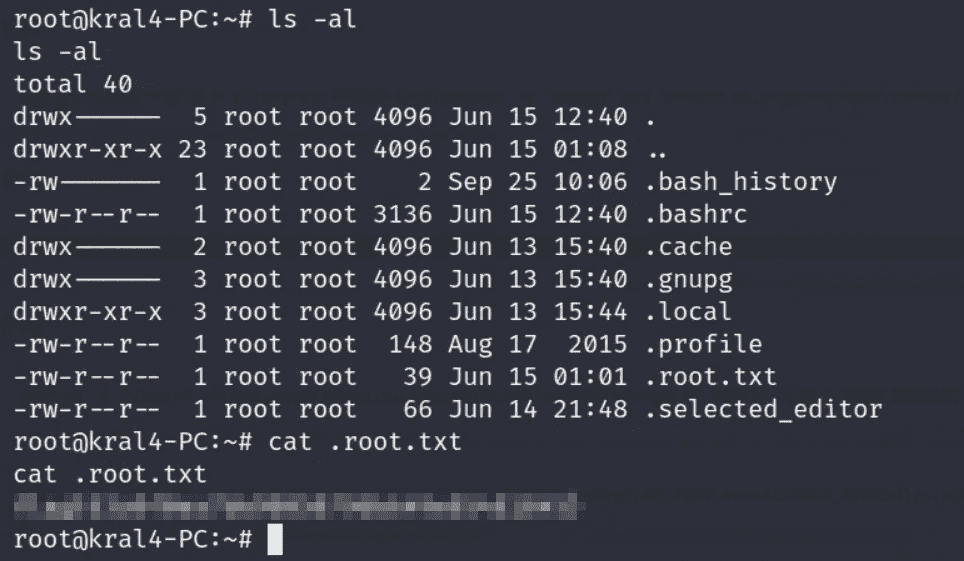

恭喜你！！我们已经完成了房间！！

如果你喜欢这个帖子，并且这个帖子在任何可能的方面帮助了你，请在评论中告诉我，或者用掌声分享你的爱。

谢谢你抽出时间。

跟着我。

更多的报道正在进行中。

保重，注意安全，继续黑！

**-哈桑·谢赫**