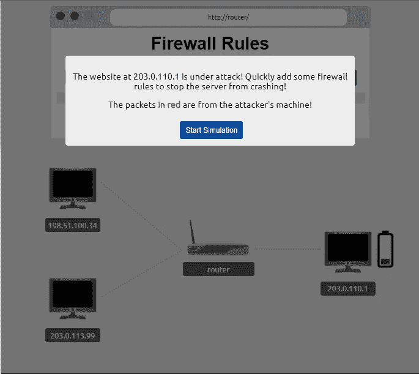
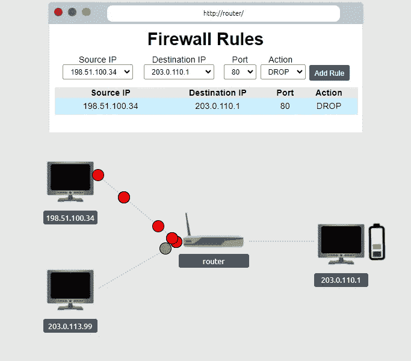
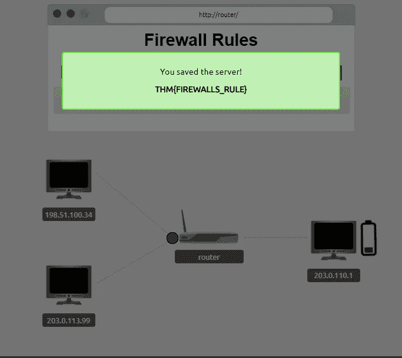
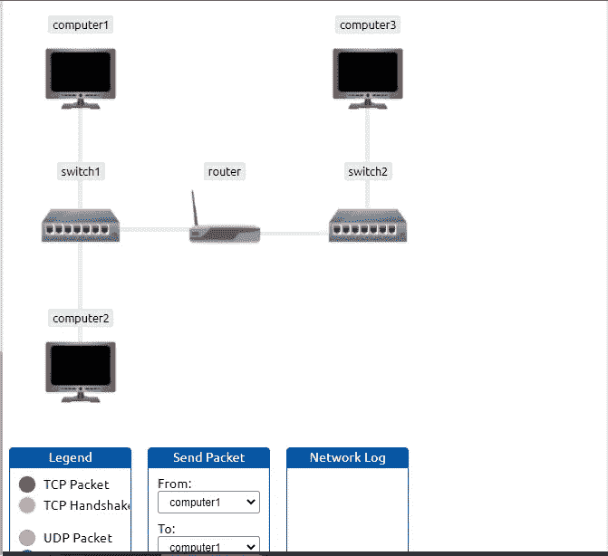
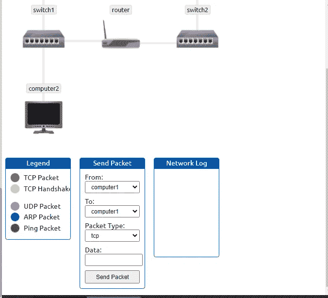
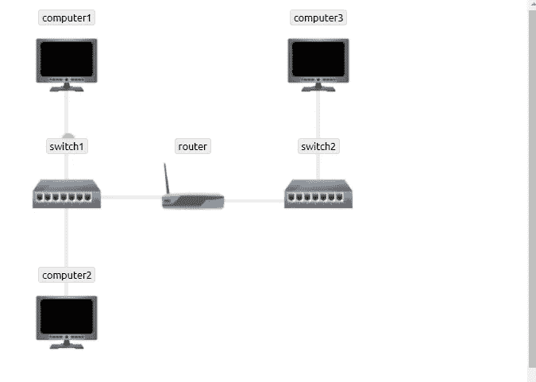
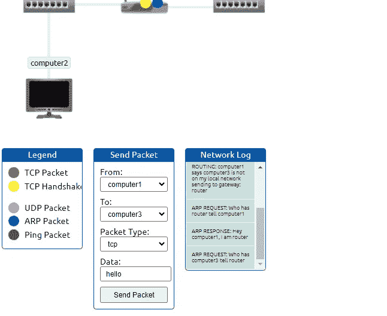

# TryHackMe —扩展您的网络

> 原文：<https://infosecwriteups.com/tryhackme-extending-your-network-15b7a28c9c0f?source=collection_archive---------0----------------------->

## Ctf 信息记录

欢迎回到神奇的黑客，今天我带来了一篇关于 Tryhackme 的很酷的文章。

**端口转发简介:**

端口转发是将应用程序和服务连接到互联网的有用组件。以 IP 地址为“192.168”的服务器为例。*.* "在端口 80 上运行一个端口，并有两台计算机与其相连(intranet)。管理员想让内容对公众可见，所以他使用端口转发的概念使其可见。

**问题 1:**

> 用于配置端口转发的设备名称是什么？

*Ans:路由器*

**防火墙 101:**

防火墙是一种负责过滤流量以决定是否允许的设备。如果流量是真正的防火墙允许这些流量，否则拒绝它。

***过滤已经通过以下方式完成:***

1.  交通是从哪里来的？
2.  交通要去哪里？
3.  这是哪个港口的交通？
4.  流量使用什么协议？

**防火墙的两个主要类别:**

1.  有状态-使用来自连接的全部信息。它决定连接的整体行为，而不是检查单个数据包。
2.  无状态-检查单个数据包是否被防火墙接受。

> **问题 1:**

防火墙在 OSI 模型的哪一层运行？

第二层，第三层

> 问题 2:

***什么类别的防火墙会检查整个连接？***

宏伟威严的

> **问题 3:**

***什么类别的防火墙会检查单个数据包？***

无国籍的

> **实用—防火墙:**

部署附加到此任务的静态站点。您必须**正确配置防火墙，防止设备过载**接收标志！

通过以上方法，我们可以过滤这个过滤恶意数据包。

**VPN 基础知识:**

VPN 代表虚拟专用网络，是一种通过互联网(隧道)在彼此之间创建专用路径连接，在安全的专用网络上进行通信的技术。

***VPN 的好处:***

1.  允许不同地理位置网络相互连接。
2.  产生隐私。
3.  生成匿名。

***VPN 技术:***

1.  PPP-PPTP 使用它来进行身份验证并提供数据加密。它不能自己离开网络。
2.  PPTP——它代表点对点隧道协议，允许来自 PPP 的数据传输并离开网络。它是弱加密的。
3.  IPSec -互联网协议安全使用现有的互联网协议框架加密数据。

**问题 1:**

> **什么 VPN 技术只加密&提供数据的认证？**

巴基斯坦人民党

> **什么 VPN 技术使用了 IP 框架？**

IPSec

**路由器:**

路由器的主要作用是连接网络并在彼此之间传递数据。传递或传播数据的过程称为路由。路由用于在彼此之间创建路径，以便数据成功到达目的地。

**开关:**

交换机是用于连接多台设备的专用网络设备。交换机使用以太网电缆连接多个设备。它运行在 OSI 模型的第 2 层和第 3 层。

> **问题 1:**

***路由器做的动作用什么动词？***

按指定路线发送

**交换机的两个不同层是什么？用逗号分隔，即:LayerX，LayerY**

第二层，第三层

**实用网络模拟器:**

在此任务中，您必须将数据包从计算机 1 发送到计算机 3 TCP 数据包类型，最后一个收到的数据包会弹出标志消息。

> 问题 1:

**网络模拟器的标志是什么？**

THM {你已经得到了数据}

**网络日志中有多少握手条目？**

5

订阅并关注更多类似的文章😊

# 🔈 🔈Infosec Writeups 正在组织其首次虚拟会议和网络活动。如果你对信息安全感兴趣，这是最酷的地方，有 16 个令人难以置信的演讲者和 10 多个小时充满力量的讨论会议。查看更多详情并在此注册。

 [## IWCon2022 - Infosec 书面报告虚拟会议

### 与世界上最优秀的信息安全专家建立联系。了解网络安全专家如何取得成功。将新技能添加到您的…

iwcon.live](https://iwcon.live/)