# TryHackMe-游戏区 CTF 报道(详细)

> 原文：<https://infosecwriteups.com/tryhackme-game-zone-ctf-writeup-detailed-308396d81f7c?source=collection_archive---------0----------------------->

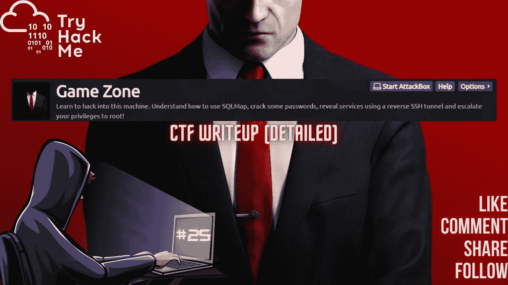

CTF 报道#25

欢迎各位！！我们将在 [TryHackMe](https://medium.com/u/dc49a0a3cb16?source=post_page-----308396d81f7c--------------------------------) 做游戏专区 CTF。这个房间也是进攻测试学习路径的一部分。您将学习 SQL 注入、使用 sqlmap 转储数据库、使用 JohntheRipper 破解散列、获取访问、SSH 隧道、CMS 利用以及最后的权限提升。这个房间棒极了。我真的很喜欢。

CTF 链接:

 [## 网络安全培训

### TryHackMe 是一个学习网络安全的在线平台，使用动手练习和实验室！

tryhackme.com](https://tryhackme.com/room/gamezone) 

CTF 由以下作者创作:

 [## 试用版|试用版

### TryHackMe 是一个学习网络安全的在线平台，使用动手练习和实验室！

tryhackme.com](https://tryhackme.com/p/tryhackme) 

让我们在游戏区潜水吧！！享受流动吧！！

## 任务 1-部署易受攻击的机器:

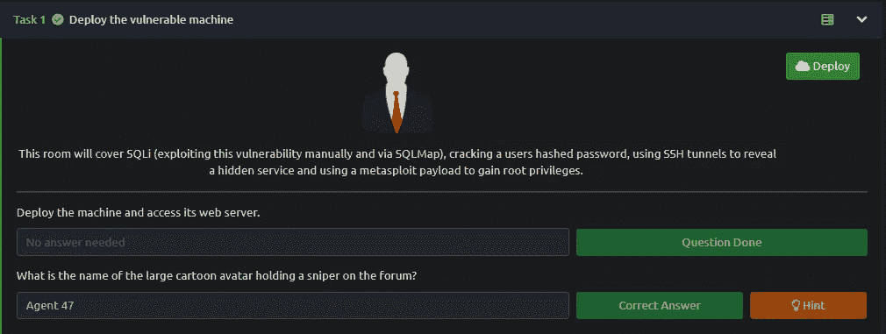

最容易的任务😃

> 部署机器并访问其 web 服务器。
> 答:不需要回答。

我们需要访问网络服务器。

> 导航到 http://<target_ip></target_ip>

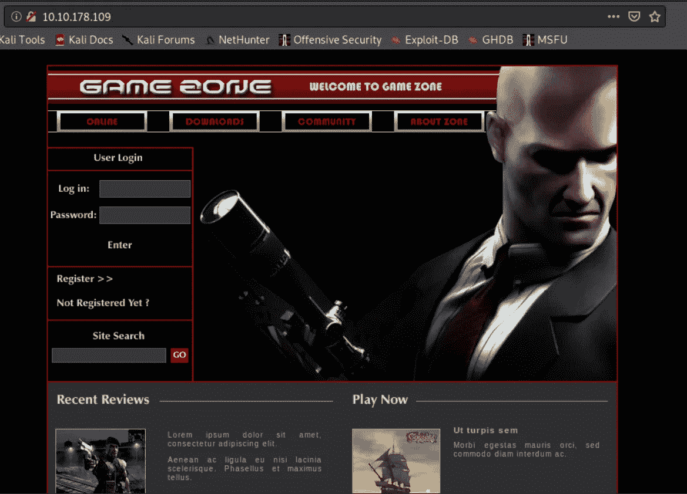

> 论坛上拿着狙击的大型动漫头像叫什么名字？
> 答:47 号特工

他是标志性的杀手游戏系列中的无声刺客“特工 47”。让我们继续进行任务 2。

## 任务 2–通过 SQLi 获得访问权限:

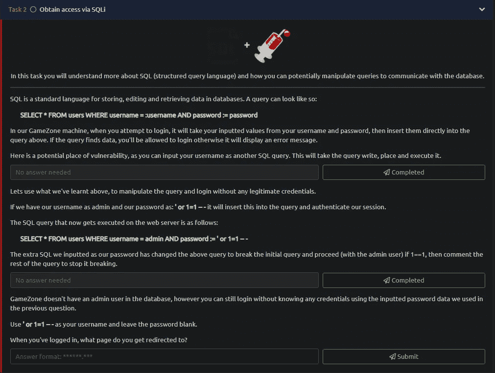

对于前两个任务，只需阅读和理解 SQL 及其查询。不应该跳过，需要通读一遍。因此，我们可以这样做几分钟，然后继续后面的任务。

> SQL 是在数据库中存储、编辑和检索数据的标准语言。查询可能是这样的:
> ***SELECT * FROM users WHERE username =:username AND password:= password*** 在我们的 GameZone 机器中，当您尝试登录时，它会从您的用户名和密码中获取您输入的值，然后将它们直接插入到上面的查询中。如果查询找到数据，将允许您登录，否则将显示一条错误消息。
> 这是一个潜在的漏洞，因为您可以在另一个 SQL 查询中输入您的用户名。这将需要编写、放置和执行查询。
> 
> 答:不需要回答。
> 
> 让我们使用上面学到的知识，在没有任何合法凭证的情况下操作查询和登录。
> 如果我们的用户名为 admin，密码为:**'或 1=1 —** —它会将其插入查询并验证我们的会话。
> 现在在 web 服务器上执行的 SQL 查询如下:
> ***SELECT * FROM users 其中 username = admin，password := '或 1 = 1—*** 我们作为密码输入的额外 SQL 已经更改了上面的查询以中断初始查询，如果 1==1，则继续(对 admin 用户)执行，然后注释查询的其余部分以阻止它中断。
> 
> 答:不需要回答。

我们现在将重新访问该页面。

> 导航到 http://<target_ip></target_ip>

我们需要绕过使用 SQL 注入登录。插入用户名或 1 = 1--密码留空。

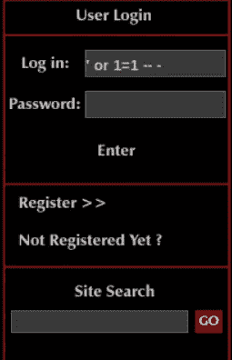

点击输入

> 已重定向至 http:// <target_ip>/portal.php</target_ip>

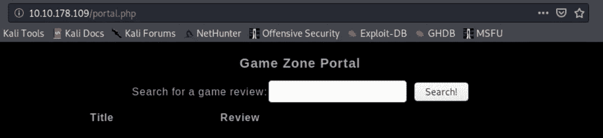

太棒了。重定向的页面回答了这个问题。提交吧。

> GameZone 在数据库中没有管理员用户，但是您仍然可以使用我们在上一个问题中输入的密码数据登录，而不需要知道任何凭证。
> 
> 使用**或 1 = 1—**作为用户名，密码留空。
> 
> 登录后，您会被重定向到哪个页面？
> 答:portal.php

## 任务 3-使用 SQLMap:

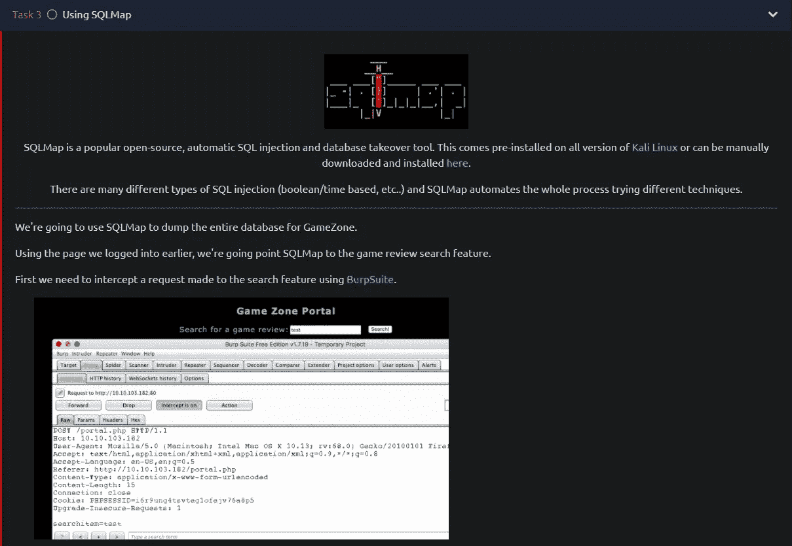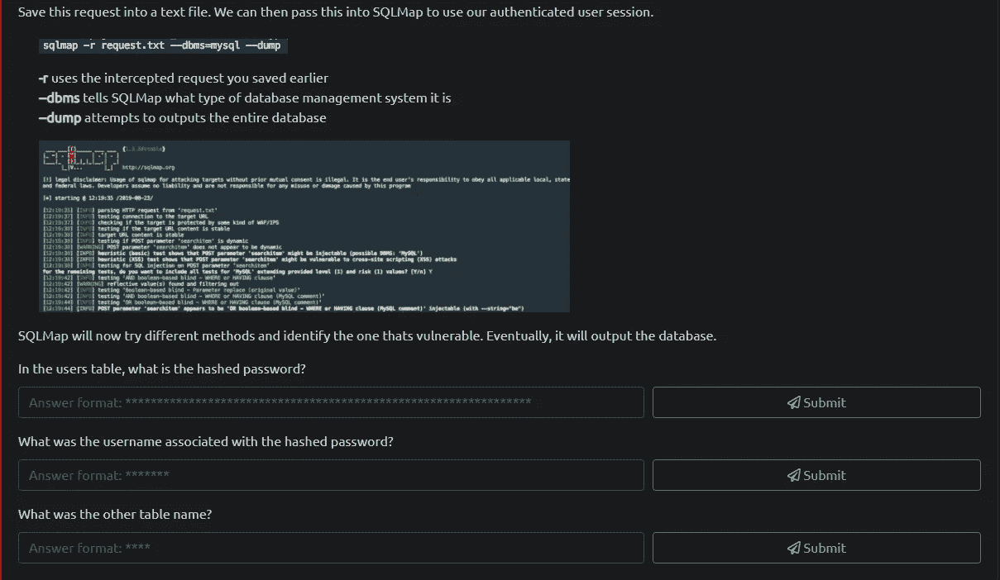

首先，我们需要启动 Burpsuite，因为我们必须将请求保存在一个文件中，该文件将在“sqlmap”工具中用于转储游戏区的整个数据库。

我们需要配置打嗝。如果你是一个完全的初学者，你不知道如何配置它，我会为你提供一步一步的指导。对你会有帮助的。配置好 Burp 后，我们将开始捕获请求。

## 设置打嗝指南:

为 Firefox 安装 FoxyProxy 扩展，并为 Burp 配置代理。

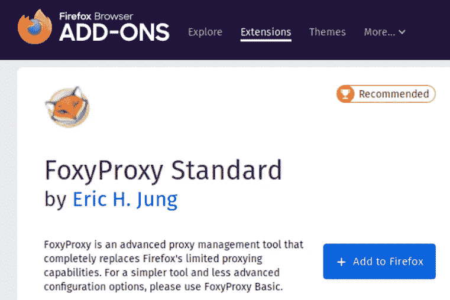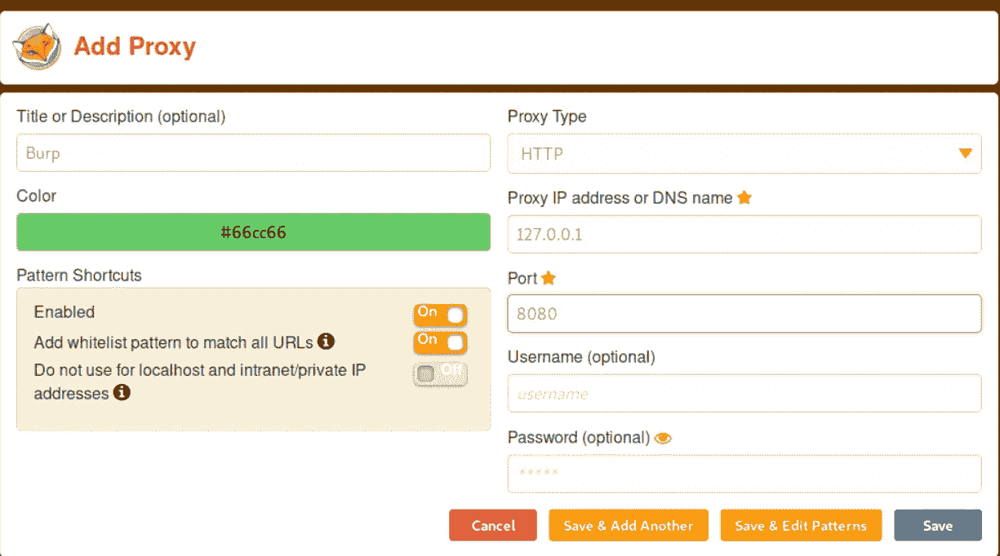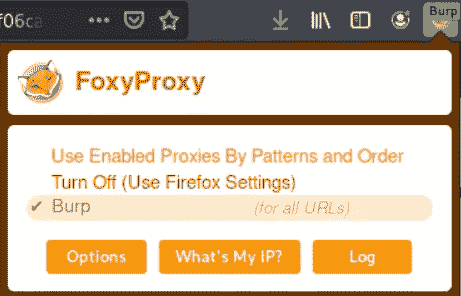

Burpsuite 正在以 Burp 默认值运行。所以我们要安装 CA 证书。

> 导航到 [http://burp](http://burp/)

保存证书。

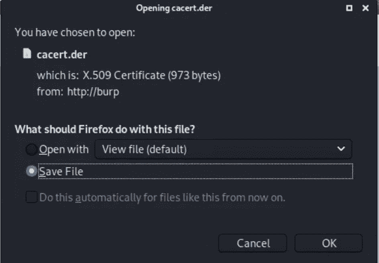

转到浏览器的首选项。

搜索证书。

导入证书并安装它。

找到您保存证书的位置。

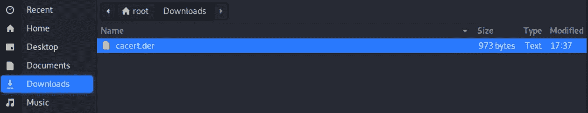

信任该证书，然后单击“确定”。

Burp 代理完全设置好了，为我们的浏览器配置拦截请求。

转到 BurpSuite >代理并打开截取。

让我们从游戏区域门户页面捕获请求。

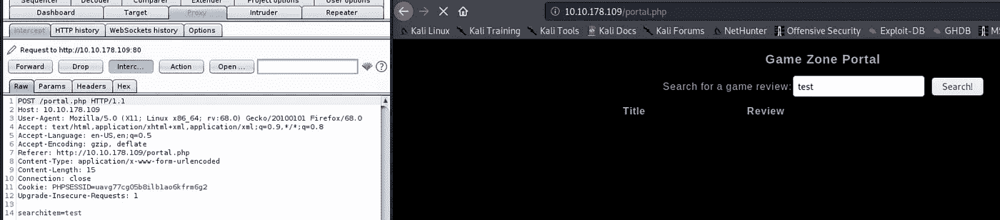

我们可以复制请求并将其保存到文件中。为此，我将使用“纳米”编辑器。

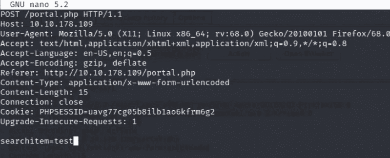

保存它[Ctrl+O]，退出它[Ctrl+X]。

现在，我们将在“sqlmap”中使用此请求。

> *sqlmap-r request . txt—DBMS = MySQL—dump*
> 
> **-r** 使用您之前保存的拦截请求
> -**DBMS**告诉 SQLMap 它是什么类型的数据库管理系统
> -**dump**试图输出整个数据库

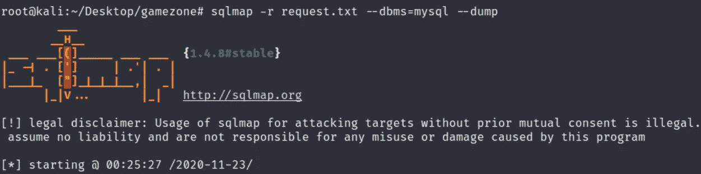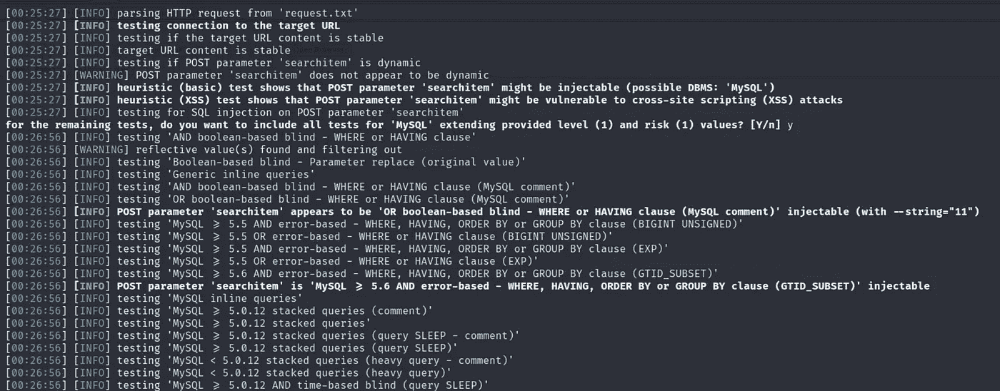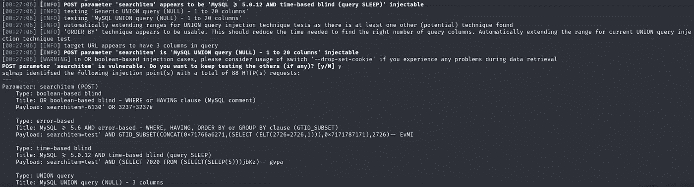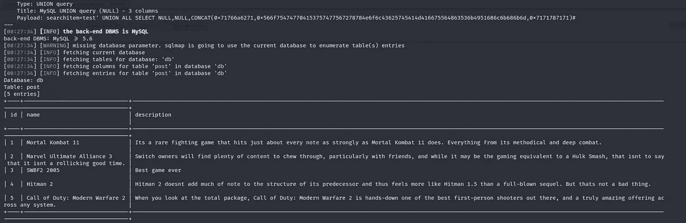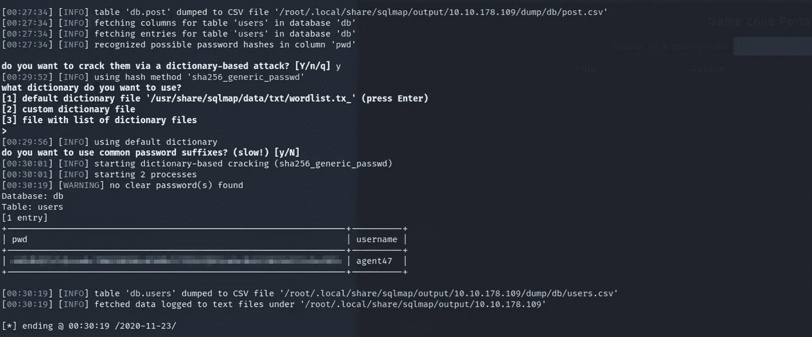

sqlmap 输出将回答此任务中的问题。让我们提交它们。

> 在 users 表中，散列密码是什么？
> Ans:xxxxxxxxxxxxxxxxxxxxxxxxxxxxxxxxxxxxxxxxxxxxxxxxxxxxx
> 
> 与哈希密码相关联的用户名是什么？答案:代理 47
> 
> 另一个表名是什么？
> 答:帖子

太棒了！！做得好！！
继续前进……

## 任务 4-使用 JohntheRipper 破解密码:

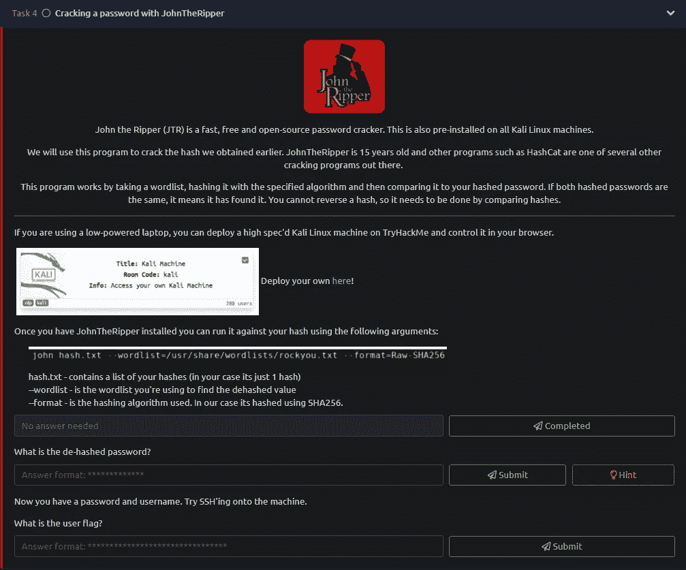

我们在前面的任务中获得的散列需要使用“JohntheRipper”工具来破解。

首先，我们需要将哈希保存在一个“hash.txt”文件中。然而，“纳米”编辑器将非常方便地做到这一点。或者是“回声”命令。这次让我们回显散列，并重定向以保存输出。

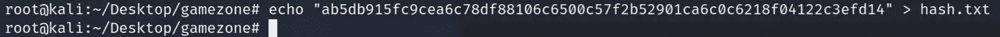

就这样！！在我们使用“john”之前，我们需要确定 hash。在终端中这样做的一个简单方法是使用“hash-identifier”命令。

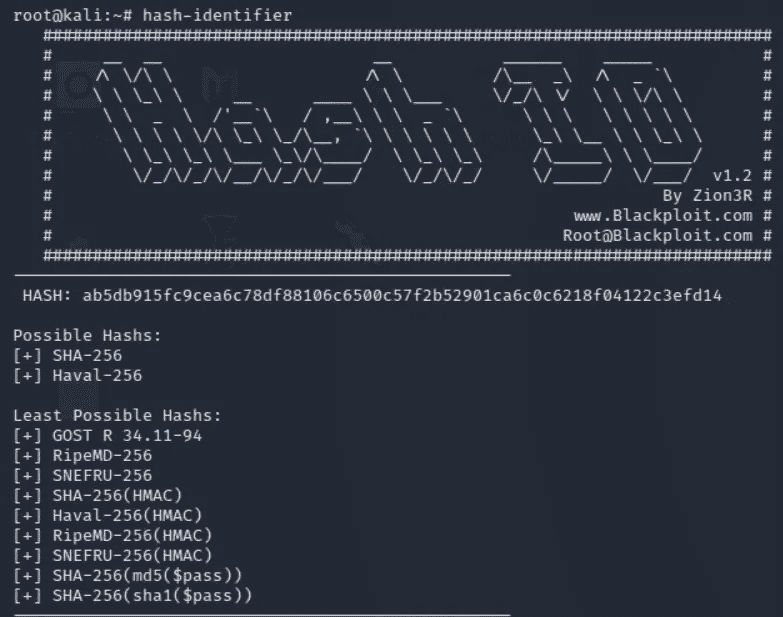

太好了！！哈希是 SHA-256。我们会让约翰瑟里普旋转起来。一个很棒的哈希破解工具，支持很多服务和哈希类型。它将完美地工作并完成任务。

> sudo john — list=formats | grep SHA

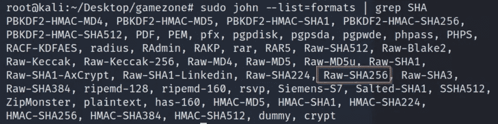

我们需要使用的格式是 Raw-SHA256。

> sudo John hash . txt—word list = rock you . txt—format = Raw-sha 256
> 
> *hash.txt —包含您的散列列表(在您的例子中只有 1 个散列)
> - -wordlist —是您用来查找去散列值的单词列表
> - -format —是使用的散列算法。在我们的例子中，它是使用 SHA256 散列的。*

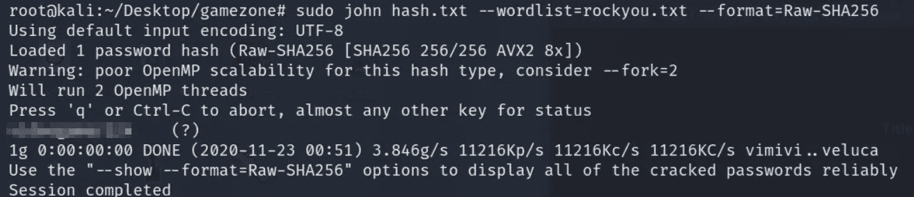

我们已经获得了密码并成功破解了哈希。

提交问题的答案。

> 什么是去哈希密码？
> 答:XXXXXXXXXXXX

我们有用户名和密码，因此我们可以使用凭证在目标机器上进行 SSH。让我们获得外壳。

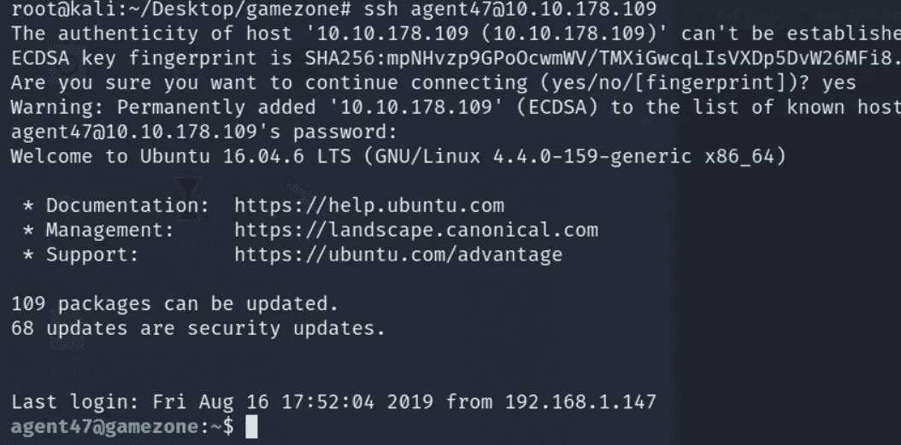

我们进去了。！我们已经获得了外壳。
现在我们需要捕捉用户标志。

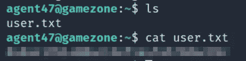

明白了！！我们提交吧。

> 什么是用户标志？
> Ans:xxxxxxxxxxxxxxxxxxxxxxxxxxxxx

现在怎么办？是的，事实上我们需要提升特权成为根用户，获取根用户标志，并给这个游戏区一个游戏结束。然而没那么容易。在这个 CTF 中，我们还处理 SSH 隧道，它们将在下一个任务中向我们公开服务。

## 任务 5-通过反向 SSH 隧道公开服务:

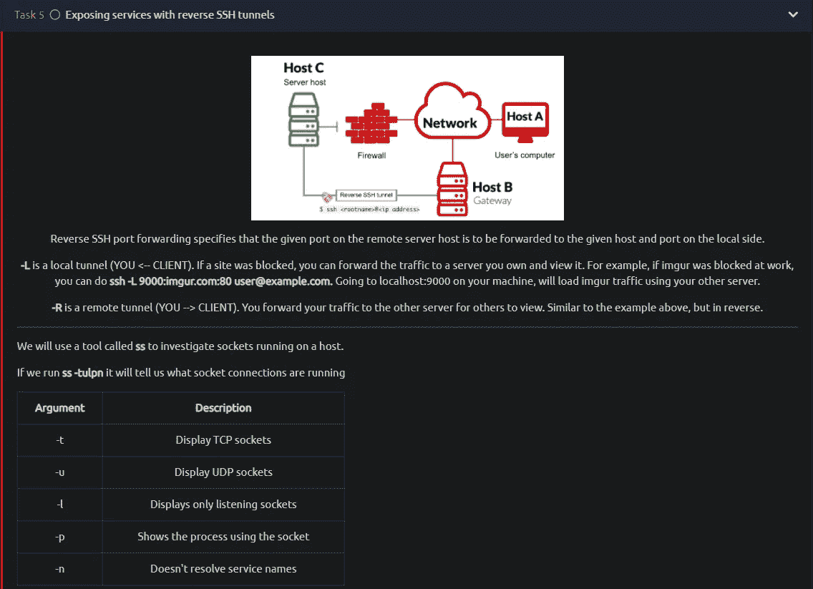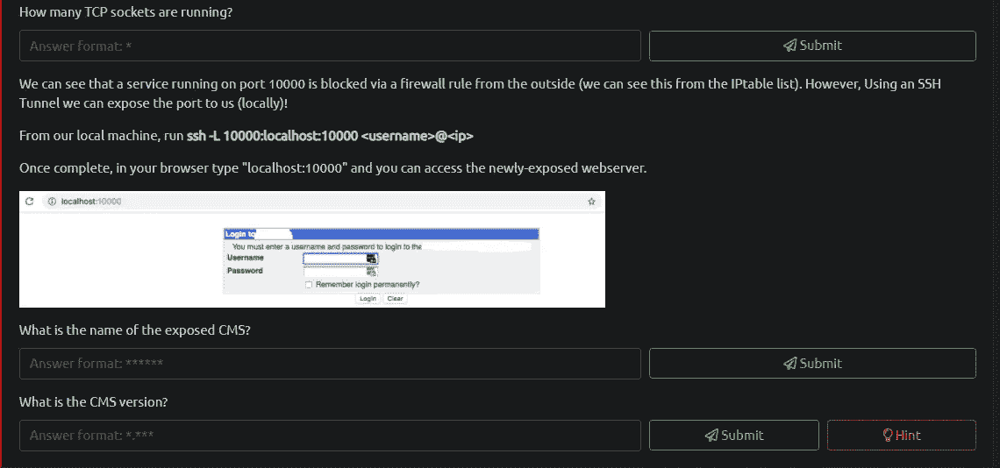

既然我们已经获得了外壳。我们需要发布“ss -tulpn”命令。该命令将向我们显示机器正在监听的端口，并将暴露被防火墙阻止的服务。

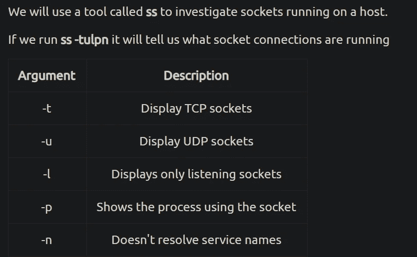

> ss -tulpn

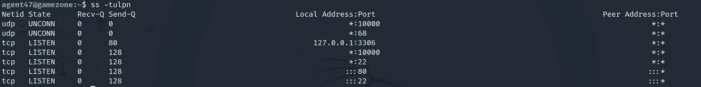

或者，我们可以使用命令' ss -tulp ',它将为我们解析服务名称。

> ss -tulp

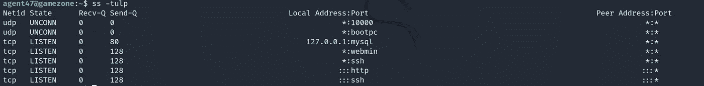

我们发现服务运行在端口 10000 上，它是“webmin”。我们还可以看到机器上运行着 5 个 TCP 套接字。提交问题的答案。

> 有多少 TCP 套接字正在运行？答案:5
> 
> 被曝光的 CMS 叫什么？
> Ans: webmin

从我们的本地机器，我们将运行命令

> ssh-L 10000:localhost:10000<username>@</username>

它将允许我们再次登录 SSH，但这一次的不同之处在于，我们将目标机器端口 10000 上的“webmin”服务转发到主机端口 10000 上的“localhost”。
登录 SSH 后，我们将能够访问该服务。

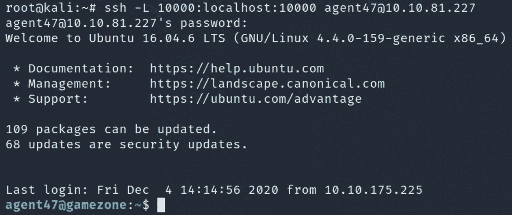

> 导航到本地主机:10000

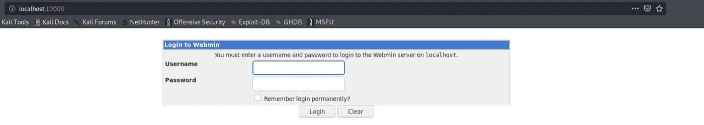

太好了！！我们有一个登录页面，但没有凭据。也许 CMS 是可利用的。让我们找出 CMS 的版本号。

我们可以通过运行 nmap 扫描简单地做到这一点。

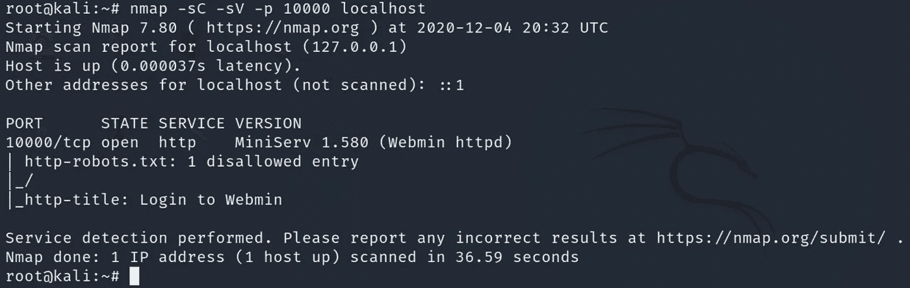

很好。我们已经获得了 CMS 的版本号，它是 1.580。也是问题的答案。提交吧。

> CMS 版本是什么？
> 答案:1.580

有趣的是，有一个“robots.txt”页面，我们会检查它。

导航到本地主机:10000/robots.txt

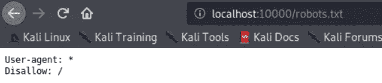

没什么有用的。

我们还可以使用之前任务中的凭证登录 Webmin。

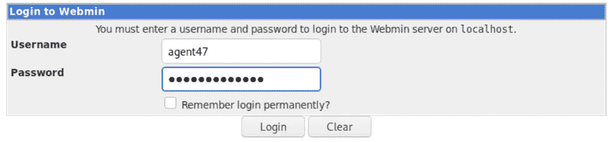

单击登录。

事实上，我们登录后可以看到更多信息，如主机名、操作系统、内核等。不可思议！！让我们继续下一项任务。
玩得开心吗？地狱是啊😃。

## 任务 6-使用 Metasploit 提升权限:

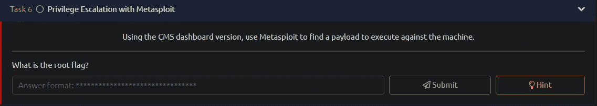

我们可以使用“searchsploit”来查找 CMS“Webmin”的任何潜在漏洞，特别是版本 1.580。

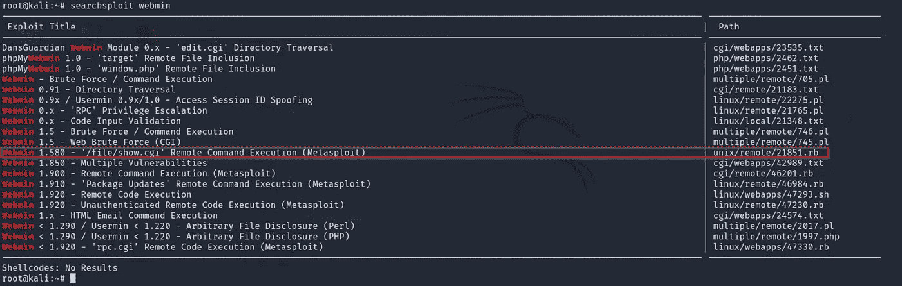

我们已经获得了远程代码执行的漏洞，并将提升我们的特权。

我们可以把漏洞下载到我们的主机上

searchsploit -m<path_to_exploit></path_to_exploit>

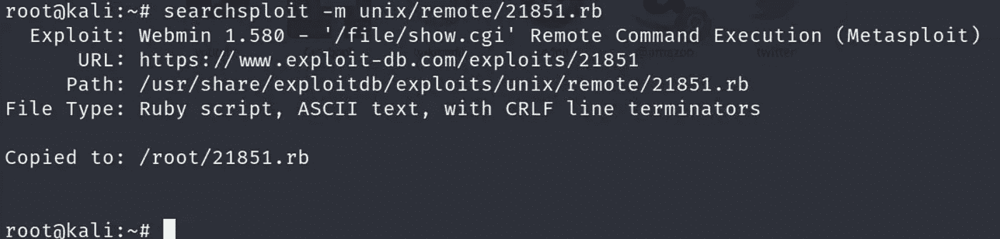

让我们检查该漏洞并查看其说明或正确用法，以便成功工作。

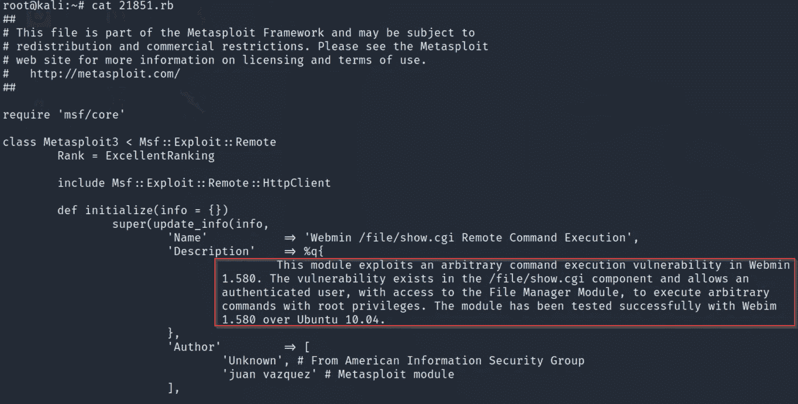

太棒了！所以这个漏洞可以让我们在 Webmin 1.580 中执行命令。我们将能够以认证用户的身份访问文件管理器，并捕获位于/root 目录中的根标志。

就这么办吧。

> 导航到本地主机:10000/file/show . CGI/root/root . txt

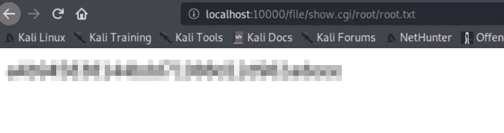

我们成功了！！这种利用非常有效。
超级牛逼！！
提交吧。

> 根旗是什么？
> 答:xxxxxxxxxxxxxxxxxxxxxxxxxxxxxxxxx

我们已经完成了房间。我真的很喜欢这个房间，并从中获得了很多乐趣。我会建议每个人都尝试一下这个房间，我相信你会学到一些新的东西。

如果你喜欢这篇文章，并且这篇文章对你有所帮助，请在评论中告诉我，或者用掌声分享你的爱。

谢谢你抽出时间。

跟着我。

更多的报道正在进行中。

保重，注意安全，继续黑！

**-哈桑·谢赫**