# TryHackMe-游戏服务器

> 原文：<https://infosecwriteups.com/tryhackme-gaming-server-191d2f142a12?source=collection_archive---------1----------------------->

本演练与来自 Try Hack Me- Gaming Server 的 easy level box 相关。根据这个房间里的标签，我们可以理解我们可以学习一些新概念来完成任务。让我们开始吧。

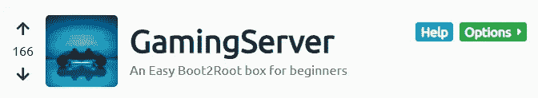

TryHackMe-游戏服务器

让我们部署机器并为开放端口运行 Nmap。

```
nmap -sC -sV -Pn 10.10.75.194
```

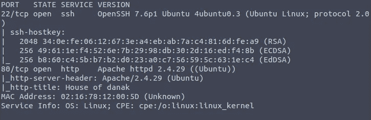

Nmap 结果

我们可以看到 22，80 个端口处于打开状态。让我们运行 gobuster 进行目录枚举并导出输出。

```
gobuster dir -u [http://10.10.75.194](http://10.10.75.194) -w /usr/share/dirb/wordlists/common.txt | tee gobuster.txt
```

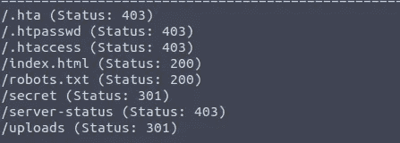

gobuster

好吧…，我们得到了我们的 gobuster 结果。但是，在检查它们之前，让我们首先检查 HTTP 站点。

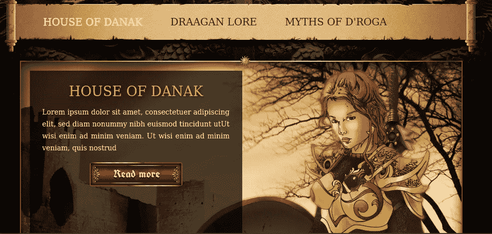

好的，看起来这是一个添加了多种内容的动态网站。让我们检查一下源代码，看看是否能找到什么。

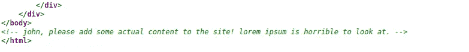

呼，我们收到了一条评论，其中突出显示了一个名叫“约翰”的人。让我们记下这个名字，以备将来使用。现在让我们一个一个地检查目录。

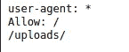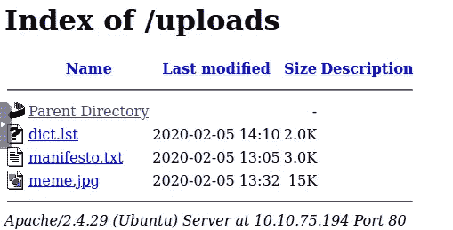

我们可以看到 robots.txt 文件中有一个关于目录的条目。我已经导航到那里，看到有 3 个文件。其中一个是字典文件。

让我们暂时把这个放在一边，探索一下这个奇怪的“秘密”目录。

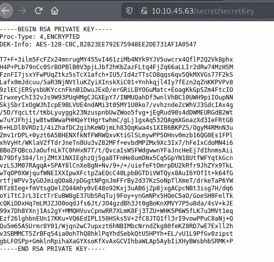

秘密目录中的秘密密钥

哦，太好了，我们有一把秘密钥匙。让我们抓住钥匙，用约翰来破解它。

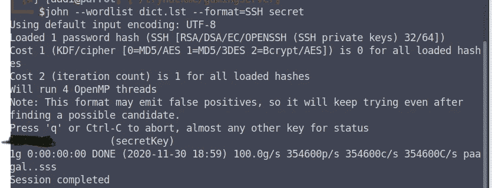

我们从 robots 文件中获得了密钥和用户名“john”。让我们抓住宋承宪继续前进。

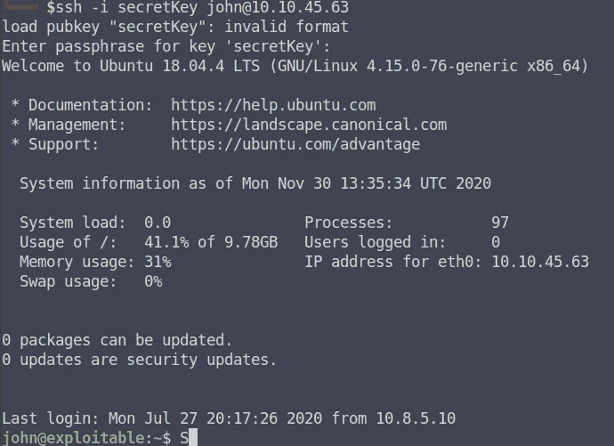

所以，终于得到了 SSH 会话。让我们找出我们的初始密钥。


我们需要提升我们的特权。我试过经营 sudo -l，但没有运气。我已经检查了这台机器的标签，注意到一个与 lxd 相关的标签。

```
**LXD** is a next generation system container manager. It offers a user experience similar to virtual machines but using Linux containers instead. It's image based with pre-made images available for a wide number of Linux distributions and is built around a very powerful, yet pretty simple, REST API.
```

我尝试了一些 LXD 的公共漏洞，发现了一个 Ubuntu 18.04 的漏洞。这是在 alpine 发行版上制作的，在那里我们需要构建 Alpine 并创建一个容器，该容器有一个获得 root 访问权限的脚本。让我们一步一步来。

```
1.Firstly, we need to clone the required alphine git repo and build it on our machine(Attacker)
2.Once we build it, we will have a compressed image file in tar format.
3\. We need to make a script which exploit the lxd group and send both of them to victim machine.
4\. Change the permission of the script and run it.
5\. Once you run the script, it will import the image and create the container with elevated access.
6\. Since the image have the admin access and it will mount the whole victim machine's root disk and give complete access.
7\. Now since we are root in this image with having access to our victim's machine's root directory, we can navigate it and get our final flag
```

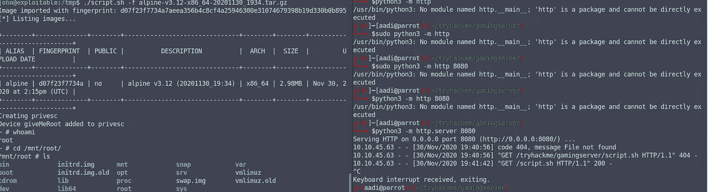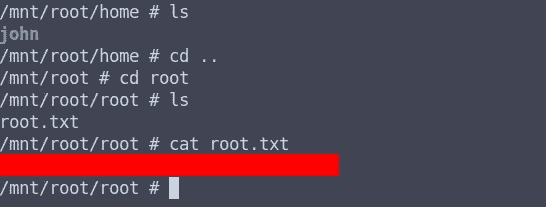

最后，我们拿到了第二面旗子。我们可以在这台机器上进一步探索，了解这种级别的访问是如何工作的。我会尽快写下并分享更多关于 LXD 的事情。

感谢阅读此…:)