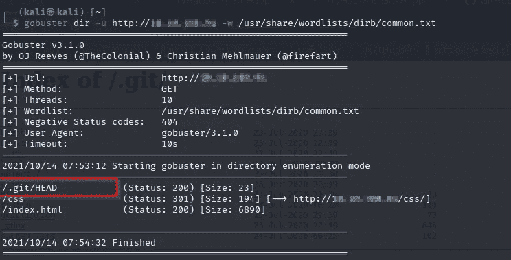
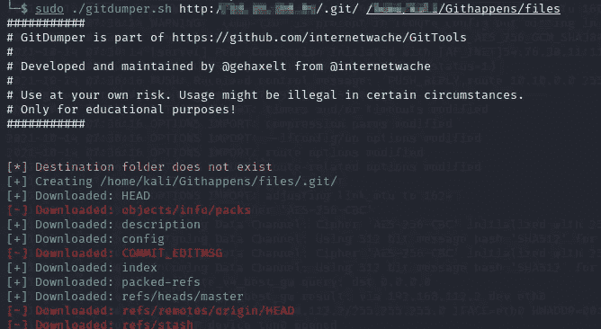
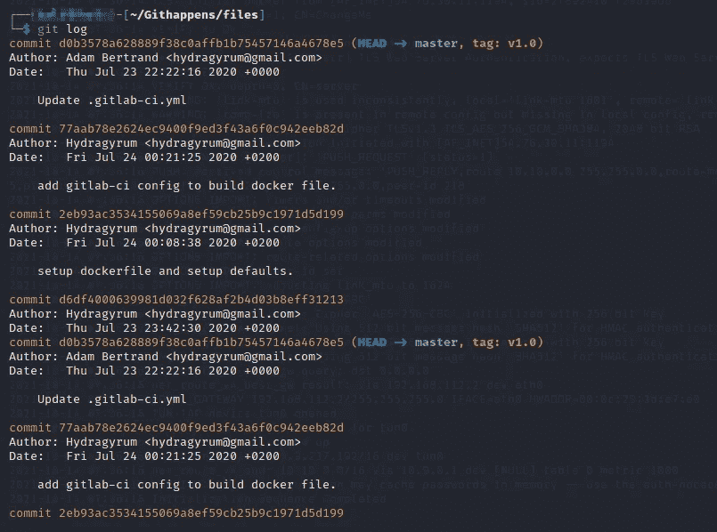
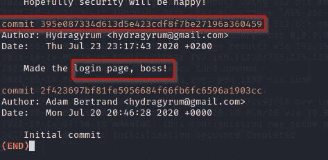
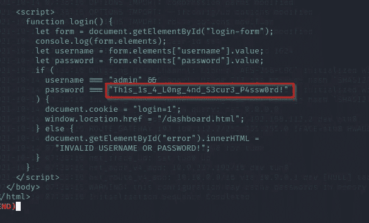

# TryHackme—Git hackme 发生记录

> 原文：<https://infosecwriteups.com/tryhackme-git-happens-writeup-c6199984502e?source=collection_archive---------1----------------------->

嗨，了不起的黑客今天的博客我们将看到 TryHackme git hacks。

首先，我用 Nmap 扫描仪扫描目标，我知道哪个目标得到了有用的信息。找到 git 目录。

然后我也使用 Gobuster 到有用的目录并找出。git/ Head 目录。

然后，我使用一个名为 GitTools 的自动化工具来查找敏感目录。

你可以从 [GitTools](https://github.com/internetwache/GitTools) 下载它，然后开始自动化过程

我导航到 Githappens/files 并进入 git 日志

然后输入**git show 395 e 087334d 613 D5 e 423 CDF 8 F7 be 27196 a 360459**

最后，我找到了一面旗子。