# TryHackMe-必须抓住他们所有 CTF 写(详细)

> 原文：<https://infosecwriteups.com/tryhackme-gotta-catchem-all-ctf-writeup-detailed-ab1b368698b8?source=collection_archive---------2----------------------->

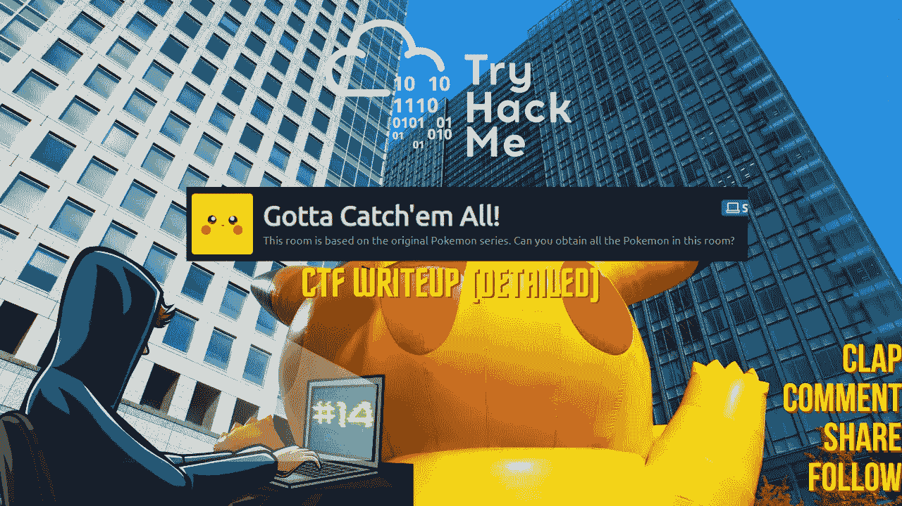

CTF 报道#14

欢迎各位！我们将在 [TryHackMe](https://medium.com/u/dc49a0a3cb16?source=post_page-----ab1b368698b8--------------------------------) 抓住他们所有的 CTF 人。

 [## TryHackMe |要把他们都抓起来！

### 这个房间是基于原口袋妖怪系列。你能得到这个房间里所有的口袋妖怪吗？

tryhackme.com](https://tryhackme.com/room/pokemon) 

在桌面上为您的 CTF 计算机创建一个目录，并在 CTF 目录中为 Nmap 创建一个目录。

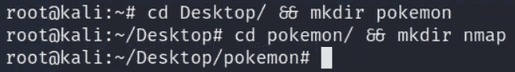

让我们潜入水中，把他们都抓起来！！享受流动吧！！

## 任务 1-你能抓住他们吗？：

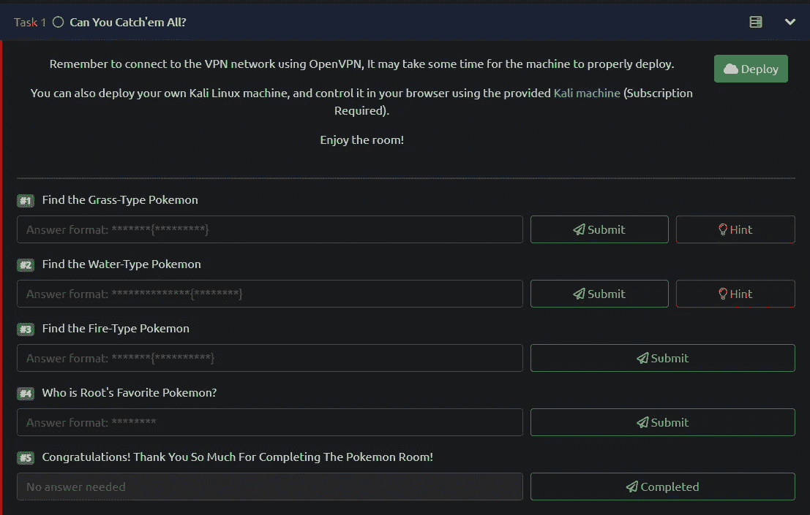

任务列表

## Nmap 扫描:

> nmap-sC-sV-p--关于 nmap/口袋妖怪<target_ip></target_ip>
> 
> -sC:默认脚本
> -sV:版本检测
> -p-:扫描所有端口
> -oN:输出将存储在您之前创建的目录“nmap”中

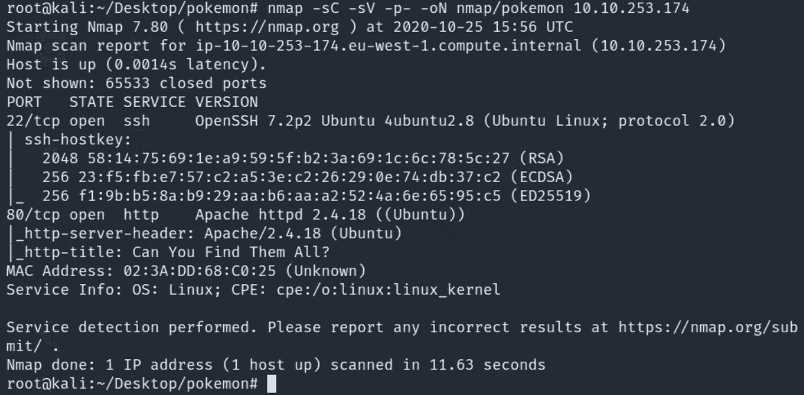

有 2 个端口打开:
22/ssh-OpenSSH 7.2 p2
80/http-Apache httpd 2 . 4 . 18
OS 检测到- Ubuntu Linux

## Gobuster:

> gobuster dir-u http://<target_ip>-w<path_to_wordlist>-o<output_file_name>-x</output_file_name></path_to_wordlist></target_ip>
> 
> -u : URL
> -w:单词列表
> -o:输出将存储在目录
> -x:搜索扩展名，例如 html、txt、php、phtml 等。

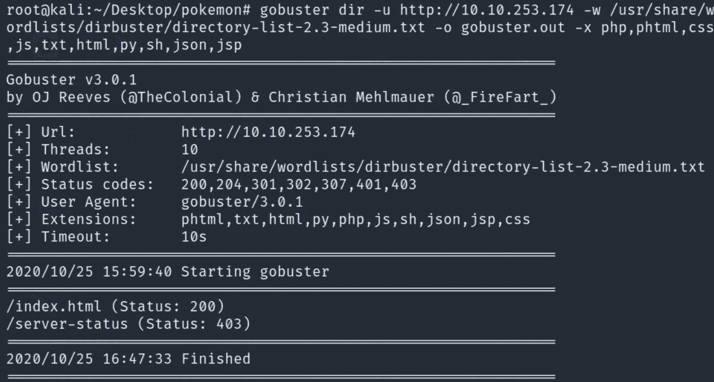

web 服务器中没有隐藏的目录。然而，总是寻找它们是一个好习惯。

导航到 http://<target_ip></target_ip>

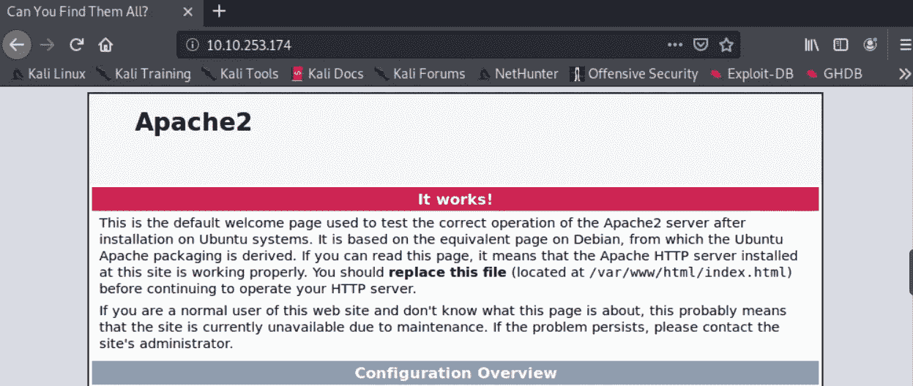

检查页面的源代码是否有隐藏的注释总是好的。查看 URL 页的源代码。

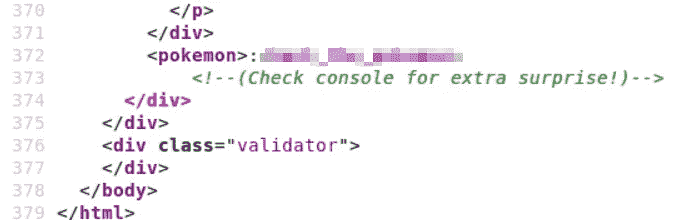

太棒了。这是为 ssh 控制台准备的凭证。因此，我们将使用它们作为用户“口袋妖怪”登录 ssh。

让我们这样做，在系统上获得立足点，并开始寻找标志。

太棒了。我们进去了。

我们将从桌面开始查看您在主目录中看到的每个文件夹。

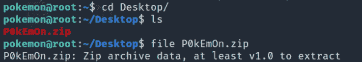

有一个 zip 文件，我们需要提取它的内容，因此我们可以使用' unzip '命令。

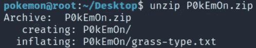

提取了 1 个目录和该目录中的 1 个文件。很明显，第一个任务的标志在 grass-type.txt 中。

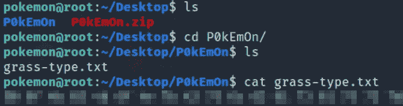

我们得到了一个十六进制的散列，我们需要对它进行解码以获得标志。
不太难，我将使用我的工具来破解哈希:

 [## 网络咖啡馆

### 网络瑞士军刀-一个用于加密、编码、压缩和数据分析的网络应用程序

gchq.github.io](https://gchq.github.io/CyberChef/) 

Cyberchef 将完美地完成这项工作，而且工作起来很有魅力。

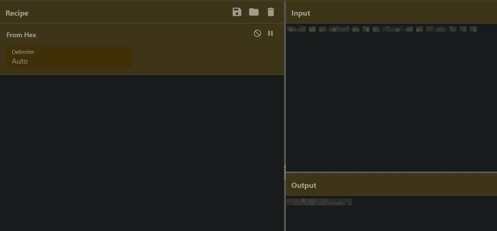

太棒了！！我们有草型口袋妖怪。提交吧。

> #1.找草型口袋妖怪
> Ans:xxxxxxxxxxxxxxxxxxxxx

继续前进。对下一个任务的提示是:

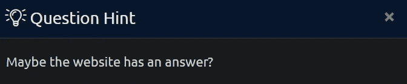

寻找下一个口袋妖怪的几种方法。当我们知道网站有答案时，这并不意味着您必须一遍又一遍地浏览网页，而是在 web 服务器上运行的网站总是包含文件系统中/var/www/html 目录下的文件。

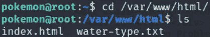

的确如此。
或者，我们可以使用‘locate’命令来定位 water-type.txt 在文件系统中的路径。

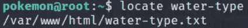

此外，我们可以使用“find”命令来查找 water-type.txt 文件的位置。

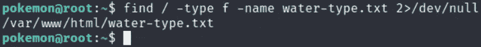

> / —搜索整个文件系统
> —类型 f —搜索类型为
> 的文件—名称 water-type.txt —搜索名称为 water-type . txt
> 2>/dev/null 的文件—隐藏错误，这样我们就不必看到一长串权限被拒绝的文件，而只看到我们正在搜索的文件

因此，我们将导航到/var/www/html 目录并捕获水型口袋妖怪。

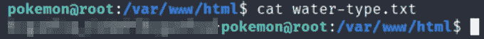

正如所料，该标志是哈希编码，因此我们必须解码它。如果你注意到字符被简单地旋转，并且清楚地表明散列是 ROT13。但我们会去赛博咖啡馆解码。

我们需要将数量增加到 14，哈希将成功解码。数量 14 意味着哈希字符串旋转了 14 个字符，而不是默认的 13 个字符。

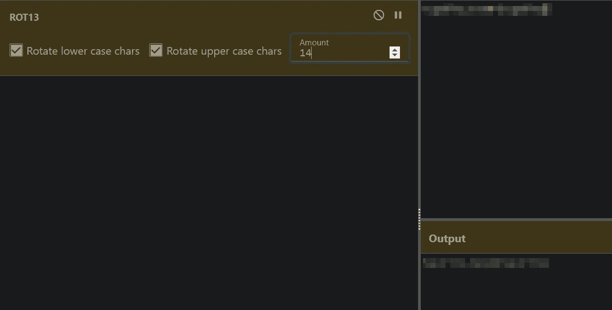

宏伟！！
我们有水型口袋妖怪。
提交吧。

> #2.找水型口袋妖怪
> Ans:xxxxxxxxxxxxxxxxxxxxxxx

很好很容易。让我们继续吧。

我们可以使用与之前找到我们的标志相同的方法，因为我们知道 fire-type pokemon 已经在文件系统中，但是它到底在哪里。

我们可以使用“定位”命令，并希望它能为我们定位路径。如果文件名不同于我们猜测的名称，事情可能会变得有点棘手。

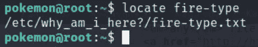

这很简单。太好了！！让我们抓住口袋妖怪。

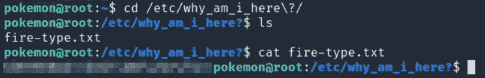

哈希清楚地表明它是基本编码的，因为字符串包含“= =”符号。我们现在知道去哪里解码了。就这么办吧。

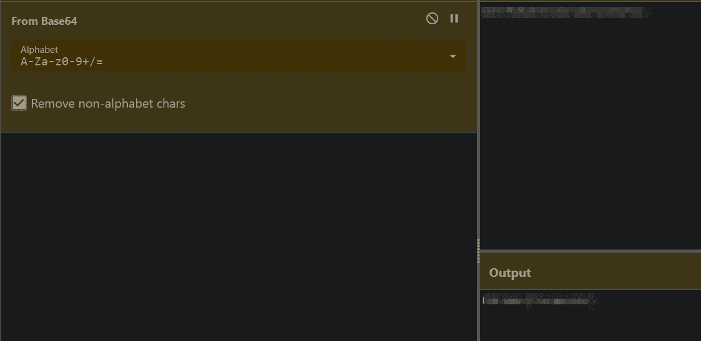

我们也可以在终端解码。

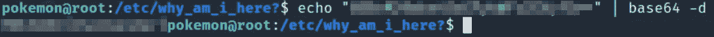

做得好！！我们有火型口袋妖怪。
提交吧。

> #3.找到火型口袋妖怪
> Ans:xxxxxxxxxxxxxxxxxxxxx

我们继续吧。
现在怎么办？你认为这是对的。我们需要提升我们的特权以成为根用户并获取根标志。
首先，我们需要查看/home 目录，看看这个机器上有多少用户。

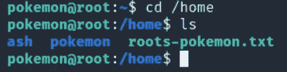

所以/home 目录里面有一个 root-pokemon . txt 文件。似乎我们需要查看这个文件的内部以获得最后一个标志。

其次，我们将检查这个文本文件的权限。

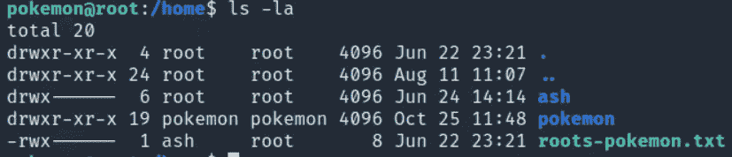

正如所料，用户“ash”和组“root”拥有该文件。

没关系。如果你还记得我提到过我们会查看口袋妖怪用户的/home 目录中的所有目录。

> 文件/

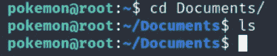

没什么。继续下一个目录。

> 下载/

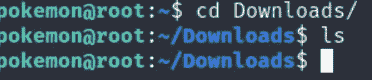

没什么。

> 音乐/

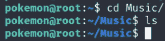

没什么。

> 图片/

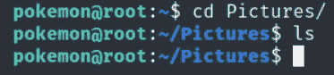

没什么。

> 模板/

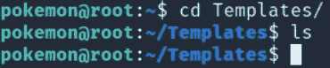

没什么。

> 视频/

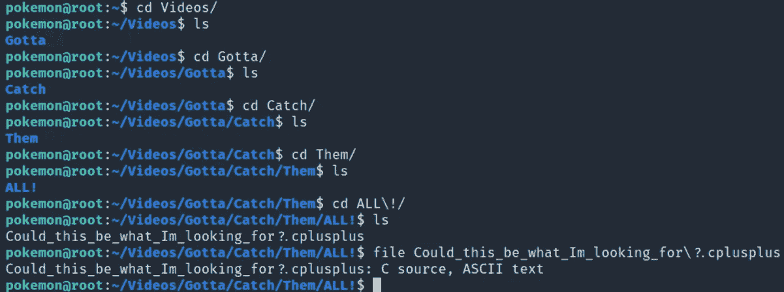

干得好！！我们在视频目录中发现了几个目录和一个我们正在寻找的文件。让我们打开文件，看看它的内容。

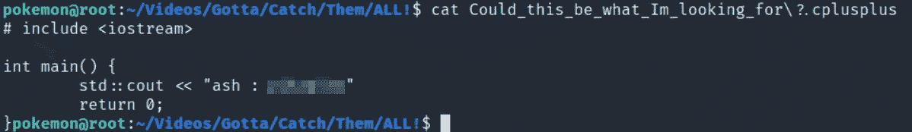

这里我们有用户“ash”的凭证。
我们将以 ash 的身份登录。

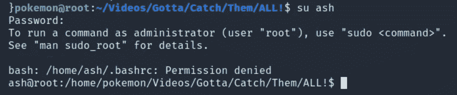

我们记得在/home 目录中有一个可以被 ash 执行的文本文件。它可能包含这个盒子的最后一个标志。

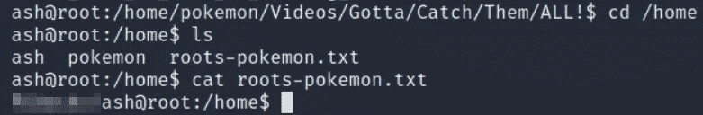

太棒了。！
有 Root 最喜欢的口袋妖怪，也有我的。😃
提交。

> #4.Root 最喜欢的口袋妖怪是谁？
> 答:XXXXXXXXX
> 
> #5.恭喜你！非常感谢你完成口袋妖怪房间！答:不需要回答。

恭喜，我们已经完成了房间。这确实是一个有趣的盒子。我希望你在阅读它的时候有乐趣。我童年时有很多关于口袋妖怪交易卡的美好回忆，我真的很喜欢玩基于口袋妖怪的 CTF，但我想念我那时最喜欢的 Mewtwo，Charizard，Venasaur。

如果你喜欢这篇文章，并且这篇文章对你有所帮助，请在评论中告诉我，或者用掌声分享你的爱。

谢谢你抽出时间。

跟着我。

更多的报道正在进行中。

保重，注意安全，继续黑！

**-哈桑·谢赫**