# TryHackMe:必须抓住他们！Mayur Parmar 的漫游(th3cyb3rc0p)

> 原文：<https://infosecwriteups.com/tryhackme-gotta-catchem-all-walkthrough-by-mayur-parmar-th3cyb3rc0p-9b6c3db4a6c1?source=collection_archive---------1----------------------->

## 这个房间是基于原口袋妖怪系列。你能得到这个房间里所有的口袋妖怪吗？

> 房间链接:[**https://tryhackme.com/room/pokemon**](https://tryhackme.com/room/pokemon)

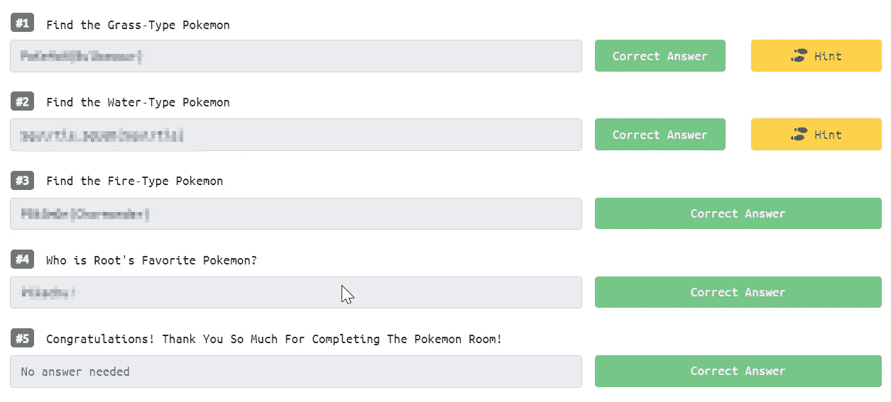

## 信息收集:

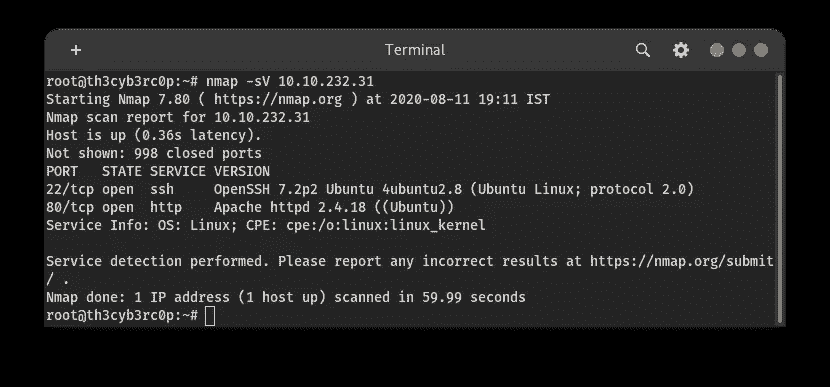

我已经完成了端口扫描，得到了 2 个端口。

端口 80(web)，22(ssh)

## 目录暴力强制:

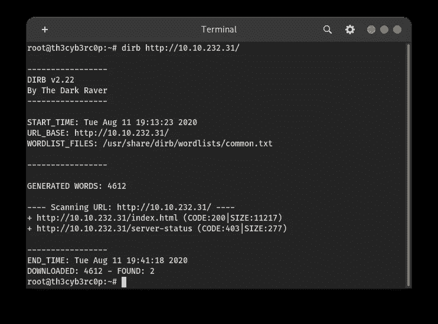

从 dirb 工具中没有得到什么有趣的目录。

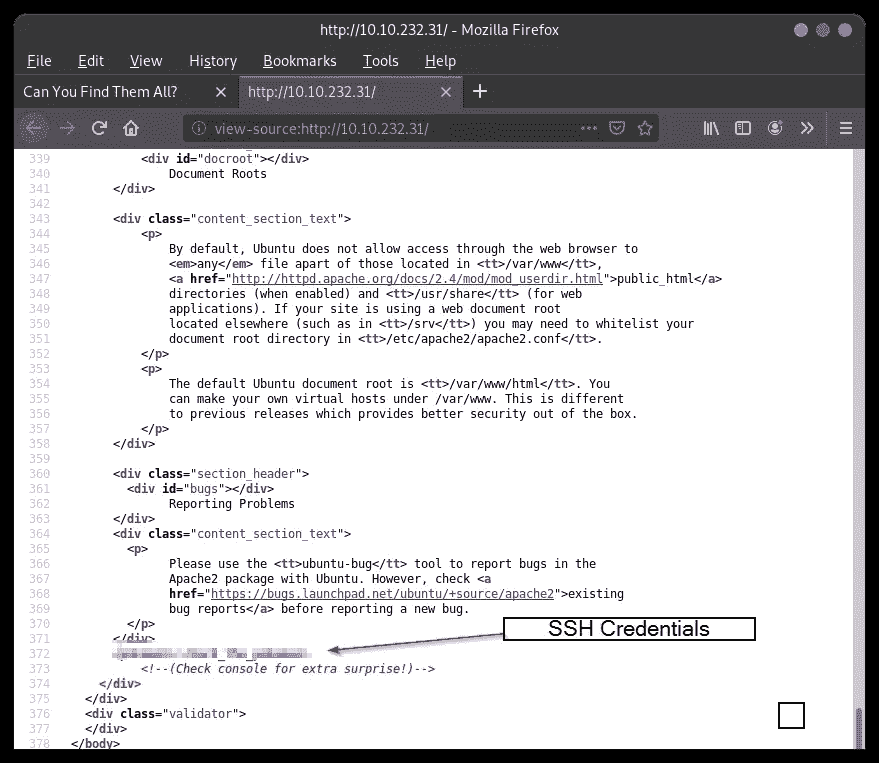

当我打开 IP 地址时，它给了我默认的 apache 页面。所以我很快查看了源代码。在评论栏里发现了一些有趣的信息。得到一些提示当我仔细观察时，我注意到在网页上没有登录选项可用。我们可以通过 SSH 服务登录，从源代码中我得到了一些凭证。

## SSH 登录:

语法:ssh user@ipaddress

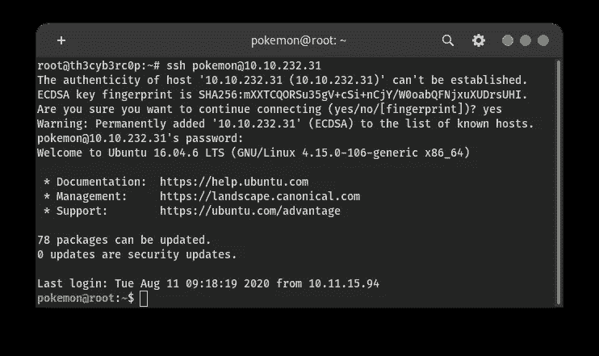

我们使用 ssh 凭证成功登录。

> **#1** 找到草型口袋妖怪

登录后，我寻找一些有趣的文件。并且在**桌面**目录中发现了一个有趣的文件。名为**p0ke0n . zip**

这是一个 zip 文件，所以我们必须解压缩才能显示里面的内容。

所以我使用了 Linux 操作系统中的 unzip 工具。

命令:解压<filename></filename>

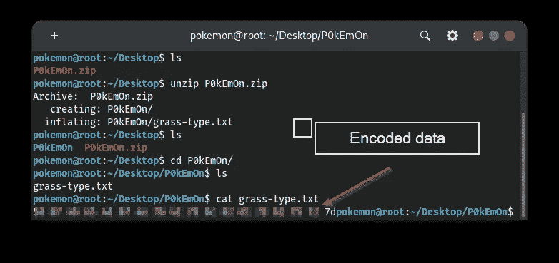

提取数据后，我发现其中有一个名为 **P0kEm0n 的文件夹。**在这个文件夹里，我得到了一个文件 **grass-type.txt**

当我读取内容并得到一些数字时，我知道这是十六进制的数字，所以我们必须转换成文本。

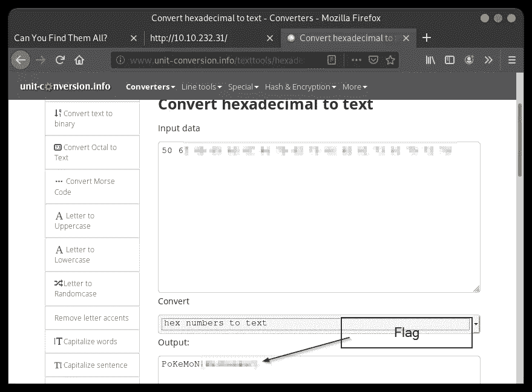

> **#2** 找到水型口袋妖怪

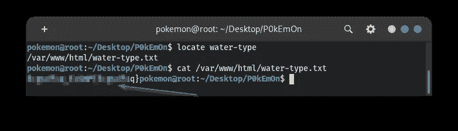

根据上面的问题，我使用 locate 命令快速搜索单词 **water-type** ，得到了包含一个标志的文件。

从这个文件中，我得到了一些加密数据。我知道这段文字是用**凯撒密码**加密的

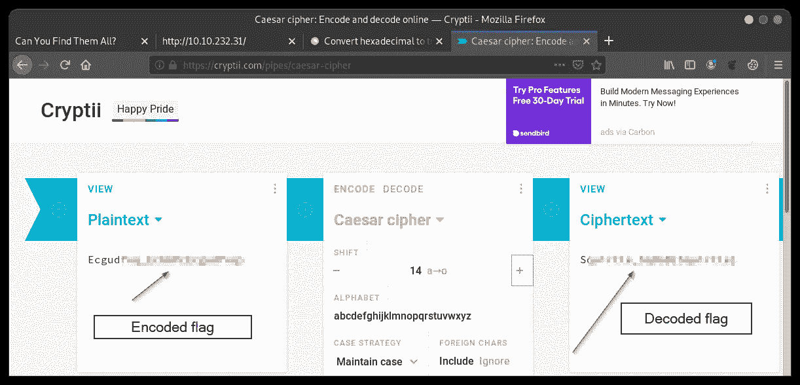

> **#3** 找到火型口袋妖怪

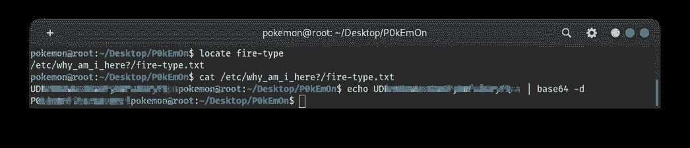

这里我应用了问题 2 的相同方法，得到了一个文本文件。

它在字符串的末尾有==所以我记住了它的 base64 值。

所以我用 Linux 命令行解码。

**命令:回显<加密文本> | base 64 -d**

其中-d 表示解码选项，

> **# 4**Root 最喜欢的口袋妖怪是谁？

当我回到主目录时，我得到了我们的旗帜。但当我试图打开它时，它会说拒绝许可。

所以我想我必须提升权限，但后来我在视频目录中发现了一些有趣的信息。文件夹中有文件夹。最后得到一个 C++文件。当我查看源代码中的内容时。我有一些证件。

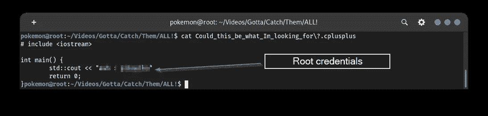

所以我以为这是根帐户凭据。

所以我使用 **su** 命令更改用户，

指挥:苏

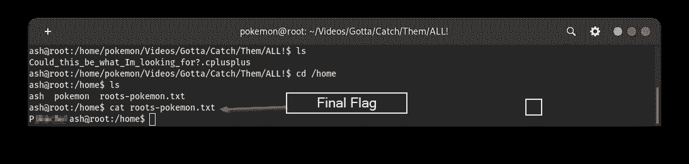

登录后，我可以查看我们的标志文件的内容，即 **roots-pokemon.txt**

> 参考

 [## Base64 解码和编码-在线

### 使用高级格式选项从 Base64 解码或编码到 Base64。进入我们的网站，获得一个易于使用的在线工具。

www.base64decode.org](https://www.base64decode.org/)  [## DIRB

### DIRB 是一个网页内容扫描器。它查找现有的(和/或隐藏的)Web 对象。它的基本工作原理是启动一个…

tools.kali.org](https://tools.kali.org/web-applications/dirb)  [## 快速端口扫描教程| Nmap 网络扫描

### 我开发 Nmap 的目标之一是保持最常见的用法简单，同时保留定制的灵活性…

nmap.org](https://nmap.org/book/port-scanning-tutorial.html)  [## 10 个对 Linux 新手有用的“定位”命令实例

### 大多数 Linux 平台的新用户通常面临的最讨厌的经历之一是无法找到…

www.tecmint.com](https://www.tecmint.com/linux-locate-command-practical-examples/)  [## 将十六进制转换为文本

### 关于将十六进制转换为文本工具将文本转换为十六进制格式。计算机将文本存储为数字，并且用…

www.unit-conversion.info](http://www.unit-conversion.info/texttools/hexadecimal/)  [## 凯撒密码:在线编码和解码

### 明文中的每个字母被替换为字母表中某个固定位置的字母的方法…

cryptii.com](https://cryptii.com/pipes/caesar-cipher)  [## 如何在 Linux 中使用“Sudo”和“Su”命令:介绍-Linux.com

### 如何在 Linux 中使用“sudo”和“su”命令:一个介绍今天我们将讨论 Sudo 和 Su，非常…

www.linux.com](https://www.linux.com/training-tutorials/how-use-sudo-and-su-commands-linux-introduction/#:~:text=The%20Linux%20command%20%27su%27%20is,of%20the%20user%20switching%20to.&text=Users%20can%20also%20use%20it,to%20enter%20root%20user%20password.) 

**作者:**[**Mayur Parmar**](https://medium.com/u/4dbaf35dbafc?source=post_page-----9b6c3db4a6c1--------------------------------)**(th 3c Yb 3 RC 0 p)**

在 Twitter 和 LinkedIn 上关注我(通常我会在这些社交媒体平台上分享技巧)

[https://twitter.com/th3cyb3rc0p?lang=en](https://twitter.com/th3cyb3rc0p?lang=en)

[https://in.linkedin.com/in/th3cyb3rc0p](https://in.linkedin.com/in/th3cyb3rc0p)

[https://www.instagram.com/th3cyb3rc0p/?hl=en](https://www.instagram.com/th3cyb3rc0p/?hl=en)

[https://twitter.com/cyberdefecers?lang=en](https://twitter.com/cyberdefecers?lang=en)

[https://ctftime.org/team/112504](https://ctftime.org/team/112504)