# TryHackMe — h4cked 演练

> 原文：<https://infosecwriteups.com/tryhackme-h4cked-walkthrough-71b9ba4bad7d?source=collection_archive---------0----------------------->

TryHackMe“h4cked”([https://tryhackme.com/room/h4cked](https://tryhackme.com/room/h4cked))是一个简单的 CTF 挑战赛，它是蓝队和红队的组合，你必须分析网络流量捕获，以找出对手的活动，并侵入你的系统，以便获得 root 访问权限，因为对手已经改变了一些配置。

## 哦不！我们被黑了！

首先启动你的 pentesting 机器，通过 OpenVPN 连接到 TryHackMe 网络。然后下载他们给的 pcap 文件。然后使用 Wireshark 打开它。让我们一个一个地讨论问题。

1.  攻击者试图登录特定的服务。这是什么服务？

当分析 pcap 文件时，我们很容易发现攻击者试图登录 FTP 服务，因为有许多来自 FTP 的请求和响应，如下所示。

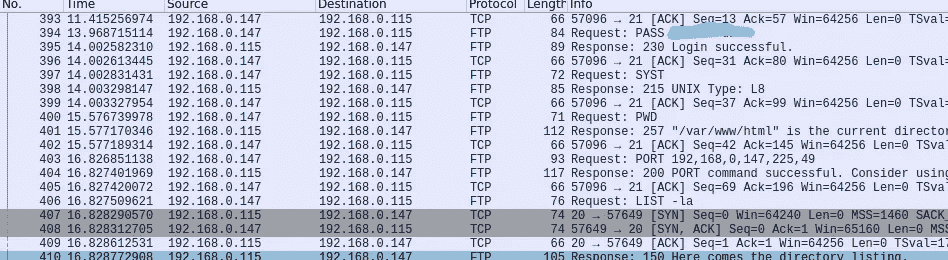

2.Van Hauser 有一个非常流行的工具，可以用来暴力破解一系列服务。这个工具叫什么名字？

通过简单的谷歌搜索，我们可以发现，他们问的是世界著名的九头蛇工具。

3.攻击者试图使用特定的用户名登录。用户名是什么？

分析 pcap 文件，添加“ftp.request”过滤器。您会发现有许多用户请求 Jenny 这个名字，如下所示。

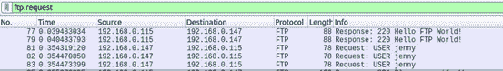

4.用户的密码是什么？

进一步分析上面的“ftp.request”过滤器。您可以看到有许多不正确的登录尝试，只有一次成功的登录尝试，如下所示。你可以在那里找到密码。

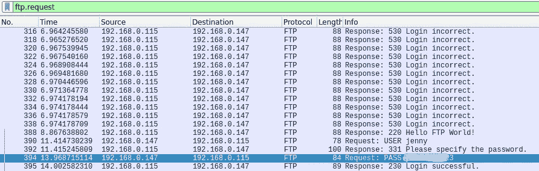

5.攻击者登录后当前的 FTP 工作目录是什么？

你只需在攻击者登录后点击一个数据包，右键点击，然后“跟随 TCP 流”。由于攻击者执行了“PWD”命令，您可以在那里找到当前工作目录“/var/www/html”。

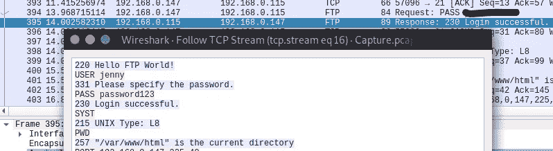

6.攻击者上传了一个后门。后门的文件名是什么？

您可以在上面的 TCP 流中找到文件名“shell.php”

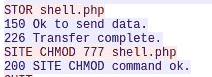

7.后门可以从特定的 URL 下载，因为它位于上传的文件中。完整网址是什么？

根据提示，应用过滤器“ftp-data”并遵循 TCP 流。整个 php 文件在那里是可见的，当你滚动的时候可以很容易的找到 url。

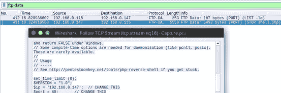

8.攻击者在获得反向 shell 后手动执行了哪个命令？

你只需要在执行 shell 后选择一个包，然后跟随 TCP 流。在那里你可以找到攻击者得到反向 shell 后执行的所有命令。因此，“whoami”是他执行的第一个手动命令。

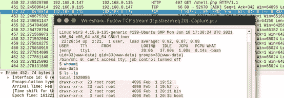

9.计算机的主机名是什么？

当仔细观察上面的 TCP 流时，第一行描述了操作系统、主机名等。由于 Linux 是操作系统，“wir3”应该是主机名。

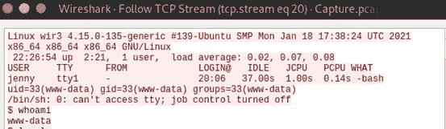

10.攻击者执行了哪个命令来生成新的 TTY shell？

有过反壳经验的人都知道，首先给我们的是一个不稳定的壳。我们需要让它稳定。大多数时候我们使用一个简单的 Python 脚本来实现。我们可以看到这个攻击者在分析上面的 TCP 流时也使用了相同的脚本。

11.执行了哪个命令来获得根 shell？

在分析上面的 TCP 流时，我们可以看到攻击者给了 Jenny root 权限。然后他通过“须藤素”获得了一个根壳。

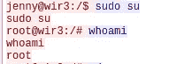

12.攻击者从 GitHub 下载了一些东西。GitHub 项目的名字是什么？

我们可以看到攻击者克隆了一个 git。我们可以简单地将“爬行动物”作为 GitHub 项目的名称。

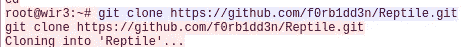

13.该项目可用于在系统上安装秘密后门。很难察觉。这种类型的后门叫什么？

所以，如果你不知道什么是爬虫，谷歌是你最好的朋友。当谷歌搜索时，我们可以发现它是一个 rootkit。

蓝队部分至此结束。现在我们必须重新进入系统。

## 黑进那台机器

我们被告知攻击者已经更改了用户的密码。因此，我们的目标是破解密码并获得 root 访问权限，以便读取标志。因此，首先部署机器并复制 IP 地址。

1.  在 FTP 服务上运行 Hydra(或任何类似的工具)。攻击者可能没有选择复杂的密码。如果你使用一个普通的单词表，你可能会很幸运。

火起世界著名的密码破解工具 Hydra，以破解 FTP 密码。当使用内置单词表“rockyou.txt”时，我们可以在几秒钟内轻松破解 FTP 密码。

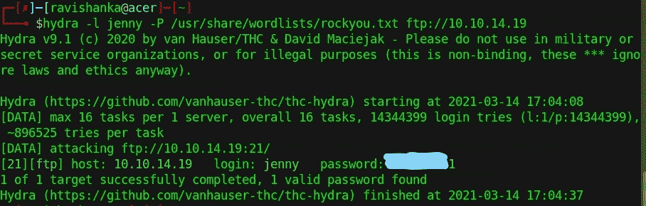

他不是一个好的黑客。不是吗？

因此，让我们使用上述凭证登录 FTP。

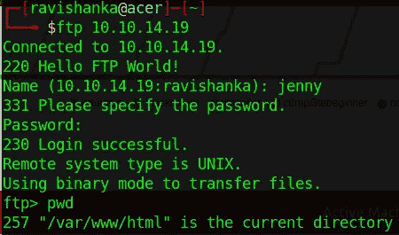

现在，我们以 Jenny 的身份成功登录。

2.在 web shell 中更改必要的值，并将其上传到 web 服务器。

我们可以看到攻击者上传的 php 外壳如下图所示。所以，我下载了它，以便做必要的修改。

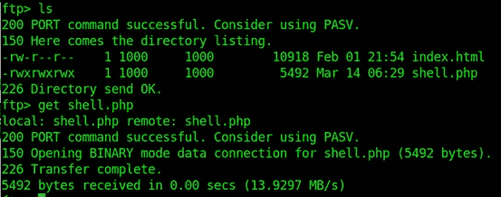

现在你需要你的机器的 IP。您可以通过给出“ifconfig”命令来查看您的 IP 配置。记得使用 VPN(tun0) IP。

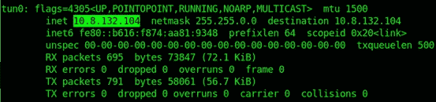

复制上面的 IP，粘贴到下载的 php shell 中，如下图所示。我正在使用纳米文本编辑器来编辑外壳。你可以用你喜欢的任何东西。

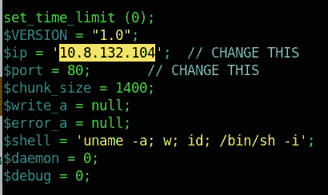

现在通过“put”命令将 shell 上传到 FTP 服务器。上传 shell 时，我发现服务器超时了。如果遇到这个问题，不要慌，重新连接 FTP 就可以了。

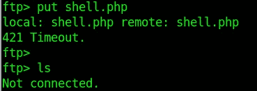

服务器超时错误

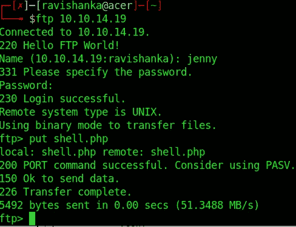

重新连接并上传外壳

当给出“put”命令时，确保给出 shell.php 文件的完整路径。在我的例子中，它位于主目录中。所以，我不需要给出完整的位置。

3.在攻击者机器的指定端口上创建一个监听器。通过访问。目标 web 服务器上的 php 文件。

在这一点上，很明显我们需要一个监听器来与我们上传的 shell 通信。因此，我在端口 80 上建立了一个 Netcat 监听器。

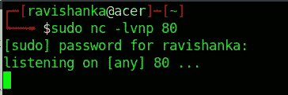

现在我们必须访问 web 应用程序，以便成功执行我们上传的 shell。通过在浏览器上键入机器 IP 访问 web 应用程序，您将看到如下界面。

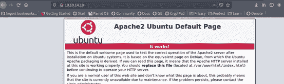

因此，为了执行我们的 shell，我们需要在 web 应用程序上给出 shell 的路径。既然上传到了/var/www/html 目录中，那么只需要给出“http:// <machineip>/shell.php”作为路径即可。</machineip>

一旦在 web 应用程序中给出了上面的路径，我们就会在 Netcat 上获得一个反向 shell。

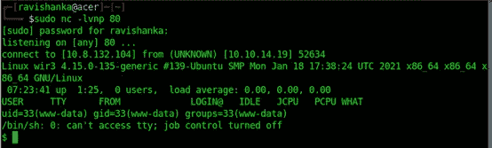

如你所见，这个外壳不稳定。所以，我们可以使用传统的 Python 脚本来使它更加稳定。

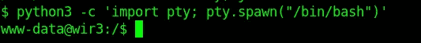

4.成为 root！

至于现在，我是“www-data”，不具备 root 权限。我们知道 Jenny 在机器上有根权限。所以，让我们把用户改成 Jenny，变成 root。事情非常简单，如下所示。

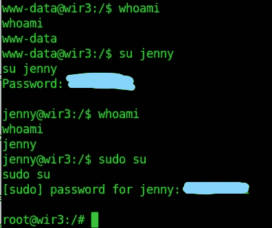

沃拉。没费多大力气就给了我们一个根壳。

5.读取爬虫目录内的 flag.txt 文件。

这是我们的目标。不是吗？获得旗帜！！！！因为我们在一个根 shell 中，所以我们可以很容易地导航到爬行类目录，这个目录位于 root(/root/爬虫)的主目录中，并获得这个标志。

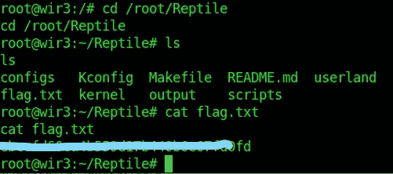

所以，就是这样！就这么简单。

我也想听听你对此的想法。在 LinkedIn 上帮我联系，[https://www.linkedin.com/in/ravishanka-silva-a632351a0/](https://www.linkedin.com/in/ravishanka-silva-a632351a0/)

黑客快乐！！！

感谢对 OSCP 考试的小小帮助，

