# TryHackMe- Ignite CTF 报道(详细)

> 原文：<https://infosecwriteups.com/tryhackme-ignite-ctf-writeup-detailed-67a4adba148b?source=collection_archive---------1----------------------->

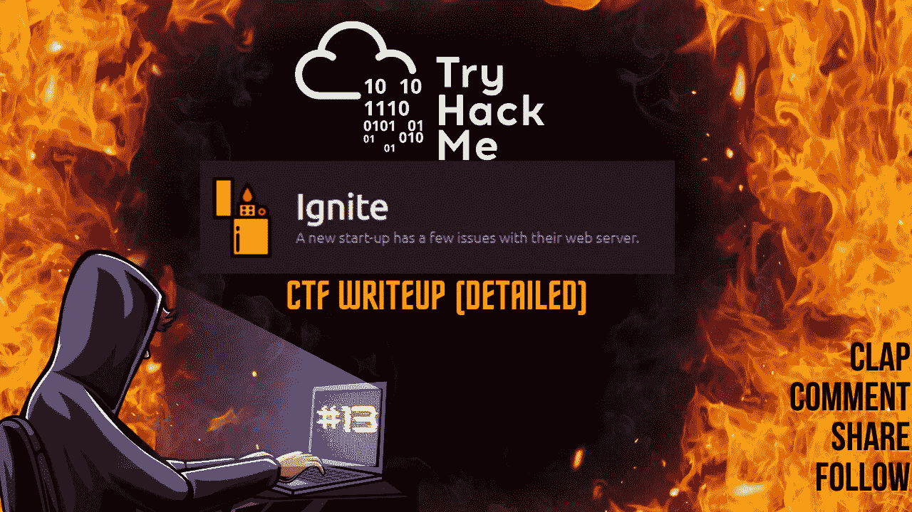

CTF 报道#13

欢迎各位！！我们将在 [TryHackMe](https://medium.com/u/dc49a0a3cb16?source=post_page-----67a4adba148b--------------------------------) 举办“点燃 CTF”活动。

 [## 尝试黑客|点燃

### TryHackMe 是一个学习和教授网络安全的在线平台，全部通过您的浏览器完成。

tryhackme.com](https://tryhackme.com/room/ignite) 

在桌面上为您的 CTF 计算机创建一个目录，并在 CTF 目录中为 Nmap 创建一个目录。

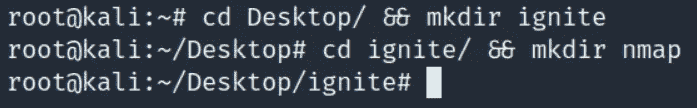

让我们开始吧！！享受流动吧！！

## 任务 1-根除它！：

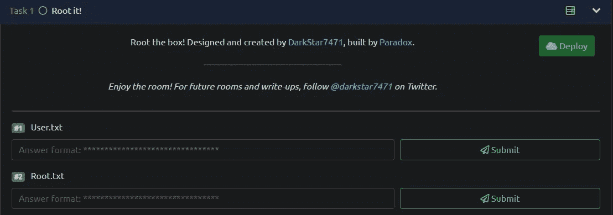

## Nmap 扫描:

> nmap-sC-sV-p--在 nmap/ignite 上<target_ip></target_ip>
> 
> -sC:默认脚本
> -sV:版本检测
> -p-:扫描所有端口
> -oN:输出将存储在您之前创建的目录“nmap”中

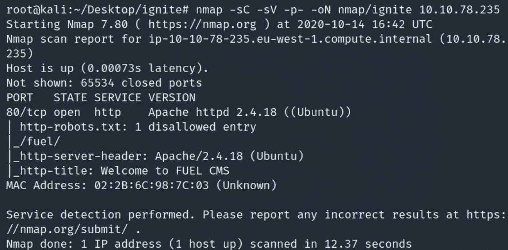

有 1 个端口打开:
80/http- Apache httpd 2.4.18

## Gobuster:

> gobuster dir-u http://<target_ip>-w<path_to_wordlist>-o<output_file_name>-x</output_file_name></path_to_wordlist></target_ip>
> 
> -u : URL
> -w:单词列表
> -o:输出将存储在目录
> -x:搜索扩展名，例如 html、txt、php、phtml 等。

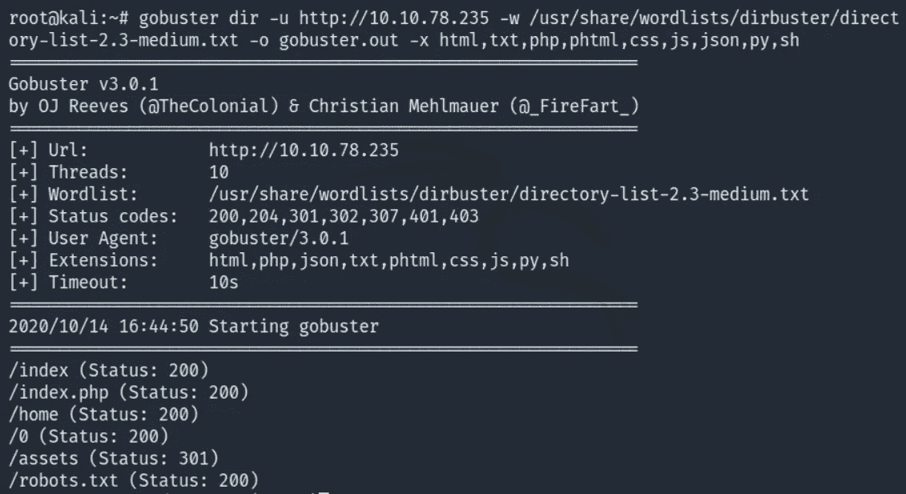

导航到 http://<target_ip></target_ip>

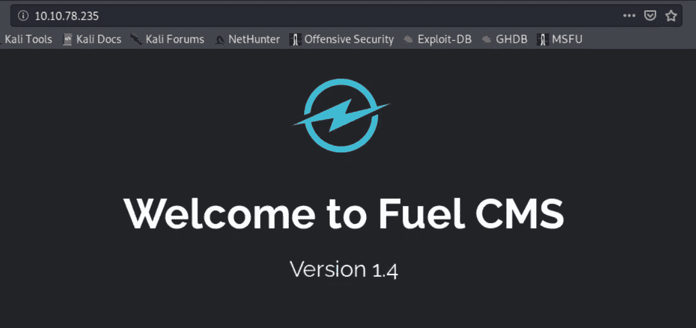

如果我们向下滚动，我们将找到登录 CMS 的默认凭据。

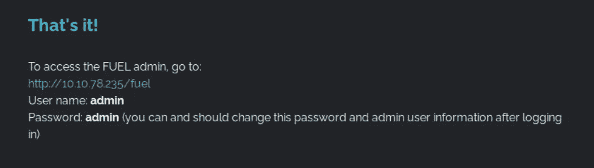

检查页面的源代码是否有隐藏的注释总是好的。查看 URL 页的源代码。

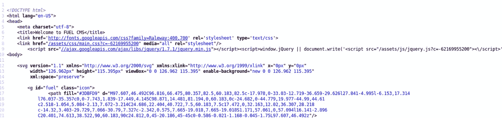

我们在源代码中看不到任何隐藏的注释/散列/信息。

导航到 http:// <target_ip>/robots.txt</target_ip>

你可以尝试导航到 gobuster 扫描中发现的所有目录，我逐个检查了它们，它们重定向到同一个页面，这是 Fuel CMS 的默认页面。

导航到 http:// <target_ip>/fuel</target_ip>

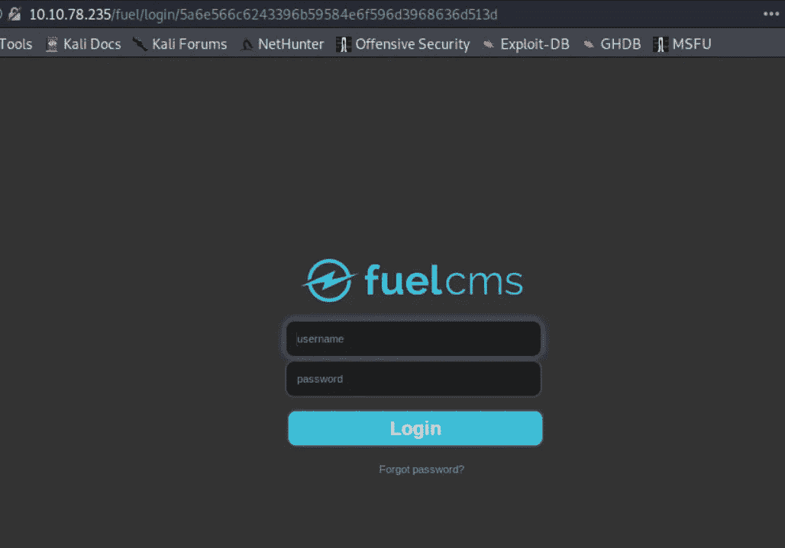

我们将看到一个登录提示，我们可以使用默认凭据登录 CMS。

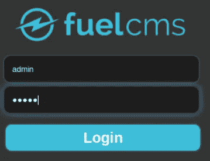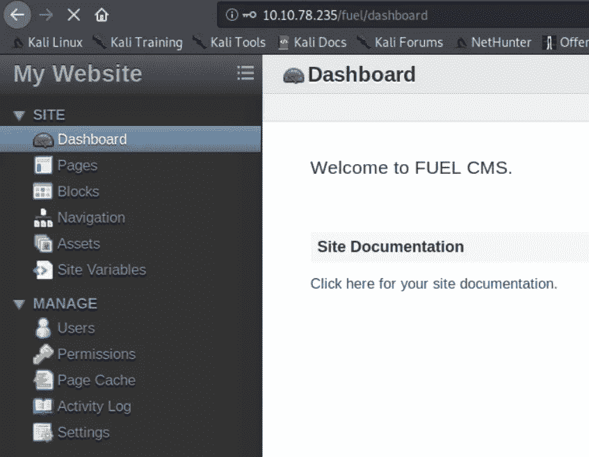

我们在 CMS 中，我们必须找到一种方法来上传一个反向外壳脚本，这可以从根本上帮助我们获得外壳上的盒子。视情况而定，有时有效，有时无效，但目标是不要停止尝试。

我们可以创建一个页面，在页面的底部，我们可以上传反向外壳脚本，并希望它绕过上传。

我对反向外壳的理解如下:

 [## pentest monkey/PHP-reverse-shell

### 此时您不能执行该操作。您已使用另一个标签页或窗口登录。您已在另一个选项卡中注销，或者…

github.com](https://github.com/pentestmonkey/php-reverse-shell) 

我们必须在上传之前修改脚本中的 IP 和端口值。

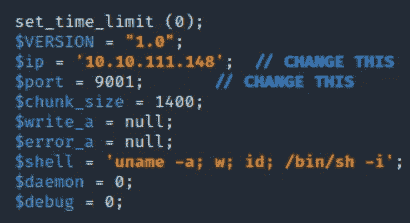

我们试试看，看能不能上传成功。

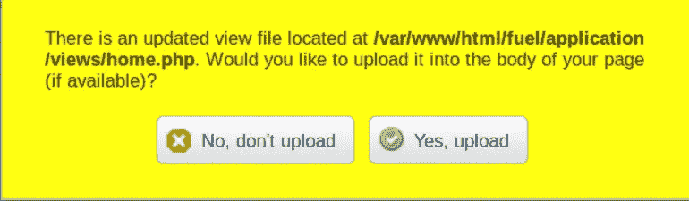

而且没有！！它不起作用。我们可以尝试使用不受欢迎的扩展，如 phtml、phtml5 等。为了绕过上传，但还是不行。没关系，我们总会找到进去的路。
CMS 可开发性怎么样？我们现在就能找到答案。

我们可以尝试使用“searchsploit”命令找到一个可用于 Fuel CMS 的漏洞。

> 此外，我们还可以使用 searchsploit 中的标志来检查和下载主机上的漏洞。
> searchsploit -m <利用路径> —下载
> searchsploit -x <利用路径> —检查

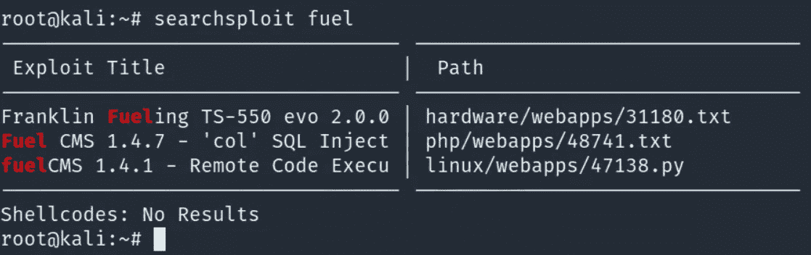

似乎有一个足够有趣的是燃料 CMS 1.41 远程代码执行。我们将使用-m 沿着漏洞利用路径下载漏洞利用。

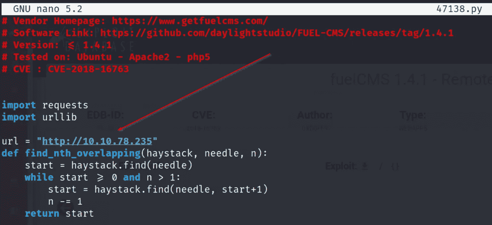

让我们使用 nano editor 修改漏洞，并将 URL 更改为目标机器 IP。
保存漏洞后，我们可以用 python 执行漏洞，看看是否有效。

太好了！！该漏洞成功地工作，我们得到了一个 cmd 提示符，我们可以在目标系统上输入或执行命令。

我们需要在目标系统上获得一个反向 shell，为此，我们只需转到 prentestmonkey 反向 shell 备忘单[下面的链接]，复制 netcat 反向 shell 命令，修改我们主机的 IP 和端口值。完成后，我们将在前面输入的命令中指定的端口上设置一个 netcat 监听器，并最终获得 shell。让我们轻松愉快地完成它。

 [## 反向外壳备忘单

### 如果你足够幸运，在渗透测试中发现了一个命令执行漏洞，不久之后…

pentestmonkey.net](http://pentestmonkey.net/cheat-sheet/shells/reverse-shell-cheat-sheet) 

目标机器上的 Netcat 反向 Shell 命令。

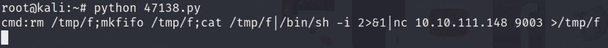

主机上的 Netcat 监听器

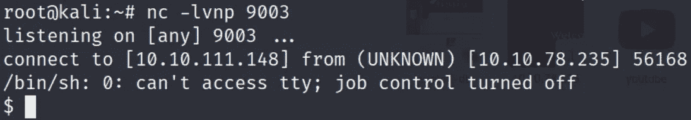

太棒了！！我们已经成功获得了外壳。但不是一个稳定的外壳。让我向您展示我们如何获得一个稳定的 shell，这实质上意味着您将能够非常容易地使用完整的功能导航 shell，如 ssh shell、清晰的屏幕、使用上下箭头键查看历史命令等。

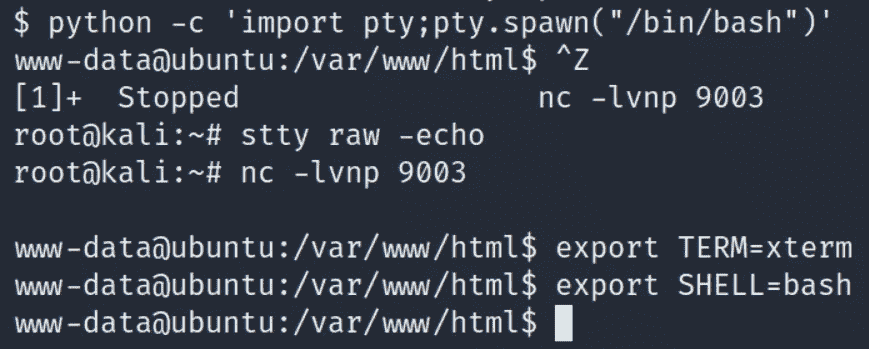

> python-c ' import pty；pty . spawn("/bin/bash ")'
> Ctrl+Z
> stty raw-echo
> fg
> export TERM = xterm
> export SHELL = bash

我们去找旗子吧。

干得好。提交标记，现在我们必须提升系统上的权限，以获得 root 访问权限并获得 root 标记。

一个建议是，通常 CMS 包含非常重要信息的配置文件，我们可以导航到存储在/var/www/html 中的配置文件，并尝试找到任何包含密码或任何重要信息的文件。如果我们找不到任何东西，那么我们可以运行我最喜欢的令人敬畏的自动枚举脚本 Linpeas 来发现特权提升的潜在攻击媒介。

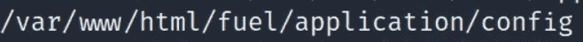

检查配置文件。

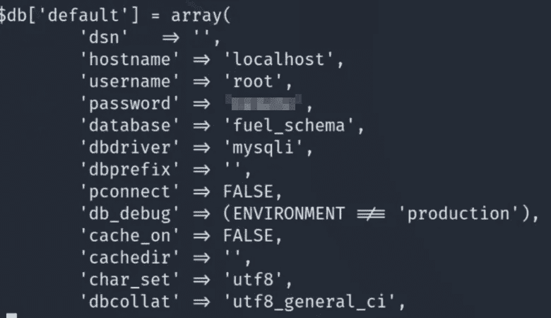

宏伟！！我们已经获得了 root 用户的密码，因此我们可以使用“su root”命令尝试以 root 用户身份登录。

插入我们获得的密码，然后按回车键。

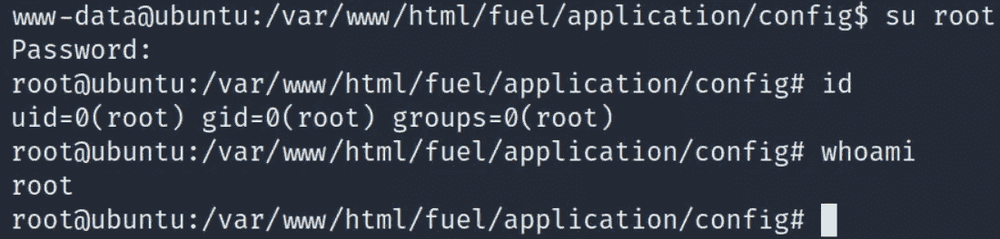

太棒了。！我们已经成功提升了权限，现在可以确认我们是 root 用户了。
夺取根旗，给这个盒子一个圆满的结局。

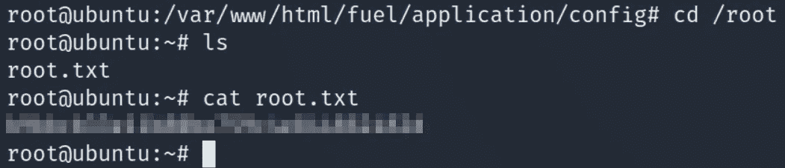

瞧啊。！提交根标志。

恭喜，我们已经完成了房间。这确实是一个有趣的盒子。我希望你在阅读它的时候有乐趣。

如果你喜欢这篇文章，并且这篇文章对你有所帮助，请在评论中告诉我，或者用掌声分享你的爱。

谢谢你抽出时间。

跟着我。

更多的报道正在进行中。

保重，注意安全，继续黑！

哈桑·谢赫