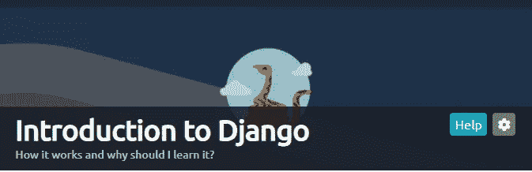
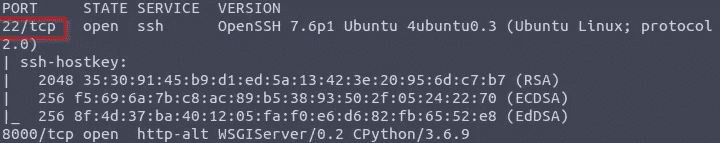
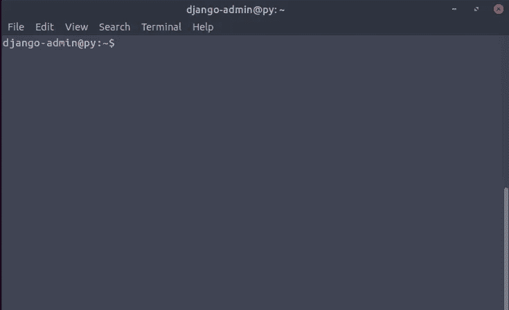
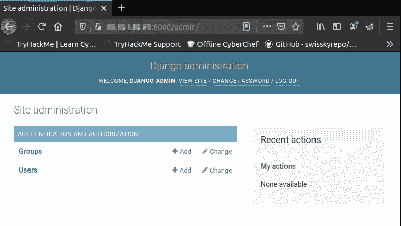
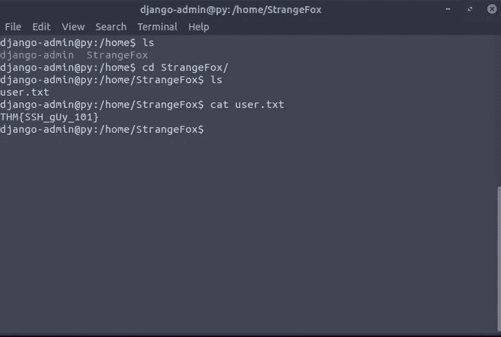
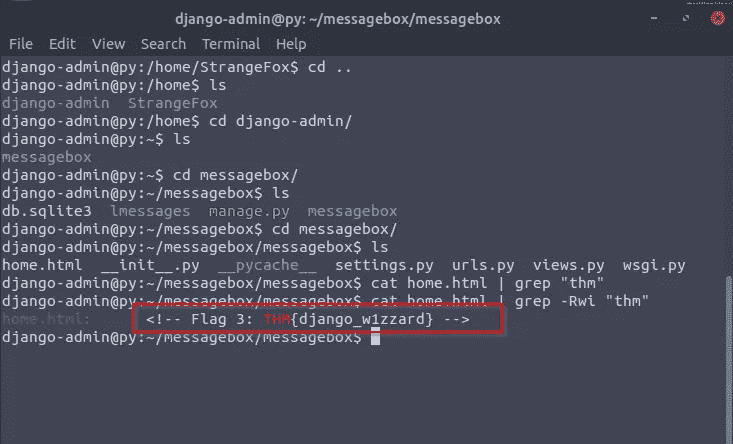

# TryHackme—Django 简介

> 原文：<https://infosecwriteups.com/tryhackme-introduction-to-django-e24893895c69?source=collection_archive---------0----------------------->

## 夺旗类游戏

你好，神奇的黑客们，在这个博客中，我们将看到一个基于 Django 框架的酷 CTF 挑战赛。不浪费任何时间让我们开始吧。

在这次挑战中，他们给了我一些证书。我想做一些 Nmap 扫描来检查哪些端口是打开的。

当我知道端口 22 和 8000 被打开后，我做了一个 Nmap 扫描。

所以我用提供给我的凭证进行 ssh 登录。

我通过 ssh 成功登录。

然后我继续挖掘，找到了第一个标志，在这个问题中，他们显示了管理面板的标志。我创建了一个超级用户。

然后我在浏览器中打开管理面板，在 settings.py 中包含目标 IP(允许的主机=[0.0.0.0，127.0.0.1，目标 IP])

然后我点击用户，它显示第一个标志。

## THM{DjanGO_Adm1n}

然后导航到 StrangeFox，你可以找到第二面旗帜。

## THM{SSH_gUy_101}

然后你会在 home.html 发现第三面旗帜

感谢你和我一起度过了阅读这篇文章的美好时光！！！