# TryHackMe-克诺比 CTF 写道(详细)

> 原文：<https://infosecwriteups.com/tryhackme-kenobi-ctf-writeup-detailed-e2efc2ec14f4?source=collection_archive---------1----------------------->

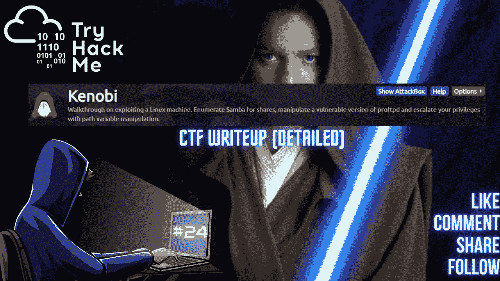

CTF 报道#24

欢迎各位！！我们将在 [TryHackMe](https://medium.com/u/dc49a0a3cb16?source=post_page-----e2efc2ec14f4--------------------------------) 上表演克诺比 CTF。
这个房间是进攻性测试学习路径的一部分，它将向您介绍 Samba、SMB 共享枚举、ProFTPD 操作、NFS 枚举、安装 NFS 驱动器、获得访问权限以及使用 SUID 二进制文件的路径变量的权限提升。这是一个超级有趣的房间。

CTF 链接:

 [## 肯诺比

### 利用 Linux 机器的演练。枚举 Samba for shares，操纵易受攻击的 proftpd 版本并…

tryhackme.com](https://tryhackme.com/room/kenobi) 

CTF 由以下作者创作:

 [## 试用版|试用版

### TryHackMe 是一个学习网络安全的在线平台，使用动手练习和实验室！

tryhackme.com](https://tryhackme.com/p/tryhackme) 

为您的 CTF 计算机创建一个目录，并为 Nmap 创建一个目录来存储您的 Nmap 扫描输出。

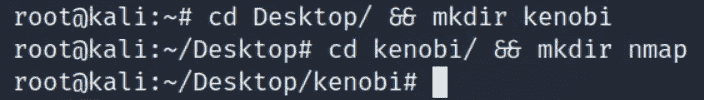

让我们开始吧！！享受流动吧！！

## 任务 1-部署易受攻击的机器:

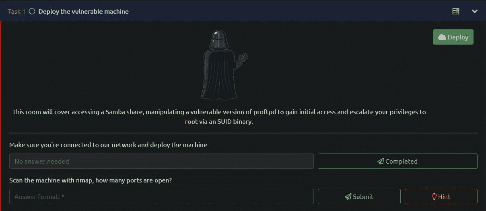

部署机器。最容易的任务😄。

> 确保你连接到我们的网络并部署机器
> 答:不需要回答

## Nmap 扫描:

> *nmap-sC-sV-p--在 nmap/克诺比上< TARGET_IP >*
> 
> -sC:默认脚本
> -sV:版本检测
> -oN:输出将存储在您之前创建的“nmap”目录中
> -p-:要扫描的所有端口

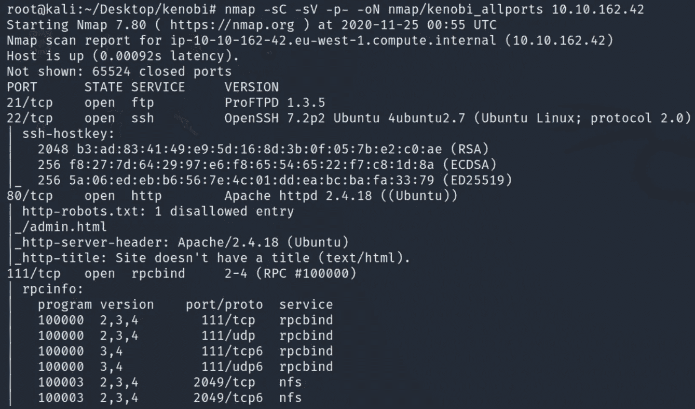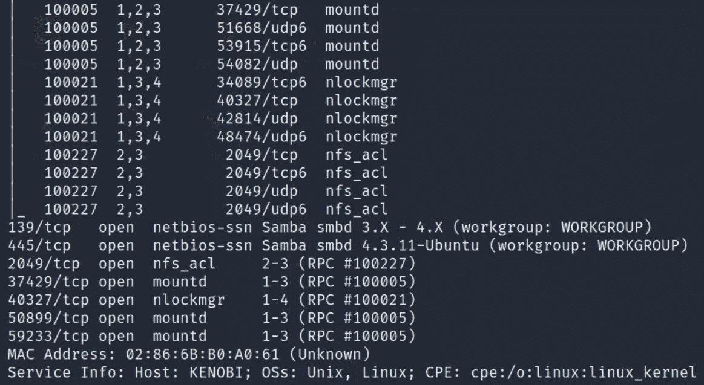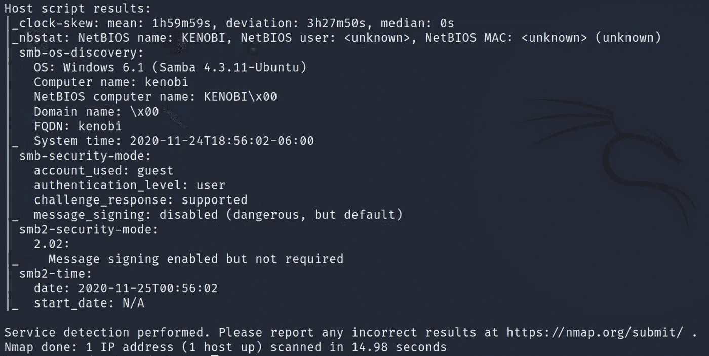

有 7 个端口打开:
21/FTP-ProFTPD 1 . 3 . 5
22/ssh-OpenSSH 7.2p 2
80/http-Apache httpd 2 . 4 . 18
111/rpcbind-2–4
139/SMB
445/SMB
2049/NFS

我们可以提交任务中问题的答案。

> 用 nmap 扫描机器，开了几个端口？
> 答:7

太棒了！！Ler 开始任务 2。

## 任务 2-为共享枚举 Samba:

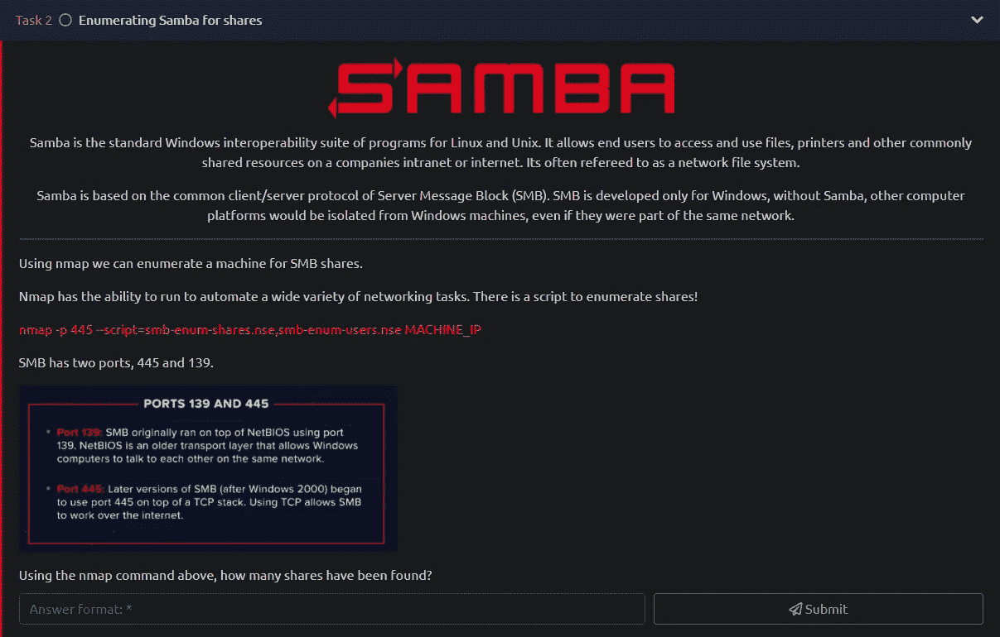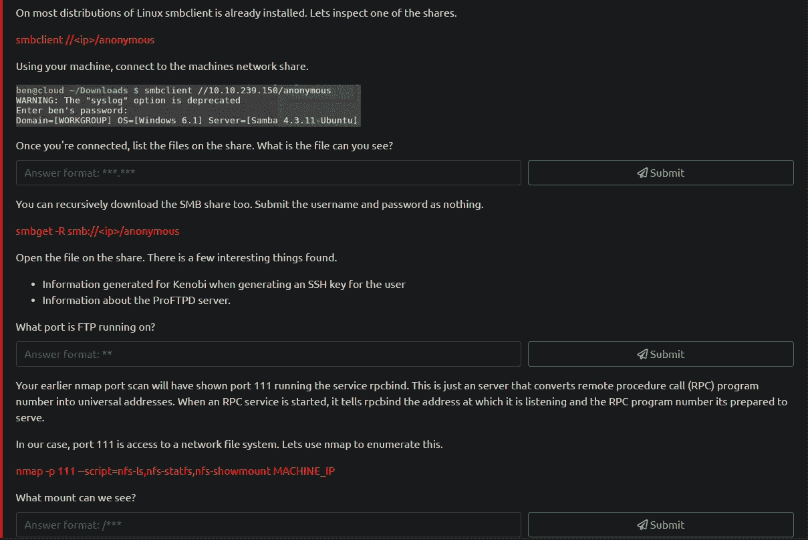

我们必须列举中小企业份额。我们可以用不同的方法来做。
按照提供的说明，我们可以使用脚本运行 Nmap 扫描，以枚举目标计算机上的 SMB 共享和用户。或者，我们也可以运行“Enum4linux ”,它会像魔咒一样工作。它将成功枚举 SMB 共享。为了你的理解，我可以展示两者。

> nmap-p 445—script = SMB-enum-shares，smb-enum-users<target_ip></target_ip>

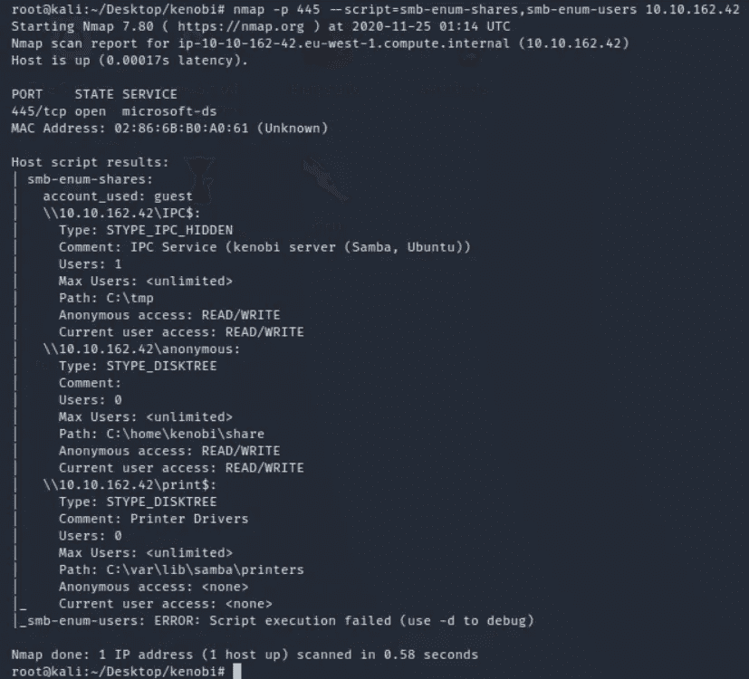

> enum4linux -a<target_ip></target_ip>

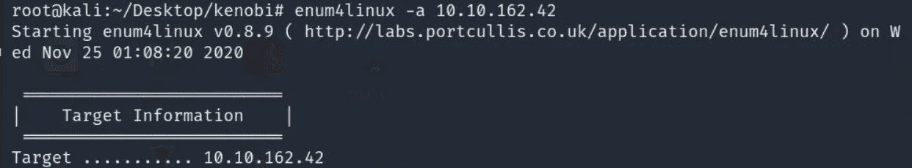

输出很长，因此我将包括下面的重要发现。

> 中小企业股份

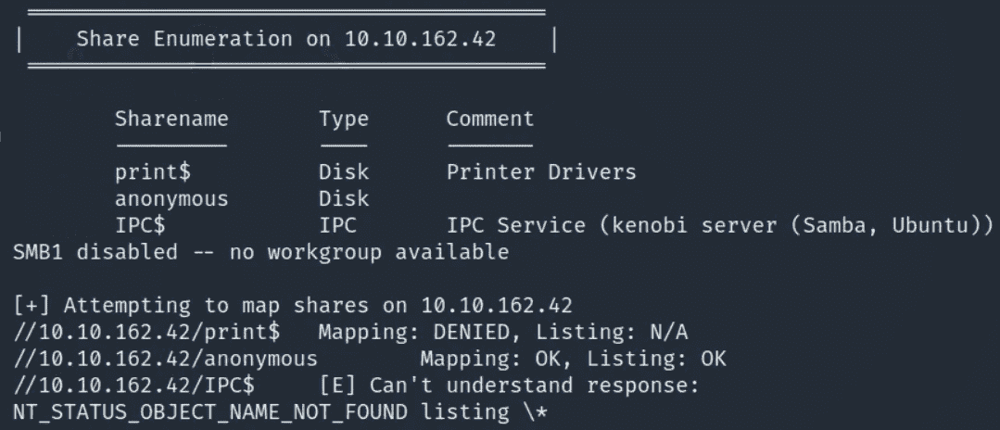

> 用户

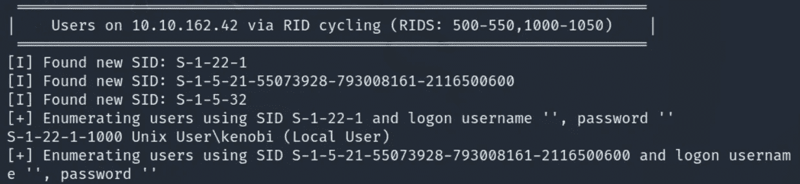

我们发现了 3 个 smb 共享“IPC$，anonymous，print$”和用户“克诺比”
提交答案。

> 使用上面的 nmap 命令，找到了多少个共享？
> 答案:3

我们将使用“smbclient”工具连接到匿名 SMB 共享并找到一些文件。如果发现任何错误，我们将使用“get”命令将它们转移到我们的主机上。

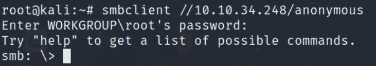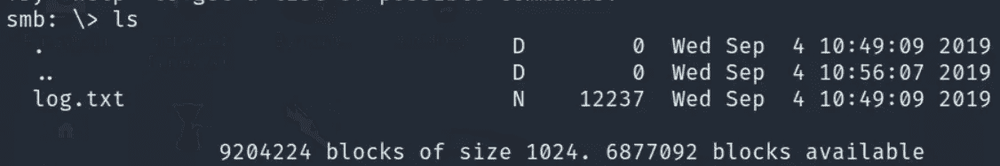

> 连接后，列出共享上的文件。你能看到什么文件？
> Ans: log.txt

我们可以用“get”命令把文件传送到主机上。

> 获取<file_name></file_name>

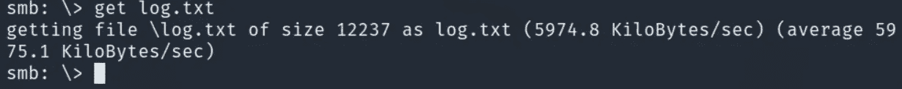

或者，您可以使用以下命令将共享转储到您的主机:

> smbget -R smb:// <target_ip>/<share_name></share_name></target_ip>

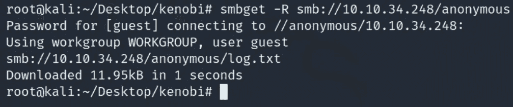

共享已成功转储到我们的主机。这是一种自动方式。早先是有点手动的方式。

> FTP 运行在哪个端口上？
> Ans: 21

在我们进入下一个任务之前，我们可以快速检查“log.txt”文件。

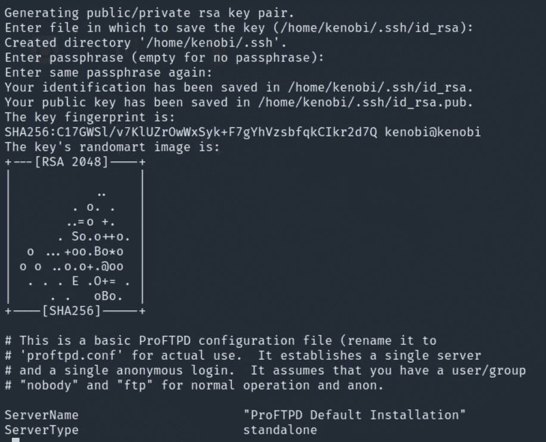

这是一个基本的 ProFTPD 配置文件，它包含可以访问服务器上 FTP 的“kenobi”用户。

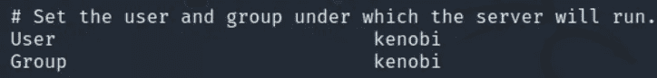

对于下一个任务，我们将使用脚本“nfs-ls，nfs-statfs，nfs-showmount”在端口 111 上使用 Nmap 扫描。

根据输出结果，我们将能够获得 NFS 山的名称。

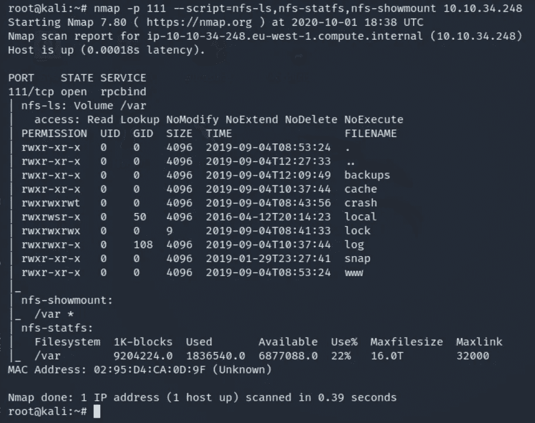

> 我们能看到什么山？
> Ans: /var

做得好！！开心吗？当然了。让我们进入下一个任务。

## 任务 3-通过 ProFtpd 获得初始访问权限:

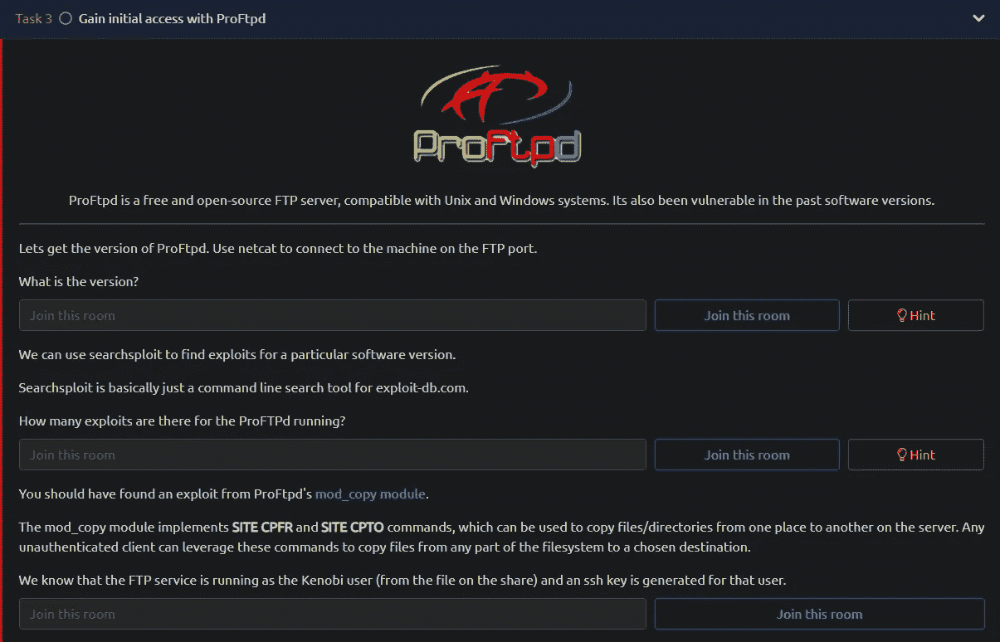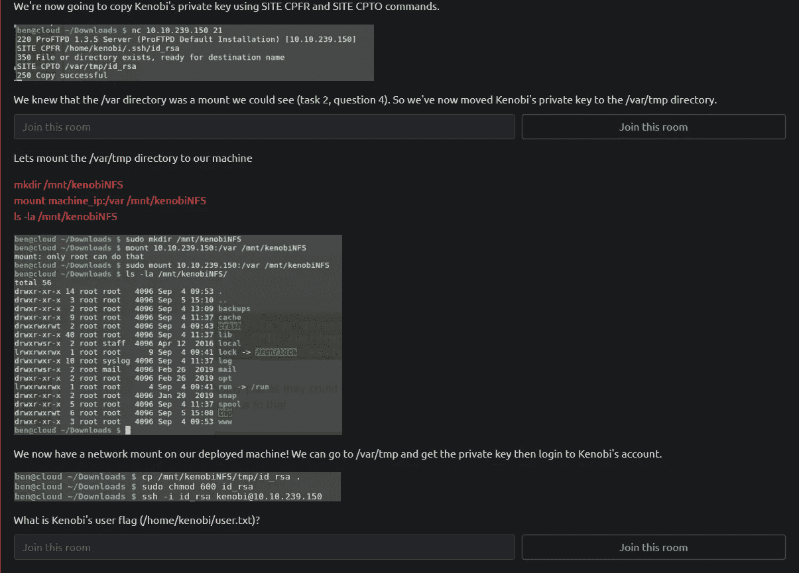

如果您还记得，我们通过使用默认脚本和版本枚举在所有端口上进行的 Nmap 扫描获得了版本号。然而，我们也可以通过使用 netcat 简单地连接到机器上的端口来找到版本。

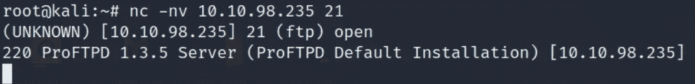

> 版本是什么？
> 答:1.3.5

我们将使用“searchsploit”命令来查找 ProFTPD 版本 1.3.5 中的漏洞。

> searchsploit proftpd 1.3.5

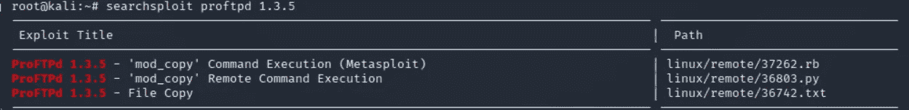

发现了三个漏洞，我们将通过以下命令检查“36742.txt”漏洞:

> searchsploit -x 34742.txt

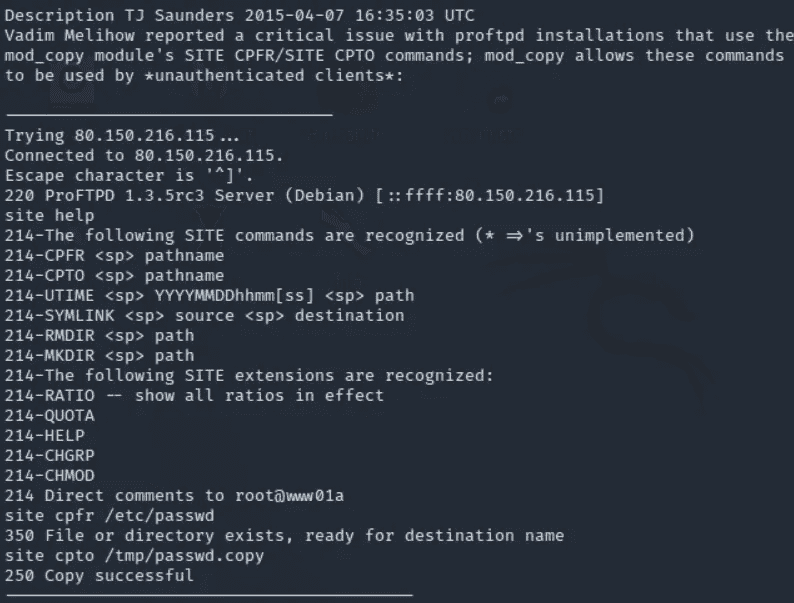

在上面的屏幕截图中，我们有一些无需认证就可以使用的命令。

mod_copy 模块实现了**站点 CPFR** 和**站点 CPTO** 命令，这些命令可以用来将文件/目录从服务器上的一个地方复制到另一个地方。任何未经身份验证的客户端都可以利用这些命令将文件从文件系统的任何部分复制到选定的目的地。

> 我们知道 FTP 服务是作为 Kenobi 用户运行的(从共享上的文件中),并且为该用户生成了一个 ssh 密钥。答:不需要回答

我们将重新连接到目标计算机上的 FTP 服务。连接完成后，我们将发出以下命令:

> 网站 CPFR <source_path>CPFR——复制自</source_path>
> 
> 站点 CPTO <destination_path>CPTO-复制到</destination_path>

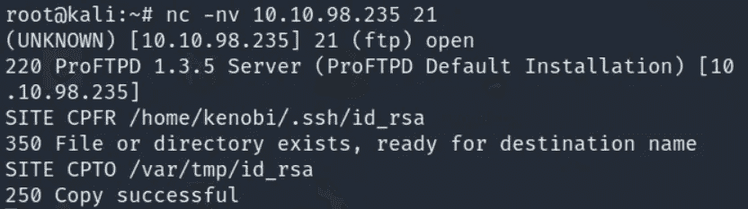

> 我们知道/var 目录是我们可以看到的挂载(任务 2，问题 4)。所以我们现在已经把克诺比的私钥移到了/var/tmp 目录。
> 答:不需要回答。

我们已经成功地将用户“kenobi”的“id_rsa”文件从其主目录复制到“/var/tmp”中。

现在我们需要将/var 挂载到我们的主机上。

首先，我们将在/mnt 中创建一个“kenobiNFS”目录。

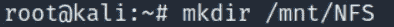

接下来，我们将使用“sudo mount”命令将/var 从目标计算机挂载到我们的主机上。

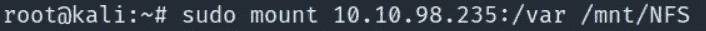

使用' ls -la '列出所有文件，包括隐藏文件。

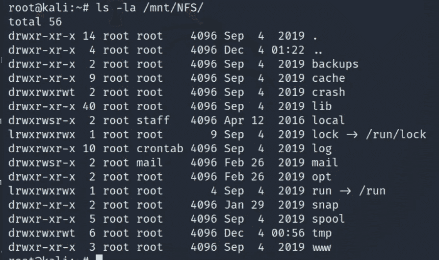

我们知道我们将' id_rsa '复制到了'/var/tmp '目录。导航到/tmp 并找到“id_rsa”。

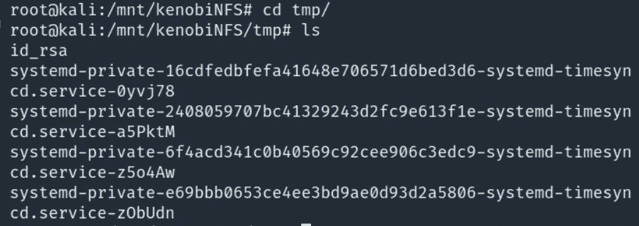

使用密钥作为用户“kenobi”连接到 SSH。手指交叉！

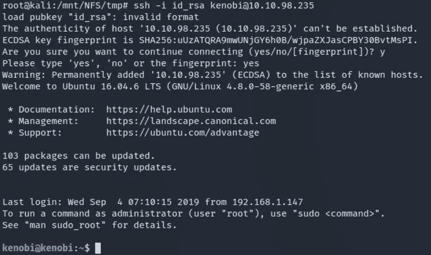

太棒了。
我们已经成功获得了外壳。
让我们捕获 user.flag 并提交它。

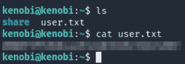

> 克诺比的用户标志(/home/kenobi/user.txt)是什么？
> 答:xxxxxxxxxxxxxxxxxxxxxxxxxxx

太棒了！！进入下一个任务。

## 任务 4-通过路径变量操作提升权限:

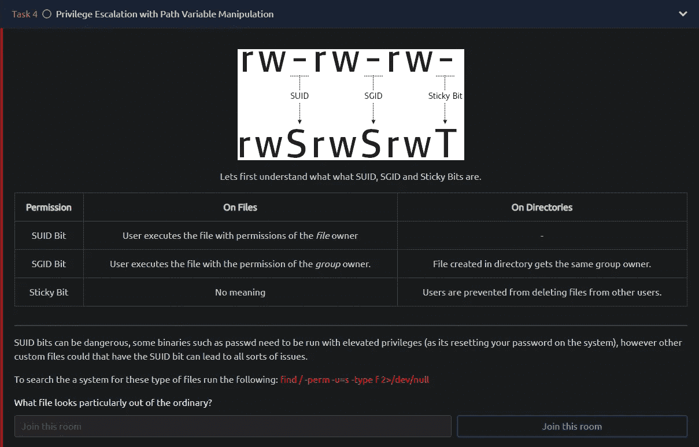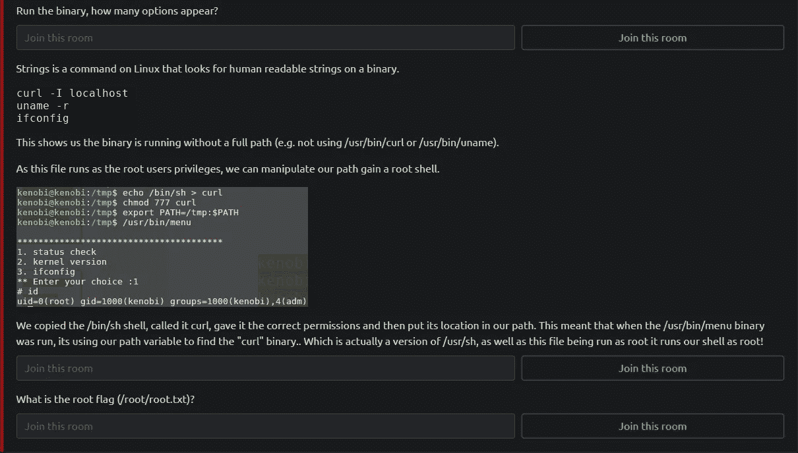

我们需要提升机器上的权限以成为 root，捕获 root 标志并给这个机器一个美好的结局。

我们可以在拥有超级用户权限的文件系统上找到文件和二进制文件。由于许多文件显示错误，输出会很长，因此我们也可以使用' 2>/dev/null '来抑制错误。

> find/-type f-perm-u = s 2 >/dev/null

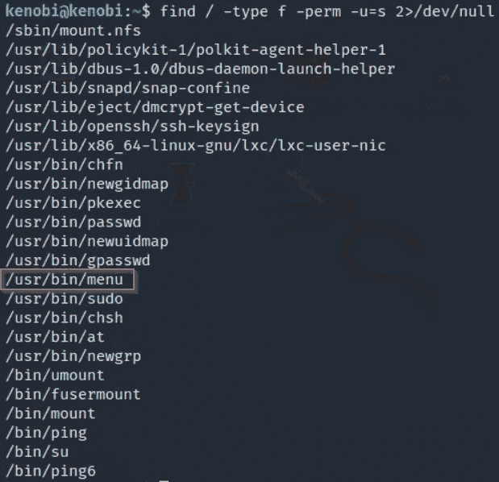

二进制文件“/usr/bin/menu”看起来很奇怪，你可能也注意到了。

> 什么文件看起来特别与众不同？|
> Ans: /usr/bin/menu

的确，这是不寻常的。

我们需要运行二进制文件。就这么办吧。

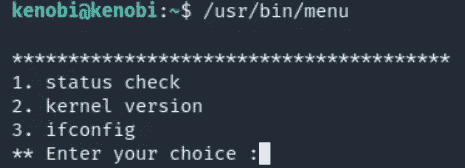

有 3 个选项和下一个问题的答案。提交吧。

> 运行二进制，出现多少个选项？
> 答案:3

“Strings”是一个非常棒的命令，它可以将文件或二进制文件中的数据转换成人类可读的字符串格式。我们可以在二进制文件“usr/bin/menu”上使用“字符串”

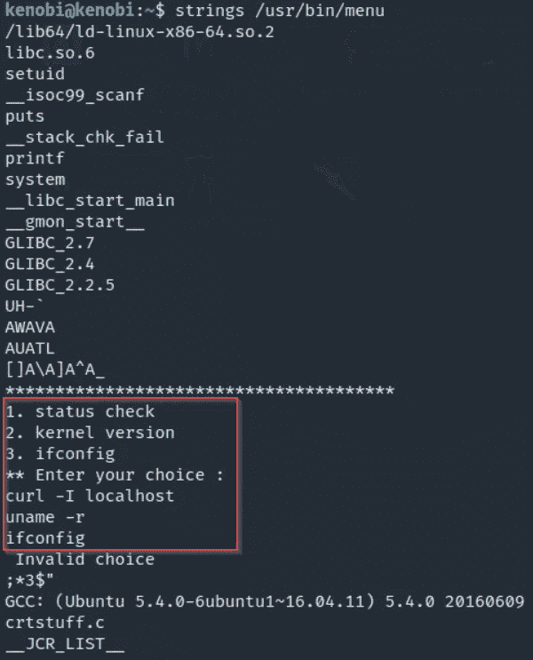

我们可以注意到，二进制文件在没有完整路径的情况下运行命令，例如/usr/bin/curl 或/usr/bin/uname。导航到/tmp 目录

复制“/bin/sh”文件，并将其命名为 curl。

授予文件的所有权限，即 777 [-rwxrwxrwx]

在 PATH 变量中设置位置。

执行二进制文件。

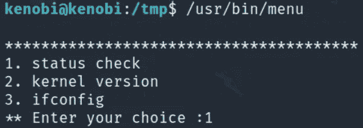

输入您的选择“1”并按回车键。

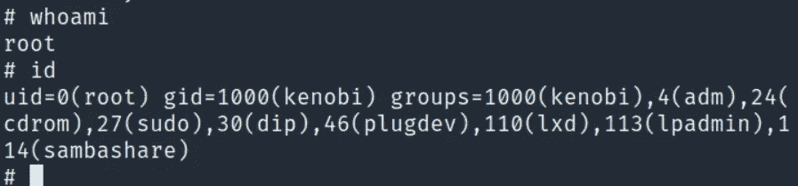

瞧啊。
我们已经成功升级权限！
我们现在可以确认我们是 root 了！

> 我们复制了/bin/sh shell，将其命名为 curl，赋予它正确的权限，然后将其位置放在我们的路径中。这意味着当/usr/bin/menu 二进制文件运行时，它使用我们的 path 变量来查找“curl”二进制文件..它实际上是/usr/sh 的一个版本，并且这个文件以 root 用户身份运行，它以 root 用户身份运行我们的 shell！
> 答:不需要回答。

让我们抓住根旗。

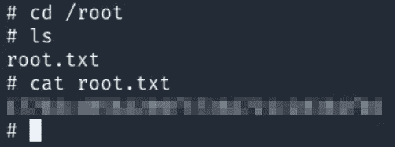

太棒了。！
提交。

> 什么是根标志(/root/root.txt)？
> 答:xxxxxxxxxxxxxxxxxxxxxxxxxxx

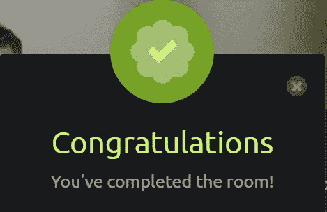

我们已经完成了房间。我真的很喜欢这个房间，并从中获得了很多乐趣。我会建议每个人都尝试一下这个房间，我相信你会学到一些新的东西。

如果你喜欢这篇文章，并且这篇文章对你有所帮助，请在评论中告诉我，或者用掌声分享你的爱。

谢谢你抽出时间。

跟着我。

更多的报道正在进行中。

保重，注意安全，继续黑！

**-哈桑·谢赫**