# TryHackMe: LazyAdmin

> 原文：<https://infosecwriteups.com/tryhackme-lazyadmin-9441e1240cb7?source=collection_archive---------4----------------------->

## 走查

# 介绍

你好，绅士！！这次我从 Tryhackme 告诉你如何解决**懒 Admin** 。所以，事不宜迟，让我们利用。

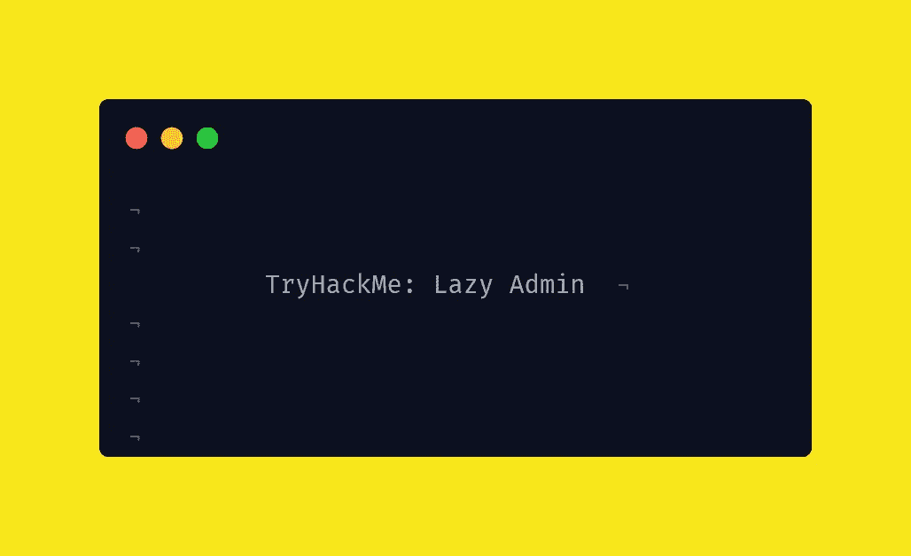

# 首字母

```
nmap -sC -sV $IP 
```

nmap 扫描后，发现端口 80 是打开的。访问网站后:

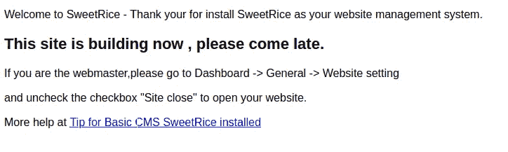

用 **gobuster** 运行目录搜索，我们找到了 **/content/inc**

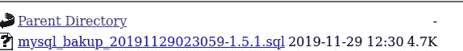

下载文件并获得密码**哈希:**

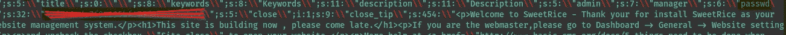

以 **hashcat** 和 **rockyou.txt** 为字表破解密码，得到密码


我们在 **/content/as** 找到了登录面板，以管理员身份登录并获得了 CMS 管理仪表板

# 利用:

登录后，我们发现有一个可以添加代码的部分

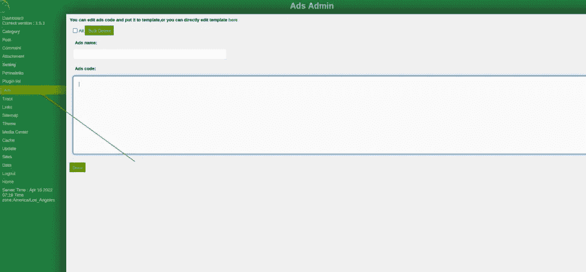

添加了 php 反向外壳代码并添加了文件名为**reverse.php**

我们可以在 **/content/inc/ads** 获取代码

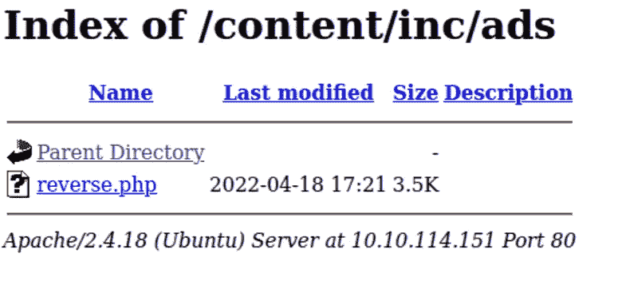

启动**监听器**并运行**反向 shell** 获取 shell。

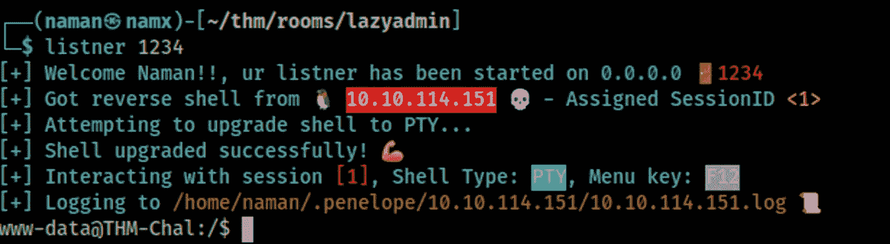

现在轮到鲁特·:D 了

有一个兔子洞，里面有包含 mysql 凭证的文件。但是除了兔子洞之外，我们发现用户可以使用 root 权限运行一个命令。

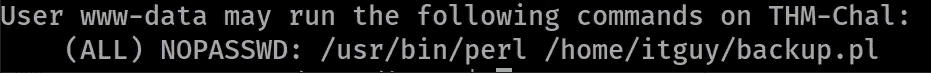

检查 backup.pl 文件

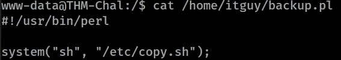

它运行一个 bash 脚本。检查了 shell 脚本


这是一个反向 shell 代码，该用户拥有对该文件的写权限。

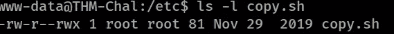

更改了文件的内容

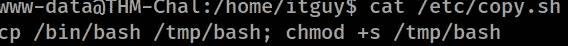

> 这条线会做什么？
> 这会将本地的 **/bin/bash** 文件复制到 **/tmp** 中，并给予 **SUID 权限**，这样我们就可以以**根**的身份运行 **/tmp/bash** 文件

运行命令以获得 SUID 权限，然后执行 bash 文件以获得根目录

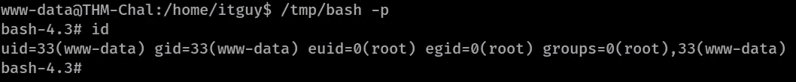

# 结尾部分

我们完成了这个房间，我们将在下一个房间见面。到那时，**快乐黑客** o7

|| [房间](https://tryhackme.com/room/lazyadmin) || [推特](https://twitter.com/namx05) ||