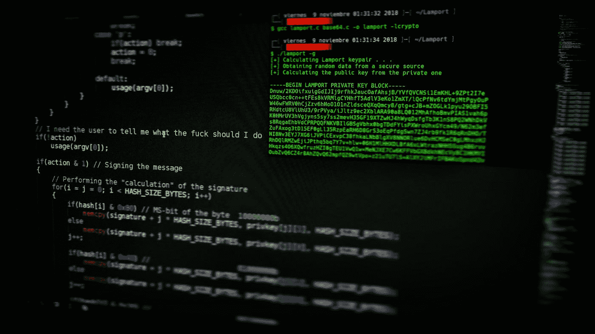
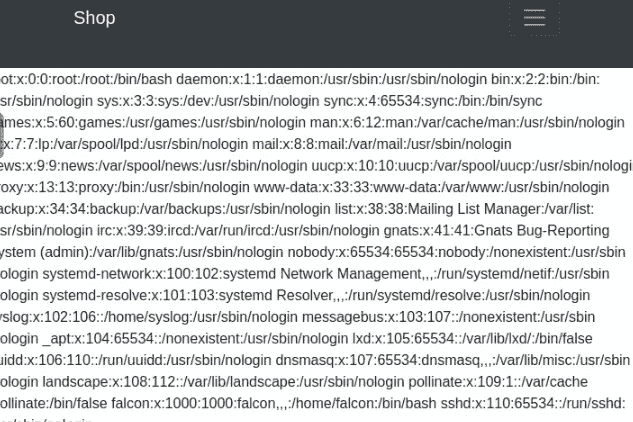
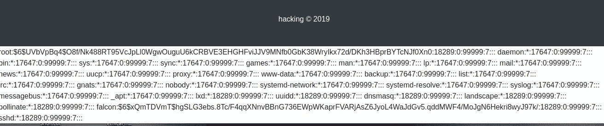
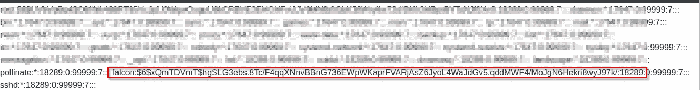
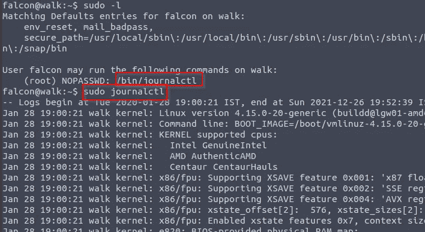
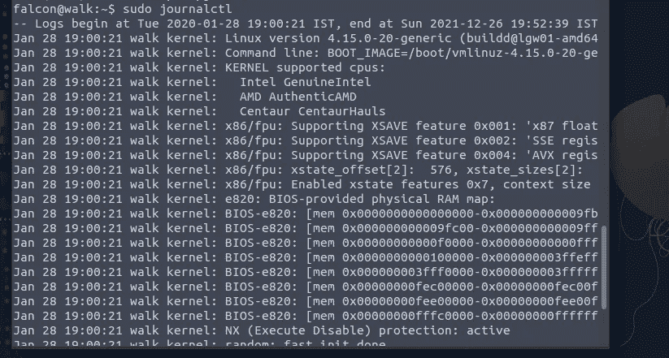
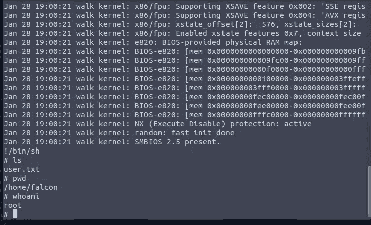
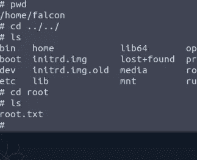

# TryHackme LFI 报道

> 原文：<https://infosecwriteups.com/tryhackme-lfi-writeup-a3fff2fb5009?source=collection_archive---------1----------------------->

## 如何发现和开发 LFI

欢迎回到酷炫的黑客博客，我将向你展示一个有趣的话题本地文件包含 Tryhackme 演练。不浪费时间，让我们进入主题。

部署目标机器后，我看到了目标网页。

我得到了一个端点**？由此，我得出结论，这可能是一个易受攻击的参数。**

**？文件=../../../../etc/passwd** 用于查看密码文件，如果它对攻击者可见，会导致密码文件的敏感泄露。

我输入了 **passwd** ，它给出了结果，然后它容易受到本地文件包含的攻击。

我开始知道这里泄露了用户名列表。falcon 是名字泄露出去的用户之一。

为了找到用户的密码，我们需要寻找 **/etc/shadow** 文件。

然后每个哈希格式的密码文件我们都要解密才能得到用户密码。对于猎鹰，我们哈希

哈希格式以$6$……开头。)这种格式。在 hashcat 模式的帮助下，我们知道它在 shacrypt 中。

要解码这个 Shacrypt，我们使用以下命令:

> **hashcat-m 1800 hash . txt rock you . txt**

然后，您将获得这种散列类型的密码。

然后，是时候使用登录到 falcon id

终于找到密码的 ssh falcon@target_ip。

然后就可以看到 falcon 账号里的 user.txt 文件了。

下一个任务是找到 root.txt 文件，为此我们必须提升 root 权限。

我在终端中键入**“sudo-l”**，它给出了 **journalctl 作为提示。**

journalctl —可用于查询 systemd(1)的内容。

然后在 GTFO·宾斯的帮助下，我们可以升级为 root。

这就是我们如何以 root 身份进入目标机器的方法。最后，我们拿到了根旗。

