# TryHackMe- Lian_Yu 详细报道

> 原文：<https://infosecwriteups.com/tryhackme-lian-yu-ctf-writeup-detailed-7c229b1904fd?source=collection_archive---------0----------------------->

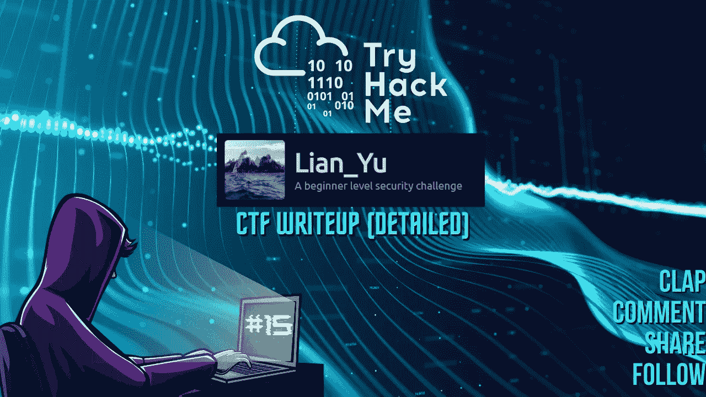

CTF 报道#15

欢迎各位！！我们将在[尝试黑客](https://medium.com/u/dc49a0a3cb16?source=post_page-----7c229b1904fd--------------------------------)做《良玉 CTF》。这是一个初级安全 CTF 室和箭头主题的 CTF。《绿箭》是一部基于 DC 漫画角色绿箭的美国超级英雄电视剧。

 [## TryHackMe |连 _ 玉

### TryHackMe 是一个学习和教授网络安全的在线平台，全部通过您的浏览器完成。

tryhackme.com](https://tryhackme.com/room/lianyu) 

在桌面上为您的 CTF 计算机创建一个目录，并在 CTF 目录中为 Nmap 创建一个目录。

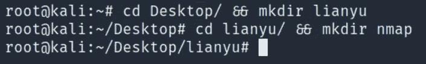

让我们开始吧！！享受流动吧！！

## 任务 1-找到旗帜:

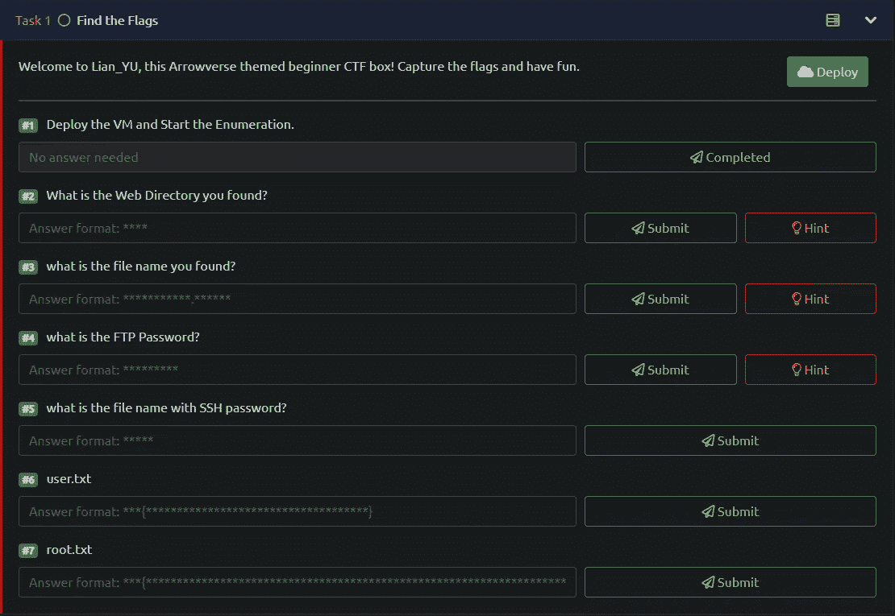

任务列表

最简单的任务。😄。部署机器。

> #1.部署虚拟机并启动枚举。
> 答:不需要回答。

## Nmap 扫描:

> nmap-sC-sV-p--关于 nmap/玉莲<target_ip></target_ip>
> 
> -sC:默认脚本
> -sV:版本检测
> -p-:扫描所有端口
> -oN:输出将存储在您之前创建的目录“nmap”中

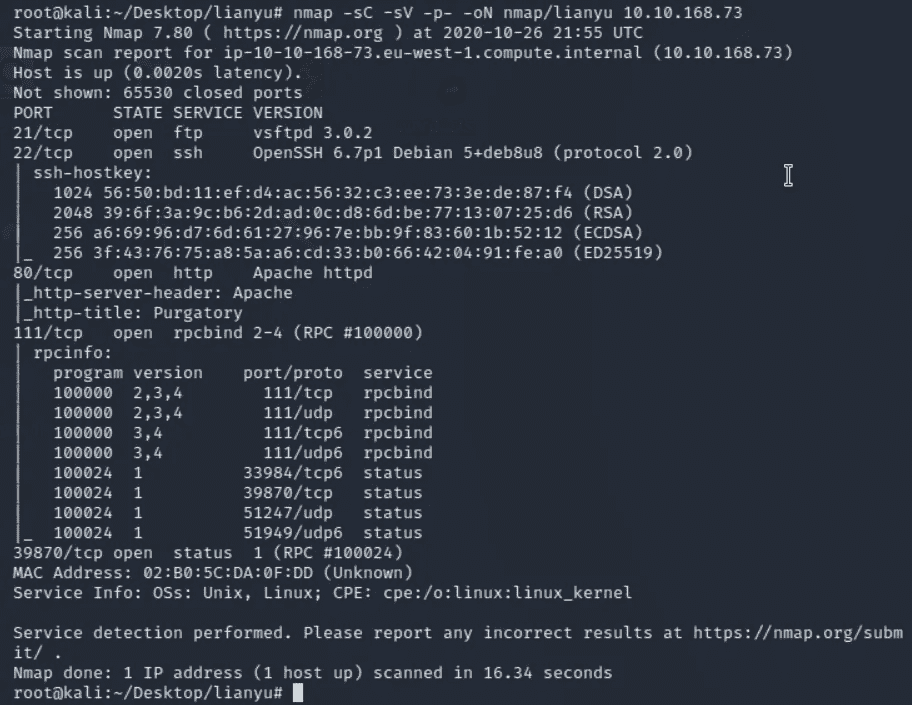

有 5 个端口打开:
21/ssh-OpenSSH 7.2 p2
22/http-guni corn 19 . 7 . 1
80/http-Apache httpd
111/rpcbind
39870/未知但打开
检测到 OS-Linux

## Gobuster:

> gobuster dir-u http://<target_ip>-w<path_to_wordlist>-o<output_file_name>-x</output_file_name></path_to_wordlist></target_ip>
> 
> -u : URL
> -w:单词列表
> -o:输出将存储在目录
> -x:搜索扩展名，例如 html、txt、php、phtml 等。

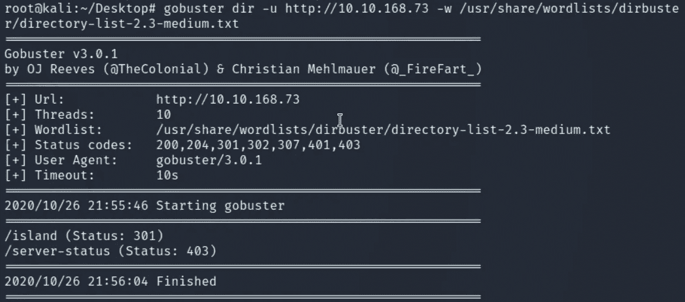

导航到 http://<target_ip></target_ip>

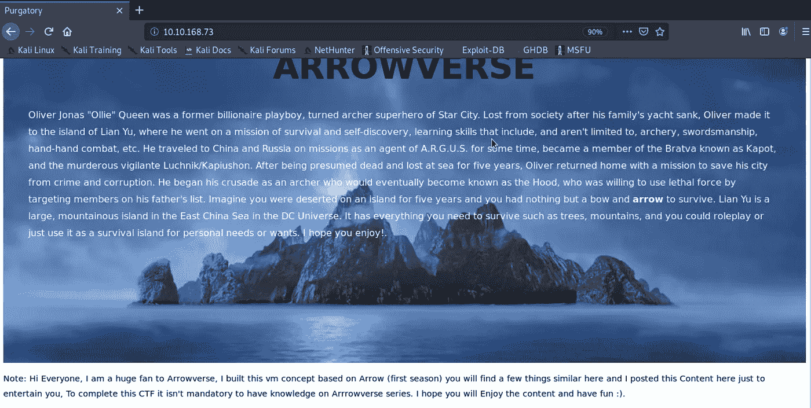

检查页面的源代码是否有隐藏的注释总是好的。查看 URL 页的源代码。

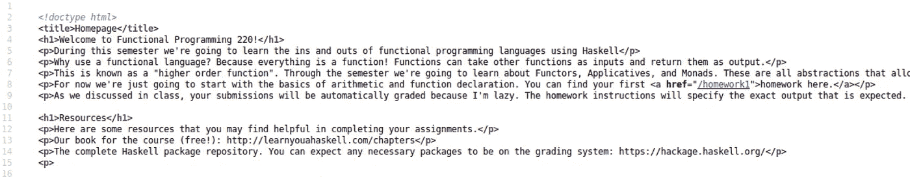

导航到 http:// <target_ip>/island</target_ip>

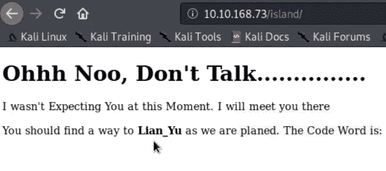

暗号是:………。突出显示文本，我们会看到单词“义警”。会是什么呢？我们最终会发现的。让我们继续列举。

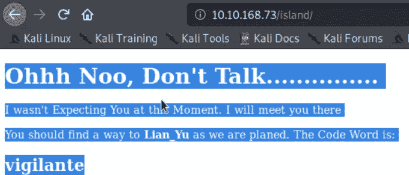

我们可以在“岛”目录上启动 gobuster。

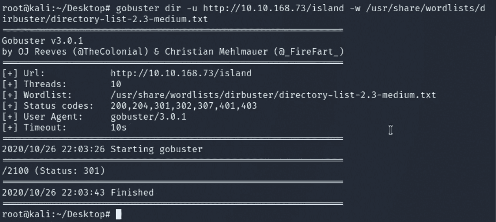

是的，有一个目录和任务的答案。

> #2.你找到的网页目录是什么？
> Ans: 2100

导航到 http:// <target_ip>/island/2100</target_ip>

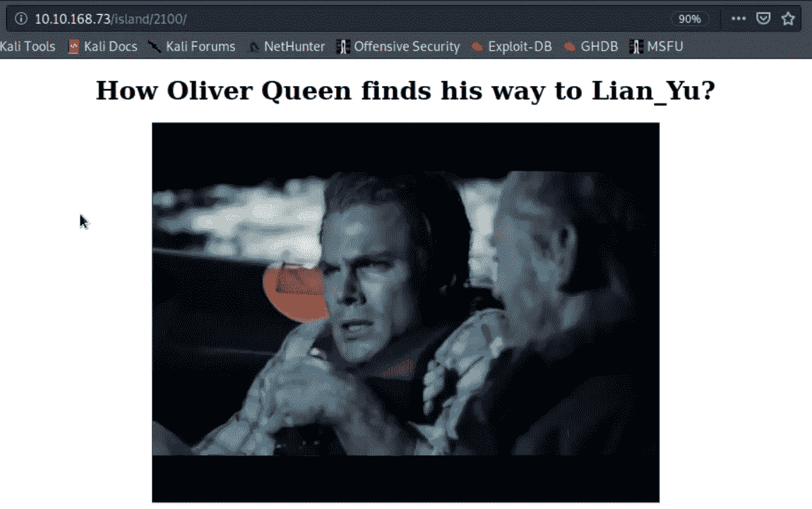

检查页面的源代码。

嗯，看起来有些文件被用作扩展名。ticket。在这个目录中再进行一次 gobuster 扫描怎么样，但这次我们将添加扩展名。要专门搜索的“票证”。也许我们得到了我们想要的。

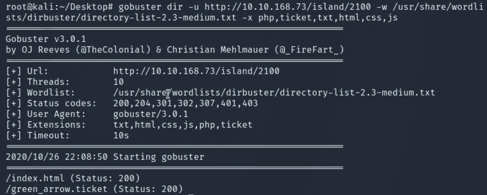

这就是我们对这项任务的答案。

> #3.你找到的文件名是什么？
> 答:XXXXXXXXXXXXX

导航到 http://<target_ip>/island/2100/XXXXXX . ticket</target_ip>

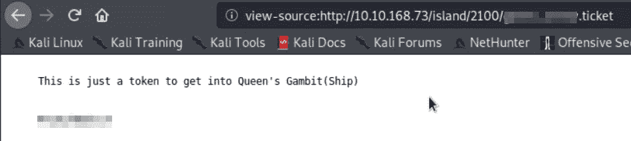

干得好。我们发现了一个能让我们进入女王号的杂凑。我们可以分析或识别散列。

 [## 哈希分析器

### 5 F4 DC C3 b5 aa 765d 61d 8327 deb 882 cf 99 MD5 5 baa 61 e 4c 9 b 93 F3 f 0682250 B6 cf 8331 b7ee 68 FD 8 SHA1…

www.tunnelsup.com](https://www.tunnelsup.com/hash-analyzer/) 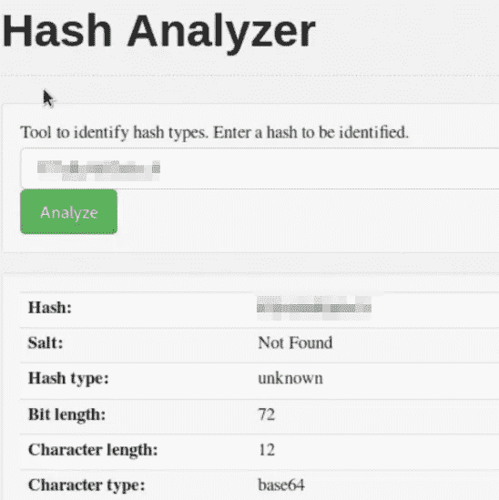

看起来哈希是 base 编码的，但肯定不是 base64。

我们可以去赛博咖啡馆解码。

 [## 网络咖啡馆

### 网络瑞士军刀-一个用于加密、编码、压缩和数据分析的网络应用程序

gchq.github.io](https://gchq.github.io/CyberChef/) 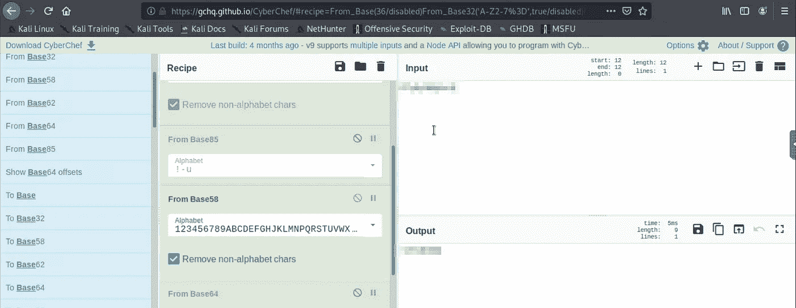

我试着解码所有类型的基本格式的散列，Base58 确实有效，成功地解码了散列，它是 FTP 的密码。

> #4.FTP 密码是什么？
> 答:XXXXXXXXX

让我们用获得的凭证登录 FTP。
回想一下代码字是 vigilante，我们可以用它作为用户名和上一个任务中的密码。

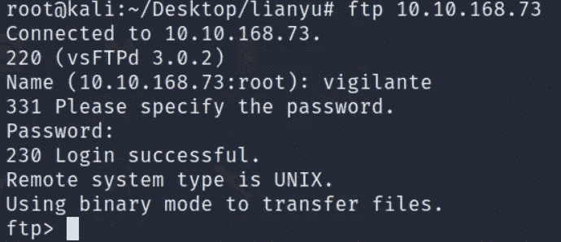

太棒了！！让我们检查文件。

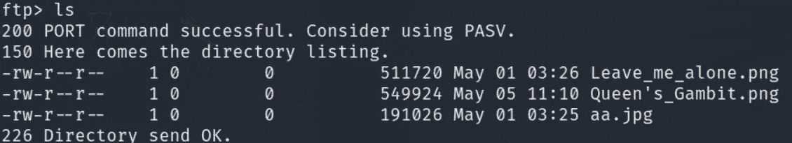

我们需要将这些文件传送到主机上进行检查。我们可以使用' mget * '命令将 FTP 中的所有文件下载到您的主机上。一般来说，如果你想下载一个文件，那么使用“获取<file_name>命令。</file_name>

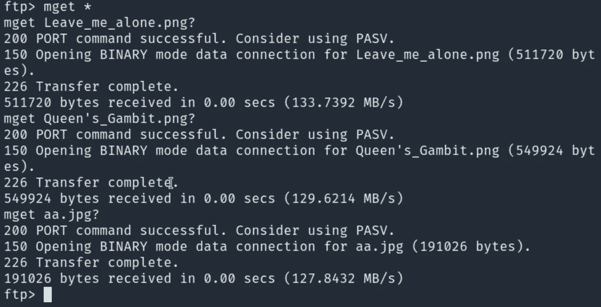

非常重要的是，当你在 FTP 中时，你应该在离开前寻找隐藏的文件。

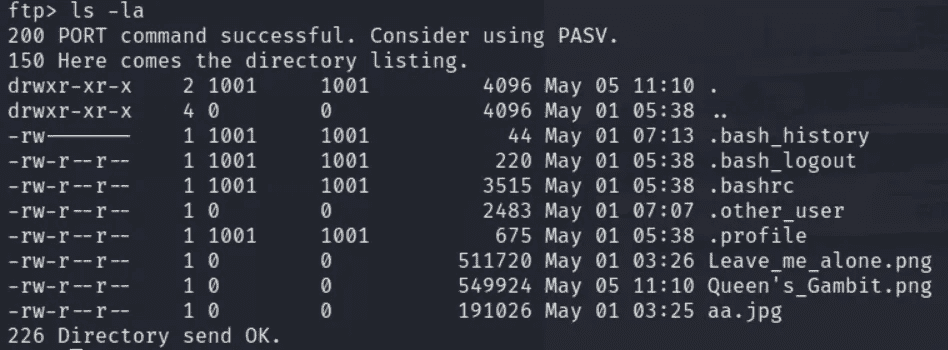

有趣的是有一个隐藏的文件。“其他 _ 用户”。我们也会抓住那个。

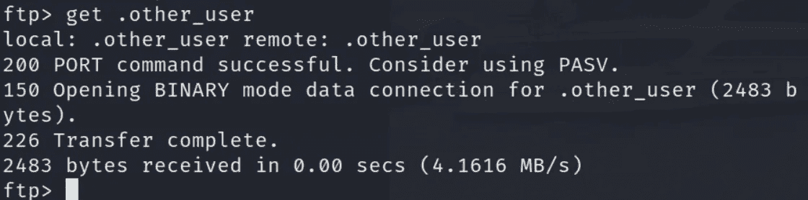

现在我们已经下载了文件，我们需要检查它们。

> 。其他 _ 用户

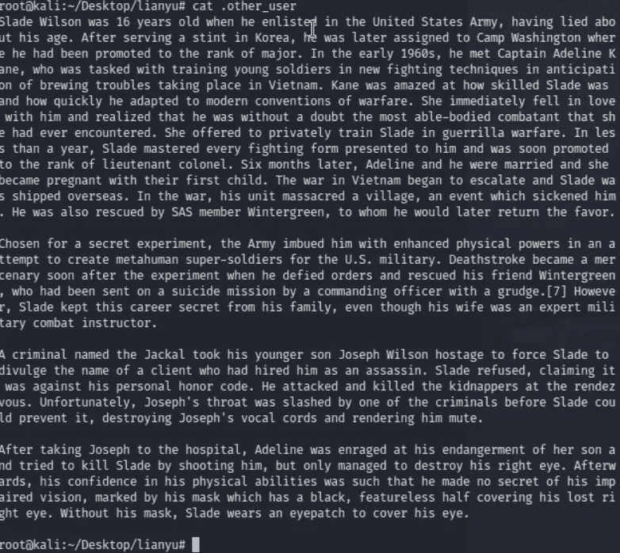

这是一个很长的叙述，但我们对便条中提到的名字感到担忧。文件名也表明其他用户的名字在这里。通读它，我们可以注意到笔记主要是关于斯莱德·威尔逊。我们可以把这份文件留作日后参考。让我们继续列举。

> 别管我. png

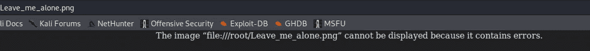

图像文件包含错误，我们无法执行它或查看其内容。图像文件损坏的原因是由于不正确的文件签名。我们必须根据扩展名类型正确修改文件签名。因此，文件扩展名

 [## 文件签名列表

### 许多文件格式不适合作为文本阅读。如果这样的文件被意外地视为文本文件，其…

en.wikipedia.org](https://en.wikipedia.org/wiki/List_of_file_signatures) 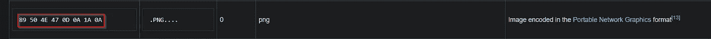

png 文件应该具有上述文件签名。让我们使用“hexeditor”命令检查图像文件的文件签名。

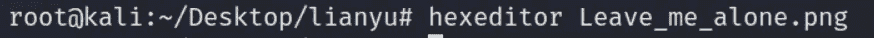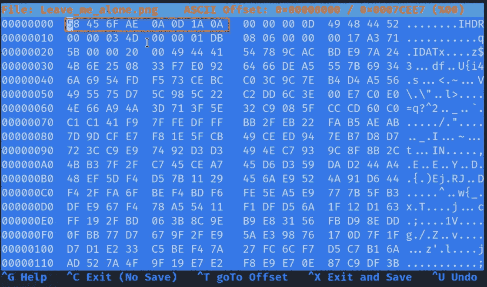

你可能也注意到了，它们不相配。我们来搭配一下。

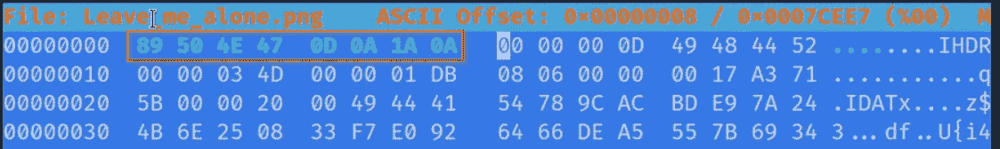

保存它[Ctrl+O]，退出编辑器[Ctrl+X]，然后看看我们是否能无错地执行文件。

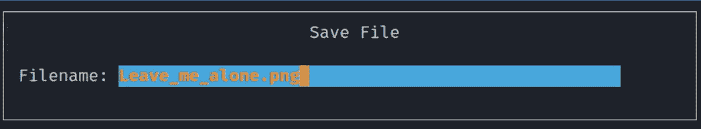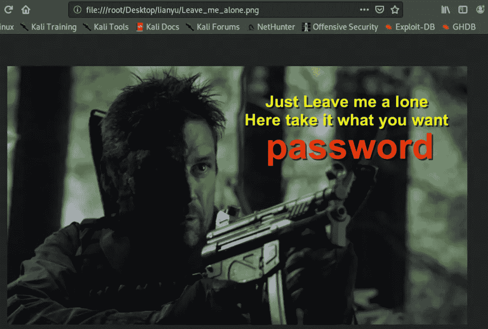

干得好！！成功了。看起来密码就藏在这张图片里

> queen _ gambit . png

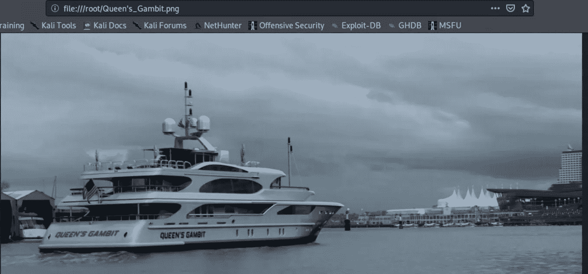

我们可以执行图像并查看其内容，因此文件签名没有问题。我们不能对 png 文件使用 steghide 工具，只能对 jpg/jpeg 文件使用。我们会保存它，如果有必要的话会回来看的。

> aa.jpg

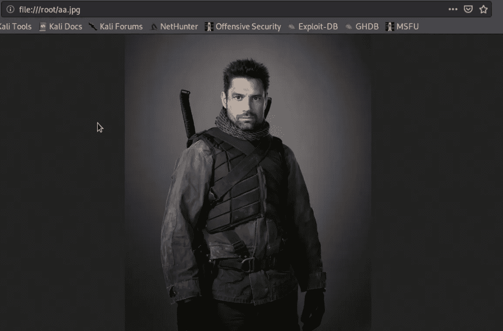

我们可以使用我的 go-to steg 工具从图像文件中提取文件或信息，在提示提交密码时，我们可以使用“password”作为密码。我们之前修复的映像有一个密码，即“密码”。希望有用。

> 隐写提取物-sf<file_name></file_name>

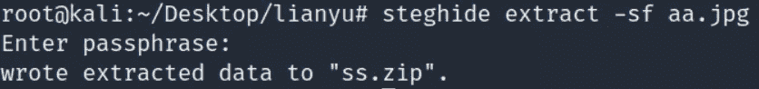

太棒了，它确实起作用了。提取了一个“ss.zip”文件。我们需要拉开拉链。

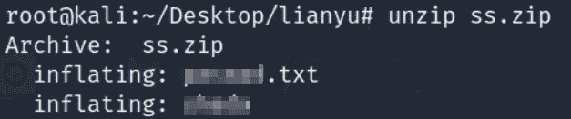

两个文件被提取。

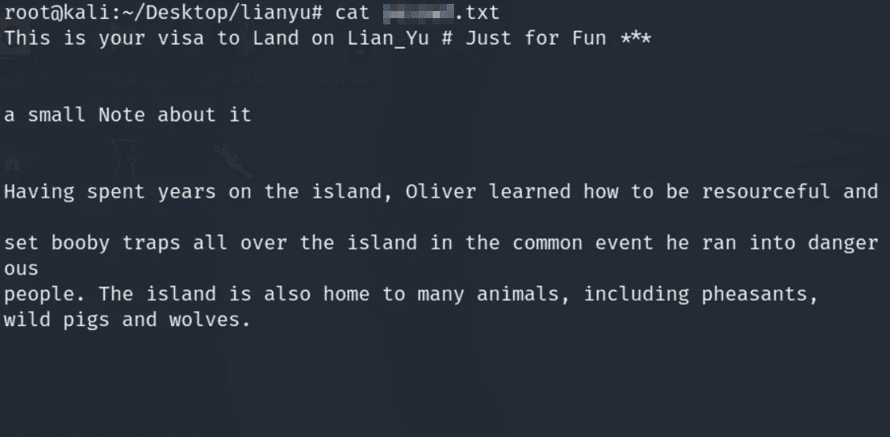

这里似乎没什么有趣的。检查另一个。

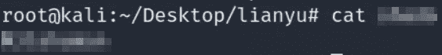

太棒了！！我们已经获得了 SSH 的密码。然而我们遗漏了另一半谜题，那就是 SSH 的用户名。回想一下。“其他用户”文件包含名称“斯莱德·威尔逊”。我们可以使用这些凭证登录 SSH。

> #5.带 SSH 密码的文件名是什么？
> 答:XXXXXX

让我们嘘。

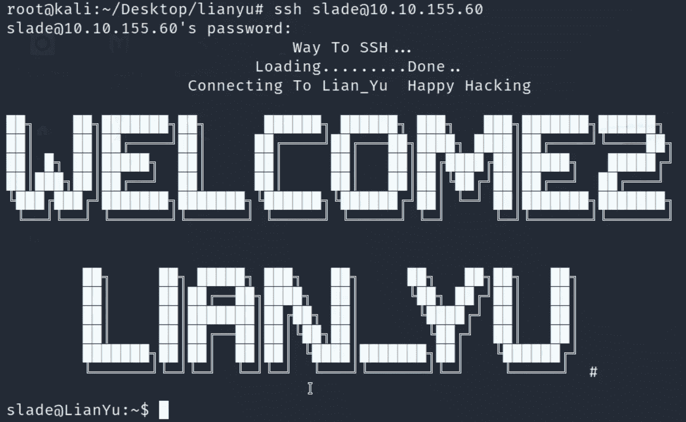

太棒了。！我们进来了！！
让我们捕获用户标志。

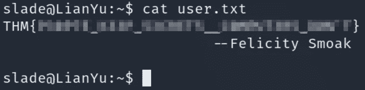

> #6.user . txt
> Ans:xxxxxxxxxxxxxxxxxxxxxxxxxxx

做得好！！现在怎么办？是的，你认为是对的。我们需要提升权限，成为根用户，并获得根标志。

使用“sudo -l”查找可以由用户“slade”作为根用户执行的命令或二进制文件。Sudo 密码与 SSH 密码相同。

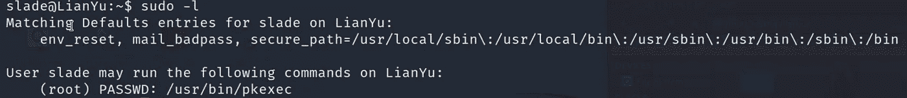

我查看二进制文件特权提升命令的方法是:

 [## GTFOBins

### GTFOBins 是 Unix 二进制文件的精选列表，攻击者可以利用它来绕过本地安全限制…

gtfobins.github.io](https://gtfobins.github.io/) 

搜索“pkexec”

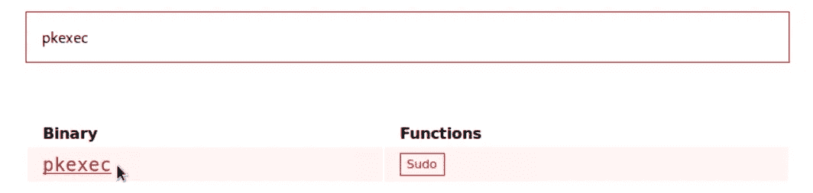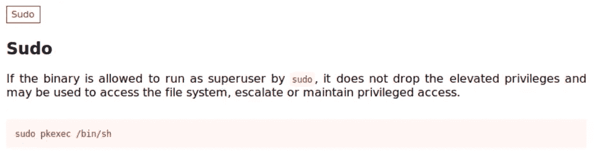

我们可以尝试使用上面的命令，并希望我们可以提升机器上的权限。

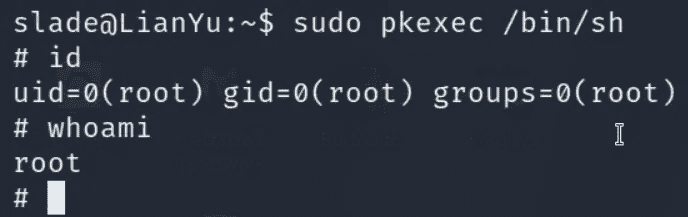

瞧啊。！
我们已经成功地对盒子进行了根操作！！
让我们抓住根旗，给这个盒子一个美好的结局。

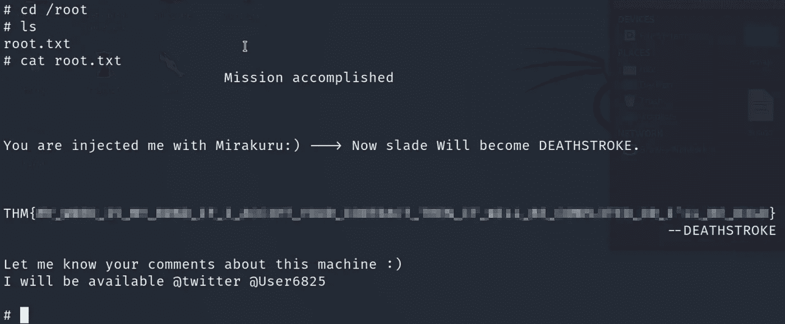

太棒了。提交吧。

> #7.root . txt
> Ans:xxxxxxxxxxxxxxxxxxxxxxxxxxxxxxxxxxxxxxxxx

我们已经完成了房间。我在寻找盒子的过程中获得了巨大的乐趣，我希望你喜欢阅读这篇文章。

如果你喜欢这篇文章，并且这篇文章对你有所帮助，请在评论中告诉我，或者用掌声分享你的爱。

谢谢你抽出时间。

跟着我。

更多的报道正在进行中。

保重，注意安全，继续黑！

**-哈桑·谢赫**