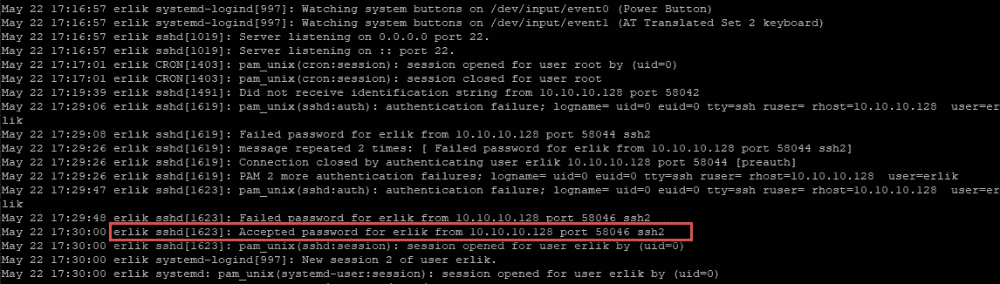
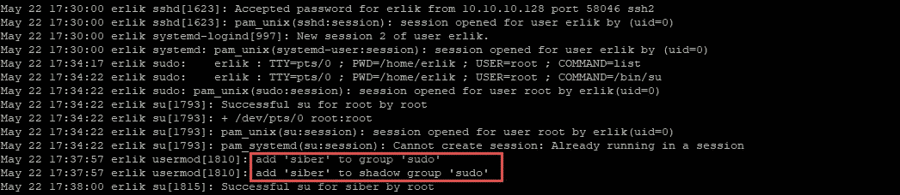
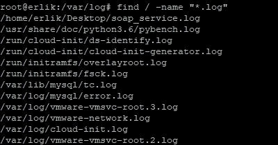
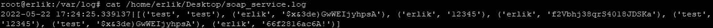
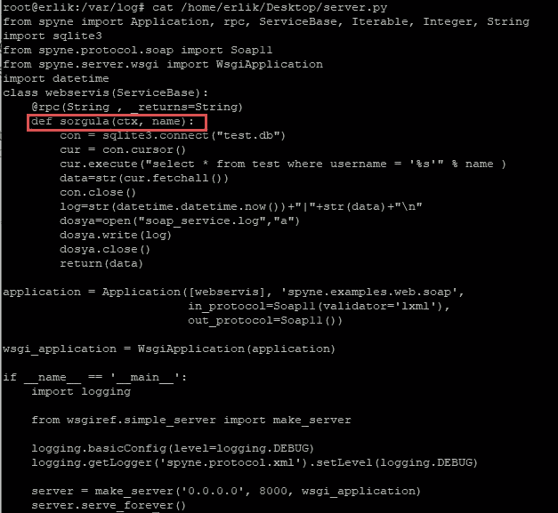

# Tryhackme linuxloganalysis 撰写文章

> 原文：<https://infosecwriteups.com/tryhackme-linuxloganalysis-writeup-8a28fca4ac02?source=collection_archive---------3----------------------->

 [## 网络安全培训

### TryHackMe 是一个免费的学习网络安全的在线平台，使用动手练习和实验室，通过您的…

tryhackme.com](https://tryhackme.com/jr/linuxloganalysis) 

tryhackme.com/jr/linuxloganalysis

问:哪个用户第一次成功登录 ssh 服务？
A:erlik
在 auth.log 中观察到密码被接受如下。

问:哪个用户被添加到 sudo 组？
答:siber
在 auth.log 中，观察到如下谁被添加到了 sudo 组。

问:5 月 22 日无法使用 sudo su 命令的用户是谁？
答:在 auth.log 中观察到 erlik
“用户不在 sudoers”

问:使用的是什么 WPScan 版本？答:3.8.20

在 access.log 中可以看到 WPScan 版本，如下所示。

10 . 10 . 10 . 128—[22/5/2022:17:46:54+0000]" POST/WordPress/WP-log In . PHP HTTP/1.1 " 200 2411 "[HTTP://10 . 10 . 10 . 130/WordPress](http://10.10.10.130/wordpress)" " wps can v 3 . 8 . 20([https://wpscan.com/wordpress-security-scanner](https://wpscan.com/wordpress-security-scanner))"

问:在哪个日志文件中答:soap_service.log

包含日志的文件搜索如下。

soap_service.log 的内容如下所示。

问:erlik 用户的 SSH 服务密码是什么？
A:66f2816ac6A！

在 soap_service.log 的内容中，观察到了 erlik 用户的 SSH 密码。

问:SOAP web 服务中使用的方法的名称是什么？索尔古拉

方法名称出现在 server.py 代码中。

