# TryHackMe- Madness CTF 报道(详细)

> 原文：<https://infosecwriteups.com/tryhackme-madness-ctf-writeup-detailed-263fb443b978?source=collection_archive---------0----------------------->

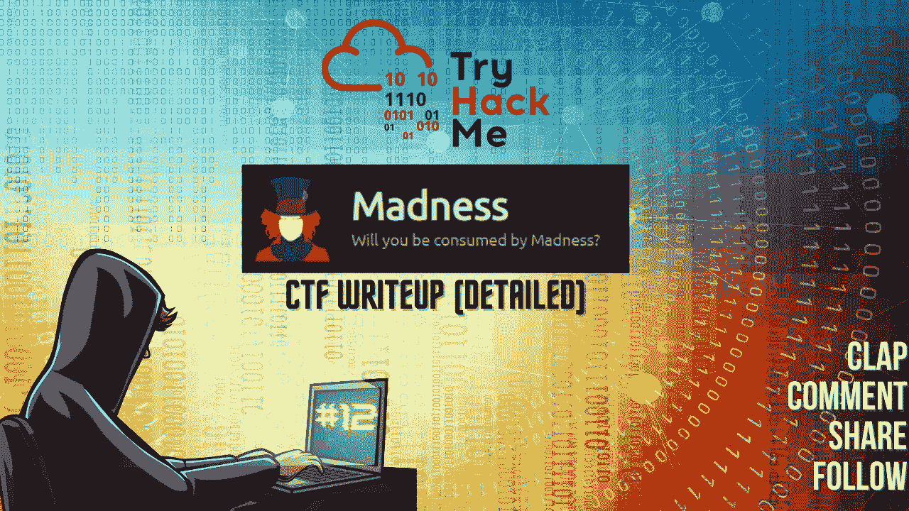

CTF 报道#12

欢迎各位！！我们将在 [TryHackMe](https://medium.com/u/dc49a0a3cb16?source=post_page-----263fb443b978--------------------------------) 上演疯狂 CTF。

 [## 疯狂

### TryHackMe 是一个学习和教授网络安全的在线平台，全部通过您的浏览器完成。

tryhackme.com](https://tryhackme.com/room/madness) 

在桌面上为您的 CTF 计算机创建一个目录，并在 CTF 目录中为 Nmap 创建一个目录。

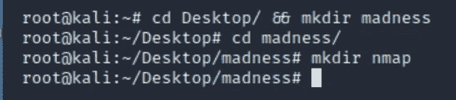

> 让我们疯狂地潜水吧！！享受流动吧！

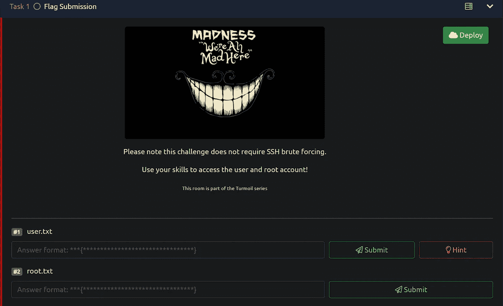

任务列表

## Nmap 扫描:

> nmap-sC-sV-p--关于 nmap/madness<target_ip></target_ip>
> 
> -sC:默认脚本
> -sV:版本检测
> -p-:扫描所有端口
> -oN:输出将存储在您之前创建的目录“nmap”中

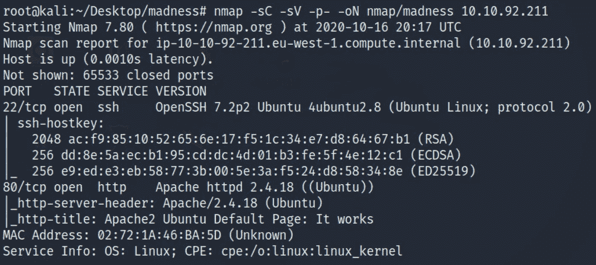

有 2 个端口打开:
22/ssh-OpenSSH 7.2 p2
80/http-Apache/2 . 4 . 18
OS 检测到- Ubuntu Linux

> 导航到 http://<target_ip></target_ip>

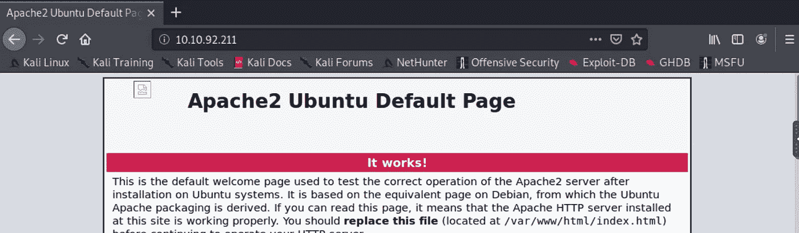

这是 Apache 的默认页面。检查页面的源代码，寻找任何对我们的枚举过程有帮助的有趣信息总是好的。查看 URL 页的源代码。

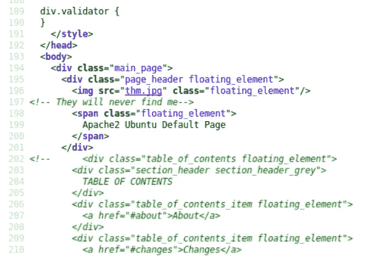

有一个评论说他们永远也找不到我。没关系，我们最终会找到他的。在评论上面，我们可以看到有一个“thm.jpg”文件，因此它是提供给我们检查的文件。我们将打开 thm.jpg 来查看它的内容，但它不会，因为图像包含错误。

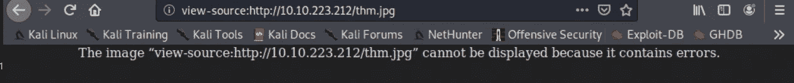

我们可以使用主机上的“wget”下载图像。

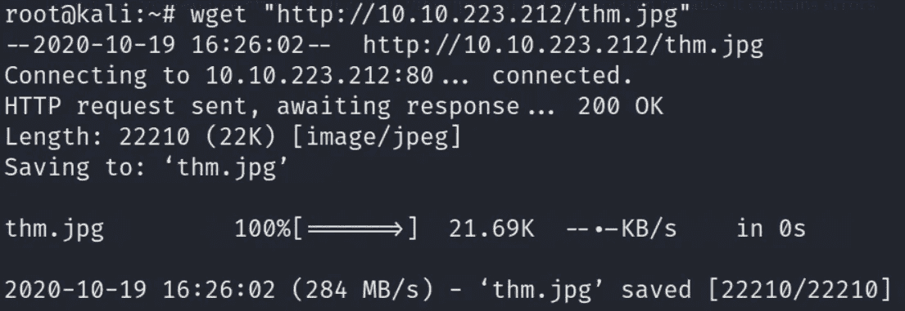

使用“文件”命令分析文件。

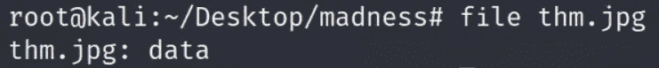

图像文件(如 png、jpg、jpeg 等)损坏或包含错误意味着文件签名不符合扩展名类型，不正确的文件签名不允许我们打开该文件。换句话说，我们必须在 hexeditor 中修改“thm.jpg”的文件签名，并根据图像的扩展类型进行匹配。

我已经链接了下面的文件签名列表:

 [## 文件签名列表

### 许多文件格式不适合作为文本阅读。如果这样的文件被意外地视为文本文件，其…

en.wikipedia.org](https://en.wikipedia.org/wiki/List_of_file_signatures) 

向下滚动，我们可以找到 jpg/jpeg 的文件签名。

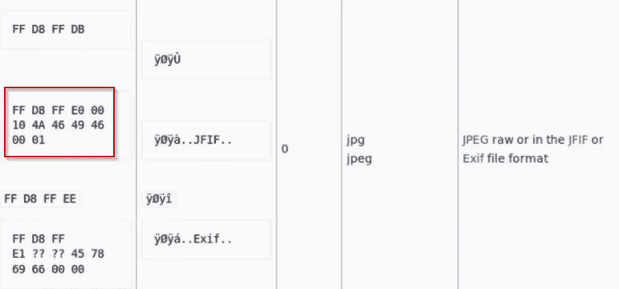

我们必须使用“hexeditor”命令修改 jpg 文件的十六进制格式。

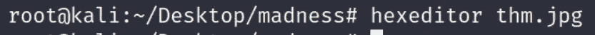

将第一行中的十六进制替换为我们之前找到的十六进制后，图像将为我们工作，我们将能够看到图像的内部。保存十六进制[Ctrl+O]并退出编辑器[Ctrl+X]。

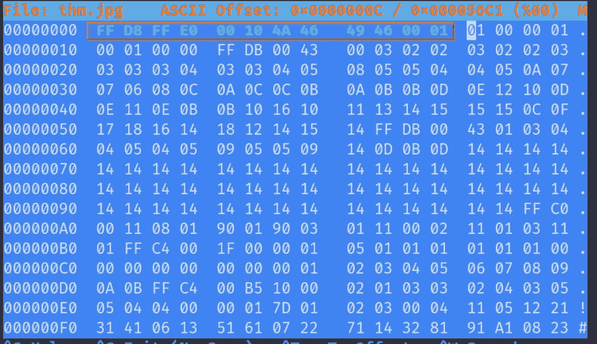

> thm.jpg

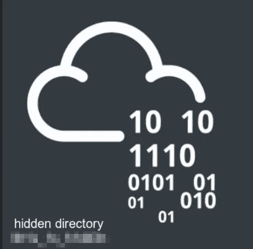

我们被提供了一个隐藏的目录。

> 导航到 http:// <target_ip>/</target_ip>

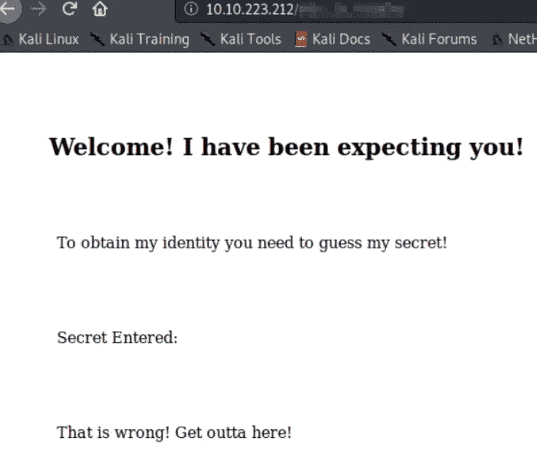

让我们看看源代码。

有一个注释，表示页面会认为 0 到 99 之间有一个特定的数字是正确的，在输入正确的键后，我们会得到进入下一步的信息。

Burpsuite 将很容易地解决这个问题，因为我们将能够使用入侵者选项来强力攻击 URL，包括具有从 0 到 100 的数字有效载荷列表的参数。首先，我们必须在浏览器上设置 Burpsuite 代理。就这么办吧。

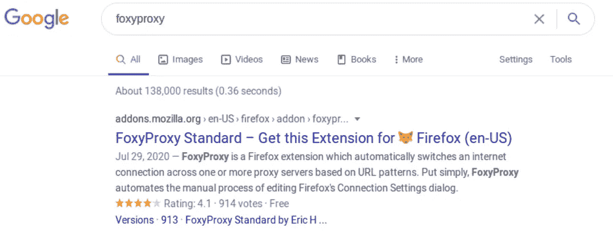

> 安装 FoxyProxy 插件。

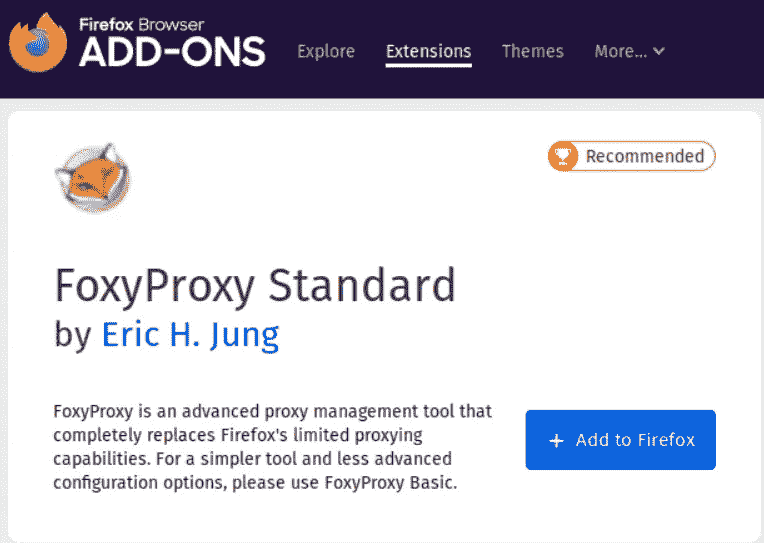

> 点击选项。

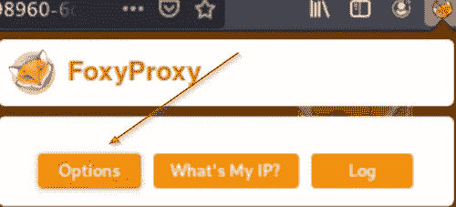

> 点击添加。

> 在 IP=127.0.0.1 和端口=8080 上配置 Burp 代理。

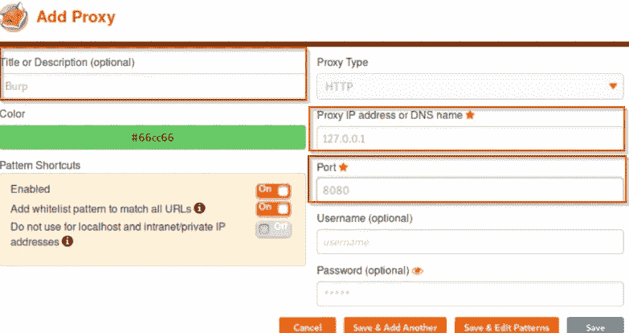

> 打开打嗝代理。

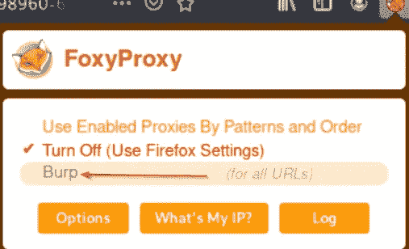

> 在 Burpsuite 中，确保 intercept 处于打开状态，刷新隐藏目录页面[F5 ], burp 将捕获请求。

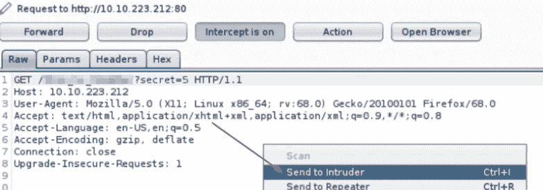

> 在“位置”标签下的“入侵者”选项中，确保我们想要强力攻击的参数在字符之间。

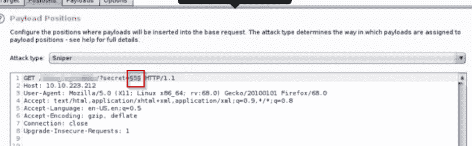

> 在有效载荷选项卡下的入侵者选项中，我们可以从下拉列表中选择数字有效载荷类型，并将有效载荷的选项设置为范围从 0 到 99，1 步意味着逐个使用每个数字。

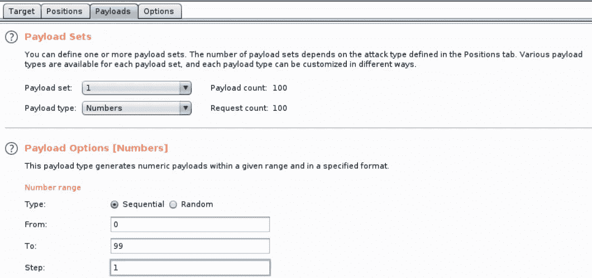

> 开始攻击，等待它结束。

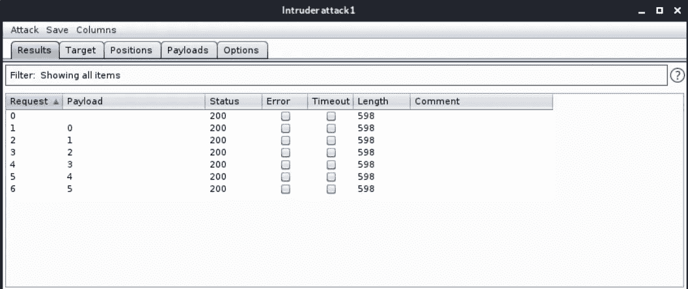

> 单击 Length 以降序排列，我们会看到有一个数字的长度最长。长度越长，获得正确数字的机会就越大，该数字将被页面忽略或验证。

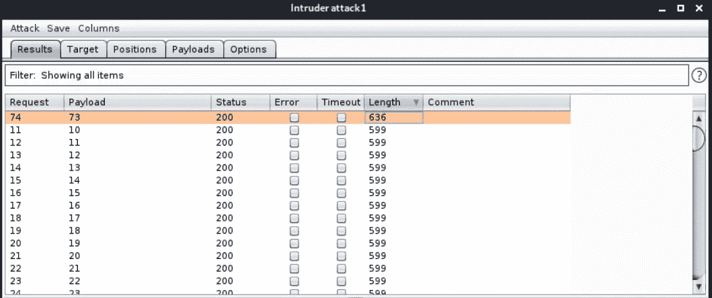

数字 73 是我们感兴趣的数字，因此我们将使用它作为 URL 中带参数“secret”的秘密数字。

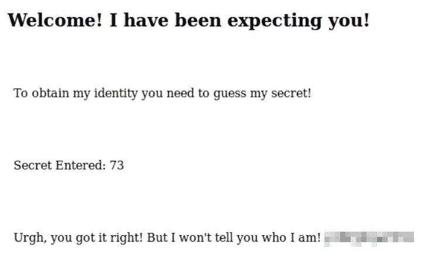

太好了！！我们已经得到了它的权利。让我们解码这个散列。等等。你可能也认为这是一个杂凑。不，不是的。这是一个密码，我们将使用隐写术工具提取“thm.jpg”文件中的隐藏文件/信息。

我的首选 steg 工具是 steghide。如果你还没有安装它，请在你的机器上安装它。

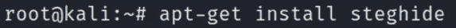

我们将使用密码从“thm.jpg”中提取信息。

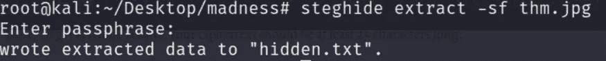

厉害！！它包含一个用户名和密码被确认。

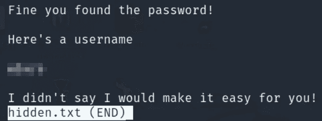

用户名很短，但经过旋转，它清楚地向我表明它是 ROT13 编码的。我们想解码它。我破解哈希的首选是赛博咖啡馆。它完美地破解了哈希，工作起来就像一个魔咒。

 [## 网络咖啡馆

### 网络瑞士军刀-一个用于加密、编码、压缩和数据分析的网络应用程序

gchq.github.io](https://gchq.github.io/CyberChef/) 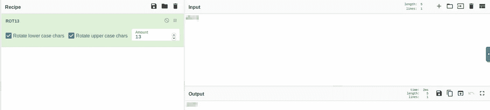

解码用户名:XXXXX
我们已经获得了用户名，现在我们需要密码。
如果你还记得[https://tryhackme.com/room/madness](https://tryhackme.com/room/madness)疯狂 CTF 主页上有明确的说明，挑战不需要 SSH 蛮力。

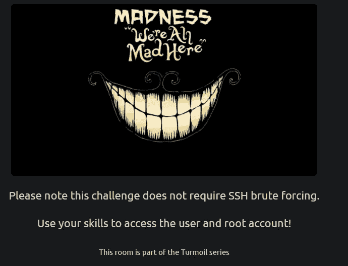

但是注意上图。我们都疯了。它被放在那里是有目的的。也许这张图片包含了一些东西，让我们来看看。下载图像。

我们可以使用 steghide 从文件中提取信息。

> 隐藏信息

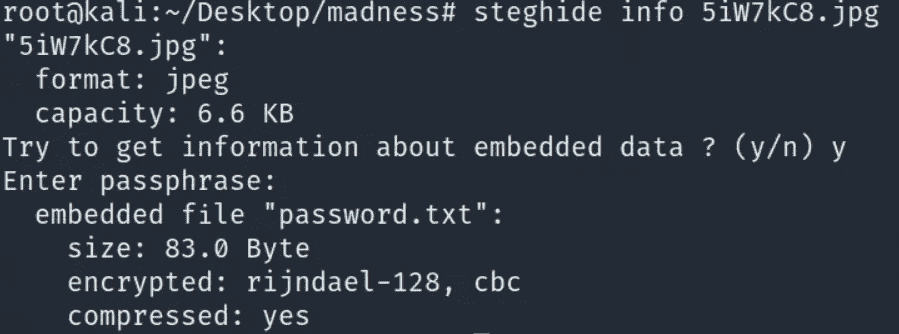

> 隐写提取物-sf

太棒了！！我们得到了一个密码文件。它将包含密码。

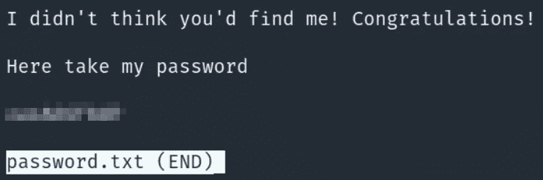

哦，我明白为什么他们指示我们不要暴力使用宋承宪了。单词表肯定无法破解它。然后我们用凭证获取 SSH shell。

让我们嘘。

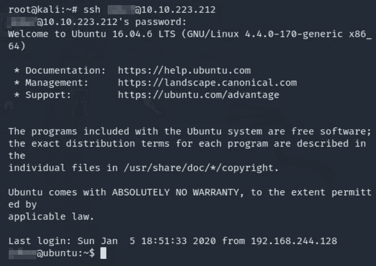

我们进去了。让我们捕获用户标志。

提交吧。干得好。接下来呢。是的，你认为它是正确的。我们必须提升权限，成为超级用户。我对机器上的任何潜在攻击媒介进行自动枚举的首选是“Lin peas”——一个真正出色的脚本。

 [## Carlos polop/特权升级-牛逼-脚本-套件

### PEASS -特权升级真棒脚本套件(带颜色)…

github.com](https://github.com/carlospolop/privilege-escalation-awesome-scripts-suite/blob/master/linPEAS/linpeas.sh) 

使用 python，我们可以默认在端口 8000 上启动一个简单的 http 服务器，但是你可以指定任何你想要的端口。

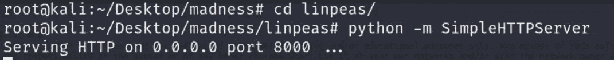

在目标机器上“wget”Lin peas 脚本，使用“chmod +x linpeas.sh”使其可执行，并执行它。

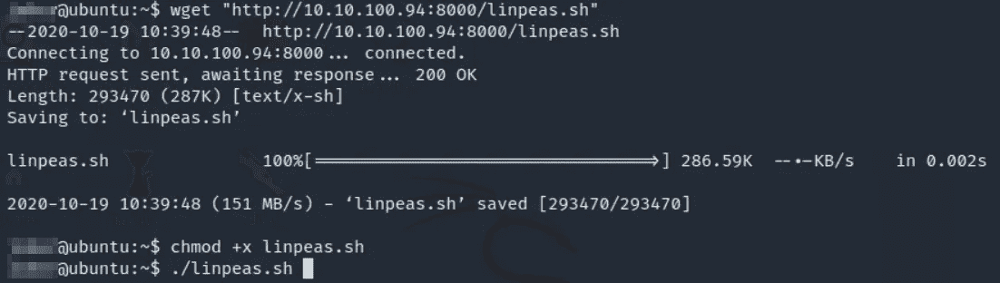

您还可以通过将命令传送到 tee <output_file>来保存输出</output_file>

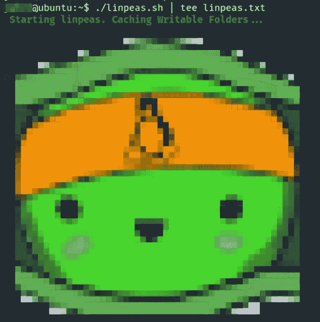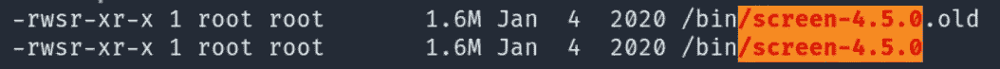

此脚本最精彩的部分是，用红色和黄色突出显示的内容有 99%的机会成为攻击媒介，从而提升权限。攻击媒介是 root 拥有的二进制文件，其“s”权限意味着超级用户。
我寻找可利用的二进制文件的途径

 [## GTFOBins

### GTFOBins 是 Unix 二进制文件的精选列表，攻击者可以利用它来绕过本地安全限制…

gtfobins.github.io](https://gtfobins.github.io/) 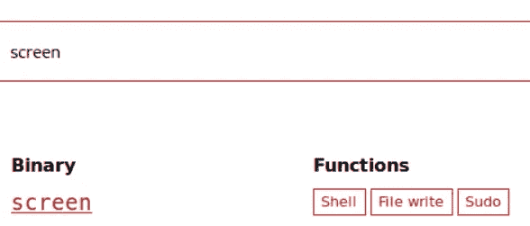

这些命令在 shell 上无法工作，也无法提升权限，因为我们有 SSH Shell，但是我们没有用户的密码，因此任何使用 sudo 的命令都无法执行。

我们可以寻找任何利用'屏幕-4.5.0 '的漏洞，是的，我们有一个。下面的链接为利用。我会把漏洞弄到我的机器上。

 [## 攻击性安全利用数据库档案

### GNU 屏幕 4.5.0 -本地权限提升..Linux 平台的本地漏洞利用

www.exploit-db.com](https://www.exploit-db.com/exploits/41154) 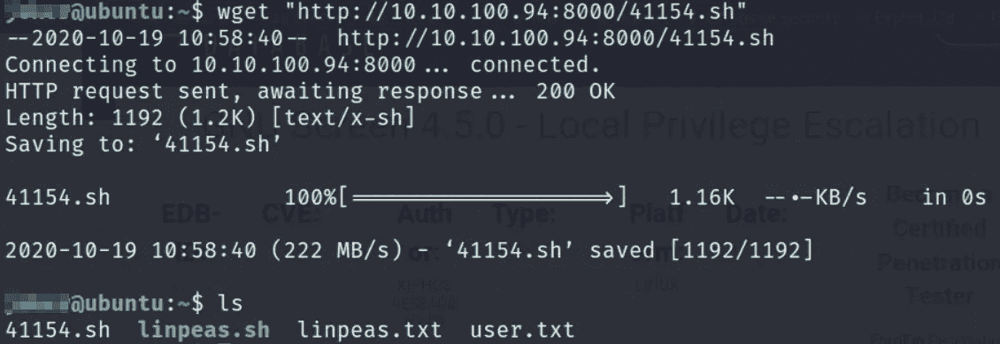

我们会分析剧本。

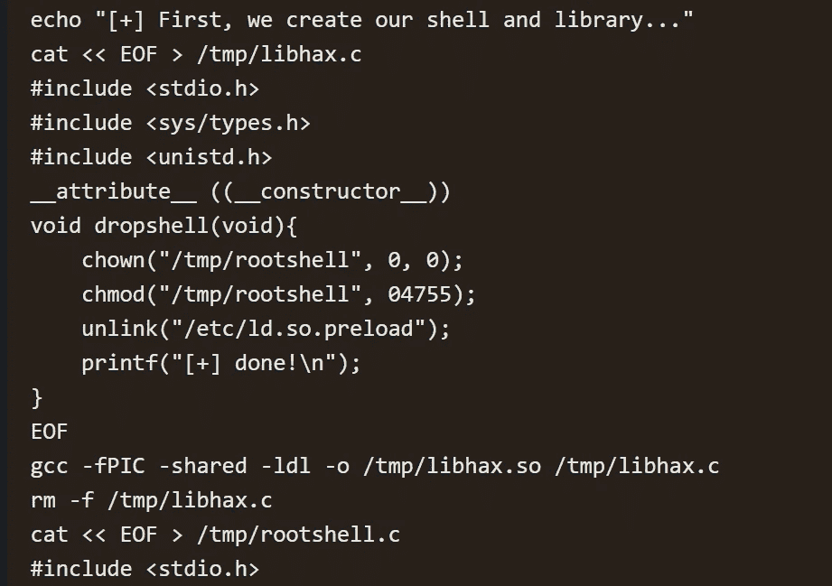

我们需要在/tmp 目录中执行脚本，以便它正常工作并提升权限。

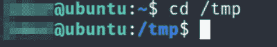

抄剧本。

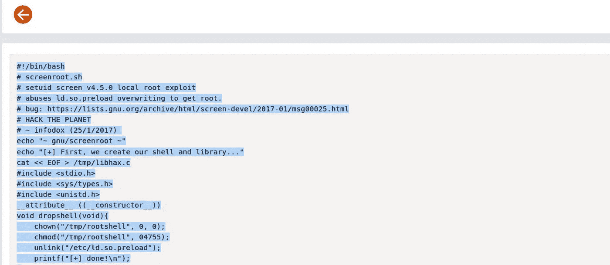

使用 nano 并创建“exploit.sh”文件。

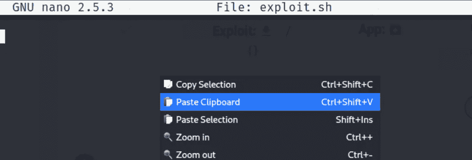

粘贴

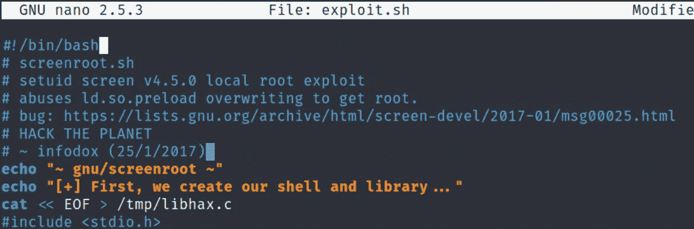

保存它[Ctrl+O]并退出[Ctrl+X]

使其可执行。

观看魔术表演。

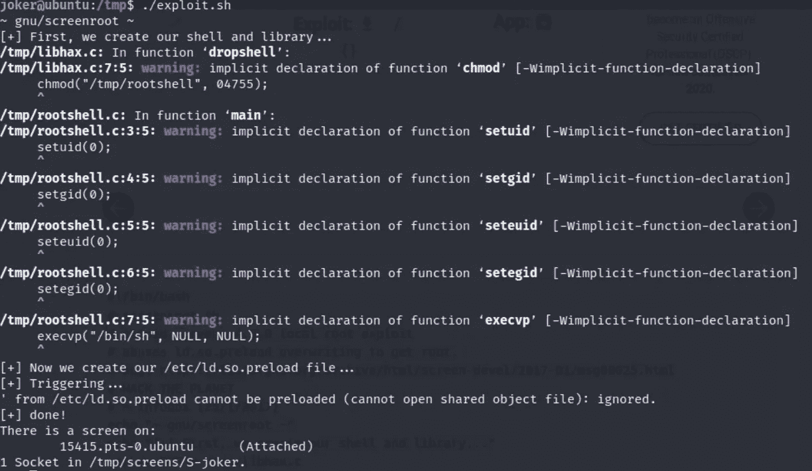

确认我们是根。

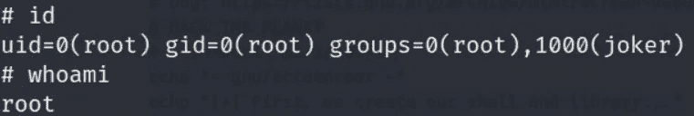

的确如此。宏伟。

让我们夺取根旗，给这场疯狂一个圆满的结局。

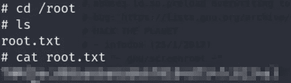

瞧。
提交。我们已经成功地将箱子扎根。我从中获得了很多乐趣。我希望你能从阅读中获得乐趣。

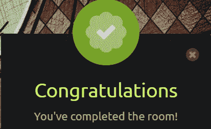

#]

如果你喜欢这篇文章，并且这篇文章对你有所帮助，请在评论中告诉我，或者用掌声分享你的爱。

谢谢你抽出时间。

跟着我。

更多的报道正在进行中。

保重，注意安全，继续黑！

哈桑·谢赫