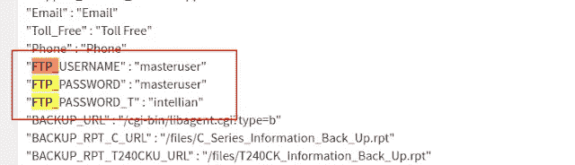
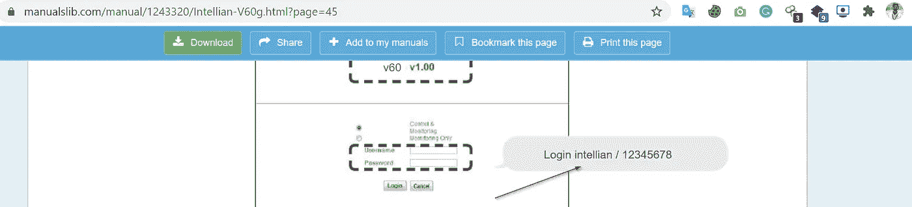
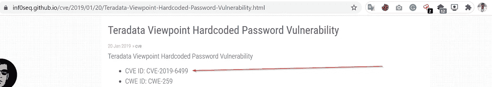
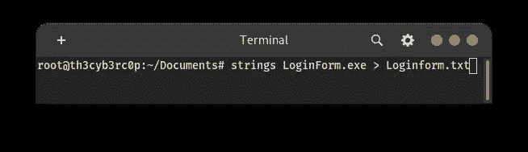
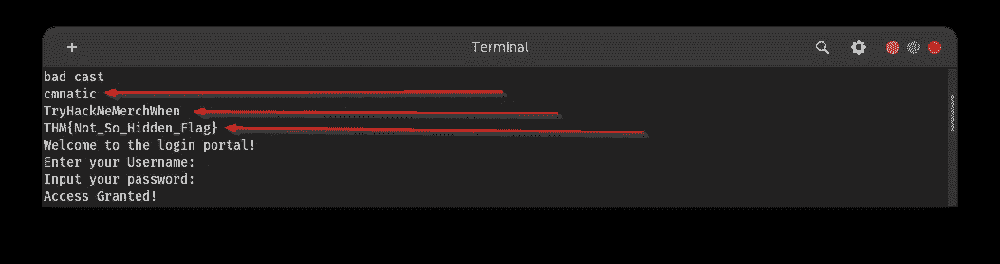
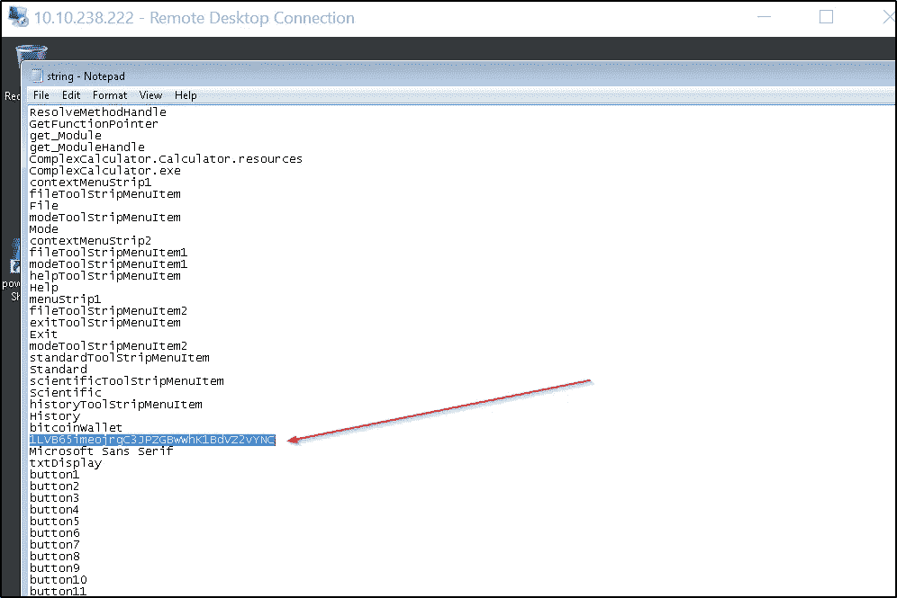

# TryHackMe:(MAL:Strings)Mayur Parmar 的漫游

> 原文：<https://infosecwriteups.com/tryhackme-mal-strings-walkthrough-by-mayur-parmar-8894d436d3e0?source=collection_archive---------0----------------------->

研究应用程序中的“字符串”以及为什么这些值很重要！

> 房间链接:[https://tryhackme.com/room/malstrings](https://tryhackme.com/room/malstrings)

注:**此房间只供高级会员使用。谁购买了高级会员。**

> 动机:

完成本课程后，您将了解到:

*   字符串分析
*   OSINT
*   静态分析(恶意软件分析的一部分)

马尔:字符串

**什么是“弦”？**

*   >从编程的角度来看，“字符串”是指应用程序处理的数据。从更广的角度来看，这些数据用于存储信息，比如从文本到数值。
*   例如，假设我们有一个计算器这样的应用程序。在这种情况下，用户将不得不输入两个数值(例如 1 和 5)以及运算符(例如+或加号)。这些值将被存储为“字符串”。
*   然而,“字符串”可以存储在应用程序本身中——不需要用户输入。例如，使用用户名和密码的例子是可以作为“字符串”存储的许多类型的信息的一个很好的表示。

**为什么“字符串”很重要？**

*   我们都是有安全意识的人，都知道写下密码不是一件明智的事情。然而，开发人员并不这么认为，他们经常在应用程序中留下凭证，而这些凭证通常是必不可少的，即服务器需要知道其 IP 地址的应用程序。可以说，与密码的敏感性相比，IP 地址是微不足道的——但两者都将被存储为字符串。
*   公司在应用程序中存储密码等敏感信息的例子不胜枚举。例如， [Intellian](https://www.intelliantech.com/) ，一家专注于卫星通信的公司，披露了他们的**“Aptus Web 1.24”**应用保留了默认密码“12345678”。
*   下图是一个在字符串中包含敏感凭据的 Android 应用程序示例:

> **任务 1:**

1.  在上面讨论的 intellian 示例中，密码为“12345678”的账户的**名称是什么？**

答案: **intellian**

*   我在谷歌上搜索了这个产品名称，找到了它的默认用户名和密码。

**参考**:

 [## Intellian V60G 安装和操作手册(第 45 页，共 149 页)|手册 Lib

### 在线查看和下载 Intellian V60G 安装和操作手册。60 厘米船用稳定通信…

www.manualslib.com](https://www.manualslib.com/manual/1243320/Intellian-V60g.html?page=45) 

2.“Teradata”公司在他们的“视点”应用程序中披露的在字符串中有密码的 CVE 条目是什么？

答案:**CVE-2019–6499**

**参考:**

 [## Teradata 视点硬编码密码漏洞

### Teradata 视点硬编码密码漏洞影响的产品:Teradata 视点 14.0 之前的版本，但是…

inf0seq.github.io](https://inf0seq.github.io/cve/2019/01/20/Teradata-Viewpoint-Hardcoded-Password-Vulnerability.html) 

3.根据 **OWASP 的**列表中的**“十大物联网”**漏洞，说出该漏洞的排名，用文本表示。

**答案:1**

由于这是一个 IOT 设备，所以我很快在谷歌上搜索，发现弱，硬编码类别是在第 **1** 号。

**参考:**

 [## OWASP 物联网十大漏洞列表| InfoSec 洞察

### 如果您是来了解 OWASP 物联网十大清单的，那很好。因为物联网技术就在我们身边，而且没有…

sectigostore.com](https://sectigostore.com/blog/owasp-iot-top-10-iot-vulnerabilities/) 

> **【任务 2】实用:从应用程序中提取“字符串”**

**# 1“LoginForm”要求的正确用户名是什么？**

回答:对于这个问题，我使用了 kali linux 中内置的字符串工具。

我从 LoginFrom.exe 身上提取了字符串。

从提取的字符串中，我发现了一些敏感信息。

答案:**中文**

**#2 进行身份验证所需的密码是什么？**

回答:从上面的截图我们可以看到，在第二行我们有密码，即:

**尝试黑客时代**

**#3 什么是“隐藏的”THM { flag？**

回答:从上面的截图，我们可以看到这个任务的标志。

**THM{Not_So_Hidden_Flag}**

> [任务 3]恶意软件环境中的字符串

描述僵尸网络接收指令的服务器的关键术语是什么？

答:**指挥控制**

**#2** 列举所讨论的恶意软件示例，这些恶意软件使用“字符串”来存储用于支付的比特币钱包地址

答案: **Wannacry**

> 【任务四】实用:在勒索软件中查找比特币地址(部署！)

**#1** 列出“Wannacry”作者使用的比特币钱包的总交易次数

回答:对于这个问题，他们已经在任务描述中给了我们提示。

我们有一个 **wannacry** 作者的比特币地址。

在底部，我们可以看到这个作者用这个钱包做了 140 笔交易。

答案: **140**

**# 2**“complex calculator . exe”内存储的比特币地址是什么

回答:对于这个问题，我们必须部署 thm 实例进行连接。

您可以使用 Windows 操作系统中提供的**远程桌面连接**实用程序。

Linux 用户按照下面的博客安装 rdesktop 实用程序以连接到远程桌面计算机。

 [## 如何在 Redhat/Fedora/CentOS 中使用远程桌面(rdesktop)

### rdesktop 是一款开源软件，使您能够从 Linux 连接和管理远程 Windows 桌面…

www.tecmint.com](https://www.tecmint.com/rdesktop-connect-windows-desktop-from-linux/) 

现在连接到远程机器。

我们已经提供了登录凭据。

> **用户名:分析**
> 
> **密码:tryhackme**

现在登录到桌面后，我们打开 Sysinternals 文件夹，然后打开该文件夹中的 cmd。

现在键入-> strings.exe·ComplexCalculatorv2.exe > strings . txt

让我们分解这个命令。

> Strings.exe 是我们的工具可执行文件。
> 
> ComplexCalculatorv2.exe 是我们的目标文件。
> 
> >操作员在这里将作为管道工作。
> 
> 字符串. txt 是我们的输出文件，

现在在记事本中打开 **Strings.txt** 。

我从 outfile 得到了比特币的地址。存储在计算器应用程序中。

答案:**1 lvb 65 imeojrgc 3 jpzgbwwhk 1 BDV z 2 vync**

**参考:**

 [## 静态恶意软件分析

### 从这里开始，我想分享我最近对恶意软件分析的研究结果。我们将从一些…

resources.infosecinstitute.com](https://resources.infosecinstitute.com/malware-analysis-basics-static-analysis/#gref) 

[https://en . Wikipedia . org/wiki/bit coin #:~:text = It % 20 is % 20a % 20 去中心化%20digital，没有% 20% 20 need % 20 for % 20 intermediators。&text =比特币% 20 被% 20 创造% 20 为% 20as % 20a 奖励% 20 为% 20as % 20a 过程% 20 已知% 20 为% 20 挖掘。](https://en.wikipedia.org/wiki/Bitcoin#:~:text=It%20is%20a%20decentralized%20digital,without%20the%20need%20for%20intermediaries.&text=Bitcoins%20are%20created%20as%20a%20reward%20for%20a%20process%20known%20as%20mining.)

 [## 勒索软件在简单的英语

### 在过去的日子里，病毒几乎是友好的，它们很少造成那么大的伤害，很容易被清除，而且…

medium.com](https://medium.com/swlh/ransomware-in-plain-english-f95d59224d9e) 

## **学习恶意软件分析的最佳书籍:**

[https://www . Amazon . in/Practical-Malware-Analysis-Hands-classing/DP/1593272901](https://www.amazon.in/Practical-Malware-Analysis-Hands-Dissecting/dp/1593272901)

 [## 内存取证的艺术:检测 Windows、Linux 和 Mac 内存中的恶意软件和威胁…

### 如果您在几秒钟内没有被重定向，请单击此处。内存取证的艺术:检测恶意软件和…

www.google.com](https://www.google.com/search?sxsrf=ALeKk01y2we78ld6LzEG617EbnIEnUIrmg:1596144419579&q=The+Art+of+Memory+Forensics:+Detecting+Malware+and+Threats+in+Windows,+Linux,+and+Mac+Memory&stick=H4sIAAAAAAAAAGWSu47TQBSGY0RWMBtQ8AoJUizDVisUyXa89sppEOJSbYQEkWiQIl_G48t4xpkZ4szS8AiIR6CmoaSjJSUFDRIFBRJvQMmuiQckyu8___nPXM6l_sHAwpajmrossedP9kkuJGQprELShBzBkIZEiVzAiLFSbIzWPomqaH26phvjyjk6qa8C2-WVZrJc-xEvtJ3ihe-sttgN6zBpJmXpe11z1NRCLgPeMcaN7RVxvbUXmFT4eKm67rS2XXdF9OijWvDqWOo0j6xUIHUdK0VqFcQdFyvPdhbE00flTlb6-mZZkLmNR6ku10msTt2_7xAQt1x8NzbG7vDnr297o4_Gm3efvhgfDDA8YUwgop4gEkqUzJl5CHYeUplLZe6DqyNgVZa9SCsss8PeaAD-YfMl2H2K5JzNWJKnyiRmAS7PUBUhLh6n5hSA-4wQFMucUXMMro-uWbEWrPanziL3wP_ywe3Jrc8_vr7v3wT9VrhzcXjhhuH1eq_uTv8og7f95_MMwXu8XYSzsYwr-IhxREUeiyl8gOR5JMVwppckgfOMo1AKmFP4LKcJa8QYnuT0xXrclmdhvI16vWP8Bk-PNMV3AgAA&sa=X&ved=2ahUKEwjnoI6p9fXqAhV54XMBHc-uBy0Q-BYwEHoECA0QNQ) 

**课程:**

 [## 恶意软件分析专业培训课程版本 1 - MAPv1

### 恶意软件分析专业版 1 (MAPv1)是一个在线 IT 安全培训课程，让你的技能…

www.elearnsecurity.com](https://www.elearnsecurity.com/course/malware_analysis_professional/) 

**作者:**[**Mayur Parmar**](https://medium.com/u/4dbaf35dbafc?source=post_page-----8894d436d3e0--------------------------------)**(th 3c Yb 3 RC 0 p)**

在 Twitter 和 LinkedIn 上关注我(通常我会在这些社交媒体平台上分享技巧)

[https://twitter.com/th3cyb3rc0p?lang=en](https://twitter.com/th3cyb3rc0p?lang=en)

https://in.linkedin.com/in/th3cyb3rc0p

【https://www.instagram.com/th3cyb3rc0p/?hl=en 

[https://twitter.com/cyberdefecers?lang=en](https://twitter.com/cyberdefecers?lang=en)