# 机器人 CTF 先生——报道

> 原文：<https://infosecwriteups.com/tryhackme-mr-robot-ctf-writeup-ff0b3be5bd18?source=collection_archive---------0----------------------->

*TryHackMe 中一个名为* [*机器人先生*](https://tryhackme.com/room/mrrobot) *的房间的特写。*

## 关于 TryHackMe

[TryHackMe](http://tryhackme.com) 是一个学习网络安全的神奇平台，如果你是新手，不知道从哪里开始，这将是一笔惊人的财富。他们有这些房间，基本上是脆弱的机器，你可以部署和练习你的技能。TryHackMe 最棒的地方在于它非常实用。如果您是安全性新手，请务必尝试一下。

因此，在 TryHackMe 门户上部署该机器后，我们获得了一个访问该机器的 IP。每次部署时都会有所不同，所以您的`ROOM-IP` 可能与我的不同。

## nmap 扫描:

我们需要知道哪些服务在幕后运行，哪些端口是开放的。所以我们将使用一个叫做 **nmap 的工具。**

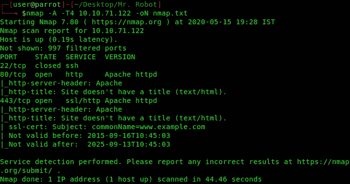

拥有端口 80 和 443 表明我们有一个网站在运行，所以我们在浏览器上打开`http://10.10.71.122`和`https://10.10.71.122`。

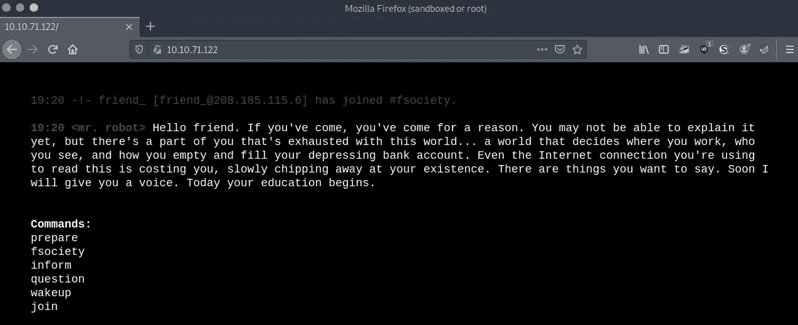

该网站是机器人先生主题网站。运行图片中提到的命令只是重定向到其他页面，这些页面有机器人先生电视节目的图像和视频。

因为我们有一个网站，我们想列举网站的目录，看看像登录页面，管理门户等存在与否。

**gobuster 扫描:**

因此，我们将使用一个名为 **gobuster** 的工具，它使用一个现有的可能的常用目录名称的单词列表，并尝试加载该单词列表中的每个目录名称，然后查看状态代码。(如果你使用的是 Kali 或 ParrotOS，那么你可以在`/usr/share/wordlists/dirbuster`找到这些词汇表)

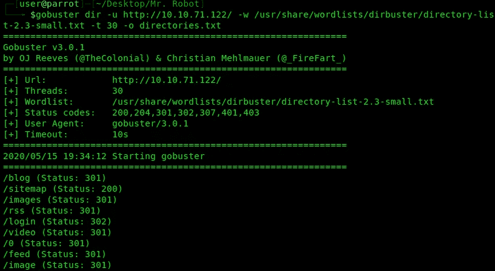

输出保存在`**directories.txt**`文件中

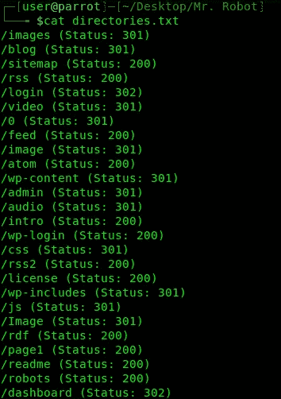

现在让我们看看状态代码为 200 的目录

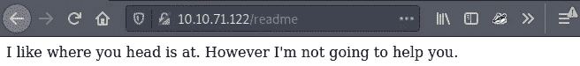

/自述文件

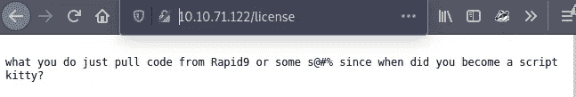

/许可证

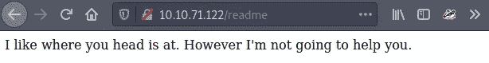

/自述文件

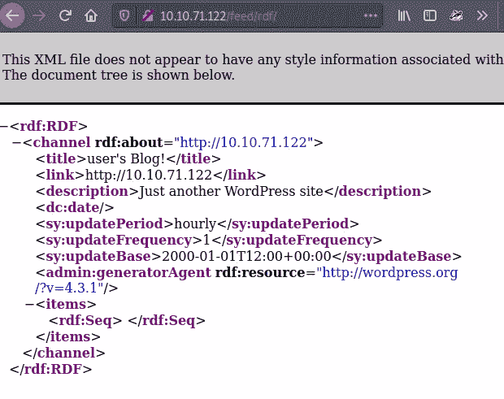

/rdf(有意思..？)

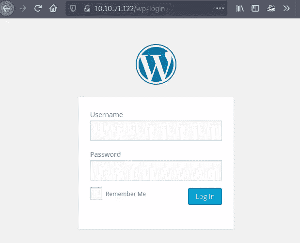

/wp-login(看起来像管理员登录页面)

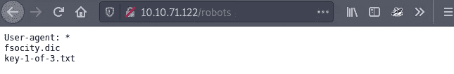

/机器人

头奖。打开`10.10.71.122/key-1–of-3.txt`

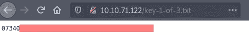

这是我们的调号 1/3。

**关键一:被俘！**

现在我们来看看 fsociety.dic

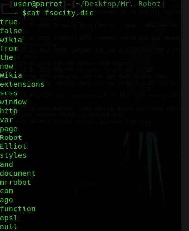

它看起来像一本字典。

让我们用这个字典对前面看到的登录页面进行字典攻击。

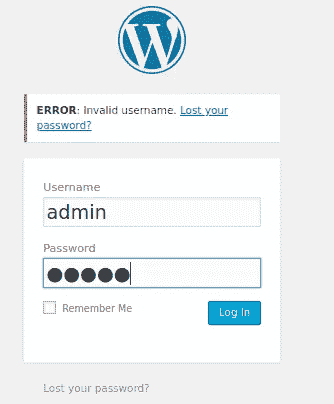

我们得到错误:**无效的用户名。**

让我们试试 admin:admin 登录:

使用 BurpSuite 拦截登录请求数据包。

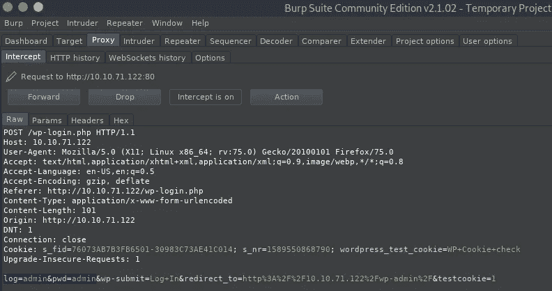

用户名和密码字段分别由`log`和`pwd`表示。

## 使用 Hydra 执行字典攻击

字典应该是`fsocity.dic`。在这种情况下，我们从他们那里收到了一个文件，在其他情况下，我们会尝试使用 comman 用户名和密码。你可以在 https://github.com/danielmiessler/SecLists 找到这些以及所有其他的清单。

因此，首先我们将尝试找到以密码为常量的用户名，然后我们将使用找到的用户名来获取密码。

**用户名改变，密码不变**

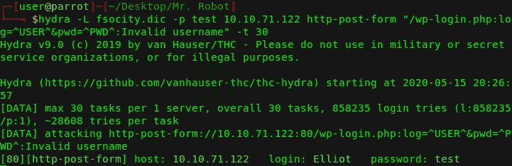

我们得到的用户名是埃利奥特。

让我们尝试用 Elliot:test 登录

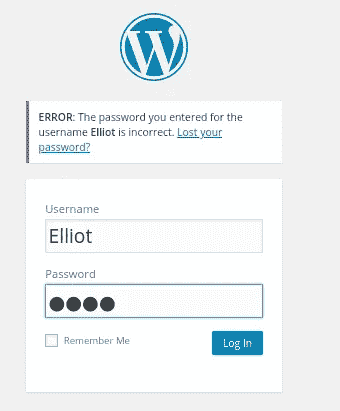

我们得到错误:**您为用户名 Elliot 输入的密码不正确。**

**用户名不变，密码更改**

我们得到一个 9 位数的密码:********

使用`Elliot:*********`登录:

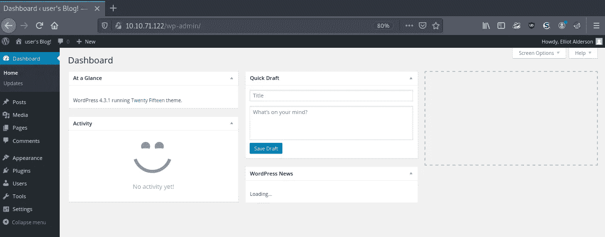

网站运行的是 WordPress 4.3.1。

现在我们需要打开一个反向外壳，所以让我们试着打开一个`php-reverse-shell`。卡莉和帕罗托斯已经拿到了。你所要做的就是`locate`它。

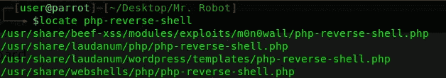

如果你没有卡利或 ParrotOS，你可以简单地谷歌一下，很容易找到它。

## **开借壳**

在 wp-admin 中，转到左侧导航栏，选择`Appearance → Editor`，然后选择右侧的`Archives (archive.php)`

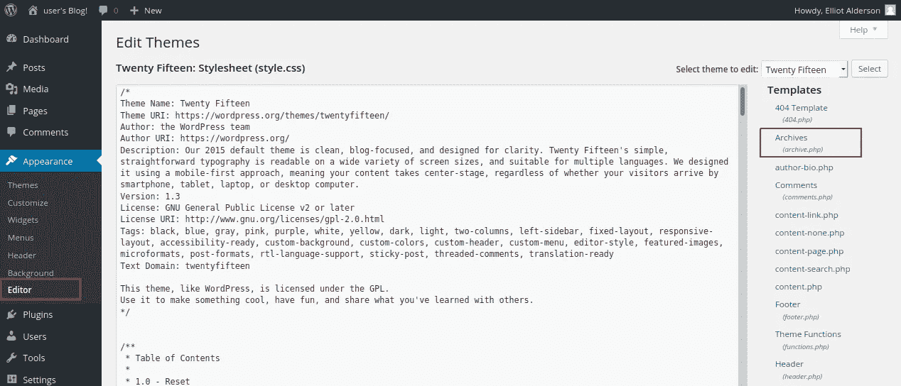

一次，档案开放。在编辑部分粘贴`php-reverse-shell.php`

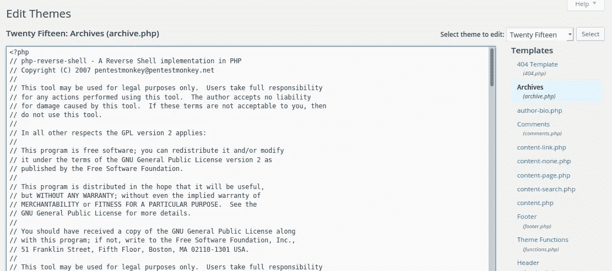

现在我们必须编辑变量`IP`的值。我们必须将它设置为我们的 IP，这样当反向外壳打开时，它就知道要连接到哪个 IP。

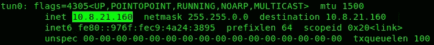

运行 **ifconfig** 命令

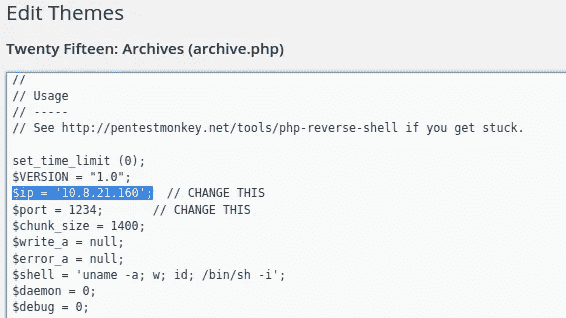

编辑后的 php-reverse-shell.php 文件的外观片段

如果你愿意，你可以改变端口，只要记住你改变的端口。

点击更新，我们打开 netcat 听一下`port 1234`。

现在我们来开`archive.php`。检查它正在运行什么主题，并打开如下所示的主题。

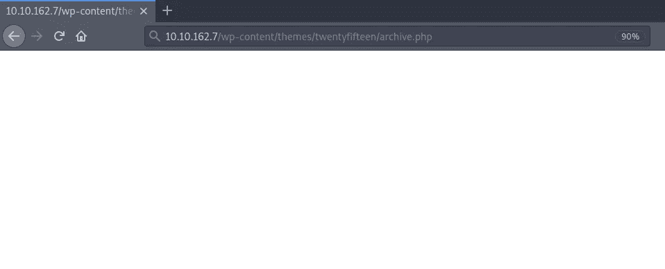

打开**http://10 . 10 . 162 . 7/WP-content/themes/twenty fifth/archive . PHP**

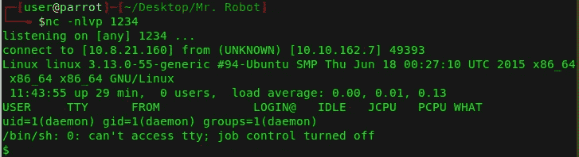

我们打开了一个反向外壳…耶！

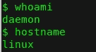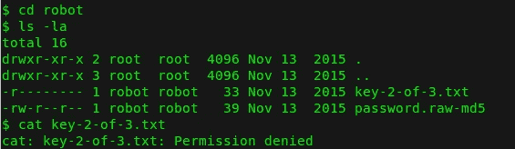

我们无法读取 key-2-of-3.txt

我们需要用户`robot`来读取`key-2-of-3.txt`，但是我们仍然可以读取 password.raw-md5。让我们开始吧。

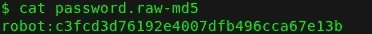

让我们用**开膛手约翰**来破解这个 MD5 散列

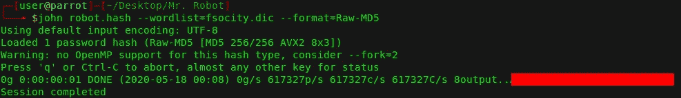

## 切换到用户机器人

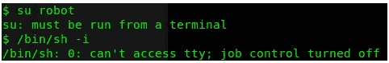

要切换用户，我们需要一个终端，我们不能使用 **/bin/sh -i** 打开终端

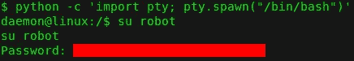

所以我们用这种方法打开终端

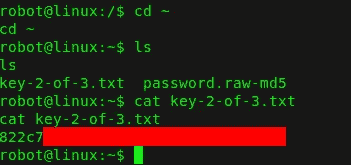

打开 **key-2-of-3.txt**

**关键二:被俘！**

现在，为了捕获第三个标志，我们需要找到 root 用户，因此我们将执行权限提升，因此我们需要找出哪些程序的 SUID 至少为 4000

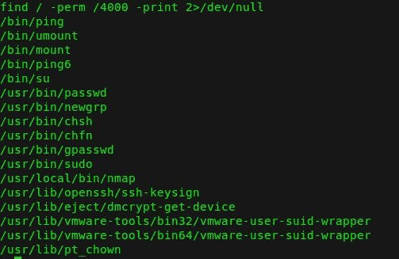

我们在这里找到了**nmap**

## 使用 nmap 的权限提升

> Nmap 设置了 SUID 位。很多时候，管理员将 SUID 位设置为 nmap，以便它可以用来有效地扫描网络，因为如果没有 root 权限运行它，所有的 nmap 扫描技术都不起作用。
> 
> 但是，nmap 旧版本中有一项功能，您可以在交互模式下运行 nmap，该功能允许您切换到 shell。如果 nmap 设置了 SUID 位，它将以 root 权限运行，我们可以通过它的交互模式访问“root”外壳。

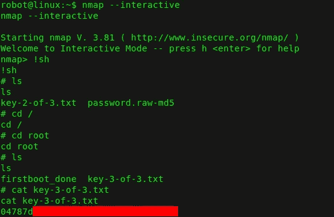

**关键三:被俘！**

我在这个房间里度过了一段美好的时光，学到了很多东西。TryHackMe 有很多其他的房间，每个房间都不同，这也提供了一个巨大的学习机会。我会试着上传我感兴趣的房间的报道。当然，我希望你也能从这篇文章中学到一些东西。干杯！🍺

# 现在，让我无耻地要求你

在 [Github](https://github.com/harshitm98) 、 [Twitter](https://twitter.com/fake_batman_) 上关注我，在 [LinkedIn](https://linkedin.com/in/harshitm98) 上连接。

# 参考资料:

1.  打开 PHP-reverse-shell for WordPress([https://pentarot . com/exploit-WordPress-back door-theme-pages/](https://pentaroot.com/exploit-wordpress-backdoor-theme-pages/))
2.  使用 Python 打开终端([https://blog . ROP nop . com/upgrading-simple-shell-to-full-interactive-ttys/](https://blog.ropnop.com/upgrading-simple-shells-to-fully-interactive-ttys/))
3.  使用 nmap([https://payatu.com/guide-linux-privilege-escalation](https://payatu.com/guide-linux-privilege-escalation))的权限提升