# TryHackMe-Nessus

> 原文：<https://infosecwriteups.com/tryhackme-nessus-3bcd7a04e484?source=collection_archive---------3----------------------->

大家好，

今天我要写的是 TryHackMe- *也就是* Nessus 的初级房间。我们开始吧。


我知道，你们当中有很多人正在尝试进入安全领域，或者曾经在这个领域工作过，他们都熟悉这个工具。对于那些不了解它的人来说，这里有一个工具的小介绍。

```
Nessus is one of the leading industry tool developed by Tenable. It is one of the many vulnerability scanners used during vulnerability assessments and penetration testing engagements, including malicious attacks.
```

正如我之前所说，Nessus 是由 Tenable 开发的，如果提供不同版本的 Nessus，每个版本的详细信息都可以在官方网站上找到。以下是 tenable 提供的产品。

【https://www.tenable.com/products 号

1.  Nessus 家庭版
2.  Nessus 企业版
3.  可租用的安全中心
4.  Nessus 经理

现在回到我们的 Nessus 房间，THM 为这个实验室提供了一台 Ubuntu 机器，但是我们可以在 Windows 和 Linux 环境下安装这些机器。

一旦我们部署了我们的机器，我们需要访问它并安装 Nessus 家庭版。要在我们的机器上安装 Nessus 家庭版，我们需要导航到 Nessus 家庭版产品页面，并在那里注册以获得我们的试用许可证。该试用许可证一次最多可以扫描 15 个 IP 地址。下面是您获取激活码的注册链接。

我已经注册并下载了。deb 包在我的攻击者机器上并安装了它。

注意:我们将在下载页面上看到两组不同的下载包。第二套将有家庭版版本

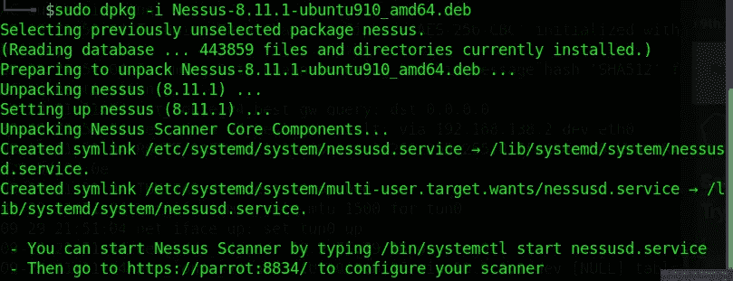

我已经使用命令启动了服务，并导航到浏览器来配置我的扫描仪。

```
/bin/systemctl start nessusd.service
```

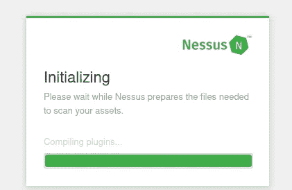

我们可以在浏览器中看到配置进度。访问 web 控制台的路径是使用 8834 端口。

[HTTP://localhost:8834/](http://HTTP://localhost:8834/)

启动服务器并访问路径后，您将获得配置 Nessus 工具的 3 步过程

1.  创建管理员帐户
2.  添加您的许可证
3.  等待插件下载

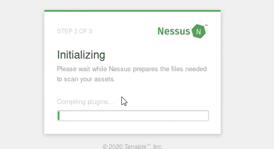

一旦你下载了所有的插件，你会看到一个欢迎屏幕。

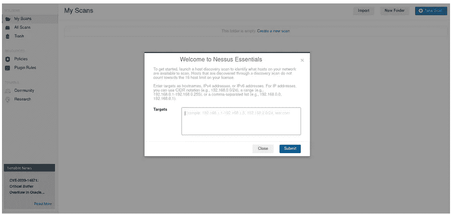

让我们探索更多的 Nessus 门户网站。打开门户后，我们会看到多个选项，如扫描、策略、扫描模板、插件规则。

当我们单击“新扫描”时，首先我们会看到选项扫描模板。

默认情况下，Nessus 提供了从基本主机发现到合规性标准的各种扫描模板。

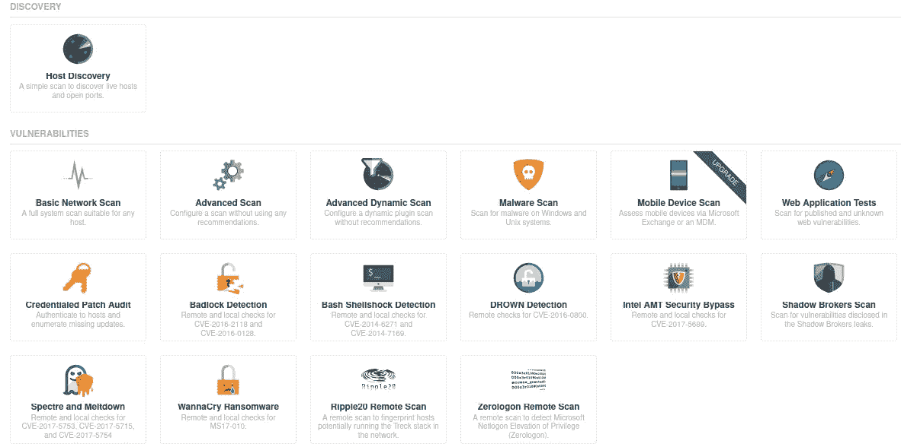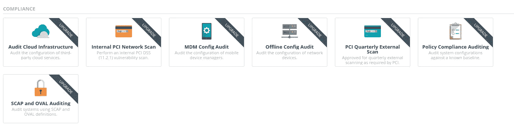

选择扫描模板后，您将看到多个选项，可根据您的环境自定义扫描。

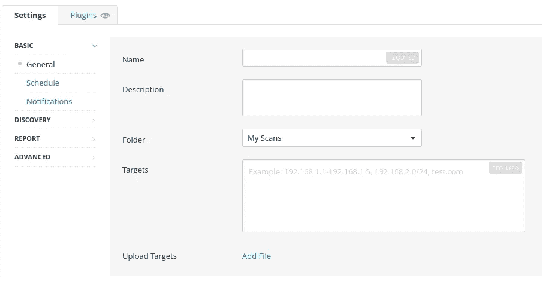

下一步是通过创建扫描名称和目标进行自定义。您可以使用逗号分隔来手动添加目标，也可以添加包含目标列表(IP 地址或主机名)的 csv 文件。您可以使用调度来调度扫描，并通过发送邮件来通知状态

下一个是发现选项卡:

您可以根据自己的需求选择扫描类型，包括扫描操作系统、端口、服务等。

如果我们以主机发现扫描模板为例，您可以扫描主机、操作系统和端口。

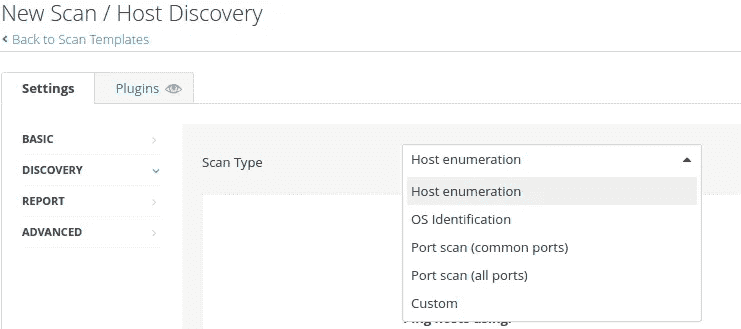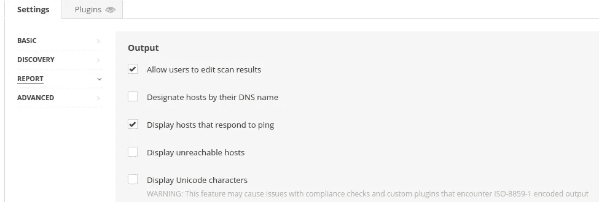

使用报告选项，我们可以导出扫描结果并添加其他信息。

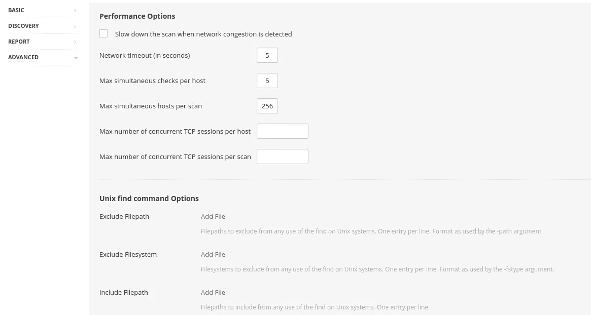

使用高级选项，我们可以控制扫描，主机阈值等。

当我们创建审计需求扫描时，有时我们需要对 SSH/Windows 主机使用基于凭证的扫描。

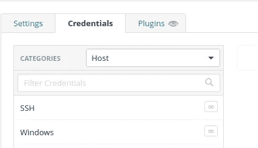

Nessus 为每个应用程序提供了各种各样的扫描插件，供应商定期更新漏洞。

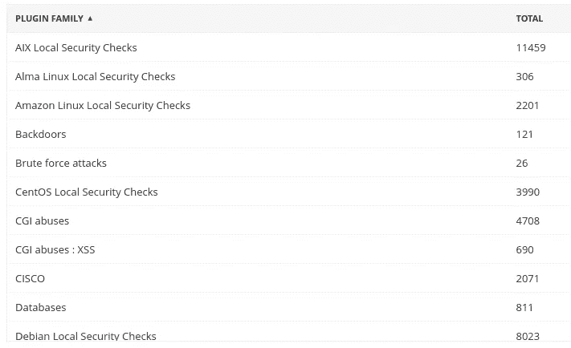

Nessus 官网声明，

```
 “As information about new vulnerabilities are discovered and released into the general public domain, Tenable, Inc. research staff designs programs to enable Nessus to detect them. These programs are named *plugins*, and are written in the Nessus proprietary scripting language, called *Nessus Attack Scripting Language* (NASL).Plugins contain vulnerability information, a generic set of remediation actions, and the algorithm to test for the presence of the security issue.Nessus supports the Common Vulnerability Scoring System (CVSS) and supports both v2 and v3 values simultaneously. If both CVSS2 and CVSS3 attributes are present, both scores are calculated. However in determining the Risk Factor attribute, currently the CVSS2 scores take precedence.Plugins also are utilized to obtain configuration information from authenticated hosts to leverage for configuration audit purposes against security best practices.
```

创建扫描后，我们可以在“我的扫描”选项卡下看到状态。

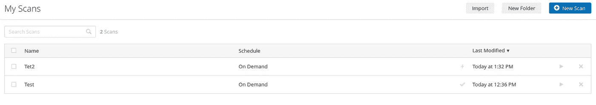

一旦完成，我们可以查看扫描结果，漏洞。

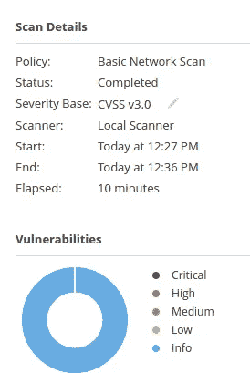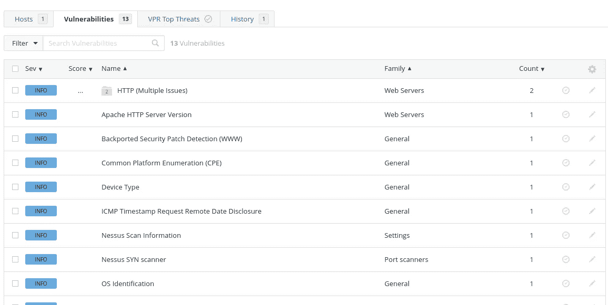

在“漏洞”下，我们可以看到检测到的漏洞，如上所示。

这就是我们如何使用 Nessus 的免费版本来扫描多达 15 台主机，通过创建自定义模板，添加所需的插件。Nessus 是各种企业广泛使用的工具之一。

感谢你阅读这篇文章。:)