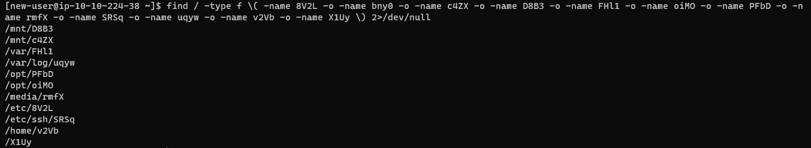
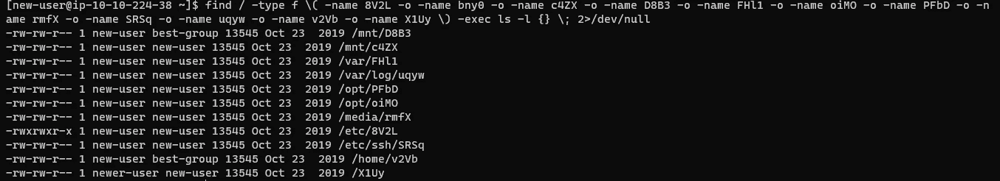
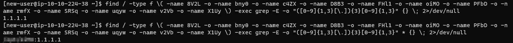
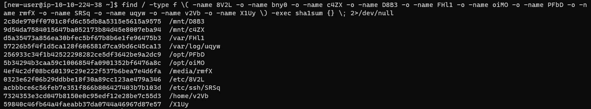
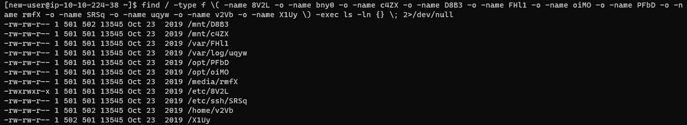

# TryHackMe——忍者技能

> 原文：<https://infosecwriteups.com/tryhackme-ninja-skills-67726fa3956e?source=collection_archive---------0----------------------->

今天我就来做这个 [**忍者技能**](https://tryhackme.com/room/ninjaskills) 房间 [**TryHackMe**](https://tryhackme.com) 的特写。

> **描述** —练习您的 Linux 技能并完成挑战。
> 
> **难度** —容易
> 
> **房间链接**——[https://tryhackme.com/room/ninjaskills](https://tryhackme.com/room/ninjaskills)

这个房间可以用很多方法来解决，但今天我将向你展示一个更简单的方法。主要可以使用**查找**命令来解决。我们可以使用 **find** 命令执行各种其他命令。

> **要使用的语法** —查找</目录> <文件名>—执行<命令>{ } \；2 > /dev/null

**注意:*2****>/****dev****/****null****会过滤掉错误，使它们不会输出到你的控制台。*

# ***任务 1——忍者技能***

*回答关于下列文件的问题:*

> *8V2L*
> 
> *bny0*
> 
> *c4ZX*
> 
> *D8B3*
> 
> *FHl1*
> 
> *oiMO*
> 
> *PFbD*
> 
> *rmfX*
> 
> *SRSq*
> 
> *uqyw*
> 
> *v2Vb*
> 
> *X1Uy*

*目的是尽可能高效地回答问题。*

*部署房间，使用给定的凭证( **new-user** 作为用户名和密码，通过 ssh 端口连接到房间。)*

> ***ssh 新用户@10.10.224.38***

*让我们先找到所有文件的位置。*

> ***find/-type f \(-name 8V2L-o-name bny0-o-name c4ZX-o-name D8 B3-o-name fhl 1-o-name oim 0-o-name PFbD-o-name rmfX-o-name SRSq-o-name uqyw-o-name v2Vb-o-name X1Uy \)2>/dev/null***

*上面命令的解释:*

1.  *`/`表示根目录*
2.  *`-type`选项用于指定文件类型，在这里，我们搜索由`f`表示的常规文件*
3.  *`-name`选项用于指定搜索模式，在这种情况下，文件扩展名*
4.  *`-o`意为“或”*

**

*让我们开始解决问题…*

## ***#1。**以上哪些文件归 best-group 所有(按字母顺序输入答案，用空格隔开)*

*这里，我们必须使用长列表来查看文件所有者和组。*

> ***-执行 ls -l***

**

## *#2.这些文件中哪些包含 IP 地址？*

*这里，我们必须使用 regex 来匹配 IP 地址格式和所有文件的内容。使用此[链接](https://www.shellhacks.com/regex-find-ip-addresses-file-grep/)寻求帮助。*

> ***-exec grep-E-o "([0–9]{ 1，3}[\。]){ 3 }[0–9]{ 1，3}"***
> 
> **【用于从文件中打印 IP 地址】**
> 
> ***-exec grep-E-o "([0–9]{ 1，3}[\。]){ 3 }[0–9]{ 1，3}" ****
> 
> **【用于打印带有文件名和目录的 IP 地址】**

**

## *#3.哪个文件的 SHA1 哈希是 9d 54 da 7584015647 ba 052173 b 84d 45 e 8007 EBA 94？*

*在这里，我们可以计算所有找到的文件的 SHA1 散列来匹配所需的散列。*

> ***-exec sha1sum***
> 
> **[****sha1sum****是一个计算和验证 SHA-1 哈希的计算机程序】**

**

## *#4.哪个文件包含 230 行？*

*在这里，我们可以看到所有的文件都列在这里，除了一个(检查给定的文件名)。*

> ***-执行 wc -l***

*有关解释，请查看 wc 命令帮助(wc - help)*

*[ **wc -l** :打印文件中的行数]*

**

## *#5.哪个文件的所有者的 ID 是 502？*

*这里，我们必须看到所有文件的 UID(用户标识符)。*

> ***-执行 ls -ln***

*为此，请查看 **ls** 命令帮助。*

****

## *#6.哪个文件是所有人都可以执行的？*

*这里，我们必须使用长列表来查看文件权限。*

> ***-执行 ls -l***

**

# *我希望，这篇文章能帮助你轻松地解决这个房间，你也一定学到了更多关于寻找命令的知识。*

# **敬请关注更多此类帖子！！！**