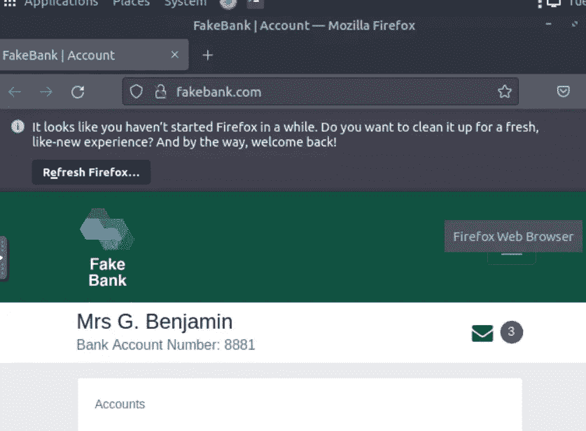
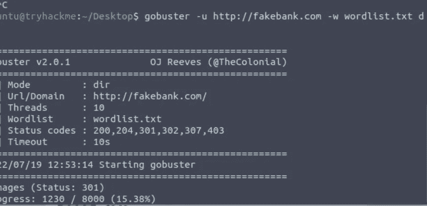
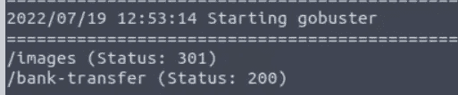
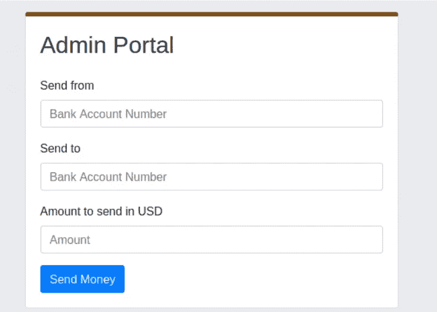
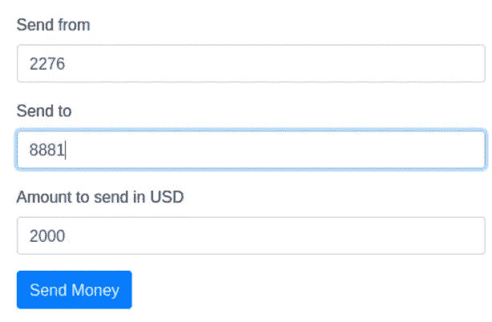
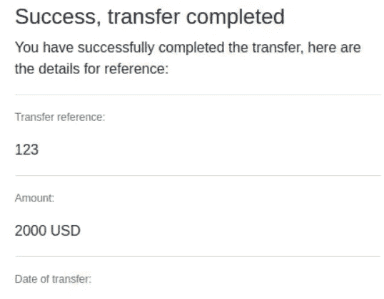

# TryHackMe —攻击性安全

> 原文：<https://infosecwriteups.com/tryhackme-offensive-security-a5ed067ca234?source=collection_archive---------1----------------------->

大家好，

今天我写的是关于 Tryhackme(攻击性安全)的另一个挑战

就组织的安全而言，攻击性安全是关键支柱之一。这是一个通过测试来检查现有控制的概念，试图打破它以查看安全性的容限。

攻击性安全团队包括漏洞评估和 Pen 测试团队，他们总是不断探索新的工具和技术来测试机器。

团队成员将给予外部用户相关的访问权限，并开始他们的测试过程，从侦察到特权访问。完成测试后，他们将根据 OWASP 十大关键漏洞和应实施的补救步骤总结报告。

完成 TryHackMe 中的路径后，此任务是成为攻击性安全团队成员或渗透测试员的职业路径的起点

在这个任务中，我们给出了一个用户登录的银行 web 应用程序。

我们需要使用隐藏目录探索工具 GoBuster 来识别应用程序中的隐藏目录。

一旦我启动机器，我就可以看到网络浏览器登录了一家银行的网上银行网站。让我们看看是否能找到任何隐藏的目录。

我们已经使用了 gobuster 工具命令，
u- url
w-单词列表
type — dir(目录)

我们找到了一个目录“银行转帐”。让我们浏览一下，看看它显示了什么…

🤯🤯🤯天哪，这是一个管理门户网站，从一个帐户转移到另一个帐户的钱。

看起来它没有额外的安全措施。这是一个严重的风险，包括没有 MFA 的授权、访问控制漏洞。

根据任务，我们需要从账户 2276 转 2000 美元到账户 8881。让我们看看我们是否能成功交易。

我已经添加了详细信息，并点击了汇款按钮…

完成了🤯🤯🤯🤯👨‍💻👨‍💻👨‍💻👨‍💻。

此漏洞可让黑客获得帐户权限来执行未经授权的交易。

在最大规模的网络攻击中，金融欺诈是动机最强的目标之一。作为一个熟练的安全专业人员来识别漏洞，在攻击者发现之前利用和修复漏洞的方法。

探索攻击性安全路径中的更多机器，成为熟练的安全专家。

感谢阅读:)