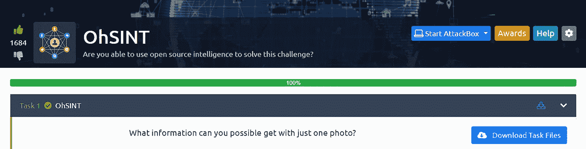
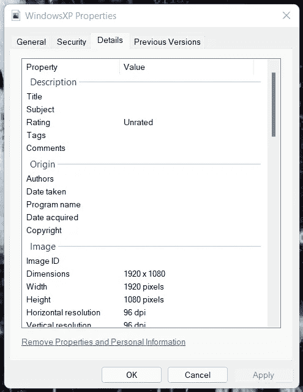
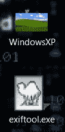
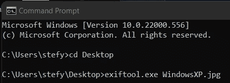
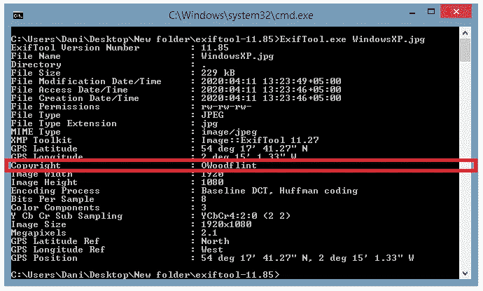
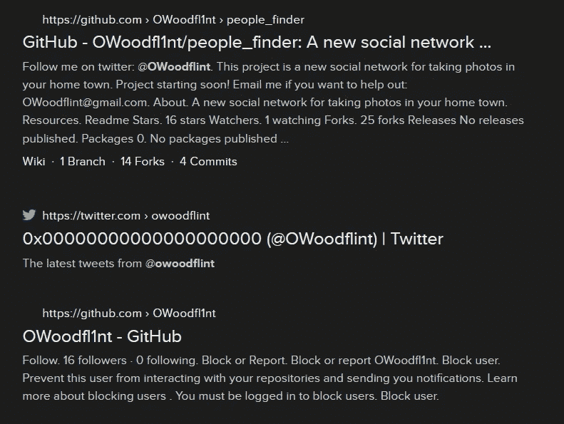
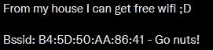

# try hackme:oh Sint Room-Up[无答案]

> 原文：<https://infosecwriteups.com/tryhackme-ohsint-room-write-up-no-answers-9765366c3849?source=collection_archive---------0----------------------->

图 1.1 — OhSINT 房间图像

OhSINT Room 描述: ***“你能够使用开源智能来解决这个挑战吗？”***

这个房间非常注重 OSINT(开源智能)，这里只有一个任务，但是要完成这个房间，你需要回答 7 个问题。

*“开源情报是一种多因素方法，用于收集、分析和决策可从公开来源获得的数据，以用于情报环境。在情报界，“公开”一词指的是公开的、公众可获得的来源。——*

****

**图 1.2 —职业健康与安全任务 1**

**要开始使用这个房间，我们需要下载任务文件(任务 1“下载任务文件”顶部的蓝色按钮)。这将允许我们下载一个图像(WindowsXP.jpg)，如下图所示(图 1.3)。**

****

**图 1.3—WindowsXP.jpg**

**现在，大多数人在获得图像后会做的第一件事就是右键单击它，然后转到图像属性。但是从下图(图 1.4)可以看出，这并不是很有帮助。**

****

**图 1.4 — WindowsXP 属性**

**接下来，我决定尝试一款名为 [**exiftool**](https://www.exiftool.org/) 的工具，由 Phil Harvey 开发。您可以从超链接网站下载该工具，为了运行该工具，我在我的桌面上将其重命名为. exe，并且我的桌面上也有任务图像(图 1.5)。**

****

**图 1.5 —任务图像和 exiftool.exe**

**现在使用 **exiftool** 我使用 Windows 的命令提示符。首先，我必须使用 *cd 桌面*回到我保存 exiftool.exe 和任务图像的桌面。之后，我只需输入*exiftool.exe·WindowsXP.jpg*(提示，如果你按 tab 键，你可以自动完成，所以没有必要输入全名)，然后让 exiftool 运行(图 1.6)。**

****

**图 1.6 —使用 exiftool**

**现在，我将运行 exiftool，看看是否能找到任何关于 WindowsXP.jpg 图像的有趣内容。**

****

**图 1.7—WindowsXP.jpg 的 exiftool 输出**

**现在这已经揭示了一些有趣的事情，如图像版权和 GPS 坐标(图 1.7)。**

**在谷歌上快速搜索“ **OWoodflint** ”这个词，会显示 3 个页面(1 个来自 Twitter，2 个来自 GitHub，图 1.8)。我决定使用 Twitter 链接，因为第一个问题(图 2.0)是“这个用户的头像是什么？”，也可能是 Twitter 或 GitHub 上的头像。**

****

**图 1.8 —谷歌搜索“OWoodflint”**

****

**图 2.0 —任务 1 的第一个问题**

**Twitter 个人资料将揭示第一个问题的答案。现在，回到简单搜索“ **OWoodflint** ”可获得的其他链接。我决定打开 ***/people_finder*** 页面，马上就找到了另外两个答案(答案不必按顺序排列)。**

****

**图 3.0 —任务 1 的第二个问题**

****

**图 4.0 —任务 1 中的个人电子邮件地址问题**

**既然我们已经回答了 3 个问题(图 2、图 3 和图 4 ),是时候继续探索 Twitter 页面了，因为它会揭示一些有趣的信息。**

**回到 Twitter 账户( [**@OWoodflint**](http://twitter.com/OWoodflint) )，我能够找到一条有趣的推文，如下图所示(图 5.0)。**

****

**图 5.0 — @OWoodflint 推文**

**这里是这个房间变得更有趣的地方，我们有一个 BSSID(基本服务集标识符，接入点或无线路由器的 MAC 地址)，有了这些信息，我们可以简单地在谷歌上搜索' ***BSSID Lookup*** '，出现的第一个网站是 [**WiGLE**](https://wigle.net/) (无线网络映射)。为了继续这个任务，我们需要对 wigle.net 做一个说明**

**拥有我们的帐户后，我们可以转到' ***高级搜索*** '，然后转到'***WiFi/蜂窝详细信息*** '并从 Twitter 粘贴 BSSID 并运行查询。这个查询应该会给出 WAP(无线接入点)的 SSID，这样我们就回答了任务 1 中的另一个问题。**

**这个房间我们差不多看完了，只剩下两个问题，他去哪里度假了？ ' & ' **这个人的密码是什么？**’。对于第一个问题，我们可以尝试找到 WAP 的位置，但我决定在谷歌上搜索“OWoodflint ”,我找到了一个 WordPress 博客。点击 WordPress 博客会显示假日问题的答案(图 6.0)。**

****

**图 6.0 —职业健康与安全问题**

**最后一个问题让我思考了一下，因为我想知道如何才能得到密码，密码是干什么用的？Twitter 上已经没有什么有用的东西了，GitHub 页面也是如此，所以剩下的一切就是 WordPress 博客了。我决定抓取页面上所有可用的内容并将其粘贴到记事本中，有时如果文本与#FFFFFF(白色)←十六进制颜色代码的颜色相同，您会发现一些有趣的东西，在这种情况下。它揭示了一些有趣的事情。好像有一串出现了。**

**所以，我决定用开发工具来分析 HTML(超文本标记语言)以找到更多关于它的信息。现在我可以在 HTML 中搜索十六进制代码，找出它在 HTML 中的位置。这是最后一个问题的密码吗(图 7.0)？值得一试。**

****

**图 OhSINT 的最后一个问题**

**现在我们已经找到了密码，我们完成了 OhSINT 房间。我喜欢这个房间，可能会有点难，但它很好地涵盖了 OSINT 的基础知识。**

**感谢你阅读我的 OhSINT 文章，如果你想自己试试这个房间，链接在下面。如果你想和我联系，我也附上了我的链接树。**

**OhSINT 房间链接:[https://tryhackme.com/room/ohsint](https://tryhackme.com/room/ohsint)**

**我的链接树—【https://linktr.ee/StefanPBargan **

## **来自 Infosec 的报道:Infosec 每天都有很多内容，很难跟上。[加入我们的每周时事通讯](https://weekly.infosecwriteups.com/)以 5 篇文章、4 个线程、3 个视频、2 个 GitHub Repos 和工具以及 1 个工作提醒的形式免费获取所有最新的 Infosec 趋势！**